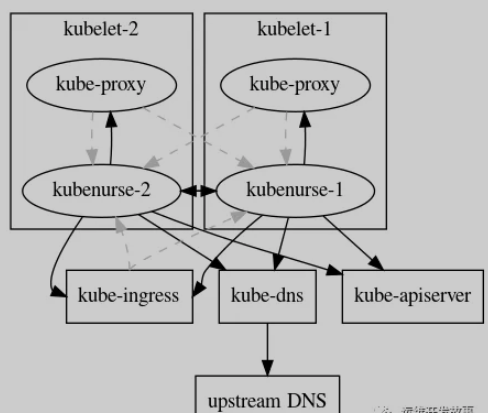
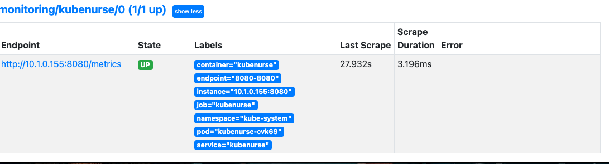
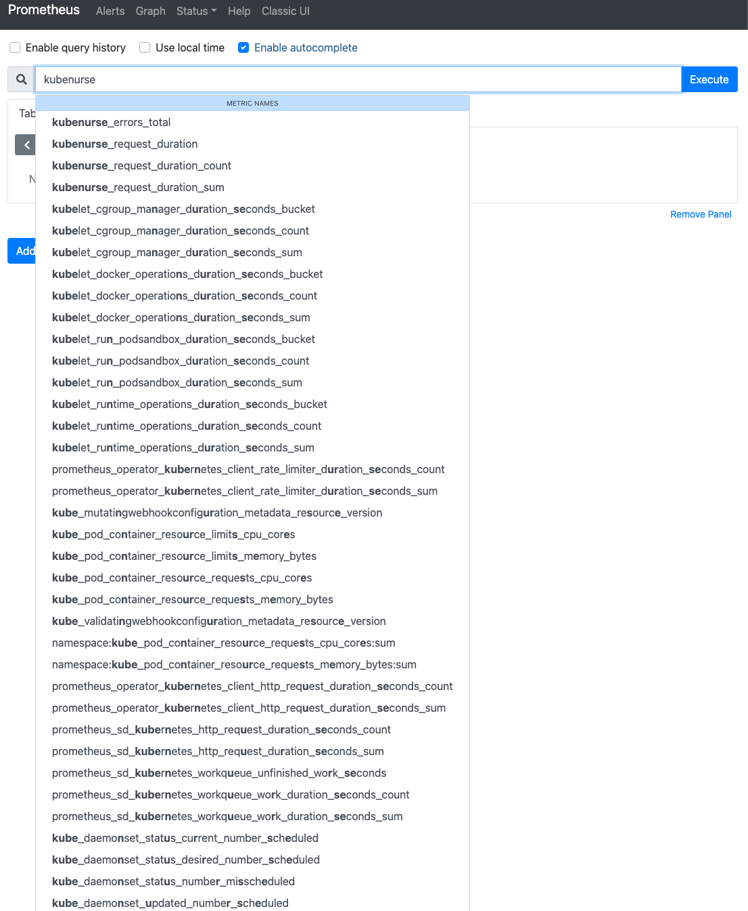
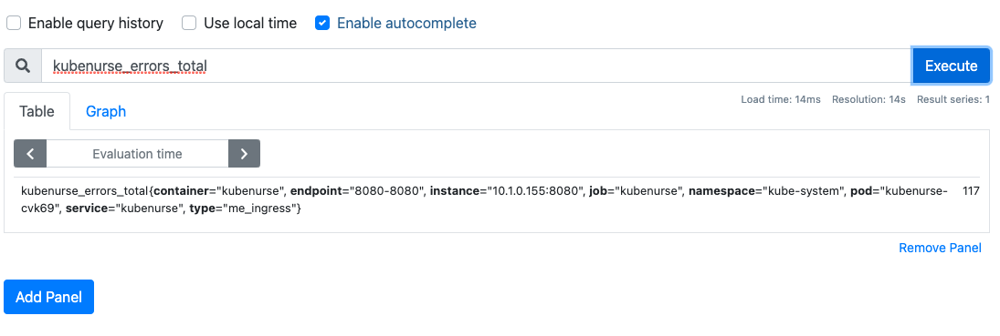
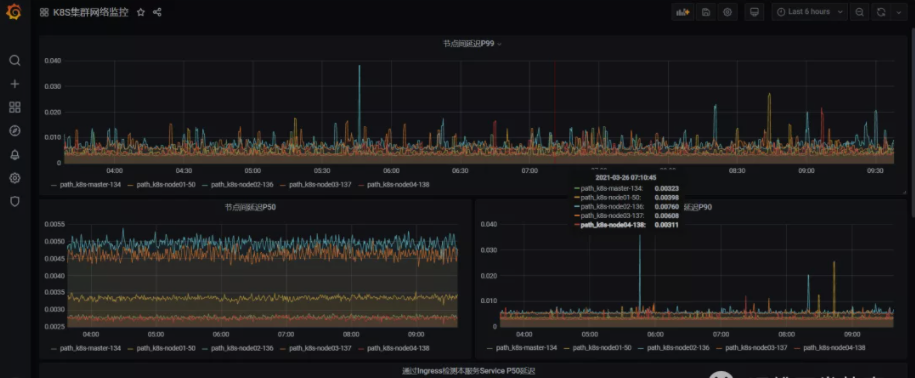

# **Promethuse-operator2021 - 使用KubeNurse进行集群网络监控**

* [https://github.com/postfinance/kubenurse](https://github.com/postfinance/kubenurse)
* [https://github.com/postfinance/kubenurse/tree/master/examples](https://github.com/postfinance/kubenurse/tree/master/examples)

## **前言**

在Kubernetes中，网络是通过第三方网络插件来提供，这些三方插件本身的实现就比较复杂，以至于在排查网络问题时常常碰壁。那么有没有什么方式来监控集群中所有的网络连接呢？

**kubenurse就是这样一个项目，它通过监视集群中的所有网络连接，并提供监控指标供Prometheus采集。**

## **Kubenurse**


kubenurse的部署非常简单，使用Daemonset形式部署到集群节点上，Yaml文件在项目的example目录下。


**部署成功后，每5秒钟会对/alive发一次检查请求，然后其内部会运行各种方法全方位对集群网络进行检测，为了防止过多的网络流量，会对检查结果缓存3秒。**其检测机制如下：




**<span style="color:red">从上图可以看出，kubenurse会对ingress、dns、apiserver、kube-proxy进行网络探测。</span>**

所有的检查都会创建公开的指标，这些指标可用于检测：

* SDN网络延迟以及错误
* Kubelet之间的网络延迟以及错误
* Pod与apiserver通信问题
* Ingress往返网络延迟以及错误
* Service往返网络延迟以及错误（kube-proxy）
* Kube-apiserver问题
* Kube-dns（CoreDns）错误
* 外部DNS解析错误（ingress url解析）

然后这些数据主要通过两个监控指标来体现：

* **`kubenurse_errors_total`：按错误类型划分的错误计数器**
* **`kubenurse_request_duration`：按类型划分的请求时间分布**

这些指标都是通过Type类型进行标识，对应几种不同的检测目标：

* `api_server_direct`：从节点直接检测 API Server
* **`api_server_dns`：从节点通过 DNS 检测 API Server**
* **`me_ingress`：通过 Ingress 检测本服务 Service**
* **`me_service`：使用 Service 检测本服务 Service**
* **`path_$KUBELET_HOSTNAME`：节点之间的互相检测**

然后这些指标分别按P50，P90，P99分位数进行划分，就可以根据不同的情况来确认集群网络状况了。

## **Promethuse-operator 2021 安装**

```
helm repo add prometheus-community https://prometheus-community.github.io/helm-charts


helm repo update
```

```
$ helm repo list
NAME                    URL                                                               
loki                    https://grafana.github.io/loki/charts                             
argocd-helm             https://chao-xi.github.io/helm/                                   
istio                   https://storage.googleapis.com/istio-release/releases/1.3.6/charts
incubator               http://mirror.azure.cn/kubernetes/charts-incubator/               
argo                    https://argoproj.github.io/argo-helm                              
traefik                 https://containous.github.io/traefik-helm-chart                   
oteemocharts            https://oteemo.github.io/charts                                   
hashicorp               https://helm.releases.hashicorp.com                               
prometheus-community    https://prometheus-community.github.io/helm-charts     
```

```
helm-values
│   └── prometheus-operator-values.yml
```

**`prometheus-operator-values.yml`**

```
# We don't need the alertmanager for this demo
alertmanager:
  enabled: false

# This configuration means all ServiceMonitors in the namespsace will be picked up
# Use with caution!
prometheus: 
  prometheusSpec:
    serviceMonitorSelectorNilUsesHelmValues: false
    serviceMonitorSelector: {}
grafana:
  persistence:
    enabled: true
    type: pvc
    size: 5G
    storageClassName: "hostpath"

prometheusOperator:
  admissionWebhooks:
    enabled: false

prometheus-node-exporter:
  hostRootFsMount: false

# prometheus-node-exporter:
#     hostRootFsMount: false
```

**Installed Error**

```
Error: failed to start container "node-exporter": Error response from daemon: path / is mounted on / but it is not a shared or slave mount
```
[https://github.com/prometheus-community/helm-charts/issues/467](https://github.com/prometheus-community/helm-charts/issues/467)

```
prometheus-node-exporter:
  hostRootFsMount: false
```

Or

```
kubectl patch ds kube-prom-prometheus-node-exporter --type "json" -p '[{"op": "remove", "path" : "/spec/template/spec/containers/0/volumeMounts/2/mountPropagation"}]' -n monitoring
```

### Installation

```
helm install kube-prom prometheus-community/kube-prometheus-stack -f helm-values/prometheus-operator-values.yml --namespace monitoring
```

Upgrade

```
helm upgrade kube-prom prometheus-community/kube-prometheus-stack -f helm-values/prometheus-operator-values.yml --namespace monitoring
```

```
$ kubectl get pod -n monitoring NAME                                                  READY   STATUS    RESTARTS   AGE
kube-prom-grafana-854d497c4b-gcd2j                    2/2     Running   10         4h39m
kube-prom-grafana-test                                0/1     Error     0          4h39m
kube-prom-kube-prometheus-operator-6b84867b8b-wpfpp   1/1     Running   6          4h39m
kube-prom-kube-state-metrics-77866d67c5-kl44g         1/1     Running   2          4h39m
kube-prom-prometheus-node-exporter-qkplq              1/1     Running   0          40s
prometheus-kube-prom-kube-prometheus-prometheus-0     2/2     Running   11         4h38m
```

## KubeNurse 安装部署

这里直接使用官方的部署文件进行部署。不过需要更改几个地方。（1）首先将代码clone到本地

```
git clone https://github.com/postfinance/kubenurse.git
```

进入example目录，修改`ingress.yaml`配置，主要是添加域名，如下。

```
---
apiVersion: extensions/v1beta1
kind: Ingress
metadata:
  annotations:
    kubernetes.io/ingress.class: nginx
  name: kubenurse
  namespace: kube-system
spec:
  rules:
  - host: kubenurse-test.xxx.cn
    http:
      paths:
      - backend:
          serviceName: kubenurse
          servicePort: 8080
```

更新`daemonset.yaml`配置，主要是更改ingress的入口域名，如下。

```
---
apiVersion: apps/v1
kind: DaemonSet
metadata:
  labels:
    app: kubenurse
  name: kubenurse
  namespace: kube-system
spec:
  selector:
    matchLabels:
      app: kubenurse
  template:
    metadata:
      labels:
        app: kubenurse
      annotations:
        prometheus.io/path: "/metrics"
        prometheus.io/port: "8080"
        prometheus.io/scheme: "http"
        prometheus.io/scrape: "true"
    spec:
      serviceAccountName: nurse
      containers:
      - name: kubenurse
        env:
        # - name: KUBENURSE_INGRESS_URL
        #   value: https://kubenurse.example.com
        - name: KUBENURSE_SERVICE_URL
          value: http://kubenurse.kube-system.svc.cluster.local:8080
        - name: KUBENURSE_NAMESPACE
          value: kube-system
        - name: KUBENURSE_NEIGHBOUR_FILTER
          value: "app=kubenurse"
        image: "postfinance/kubenurse:v1.2.0"
        ports:
        - containerPort: 8080
          protocol: TCP
      tolerations:
      - effect: NoSchedule
        key: node-role.kubernetes.io/master
        operator: Equal
      - effect: NoSchedule
        key: node-role.kubernetes.io/control-plane
        operator: Equal
```

**`rbac.yaml`**

```
---
apiVersion: rbac.authorization.k8s.io/v1
kind: RoleBinding
metadata:
  name: nurse
  namespace: kube-system
roleRef:
  apiGroup: rbac.authorization.k8s.io
  kind: ClusterRole
  name: view
subjects:
- kind: ServiceAccount
  name: nurse
  namespace: kube-system
```

**`service.yaml`**

```
---
apiVersion: v1
kind: Service
metadata:
  labels:
    app: kubenurse
  name: kubenurse
  namespace: kube-system
spec:
  ports:
  - name: 8080-8080
    port: 8080
    protocol: TCP
    targetPort: 8080
  selector:
    app: kubenurse
```

**`serviceaccount.yaml`**

```
---
apiVersion: v1
kind: ServiceAccount
metadata:
  name: nurse
  namespace: kube-system
```

新创建一个ServiceMonitor，用于获取指标数据，如下：

**`ServiceMonitor.yaml`**

```
apiVersion: monitoring.coreos.com/v1
kind: ServiceMonitor
metadata:
  name: kubenurse
  namespace: monitoring
  labels:
    k8s-app: kubenurse
spec:
  jobLabel: k8s-app
  endpoints:
  - port: "8080-8080" 
    interval: 30s
    scheme: http
  selector:
    matchLabels:
     app: kubenurse
  namespaceSelector:
    matchNames:
    - kube-system
```

部署应用，在example目录下执行以下命令。


等待所有应用变成running，如下。

```
$  kubectl get all -n kube-system -l app=kubenurse
NAME                  READY   STATUS    RESTARTS   AGE
pod/kubenurse-cvk69   1/1     Running   0          15h

NAME                TYPE        CLUSTER-IP       EXTERNAL-IP   PORT(S)    AGE
service/kubenurse   ClusterIP   10.108.126.242   <none>        8080/TCP   15h

NAME                       DESIRED   CURRENT   READY   UP-TO-DATE   AVAILABLE   NODE SELECTOR   AGE
daemonset.apps/kubenurse   1         1         1       1            1           <none>          15h
```

到prometheus上查看是否正常获取数据。

```
$ kubectl port-forward svc/kube-prom-kube-prometheus-prometheus -n monitoring 9090:9090
Forwarding from 127.0.0.1:9090 -> 9090
Forwarding from [::1]:9090 -> 9090
```




查看指标是否正常。





这时候就可以在grafana上画图，展示监控数据了，如下。

