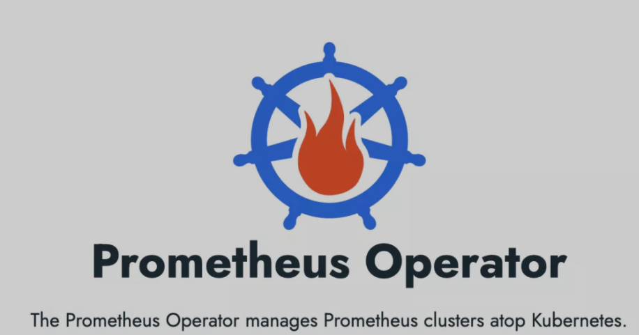
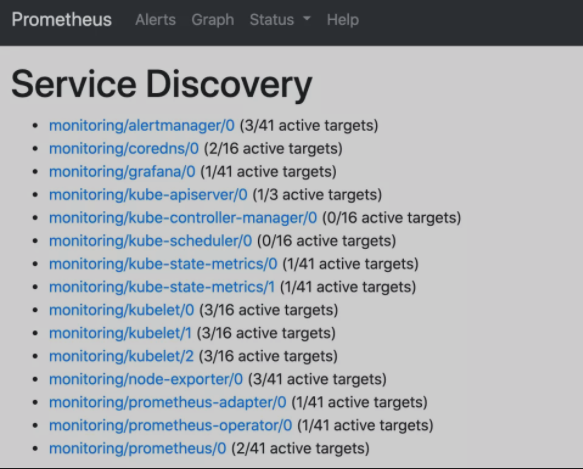
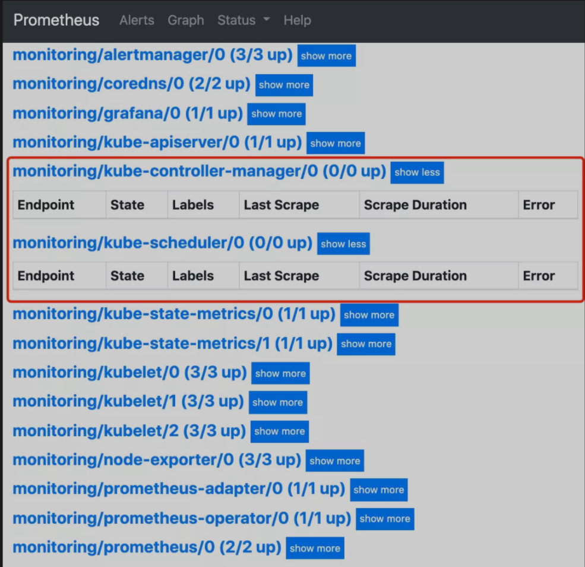
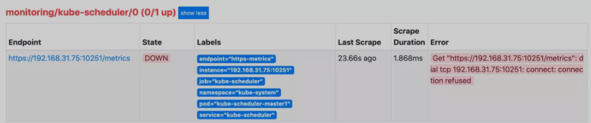
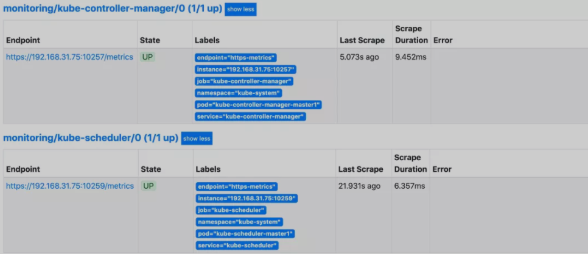
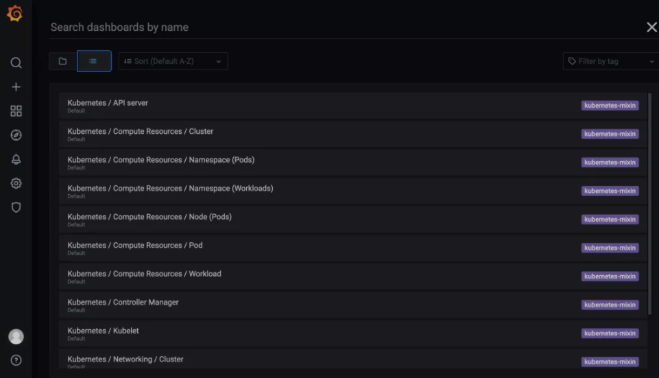
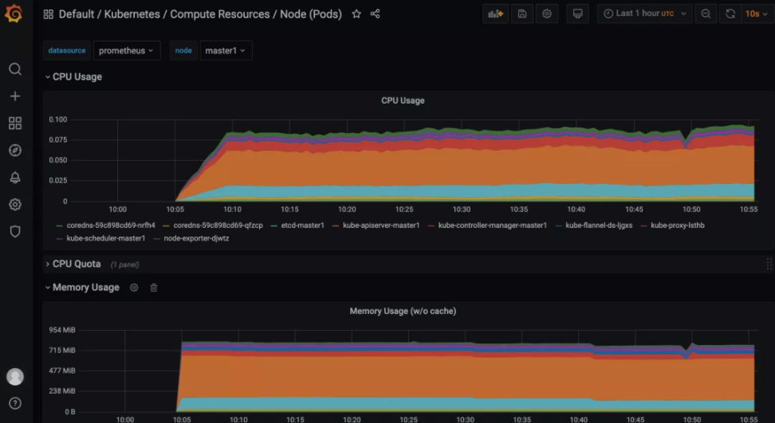

# **Prometheus Operator 安装配置 | 2021**

但实际上对上 Kubernetes 来说，还有更简单方式来监控报警，那就是 Prometheus Operator([https://prometheus-operator.dev/](https://prometheus-operator.dev/))。Prometheus Operator 为监控 Kubernetes 资源和 Prometheus 实例的管理提供了简单的定义，简化在 Kubernetes 上部署、管理和运行 Prometheus 和 Alertmanager 集群。




## 介绍

Prometheus Operator 为 Kubernetes 提供了对 Prometheus 机器相关监控组件的本地部署和管理方案，该项目的目的是为了简化和自动化基于 Prometheus 的监控栈配置，主要包括以下几个功能：

* Kubernetes 自定义资源：使用 Kubernetes CRD 来部署和管理 Prometheus、Alertmanager 和相关组件。
* 简化的部署配置：直接通过 Kubernetes 资源清单配置 Prometheus，比如版本、持久化、副本、保留策略等等配置。
* Prometheus 监控目标配置：基于熟知的 Kubernetes 标签查询自动生成监控目标配置，无需学习 Prometheus 特地的配置。

首先我们先来了解下 Prometheus Operator 的架构图：


上图是 Prometheus-Operator 官方提供的架构图，各组件以不同的方式运行在 Kubernetes 集群中，其中 Operator 是最核心的部分，作为一个控制器，他会去创建 Prometheus、ServiceMonitor、AlertManager 以及 PrometheusRule 等 CRD 资源对象，然后会一直 Watch 并维持这些资源对象的状态。

在最新版本的 Operator 中提供了以下几个 CRD 资源对象：

* Prometheus
* Alertmanager
* ServiceMonitor
* PodMonitor
* Probe
* ThanosRuler
* PrometheusRule
* AlertmanagerConfig

### Prometheus

该 CRD 声明定义了 Prometheus 期望在 Kubernetes 集群中运行的配置，提供了配置选项来配置副本、持久化、报警实例等。

**对于每个 Prometheus CRD 资源，Operator 都会以 StatefulSet 形式在相同的命名空间下部署对应配置的资源，Prometheus Pod 的配置是通过一个包含 Prometheus 配置的名为 `<prometheus-name>`  的 Secret 对象声明挂载的**。


该 CRD 根据标签选择来指定部署的 Prometheus 实例应该覆盖哪些 `ServiceMonitor`，然后 Operator 会根据包含的 ServiceMonitors 生成配置，并在包含配置的 Secret 中进行更新。

**如果未提供对 `ServiceMonitor` 的选择，则 Operator 会将 Secret 的管理留给用户，这样就可以提供自定义配置，同时还能享受 Operator 管理 Operator 的设置能力**。

### Alertmanager

该 CRD 定义了在 Kubernetes 集群中运行的 Alertmanager 的配置，同样提供了多种配置，包括持久化存储。

对于每个 Alertmanager 资源，Operator 都会在相同的命名空间中部署一个对应配置的 StatefulSet，A**lertmanager Pods 被配置为包含一个名为 `<alertmanager-name>` 的 Secret，该 Secret 以 `alertmanager.yaml` 为 key 的方式保存使用的配置文件。**

当有两个或更多配置的副本时，Operator 会在高可用模式下运行 Alertmanager 实例。

### ThanosRuler

该 CRD 定义了一个 Thanos Ruler 组件的配置，以方便在 Kubernetes 集群中运行。**通过 Thanos Ruler，可以跨多个Prometheus 实例处理记录和警报规则。**

**一个 ThanosRuler 实例至少需要一个 `queryEndpoint`，它指向 `Thanos Queriers` 或 Prometheus 实例的位置。`queryEndpoints` 用于配置 Thanos 运行时的 `--query` 参数，更多信息也可以在 Thanos 文档中找到**。

### ServiceMonitor

该 CRD 定义了如何监控一组动态的服务，使用标签选择来定义哪些 Service 被选择进行监控。这可以让团队制定一个如何暴露监控指标的规范，然后按照这些规范自动发现新的服务，而无需重新配置。


为了让 Prometheus 监控 Kubernetes 内的任何应用，**需要存在一个 Endpoints 对象，Endpoints 对象本质上是IP地址的列表，通常 Endpoints 对象是由 Service 对象来自动填充的，Service 对象通过标签选择器匹配 Pod，并将其添加到Endpoints 对象中**。

一个 Service 可以暴露一个或多个端口，这些端口由多个 Endpoints 列表支持，这些端点一般情况下都是指向一个 Pod。

Prometheus Operator 引入的这个 ServiceMonitor 对象就会发现这些 Endpoints 对象，并配置 Prometheus 监控这些 Pod。**`ServiceMonitorSpec` 的 endpoints 部分就是用于配置这些 Endpoints 的哪些端口将被 scrape 指标的**。

> 注意：endpoints（小写）是 ServiceMonitor CRD 中的字段，而 Endpoints（大写）是 Kubernetes 的一种对象。

**ServiceMonitors 以及被发现的目标都可以来自任何命名空间，这对于允许跨命名空间监控的场景非常重要。**

使用 `PrometheusSpec` 的 `ServiceMonitorNamespaceSelector`，可以限制各自的 Prometheus 服务器选择的 `ServiceMonitors` 的命名空间。

使用 `ServiceMonitorSpec` 的 `namespaceSelector`，可以限制 `Endpoints` 对象被允许从哪些命名空间中发现，要在所有命名空间中发现目标，`namespaceSelector` 必须为空：

```
spec:
  namespaceSelector:
    any: true
```

### PodMonitor

**该 CRD 用于定义如何监控一组动态 pods，使用标签选择来定义哪些 pods 被选择进行监控**。同样团队中可以制定一些规范来暴露监控的指标。

**Pod 是一个或多个容器的集合，可以在一些端口上暴露 Prometheus 指标**。

由 Prometheus Operator 引入的 PodMonitor 对象会发现这些 Pod，并为 Prometheus 服务器生成相关配置，以便监控它们。

**`PodMonitorSpec` 中的 `PodMetricsEndpoints` 部分，用于配置 Pod 的哪些端口将被 `scrape` 指标，以及使用哪些参数。**


PodMonitors 和发现的目标可以来自任何命名空间，这同样对于允许跨命名空间的监控用例是很重要的。**使用 `PodMonitorSpec` 的 `namespaceSelector`，可以限制 `Pod` 被允许发现的命名空间，要在所有命名空间中发现目标，`namespaceSelector` 必须为空**：

```
spec:
  namespaceSelector:
    any: true
```

> PodMonitor 和 ServieMonitor 最大的区别就是不需要有对应的 Service。

### Probe

**该 CRD 用于定义如何监控一组 Ingress 和静态目标。除了 target 之外，`Probe` 对象还需要一个 `prober`，它是监控的目标并为 Prometheus 提供指标的服务**。例如可以通过使用 blackbox-exporter 来提供这个服务。

### PrometheusRule

用于配置 Prometheus 的 Rule 规则文件，包括 recording rules 和 alerting，可以自动被 Prometheus 加载。

### AlertmanagerConfig

在以前的版本中要配置 Alertmanager 都是通过 Configmap 来完成的，在 v0.43 版本后新增该 CRD，可以将 Alertmanager 的配置分割成不同的子对象进行配置，允许将报警路由到自定义 Receiver 上，并配置抑制规则。

AlertmanagerConfig 可以在命名空间级别上定义，为 Alertmanager 提供一个聚合的配置。这里提供了一个如何使用它的例子。不过需要注意这个 CRD 还不稳定。

这样我们要在集群中监控什么数据，就变成了直接去操作 Kubernetes 集群的资源对象了，是这样比之前手动的方式就方便很多了。

## 安装

为了使用 Prometheus-Operator，这里我们直接使用 kube-prometheus 这个项目来进行安装，该项目和 Prometheus-Operator 的区别就类似于 Linux 内核和 CentOS/Ubuntu 这些发行版的关系，真正起作用的是 Operator 去实现的，而 `kube-prometheus` 只是利用 Operator 编写了一系列常用的监控资源清单。

首先 clone 项目代码，切换到当前最新的 v0.7.0 版本：

```
$ git clone https://github.com/prometheus-operator/kube-prometheus.git
$ cd kube-prometheus && git checkout v0.7.0
```

首先创建需要的命名空间和 CRDs，等待它们可用后再创建其余资源：

```
$ kubectl apply -f manifests/setup
$ until kubectl get servicemonitors --all-namespaces ; do date; sleep 1; echo ""; done
$ kubectl apply -f manifests/
```

进入到 `manifests` 目录下面，首先我们需要安装 `setup` 目录下面的 `CRD` 和 `Operator `资源对象，等待它们可用后再创建其余资源：

```
$ kubectl apply -f setup/
$ kubectl get pods -n monitoring
NAME                                   READY   STATUS    RESTARTS   AGE
prometheus-operator-7649c7454f-wqtx7   2/2     Running   0          2m42s
```

这会创建一个名为 `monitoring `的命名空间，以及相关的 CRD 资源对象声明和 Prometheus Operator 控制器。

前面章节中我们讲解过 CRD 和 Operator 的使用，当我们声明完 CRD 过后，就可以来自定义资源清单了，但是要让我们声明的自定义资源对象生效就需要安装对应的 Operator 控制器，这里我们都已经安装了，所以接下来就可以来用 CRD 创建真正的自定义资源对象了。

**在 `manifests` 目录下面的就是我们要去创建的 Prometheus、Alertmanager 以及各种监控对象的资源清单，直接安装即可：**

```
$ kubectl apply -f manifests/
```

这会自动安装 `node-exporter`、`kube-state-metrics`、`grafana`、`prometheus-adapter` 以及 `prometheus` 和 `alertmanager` 等大量组件，而且 prometheus 和 alertmanager 还是多副本的。

```
$ kubectl get pods -n monitoring
NAME                                   READY   STATUS    RESTARTS   AGE
alertmanager-main-0                    2/2     Running   0          12m
alertmanager-main-1                    2/2     Running   0          12m
alertmanager-main-2                    2/2     Running   0          12m
grafana-f8cd57fcf-kbnsj                1/1     Running   0          12m
kube-state-metrics-587bfd4f97-pwk5p    3/3     Running   0          12m
node-exporter-djwtz                    2/2     Running   0          12m
node-exporter-k7zl9                    2/2     Running   0          12m
node-exporter-rlnjt                    2/2     Running   0          12m
prometheus-adapter-69b8496df6-vq7bl    1/1     Running   0          12m
prometheus-k8s-0                       2/2     Running   0          12m
prometheus-k8s-1                       1/2     Running   0          12m
prometheus-operator-7649c7454f-wqtx7   2/2     Running   0          16m
$ kubectl get svc -n monitoring                      
NAME                    TYPE        CLUSTER-IP       EXTERNAL-IP   PORT(S)                      AGE
alertmanager-main       ClusterIP   10.104.5.112     <none>        9093/TCP                     4m58s
alertmanager-operated   ClusterIP   None             <none>        9093/TCP,9094/TCP,9094/UDP   4m58s
grafana                 ClusterIP   10.107.173.231   <none>        3000/TCP                     4m52s
kube-state-metrics      ClusterIP   None             <none>        8443/TCP,9443/TCP            4m51s
node-exporter           ClusterIP   None             <none>        9100/TCP                     4m51s
prometheus-adapter      ClusterIP   10.104.205.68    <none>        443/TCP                      4m50s
prometheus-k8s          ClusterIP   10.105.168.183   <none>        9090/TCP                     4m49s
prometheus-operated     ClusterIP   None             <none>        9090/TCP                     4m50s
prometheus-operator     ClusterIP   None             <none>        8443/TCP  
```

可以看到上面针对 grafana、alertmanager 和 prometheus 都创建了一个类型为 ClusterIP 的 Service，当然如果我们想要在外网访问这两个服务的话可以通过创建对应的 Ingress 对象或者使用 NodePort 类型的 Service，

我们这里为了简单，直接使用 NodePort 类型的服务即可，编辑 `grafana`、`alertmanager-main` 和 `prometheus-k8s` 这3个 Service，将服务类型更改为 NodePort:

```
# 将 type: ClusterIP 更改为 type: NodePort
$ kubectl edit svc grafana -n monitoring  
$ kubectl edit svc alertmanager-main -n monitoring
$ kubectl edit svc prometheus-k8s -n monitoring
$ kubectl get svc -n monitoring
NAME                    TYPE        CLUSTER-IP       EXTERNAL-IP   PORT(S)                      AGE
alertmanager-main       NodePort    10.111.28.173    <none>        9093:30733/TCP               18m
grafana                 NodePort    10.99.62.32      <none>        3000:32150/TCP               17m
prometheus-k8s          NodePort    10.111.105.155   <none>        9090:30206/TCP               17m
......
```

更改完成后，我们就可以通过上面的 NodePort 去访问对应的服务了，比如查看 prometheus 的服务发现页面：



可以看到已经监控上了很多指标数据了，上面我们可以看到 Prometheus 是两个副本，我们这里通过 Service 去访问，按正常来说请求是会去轮询访问后端的两个 Prometheus 实例的，但实际上我们这里访问的时候始终是路由到后端的一个实例上去，**因为这里的 `Service` 在创建的时候添加了 `sessionAffinity: ClientIP` 这样的属性，会根据 `ClientIP` 来做 `session` 亲和性**，所以我们不用担心请求会到不同的副本上去：

```
apiVersion: v1
kind: Service
metadata:
  labels:
    prometheus: k8s
  name: prometheus-k8s
  namespace: monitoring
spec:
  ports:
  - name: web
    port: 9090
    targetPort: web
  selector:
    app: prometheus
    prometheus: k8s
  sessionAffinity: ClientIP
```

> 为什么会担心请求会到不同的副本上去呢？正常多副本应该是看成高可用的常用方案，理论上来说不同副本本地的数据是一致的，但是需要注意的是 Prometheus 的主动 Pull 拉取监控指标的方式，由于抓取时间不能完全一致，即使一致也不一定就能保证网络没什么问题，所以最终不同副本下存储的数据很大可能是不一样的，所以这里我们配置了 session 亲和性，可以保证我们在访问数据的时候始终是一致的。

## 配置

我们可以看到上面的监控指标大部分的配置都是正常的，只有两三个没有管理到对应的监控目标，比如 kube-controller-manager 和 kube-scheduler 这两个系统组件。




这其实就和 `ServiceMonitor` 的定义有关系了，我们先来查看下 kube-scheduler 组件对应的 ServiceMonitor 资源的定义：

```
# manifests/prometheus-serviceMonitorKubeScheduler.yaml
apiVersion: monitoring.coreos.com/v1
kind: ServiceMonitor
metadata:
  labels:
    k8s-app: kube-scheduler
  name: kube-scheduler
  namespace: monitoring
spec:
  endpoints:
  - bearerTokenFile: /var/run/secrets/kubernetes.io/serviceaccount/token  # token 文件
    interval: 30s  # 每30s获取一次信息
    port: https-metrics  # 对应 service 的端口名
    scheme: https  # 注意是使用 https 协议
    tlsConfig:  # 跳过安全校验
      insecureSkipVerify: true
  jobLabel: k8s-app  # 用于从中检索任务名称的标签
  namespaceSelector:  # 表示去匹配某一命名空间中的 Service，如果想从所有的namespace中匹配用any:true
    matchNames:
    - kube-system
  selector:  # 匹配的 Service 的 labels，如果使用 mathLabels，则下面的所有标签都匹配时才会匹配该 service，如果使用 matchExpressions，则至少匹配一个标签的 service 都会被选择
    matchLabels:
      k8s-app: kube-scheduler
```

上面是一个典型的 `ServiceMonitor` 资源对象的声明方式，上面我们通过 `selector.matchLabels` 在 `kube-system` 这个命名空间下面匹配具有 `k8s-app=kube-scheduler` 这样的 `Service`，但是我们系统中根本就没有对应的 Service：

```
$ kubectl get svc -n kube-system -l k8s-app=kube-scheduler
No resources found in kube-system namespace.
```

所以我们需要去创建一个对应的 Service 对象，才能与 ServiceMonitor 进行关联：

```
# prometheus-kubeSchedulerService.yaml
apiVersion: v1
kind: Service
metadata:
  namespace: kube-system
  name: kube-scheduler
  labels:  # 必须和上面的 ServiceMonitor 下面的 matchLabels 保持一致
    k8s-app: kube-scheduler
spec:
  selector:
    component: kube-scheduler
  ports:
  - name: https-metrics
    port: 10259  
    targetPort: 10259  # 需要注意现在版本默认的安全端口是10259
```

其中最重要的是上面 labels 和 selector 部分，labels 区域的配置必须和我们上面的 ServiceMonitor 对象中的 selector 保持一致，**selector 下面配置的是 `component=kube-scheduler`，为什么会是这个 label 标签呢，我们可以去 `describe` 下 `kube-scheduler` 这个 Pod**：

```
$ kubectl describe pod kube-scheduler-master1 -n kube-system
Name:                 kube-scheduler-master1
Namespace:            kube-system
Priority:             2000001000
Priority Class Name:  system-node-critical
Node:                 master1/192.168.31.75
Start Time:           Mon, 29 Mar 2021 18:15:46 +0800
Labels:               component=kube-scheduler
                      tier=control-plane
......
```

**我们可以看到这个 Pod 具有 `component=kube-scheduler` 和 `tier=control-plane` 这两个标签，而前面这个标签具有更唯一的特性，所以使用前面这个标签较好，这样上面创建的 Service 就可以和我们的 Pod 进行关联了**，直接创建即可：

```
$ kubectl apply -f prometheus-kubeSchedulerService.yaml
$ kubectl get svc -n kube-system -l k8s-app=kube-scheduler
NAME             TYPE        CLUSTER-IP      EXTERNAL-IP   PORT(S)     AGE
kube-scheduler   ClusterIP   10.100.66.246   <none>        10251/TCP   2m2s
```

创建完成后，隔一小会儿后去 Prometheus 页面上查看 targets 下面 kube-scheduler 已经有采集的目标了，**但是报了 `connect: connection refused` 这样的错误**：



这是因为 kube-scheduler 启动的时候默认绑定的是 `127.0.0.1` 地址，所以要通过 IP 地址去访问就被拒绝了，我们可以查看 master 节点上的静态 Pod 资源清单来确认这一点：

```
# /etc/kubernetes/manifests/kube-scheduler.yaml
apiVersion: v1
kind: Pod
metadata:
  creationTimestamp: null
  labels:
    component: kube-scheduler
    tier: control-plane
  name: kube-scheduler
  namespace: kube-system
spec:
  containers:
  - command:
    - kube-scheduler
    - --authentication-kubeconfig=/etc/kubernetes/scheduler.conf
    - --authorization-kubeconfig=/etc/kubernetes/scheduler.conf
    - --bind-address=127.0.0.1  # 绑定了127.0.0.1
    - --kubeconfig=/etc/kubernetes/scheduler.conf
    - --leader-elect=true
    - --port=0  # 如果为0，则不提供 HTTP 服务，--secure-port 默认值：10259，通过身份验证和授权为 HTTPS 服务的端口，如果为 0，则不提供 HTTPS。
......
```

我们可以直接将上面的 `--bind-address=127.0.0.1` 更改为 `--bind-address=0.0.0.0` 即可，更改后 `kube-scheduler` 会自动重启，重启完成后再去查看 Prometheus 上面的采集目标就正常了。

**可以用同样的方式来修复下 `kube-controller-manager` 组件的监控，创建一个如下所示的 Service 对象，只是端口改成 10257**：

```
# prometheus-kubeControllerManagerService.yaml
apiVersion: v1
kind: Service
metadata:
  namespace: kube-system
  name: kube-controller-manager
  labels:
    k8s-app: kube-controller-manager
spec:
  selector:
    component: kube-controller-manager
  ports:
  - name: https-metrics
    port: 10257
    targetPort: 10257  # controller-manager 的安全端口为10257
```

然后将 `kube-controller-manager` 静态 Pod 的资源清单文件中的参数 `--bind-address=127.0.0.1` 更改为 `--bind-address=0.0.0.0`。



上面的监控数据配置完成后，我们就可以去查看下 Grafana 下面的监控图表了，同样使用上面的 NodePort 访问即可，第一次登录使用 `admin:admin` 登录即可，进入首页后，我们可以发现其实 Grafana 已经有很多配置好的监控图表了。




我们可以随便选择一个 Dashboard 查看监控图表信息。



如果要清理 Prometheus-Operator，可以直接删除对应的资源清单即可：

```
$ kubectl delete -f manifests/ 
$ kubectl delete -f manifests/setup/
```
