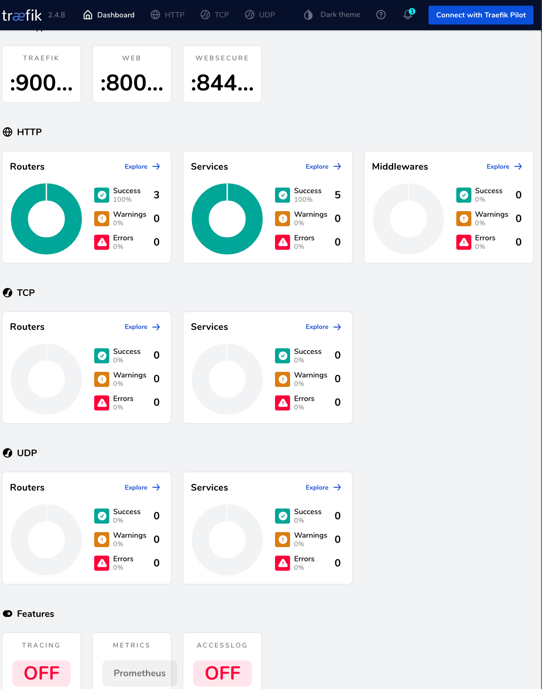
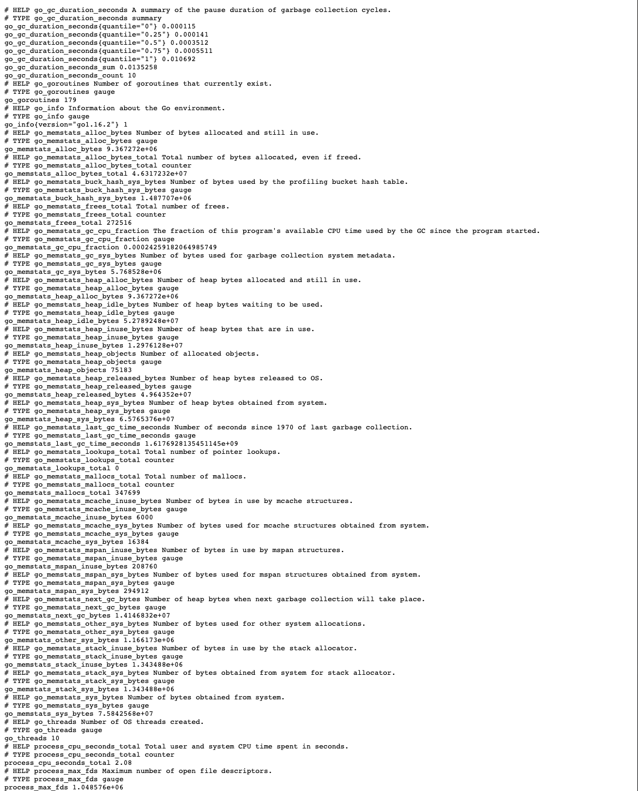
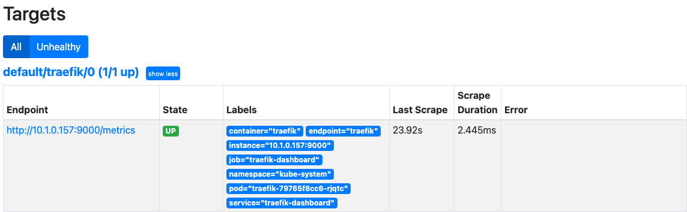
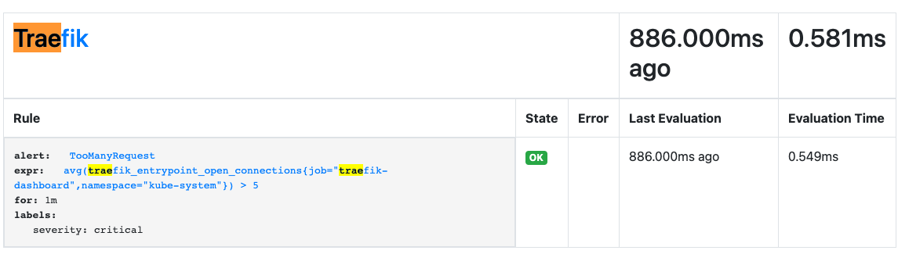
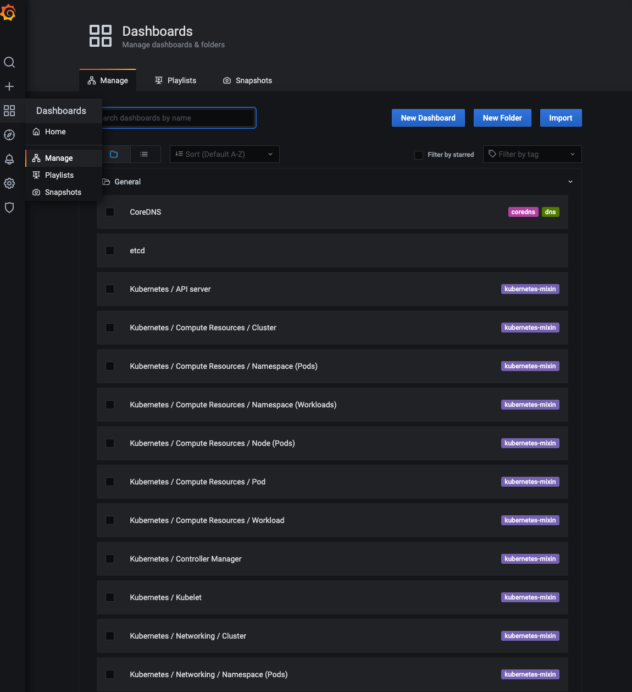
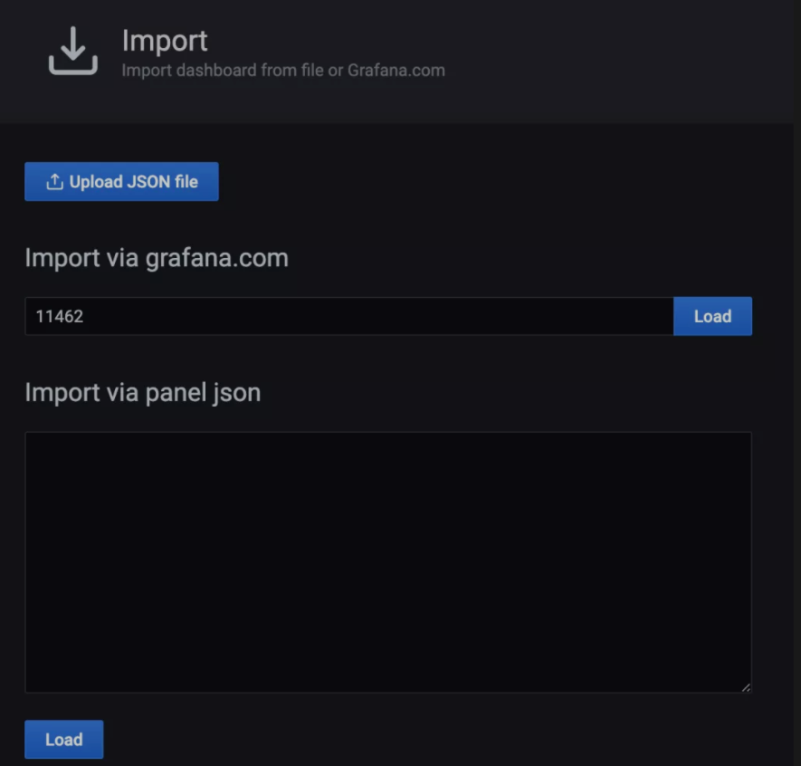
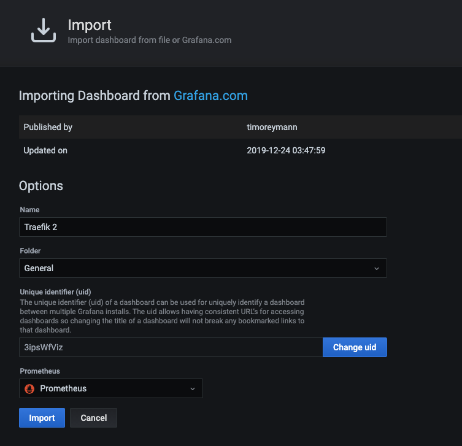
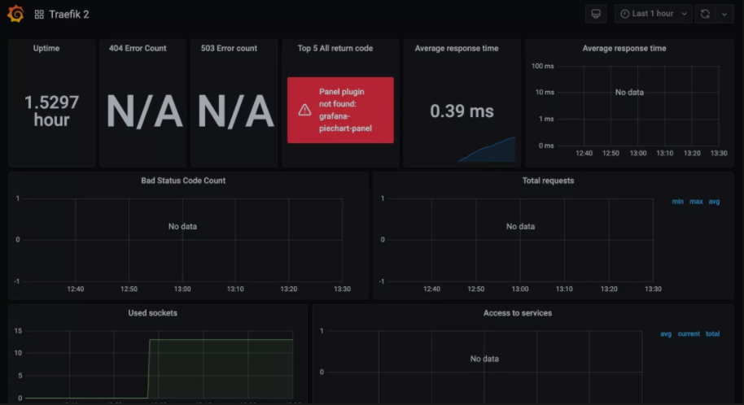
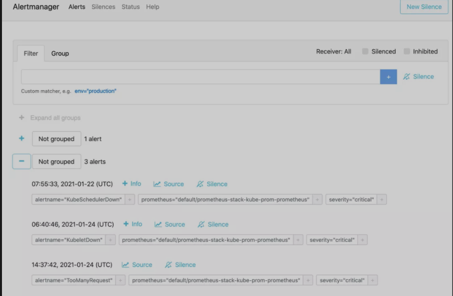

# **Traefik之使用 Prometheus 进行监控报警 (2021)(Traefik/Prometheus/PrometheusRule/Grafana 配置/测试)**


本文我们将探讨如何使用 Prometheus 和 Grafana 从 Traefik 提供的 metrics 指标中进行监控报警。


## **安装**

首先你需要一个可以访问的 Kubernetes 集群。

## **部署 Traefik**

这里我们使用更加简单的 Helm 方式来安装部署 Traefik。首先使用以下命令将 Traefik 添加到 Helm 的仓库中：

```
$ helm repo add traefik https://helm.traefik.io/traefik
$ helm repo update
```

然后我们可以在 `kube-system` 命名空间下来部署最新版本的 `Traefik`，在我们这个示例中，我们还需要确保在集群中启用了 `Prometheus` 指标，可以通过给 `Helm` 传递 `--metrics.prometheus=true` 标志来实现，这里我们将所有配置都放置到下面的 `traefik-values.yaml` 文件中：

**`traefik-values.yaml`**

```
# 简单使用 hostPort 模式
ports:
  web:
    port: 8000
    hostPort: 80
  websecure:
    port: 8443
    hostPort: 443
   
service:
  enabled: false
# 不暴露 dashboard


dashboard:
  # Enable the dashboard on Traefik
  enable: true
  ingressRoute: false
# ingressRoute:
#   dashboard:
#     enabled: false

# 开启 prometheus 监控指标
additionalArguments:
- --api.debug=true
- --metrics.prometheus=true

# kubeadm 安装的集群默认情况下master是有污点，需要容忍这个污点才可以部署
# 这里我们将 traefik 固定在 master 节点
tolerations:   
- key: "node-role.kubernetes.io/master"
  operator: "Equal"
  effect: "NoSchedule"

nodeSelector: 
  kubernetes.io/hostname: "docker-desktop"
```

[https://github.com/traefik/traefik-helm-chart/blob/43d63f418836d7aaac03cfca5b54f4287c8acf9c/traefik/values.yaml](https://github.com/traefik/traefik-helm-chart/blob/43d63f418836d7aaac03cfca5b54f4287c8acf9c/traefik/values.yaml)

直接使用如下所示的命令安装：

```
$ helm install traefik traefik/traefik -n kube-system -f traefik-values.yaml
NAME: traefik
LAST DEPLOYED: Tue Apr  6 14:37:54 2021
NAMESPACE: kube-system
STATUS: deployed
REVISION: 1
TEST SUITE: None
```

由于我们默认没有为 Traefik 的 Dashboard 创建 IngressRoute 对象，这里我们使用 port-forward 来临时访问即可，当然首先需要为 Traefik Dashboard 创建一个 Service：


**`traefik-dashboard-service.yaml`**

```
# traefik-dashboard-service.yaml
apiVersion: v1
kind: Service
metadata:
  name: traefik-dashboard
  namespace: kube-system
  labels:
    app.kubernetes.io/instance: traefik
    app.kubernetes.io/name: traefik-dashboard
spec:
  type: ClusterIP
  ports:
  - name: traefik
    port: 9000
    targetPort: traefik
    protocol: TCP
  selector:
    app.kubernetes.io/instance: traefik
    app.kubernetes.io/name: traefik
```

```
$ kubectl get all -n kube-system | grep traefik
pod/traefik-79765f8cc6-rjqtc                 1/1     Running   0          144m
service/traefik-dashboard                                   ClusterIP   10.99.59.98      <none>        9000/TCP                       169m
deployment.apps/traefik   1/1     1            1           144m
replicaset.apps/traefik-79765f8cc6   1         1         1       144m
```


直接创建，然后使用端口转发来访问：

```
$ kubectl apply -f traefik-dashboard-service.yaml

$ kubectl port-forward service/traefik-dashboard 9000:9000 -n kube-system
Forwarding from 127.0.0.1:9000 -> 9000
Forwarding from [::1]:9000 -> 9000
```

接下来我们就可以通过浏览器 [http://127.0.0.1:9000/dashboard/](http://127.0.0.1:9000/dashboard/)（**注意 URL 中的尾部斜杠，这是必须的**）访问 Traefik Dashboard 了，现在应该可以看到在仪表板的 Features 部分启用了 Prometheus 指标。



此外我们还可以访问 [http://127.0.0.1:9000/metrics](http://127.0.0.1:9000/metrics) 端点来查看 Traefik 提供的一些 metrics 指标：



## 部署 Prometheus Stack

```
helm repo add prometheus-community https://prometheus-community.github.io/helm-charts

helm repo update
```

上述资源库提供了许多 Chart，要查看完整的列表，你可以使用搜索命令：

```
$ helm search repo prometheus-community
NAME                                                    CHART VERSION   APP VERSION     DESCRIPTION                                       
prometheus-community/alertmanager                       0.8.0           v0.21.0         The Alertmanager handles alerts sent by client ...
prometheus-community/kube-prometheus-stack              14.5.0          0.46.0          kube-prometheus-stack collects Kubernetes manif...
prometheus-community/prometheus                         13.6.0          2.24.0          Prometheus is a monitoring system and time seri...
prometheus-community/prometheus-adapter                 2.12.1          v0.8.3          A Helm chart for k8s prometheus adapter           
prometheus-community/prometheus-blackbox-exporter       4.10.2          0.18.0          Prometheus Blackbox Exporter                      
prometheus-community/prometheus-cloudwatch-expo...      0.14.1          0.10.0          A Helm chart for prometheus cloudwatch-exporter   
prometheus-community/prometheus-consul-exporter         0.4.0           0.4.0           A Helm chart for the Prometheus Consul Exporter   
prometheus-community/prometheus-couchdb-exporter        0.2.0           1.0             A Helm chart to export the metrics from couchdb...
prometheus-community/prometheus-druid-exporter          0.9.0           v0.8.0          Druid exporter to monitor druid metrics with Pr...
prometheus-community/prometheus-elasticsearch-e...      4.4.0           1.1.0           Elasticsearch stats exporter for Prometheus       
prometheus-community/prometheus-kafka-exporter          1.0.0           v1.2.0          A Helm chart to export the metrics from Kafka i...
prometheus-community/prometheus-mongodb-exporter        2.8.1           v0.10.0         A Prometheus exporter for MongoDB metrics         
prometheus-community/prometheus-mysql-exporter          1.1.0           v0.12.1         A Helm chart for prometheus mysql exporter with...
prometheus-community/prometheus-nats-exporter           2.6.0           0.7.0           A Helm chart for prometheus-nats-exporter         
prometheus-community/prometheus-node-exporter           1.16.2          1.1.2           A Helm chart for prometheus node-exporter         
prometheus-community/prometheus-operator                9.3.2           0.38.1          DEPRECATED - This chart will be renamed. See ht...
prometheus-community/prometheus-pingdom-exporter        2.3.2           20190610-1      A Helm chart for Prometheus Pingdom Exporter      
```

这里我们需要安装的是 kube-prometheus-stack 这个 Chart，它会部署所需要的相关组件：

```
$ helm install kube-prom prometheus-community/kube-prometheus-stack -n monitoring
```

[Promethuse-operator 2021 安装](https://github.com/Chao-Xi/JacobTechBlog/blob/master/k8s_dev/prometheus/44Prometheus_KubeNurse.md#promethuse-operator-2021-%E5%AE%89%E8%A3%85)


## 配置 Traefik 监控

Prometheus Operator 提供了 ServiceMonitor 这个 CRD 来配置监控指标的采集，这里我们定义一个如下所示的对象：

**`traefik-service-monitor.yaml`**

```
# traefik-service-monitor.yaml
apiVersion: monitoring.coreos.com/v1
kind: ServiceMonitor
metadata:
  name:  traefik
  namespace: default
  labels:
    app: traefik
    release: prometheus-stack
spec:
  jobLabel: traefik-metrics
  selector:
    matchLabels:
      app.kubernetes.io/instance: traefik
      app.kubernetes.io/name: traefik-dashboard
  namespaceSelector:
    matchNames:
    - kube-system
  endpoints:
  - port: traefik
    path: /metrics
```

根据上面的配置，`Prometheus` 将获取 `traefik-dashboard` 服务的 `/metrics` 端点。

主要注意的是 `traefik-dashboard` 服务是在 `kube-system` 命名空间中创建的，而 `ServiceMonitor` 则部署在默认的 `default` 命名空间中，所以这里面我们使用了 `namespaceSelector` 进行命名空间匹配。


接下来我们可以来验证一下 Prometheus 是否已经开始抓取 Traefik 的指标了。



## 配置 Traefik 报警

**接下来我们还可以添加一个报警规则，当条件匹配的时候会触发报警，同样 Prometheus Operator 也提供了一个名为 PrometheusRule 的 CRD 对象来配置报警规则**：

**traefik-rules.yaml**

```
# traefik-rules.yaml
apiVersion: monitoring.coreos.com/v1
kind: PrometheusRule
metadata:
  annotations:
    meta.helm.sh/release-name: kube-prom
    meta.helm.sh/release-namespace: monitoring
  labels:
    app: kube-prometheus-stack
    release: kube-prom
  name: traefik-alert-rules
  namespace: monitoring
spec:
  groups:
  - name: Traefik
    rules:
    - alert: TooManyRequest
      expr: avg(traefik_entrypoint_open_connections{job="traefik-dashboard",namespace="kube-system"})
        > 5
      for: 1m
      labels:
        severity: critical
```
这里我们定义了一个规则：如果1分钟内有超过5个 `open connections` 机会触发一个 `TooManyRequest` 报警，直接创建这个对象即可：

```
$ kubectl apply -f traefik-rules.yaml
```

**注意： PrometheusRule的annotations&labels**

**可以借鉴其它已经运行的rule**

**`kubectl get PrometheusRule kube-prom-kube-prometheus-prometheus-operator -n monitoring -oyaml`**

```
annotations:
    meta.helm.sh/release-name: kube-prom
    meta.helm.sh/release-namespace: monitoring
  labels:
    app: kube-prometheus-stack
    release: kube-prom
  name: traefik-alert-rules
  namespace: monitoring
```

### 查看PrometheusRule是否安装成功

```
kubectl exec prometheus-kube-prom-kube-prometheus-prometheus-0 -n monitoring -it sh

cd /etc/prometheus/rules/prometheus-kube-prom-kube-prometheus-prometheus-rulefiles-0

$ ls -la

...
monitoring-traefik-alert-rules.yaml
```

创建完成后正常在 Promethues 的 Dashboard  下的 `Status > Rules` 页面就可以看到对应的报警规则：



## Grafana 配置

前面使用 kube-prometheus-stack 这个 Helm Chart 部署的时候就已经部署上了 Grafana，接下来我们可以为 Traefik 的监控指标配置一个 Dashboard，同样首先我们使用端口转发的方式来访问 Grafana：

```
kubectl port-forward svc/kube-prom-grafana 10080:80 -n monitoring
```

然后访问 `Grafana GUI（http://localhost:10080`）时，它会要求输入登录名和密码，**默认的登录用户名是 `admin`，密码是 `prom-operator`**，密码可以从名为 `prometheus-operator-grafana` 的 Kubernetes Secret 对象中获取。


当然我们可以自己为 Traefik 自定义一个 Dashboard，也可以从 Grafana 的官方社区中导入一个合适的即可，点击左侧导航栏上的四方形图标，导航到 Dashboards > Manage，即可添加仪表盘。



**点击右上角的 Import 按钮，输入 `11462` 作为 Dashboard 的 ID，对应用户 timoreymann 贡献的 Traefik 2 仪表盘**。



点击 Load 后，你应该看到导入的仪表盘的相关信息。



在最下面有一个下拉菜单，选择 Prometheus 数据源，然后点击 Import，即可生成如下所示的 Dashboard。



## 测试

现在，Traefik 已经开始工作了，并且指标也被 Prometheus 和 Grafana 获取到了，接下来我们需要使用一个应用程序来测试。这里我们部署 HTTPBin 服务，它提供了许多端点，可用于模拟不同类型的用户流量。对应的资源清单文件如下所示：

```
# httpbin.yaml
apiVersion: apps/v1
kind: Deployment
metadata:
  name: httpbin
  labels:
    app: httpbin
spec:
  replicas: 1
  selector:
    matchLabels:
      app: httpbin
  template:
    metadata:
      labels:
        app: httpbin
    spec:
      containers:
      - image: kennethreitz/httpbin
        name: httpbin
        ports:
        - containerPort: 80
---
apiVersion: v1
kind: Service
metadata:
  name: httpbin
spec:
  ports:
  - name: http
    port: 8000
    targetPort: 80
  selector:
    app: httpbin
---
apiVersion: traefik.containo.us/v1alpha1
kind: IngressRoute
metadata:
  name: httpbin
spec:
  entryPoints:
    - web
  routes:
  - match: Host(`httpbin.local`)
    kind: Rule
    services:
    - name: httpbin
      port: 8000
 ```
 
直接创建上面的资源清单：

```
$ kubectl apply -f httpbin.yaml
deployment.apps/httpbin created
service/httpbin created
ingressroute.traefik.containo.us/httpbin created
```

httpbin 路由会匹配 `httpbin.local` 的主机名，然后将请求转发给 httpbin Service：

```
$ curl -I http://192.168.65.4  -H "host:httpbin.local"
HTTP/1.1 200 OK
Access-Control-Allow-Credentials: true
Access-Control-Allow-Origin: *
Content-Length: 9593
Content-Type: text/html; charset=utf-8
Date: Mon, 05 Apr 2021 05:43:16 GMT
Server: gunicorn/19.9.0
```

我们这里部署的 Traefik 使用的是 hostPort 模式，固定到 master 节点上面的，这里的 IP 地址 192.168.65.4 就是 master 节点的 IP 地址。

接下来我们使用 ab 来访问 HTTPBin 服务模拟一些流量，这些请求会产生对应的指标，执行以下脚本：

```
$ ab -c 5 -n 10000  -m PATCH -H "host:httpbin.local" -H "accept: application/json" http://192.168.31.75/patch
$ ab -c 5 -n 10000  -m GET -H "host:httpbin.local" -H "accept: application/json" http://192.168.31.75/get
$ ab -c 5 -n 10000  -m POST -H "host:httpbin.local" -H "accept: application/json" http://192.168.31.75/post
```
正常一段时间后再去查看 Grafana 的 Dashboard 可以看到显示了更多的信息：

包括：正常运行的时间、平均响应时间、请求总数、基于 HTTP 方法和服务的请求计数等。


最后，当我们测试应用流量时，`Prometheus` 可能会触发报警，之前创建的 `TooManyRequest` 报警将显示在 Alertmanager 仪表板上，然后可以自己根据需要配置接收报警信息的 Receiver 即可。

```
$ kubectl port-forward service/prometheus-stack-kube-prom-alertmanager 9093:9093
Forwarding from 127.0.0.1:9093 -> 9093
```



## 总结

在本文中，我们已经看到了将 Traefik 连接到 Prometheus 和 Grafana 以从 Traefik 指标中创建可视化的过程是非常简单的。当熟悉这些工具后，我们也可以根据实际需求创建一些 Dashboard，暴露你的环境的一些关键数据。

