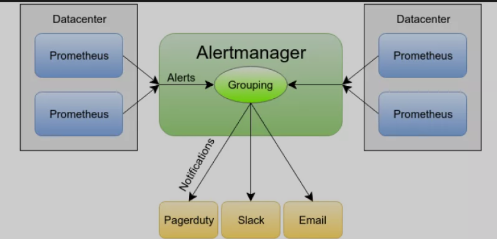
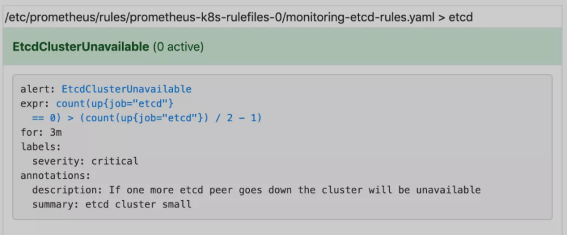
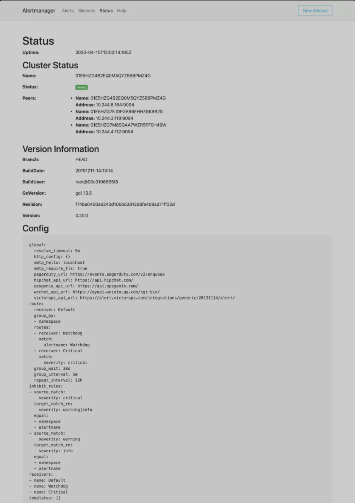
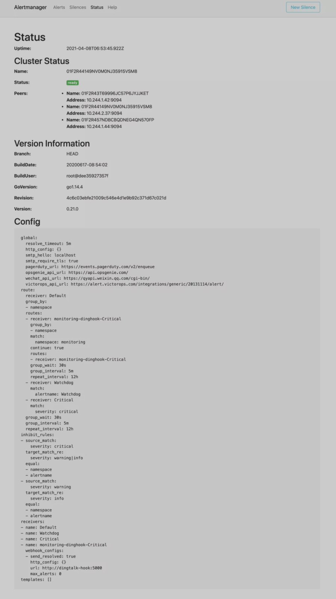

# **Prometheus Operator 使用 AlertmanagerConfig 进行报警配置**




Prometheus Dashboard 的 Alert 页面下面就已经有很多报警规则了，这一系列的规则其实都来自于项目 [https://github.com/kubernetes-monitoring/kubernetes-mixin](https://github.com/kubernetes-monitoring/kubernetes-mixin)，我们都通过 Prometheus Operator 安装配置上了。

## 配置 PrometheusRule

但是这些报警信息是哪里来的呢？他们应该用怎样的方式通知我们呢？

我们知道之前我们使用自定义的方式可以在 Prometheus 的配置文件之中指定 AlertManager 实例和 报警的 rules 文件，现在我们通过 Operator 部署的呢？

**我们可以在 Prometheus Dashboard 的 Config 页面下面查看关于 AlertManager 的配置：**

```
alerting:
  alert_relabel_configs:
    - separator: ;
      regex: prometheus_replica
      replacement: $1
      action: labeldrop
  alertmanagers:
    - kubernetes_sd_configs:
        - role: endpoints
          namespaces:
            names:
              - monitoring
      scheme: http
      path_prefix: /
      timeout: 10s
      api_version: v1
      relabel_configs:
        - source_labels: [__meta_kubernetes_service_name]
          separator: ;
          regex: alertmanager-main
          replacement: $1
          action: keep
        - source_labels: [__meta_kubernetes_endpoint_port_name]
          separator: ;
          regex: web
          replacement: $1
          action: keep
rule_files:
  - /etc/prometheus/rules/prometheus-k8s-rulefiles-0/*.yaml
```

上面 alertmanagers 的配置我们可以看到是通过 role 为 endpoints 的 kubernetes 的自动发现机制获取的，匹配的是服务名为 `alertmanager-main`，端口名为 `web` 的 `Service` 服务，我们可以查看下 `alertmanager-mai` 这个`Service`：

```
$ kubectl describe svc alertmanager-main -n monitoring
Name:                     alertmanager-main
Namespace:                monitoring
Labels:                   alertmanager=main
Annotations:              kubectl.kubernetes.io/last-applied-configuration:
                            {"apiVersion":"v1","kind":"Service","metadata":{"annotations":{},"labels":{"alertmanager":"main"},"name":"alertmanager-main","namespace":"...
Selector:                 alertmanager=main,app=alertmanager
Type:                     NodePort
IP:                       10.106.211.33
Port:                     web  9093/TCP
TargetPort:               web/TCP
NodePort:                 web  31742/TCP
Endpoints:                10.244.3.119:9093,10.244.4.112:9093,10.244.8.164:9093
Session Affinity:         ClientIP
External Traffic Policy:  Cluster
Events:                   <none>
```

可以看到服务名正是`alertmanager-main`，Port 定义的名称也是 `web`，符合上面的规则，所以 Prometheus 和 AlertManager 组件就正确关联上了。

**而对应的报警规则文件位于：`/etc/prometheus/rules/prometheus-k8s-rulefiles-0/`目录下面所有的 YAML 文件。**

我们可以进入` Prometheus` 的 `Pod` 中验证下该目录下面是否有 `YAML `文件：

```
$ kubectl exec -it prometheus-k8s-0 /bin/sh -n monitoring
Defaulting container name to prometheus.
Use 'kubectl describe pod/prometheus-k8s-0 -n monitoring' to see all of the containers in this pod.
/prometheus $ ls /etc/prometheus/rules/prometheus-k8s-rulefiles-0/
monitoring-prometheus-k8s-rules.yaml
/prometheus $ cat /etc/prometheus/rules/prometheus-k8s-rulefiles-0/monitoring-pr
ometheus-k8s-rules.yaml
groups:
- name: k8s.rules
  rules:
  - expr: |
      sum(rate(container_cpu_usage_seconds_total{job="kubelet", image!="", container_name!=""}[5m])) by (namespace)
    record: namespace:container_cpu_usage_seconds_total:sum_rate
......
```
这个 YAML 文件实际上就是我们之前创建的一个 `PrometheusRule` 文件包含的内容：

```

$ cat prometheus-rules.yaml
apiVersion: monitoring.coreos.com/v1
kind: PrometheusRule
metadata:
  labels:
    prometheus: k8s
    role: alert-rules
  name: prometheus-k8s-rules
  namespace: monitoring
spec:
  groups:
  - name: node-exporter.rules
    rules:
    - expr: |
        count without (cpu) (
          count without (mode) (
            node_cpu_seconds_total{job="node-exporter"}
          )
        )
      record: instance:node_num_cpu:sum
    - expr: |
......
```

我们这里的 `PrometheusRule` 的 `name` 为 `prometheus-k8s-rules`，namespace 为 monitoring，我们可以猜想到我们创建一个 `PrometheusRule` 资源对象后，会自动在上面的 prometheus-k8s-rulefiles-0 目录下面生成一个对应的 `<namespace>-<name>.yaml `文件，所以如果以后我们需要自定义一个报警选项的话，只需要定义一个 PrometheusRule 资源对象即可。

至于为什么 Prometheus 能够识别这个 PrometheusRule 资源对象呢？这就需要查看我们创建的 `prometheus `这个资源对象了，里面有非常重要的一个属性 ruleSelector，用来匹配 rule 规则的过滤器，要求匹配具有 `prometheus=k8s` 和 r`ole=alert-rules` 标签的 `PrometheusRule` 资源对象，现在明白了吧？

```
ruleSelector:
  matchLabels:
    prometheus: k8s
    role: alert-rules
```

所以我们要想自定义一个报警规则，只需要创建一个具有 `prometheus=k8s `和 `role=alert-rules` 标签的 PrometheusRule 对象就行了，比如现在我们添加一个 `etcd `是否可用的报警，我们知道 etcd 整个集群有一半以上的节点可用的话集群就是可用的，所以我们判断如果不可用的 etcd 数量超过了一半那么就触发报警，创建文件 `prometheus-etcdRules.yaml`：

```
apiVersion: monitoring.coreos.com/v1
kind: PrometheusRule
metadata:
  labels:
    prometheus: k8s
    role: alert-rules
  name: etcd-rules
  namespace: monitoring
spec:
  groups:
    - name: etcd
      rules:
        - alert: EtcdClusterUnavailable
          annotations:
            summary: etcd cluster small
            description: If one more etcd peer goes down the cluster will be unavailable
          expr: |
            count(up{job="etcd"} == 0) > (count(up{job="etcd"}) / 2 - 1)
          for: 3m
          labels:
            severity: critical
```

注意 label 标签一定至少要有 `prometheus=k8s` 和 `role=alert-rules`，创建完成后，隔一会儿再去容器中查看下 rules 文件夹：

```
$ kubectl apply -f prometheus-etcdRules.yaml
prometheusrule.monitoring.coreos.com/etcd-rules created
$ kubectl exec -it prometheus-k8s-0 /bin/sh -n monitoring
Defaulting container name to prometheus.
Use 'kubectl describe pod/prometheus-k8s-0 -n monitoring' to see all of the containers in this pod.
/prometheus $ ls /etc/prometheus/rules/prometheus-k8s-rulefiles-0/
monitoring-etcd-rules.yaml            monitoring-prometheus-k8s-rules.yaml
```

可以看到我们创建的 rule 文件已经被注入到了对应的 rulefiles 文件夹下面了，证明我们上面的设想是正确的。然后再去 `Prometheus Dashboard` 的 Alert 页面下面就可以查看到上面我们新建的报警规则了：



## 配置报警

我们知道了如何去添加一个报警规则配置项，但是这些报警信息用怎样的方式去发送呢？前面的课程中我们知道我们可以通过 AlertManager 的配置文件去配置各种报警接收器，现在我们是通过 Operator 提供的 alertmanager 资源对象创建的组件，应该怎样去修改配置呢？

首先我们去 Alertmanager 的页面上 status 路径下面查看 AlertManager 的配置信息:



这些配置信息实际上是来自于 `Prometheus-Operator` 自动创建的名为 `alertmanager-main-generated` 的 Secret 对象：

```
$ kubectl get secret alertmanager-main-generated -n monitoring -o json | jq -r '.data."alertmanager.yaml"' | base64 --decode
"global":
  "resolve_timeout": "5m"
"inhibit_rules":
- "equal":
  - "namespace"
  - "alertname"
  "source_match":
    "severity": "critical"
  "target_match_re":
    "severity": "warning|info"
- "equal":
  - "namespace"
  - "alertname"
  "source_match":
    "severity": "warning"
  "target_match_re":
    "severity": "info"
"receivers":
- "name": "Default"
- "name": "Watchdog"
- "name": "Critical"
"route":
  "group_by":
  - "namespace"
  "group_interval": "5m"
  "group_wait": "30s"
  "receiver": "Default"
  "repeat_interval": "12h"
  "routes":
  - "match":
      "alertname": "Watchdog"
    "receiver": "Watchdog"
  - "match":
      "severity": "critical"
    "receiver": "Critical"
```

我们可以看到内容和上面查看的配置信息是一致的，所以如果我们想要添加自己的接收器，我们就可以直接更改这个文件，但是这里的内容是 base64 编码过后的，如果手动添加内容就非常不方便。

## AlertmanagerConfig

为此 Prometheus-Operator 新增了一个 `AlertmanagerConfig` 的 CRD，比如我们将 `Critical` 这个接收器的报警信息都发送到钉钉进行报警。

首先在 monitoring 命名空间下面部署一个简单的钉钉 webhook 处理器，前面 Alertmanager 章节已经学习过，这里就不赘述了。

然后新建一个 `AlertmanagerConfig` 类型的资源对象，可以通过 `kubectl explain alertmanagerconfig` 或者在线 API 文档([https://github.com/prometheus-operator/prometheus-operator/blob/master/Documentation/user-guides/alerting.md](https://github.com/prometheus-operator/prometheus-operator/blob/master/Documentation/user-guides/alerting.md))来查看字段的含义

```
# alertmanager-config.yaml
apiVersion: monitoring.coreos.com/v1alpha1
kind: AlertmanagerConfig
metadata:
  name: dinghook
  namespace: monitoring
  labels:
    alertmanagerConfig: example
spec:
  receivers:
    - name: Critical
      webhookConfigs:
        - url: http://dingtalk-hook:5000
          sendResolved: true
  route:
    groupBy: ["namespace"]
    groupWait: 30s
    groupInterval: 5m
    repeatInterval: 12h
    receiver: Critical
    routes:
      - receiver: Critical
        match:
          severity: critical
```
 
 不过如果直接创建上面的配置是不会生效的，我们需要添加一个 Label 标签，并在 Alertmanager 的资源对象中通过标签来关联上面的这个对象，**比如我们这里新增了一个 Label 标签：`alertmanagerConfig: example`，然后需要重新更新 Alertmanager 对象，添加 `alertmanagerConfigSelector` 属性去匹配 `AlertmanagerConfig` 资源对象**：

```
# alertmanager-alertmanager.yaml
apiVersion: monitoring.coreos.com/v1
kind: Alertmanager
metadata:
  labels:
    alertmanager: main
  name: main
  namespace: monitoring
spec:
  image: quay.io/prometheus/alertmanager:v0.21.0
  nodeSelector:
    kubernetes.io/os: linux
  replicas: 3
  securityContext:
    fsGroup: 2000
    runAsNonRoot: true
    runAsUser: 1000
  serviceAccountName: alertmanager-main
  version: v0.21.0
  configSecret:
  alertmanagerConfigSelector: # 匹配 AlertmanagerConfig 的标签
    matchLabels:
      alertmanagerConfig: example
```
 
 现在我们重新更新上面的资源对象：

```
kubectl apply -f alertmanager-config.yaml
kubectl apply -f alertmanager-alertmanager.yaml
```

更新完成后默认的配置会和我们创建的配置进行合并，我们可以重新查看生成的 Secret 资源对象内容，也可以直接查看 Alertmanager 的 WEB UI 界面的配置内容：



可以看到我们在 `AlertmanagerConfig` 里面定义的名为 `Critical` 的 Receiver，在最终生成的配置中名称了` monitoring-dinghook-Critical`，格式为 `<namespace>-<name>-<receiver name>`。

