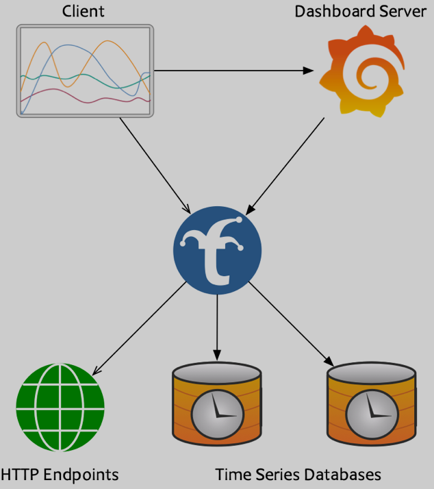
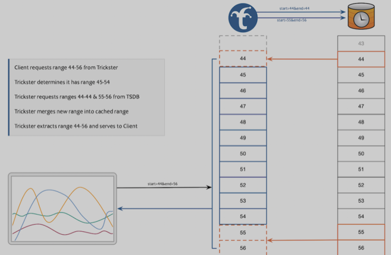
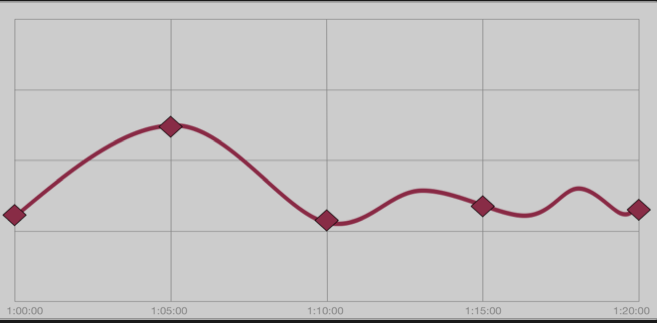

# **Grafana 图表加速神器 - Trickster**

Trickster(tricksterproxy.io)是一个用于 http 应用的 HTTP 反向代理/缓存，也是一个用于时间序列数据库的仪表盘查询加速器。

目前 Trickster 是有由 CNCF 作为沙盒级项目进行托管的，目前 Trickster v1.1 是生产版本，来源于 v1.1.x 分支，主分支来源 Trickster 2.0，目前处于测试阶段。

## HTTP 反向代理缓存

Trickster 是一个功能齐全的 HTTP 反向代理缓存工具，适用于 HTTP 应用，如静态文件服务器和 Web API。

### 功能亮点

* 一个独特而强大的应用负载均衡器，用于时间序列和通用 HTTP 端点
* **支持 TLS 和 HTTP/2**
*** 为缓存层提供了几种选择，包括内存、文件系统、Redis 和 bbolt**
* 高度可定制，使用简单的 yaml 配置设置，到 HTTP 路径。
* **内置的 Prometheus 指标和可定制的健康检查端点，用于端到端监控**
* 高性能转发
* Byte 范围内请求缓存和加速
* **通过 OpenTelemetry 进行分布式跟踪，支持 Jaeger 和 Zipkin**
* 用于自定义请求路由和重写的规则引擎

## 时序数据库加速器

Trickster 通过消除 TSDB 上的冗余计算，极大地改善了终端用户的仪表盘图表渲染时间。简而言之，Trickster 对于读取量大的 Dashboard/TSDB 环境，以及那些具有高度标准化数据集的环境，极大提高了性能和可扩展性。

Trickster 兼容 Prometheus、ClickHouse、InfluxDB、Circonus IRONdb

### 如何加速时间序列

**1. 时间序列 Delta 代理缓存**，大多数仪表盘在每次用户的仪表盘加载时，以及每次自动刷新时，都会向时间序列数据库请求他们希望呈现的整个数据时间范围。

**Trickster 的 Delta Proxy 会检查客户端查询的时间范围，以确定哪些数据点已经被缓存，并从 tsdb 中只请求仍然需要服务于客户端请求的数据点**。

这样一来，每个人的图表加载时间都会大大加快，因为 tsdb 在每次加载仪表盘时只查询微小的增量变化，而不是几百个数据点的重复数据。

**2. 边界标准化，当 Trickster 从 tsdb 请求数据时，它会稍微调整客户请求的时间范围，以确保返回的所有数据点都与标准化的步长边界一致**。

例如，如果步长为 300s，所有数据点将落在时钟 0 和 5 上。这确保了数据的高度可缓存性，以更直观地传达给用户，并且所有仪表盘用户在屏幕上看到的数据都是相同的。

**3. Fast Forward，Trickster 的 Fast Forward 功能确保了即使在步长边界统一的情况下，实时图表仍然总是显示最新的数据，而不管下一个步长边界有多远**。

例如，如果你的图表步长是 300s，而时间目前是 1:21p，通常你会在 1:25p 再等 4 分钟才有新的数据点。Trickster 会打破最近数据点的步长间隔，并始终将其包含在对客户请求实时数据的响应中。

可以通过 [https://helm.tricksterproxy.io/](https://helm.tricksterproxy.io/) 在 Kubernetes 中进行安装。

