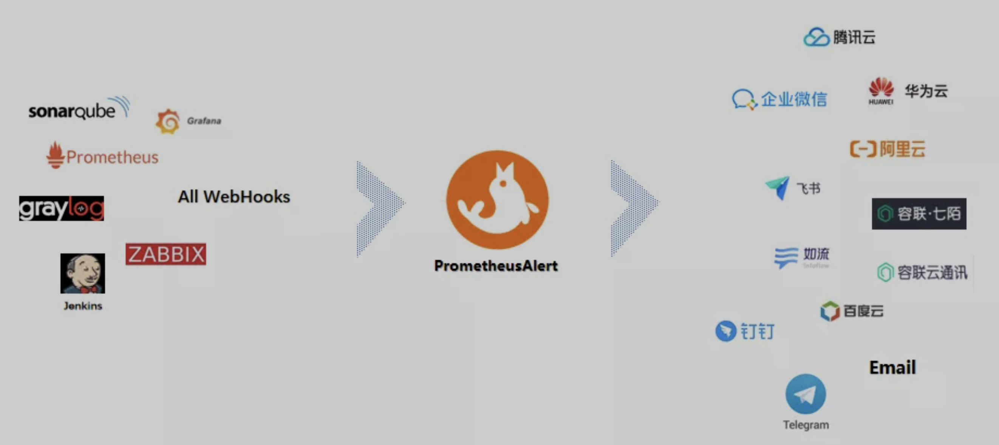
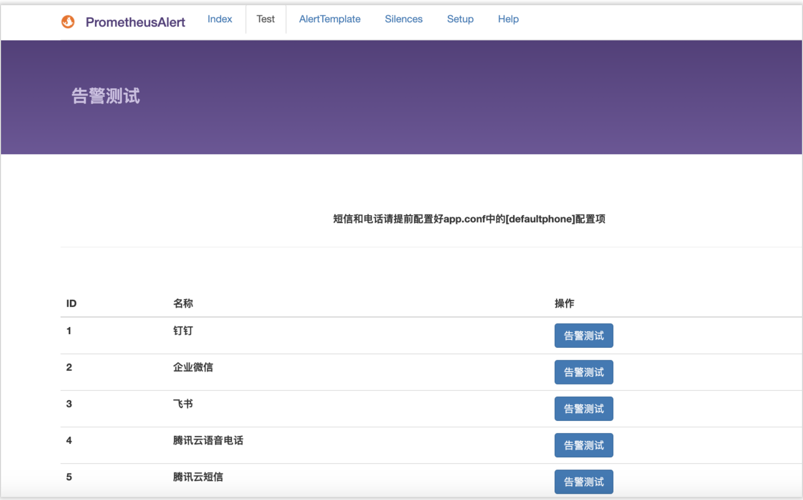
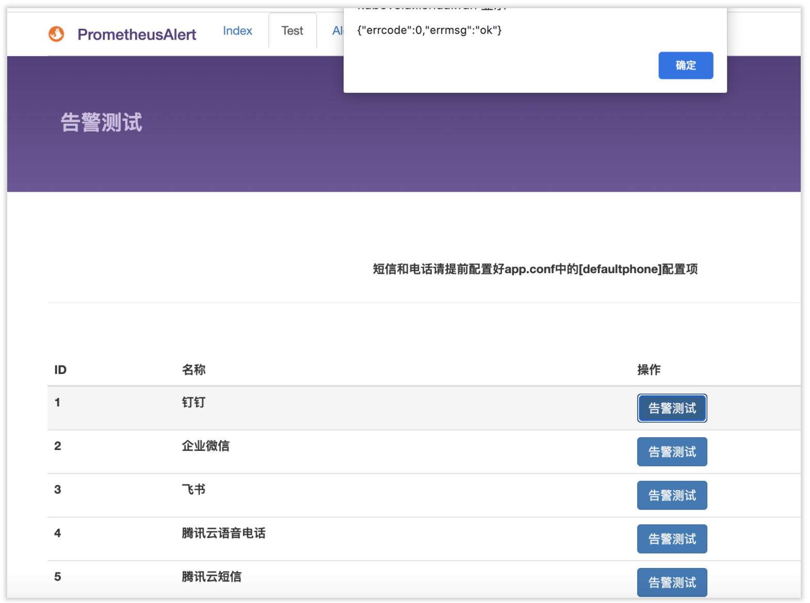
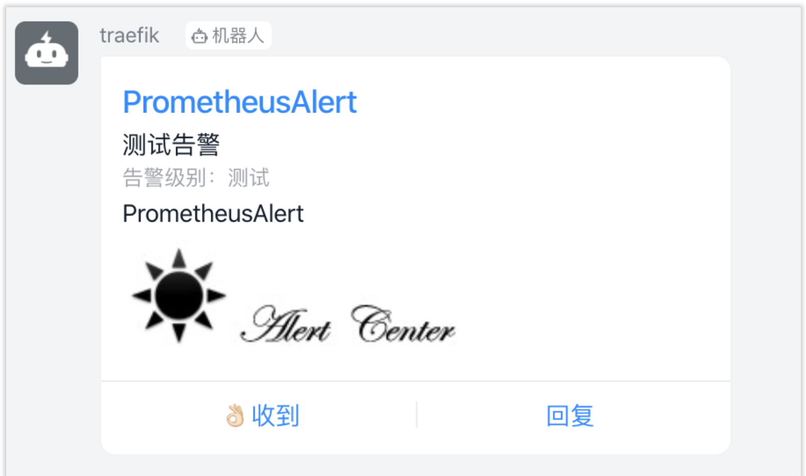

# **Prometheus 中使用 PrometheusAlert 进行聚合报警**




本身prometheus已经有了alertmanager这个组件提供了一些报警媒介比如email wechat等，为什么我还还要使用prometheusalert呢？

Prometheus Alert是开源的运维告警中心消息转发系统,支持主流的监控系统Prometheus,Zabbix,日志系统Graylog和数据可视化系统Grafana发出的预警消息,支持钉钉,微信,华为云短信,腾讯云短信,腾讯云电话,阿里云短信,阿里云电话等，

**可以看出prometheusalert相比和alertmanager内置的报警媒介相比支持的更全面，并且配置和调试更方便，prometheusalert 并不能取代alertmanager，而是要作为webhoook与alertmanager结合使用。**


```
#Kubernetes中运行可以直接执行以下命令行即可(注意默认的部署模版中未挂载模版数据库文件 db/PrometheusAlertDB.db，为防止模版数据丢失，请自行增加挂载配置 )


wget https://raw.githubusercontent.com/feiyu563/PrometheusAlert/master/example/kubernetes/PrometheusAlert-Deployment.yaml
```

注意：这里需要修改一下文件中volumemount中使用的configmap名称，参见[https://github.com/feiyu563/PrometheusAlert/issues(2021-01-26)](https://github.com/feiyu563/PrometheusAlert/issues(2021-01-26))

修改后文件如下

```
# apiVersion: v1
# kind: Namespace
# metadata:
#   name: monitoring
---  
apiVersion: v1
data:
  app.conf: |
    #---------------------↓全局配置-----------------------
    appname = PrometheusAlert
    #监听端口
    httpport = 8080
    runmode = dev
    #设置代理 proxy = http://123.123.123.123:8080
    proxy =
    #开启JSON请求
    copyrequestbody = true
    #告警消息标题
    title=PrometheusAlert
    #链接到告警平台地址
    GraylogAlerturl=http://graylog.org
    #钉钉告警 告警logo图标地址
    logourl=https://raw.githubusercontent.com/feiyu563/PrometheusAlert/master/doc/alert-center.png
    #钉钉告警 恢复logo图标地址
    rlogourl=https://raw.githubusercontent.com/feiyu563/PrometheusAlert/master/doc/alert-center.png
    #短信告警级别(等于3就进行短信告警) 告警级别定义 0 信息,1 警告,2 一般严重,3 严重,4 灾难
    messagelevel=3
    #电话告警级别(等于4就进行语音告警) 告警级别定义 0 信息,1 警告,2 一般严重,3 严重,4 灾难
    phonecalllevel=4
    #默认拨打号码(页面测试短信和电话功能需要配置此项)
    defaultphone=xxxxxxxx
    #故障恢复是否启用电话通知0为关闭,1为开启
    phonecallresolved=0
    #自动告警抑制(自动告警抑制是默认同一个告警源的告警信息只发送告警级别最高的第一条告警信息,其他消息默认屏蔽,这么做的目的是为了减少相同告警来源的消息数量,防止告警炸弹,0为关闭,1为开启)
    silent=0
    #是否前台输出file or console
    logtype=file
    #日志文件路径
    logpath=logs/prometheusalertcenter.log
    #转换Prometheus,graylog告警消息的时区为CST时区(如默认已经是CST时区，请勿开启)
    prometheus_cst_time=0
    #数据库驱动，支持sqlite3，mysql,如使用mysql，请开启db_host,db_user,db_password,db_name的注释
    db_driver=sqlite3
    #db_host=127.0.0.1:3306
    #db_user=root
    #db_password=root
    #db_name=prometheusalert
    
    #---------------------↓webhook-----------------------
    #是否开启钉钉告警通道,可同时开始多个通道0为关闭,1为开启
    open-dingding=1
    #默认钉钉机器人地址
    ddurl=https://oapi.dingtalk.com/robot/send?access_token=xxxxx
    #是否开启 @所有人(0为关闭,1为开启)
    dd_isatall=1
    
    #是否开启微信告警通道,可同时开始多个通道0为关闭,1为开启
    open-weixin=0
    #默认企业微信机器人地址
    wxurl=https://qyapi.weixin.qq.com/cgi-bin/webhook/send?key=xxxxx
    
    #是否开启飞书告警通道,可同时开始多个通道0为关闭,1为开启
    open-feishu=0
    #默认飞书机器人地址
    fsurl=https://open.feishu.cn/open-apis/bot/hook/xxxxxxxxx
    
    #---------------------↓腾讯云接口-----------------------
    #是否开启腾讯云短信告警通道,可同时开始多个通道0为关闭,1为开启
    open-txdx=0
    #腾讯云短信接口key
    TXY_DX_appkey=xxxxx
    #腾讯云短信模版ID 腾讯云短信模版配置可参考 prometheus告警:{1}
    TXY_DX_tpl_id=xxxxx
    #腾讯云短信sdk app id
    TXY_DX_sdkappid=xxxxx
    #腾讯云短信签名 根据自己审核通过的签名来填写
    TXY_DX_sign=腾讯云
    
    #是否开启腾讯云电话告警通道,可同时开始多个通道0为关闭,1为开启
    open-txdh=0
    #腾讯云电话接口key
    TXY_DH_phonecallappkey=xxxxx
    #腾讯云电话模版ID
    TXY_DH_phonecalltpl_id=xxxxx
    #腾讯云电话sdk app id
    TXY_DH_phonecallsdkappid=xxxxx
    
    #---------------------↓华为云接口-----------------------
    #是否开启华为云短信告警通道,可同时开始多个通道0为关闭,1为开启
    open-hwdx=0
    #华为云短信接口key
    HWY_DX_APP_Key=xxxxxxxxxxxxxxxxxxxxxx
    #华为云短信接口Secret
    HWY_DX_APP_Secret=xxxxxxxxxxxxxxxxxxxxxx
    #华为云APP接入地址(端口接口地址)
    HWY_DX_APP_Url=https://rtcsms.cn-north-1.myhuaweicloud.com:10743
    #华为云短信模板ID
    HWY_DX_Templateid=xxxxxxxxxxxxxxxxxxxxxx
    #华为云签名名称，必须是已审核通过的，与模板类型一致的签名名称,按照自己的实际签名填写
    HWY_DX_Signature=华为云
    #华为云签名通道号
    HWY_DX_Sender=xxxxxxxxxx
    
    #---------------------↓阿里云接口-----------------------
    #是否开启阿里云短信告警通道,可同时开始多个通道0为关闭,1为开启
    open-alydx=0
    #阿里云短信主账号AccessKey的ID
    ALY_DX_AccessKeyId=xxxxxxxxxxxxxxxxxxxxxx
    #阿里云短信接口密钥
    ALY_DX_AccessSecret=xxxxxxxxxxxxxxxxxxxxxx
    #阿里云短信签名名称
    ALY_DX_SignName=阿里云
    #阿里云短信模板ID
    ALY_DX_Template=xxxxxxxxxxxxxxxxxxxxxx
    
    #是否开启阿里云电话告警通道,可同时开始多个通道0为关闭,1为开启
    open-alydh=0
    #阿里云电话主账号AccessKey的ID
    ALY_DH_AccessKeyId=xxxxxxxxxxxxxxxxxxxxxx
    #阿里云电话接口密钥
    ALY_DH_AccessSecret=xxxxxxxxxxxxxxxxxxxxxx
    #阿里云电话被叫显号，必须是已购买的号码
    ALY_DX_CalledShowNumber=xxxxxxxxx
    #阿里云电话文本转语音（TTS）模板ID
    ALY_DH_TtsCode=xxxxxxxx
    
    #---------------------↓容联云接口-----------------------
    #是否开启容联云电话告警通道,可同时开始多个通道0为关闭,1为开启
    RLY_DH_open-rlydh=0
    #容联云基础接口地址
    RLY_URL=https://app.cloopen.com:8883/2013-12-26/Accounts/
    #容联云后台SID
    RLY_ACCOUNT_SID=xxxxxxxxxxx
    #容联云api-token
    RLY_ACCOUNT_TOKEN=xxxxxxxxxx
    #容联云app_id
    RLY_APP_ID=xxxxxxxxxxxxx
    
    #---------------------↓邮件配置-----------------------
    #是否开启邮件
    open-email=0
    #邮件发件服务器地址
    Email_host=smtp.qq.com
    #邮件发件服务器端口
    Email_port=465
    #邮件帐号
    Email_user=xxxxxxx@qq.com
    #邮件密码
    Email_password=xxxxxx
    #邮件标题
    Email_title=运维告警
    #默认发送邮箱
    Default_emails=xxxxx@qq.com,xxxxx@qq.com
    
    #---------------------↓七陌云接口-----------------------
    #是否开启七陌短信告警通道,可同时开始多个通道0为关闭,1为开启
    open-7moordx=0
    #七陌账户ID
    7MOOR_ACCOUNT_ID=Nxxx
    #七陌账户APISecret
    7MOOR_ACCOUNT_APISECRET=xxx
    #七陌账户短信模板编号
    7MOOR_DX_TEMPLATENUM=n
    #注意：七陌短信变量这里只用一个var1，在代码里写死了。
    #-----------
    #是否开启七陌webcall语音通知告警通道,可同时开始多个通道0为关闭,1为开启
    open-7moordh=0
    #请在七陌平台添加虚拟服务号、文本节点
    #七陌账户webcall的虚拟服务号
    7MOOR_WEBCALL_SERVICENO=xxx
    # 文本节点里被替换的变量，我配置的是text。如果被替换的变量不是text，请修改此配置
    7MOOR_WEBCALL_VOICE_VAR=text
    
    #---------------------↓telegram接口-----------------------
    #是否开启telegram告警通道,可同时开始多个通道0为关闭,1为开启
    open-tg=0
    #tg机器人token
    TG_TOKEN=xxxxx
    #tg消息模式 个人消息或者频道消息 0为关闭(推送给个人)，1为开启(推送给频道)
    TG_MODE_CHAN=0
    #tg用户ID
    TG_USERID=xxxxx
    #tg频道name
    TG_CHANNAME=xxxxx
    #tg api地址, 可以配置为代理地址
    #TG_API_PROXY="https://api.telegram.org/bot%s/%s"
    
    #---------------------↓workwechat接口-----------------------
    #是否开启workwechat告警通道,可同时开始多个通道0为关闭,1为开启
    open-workwechat=0
    # 企业ID
    WorkWechat_CropID=xxxxx
    # 应用ID
    WorkWechat_AgentID=xxxx
    # 应用secret
    WorkWechat_AgentSecret=xxxx
    # 接受用户
    WorkWechat_ToUser="zhangsan|lisi"
    # 接受部门
    WorkWechat_ToParty="ops|dev"
    # 接受标签
    WorkWechat_ToTag=""
    # 消息类型, 暂时只支持markdown
    # WorkWechat_Msgtype = "markdown"
  user.csv: |
    2019年4月10日,15888888881,小张,15999999999,备用联系人小陈,15999999998,备用联系人小赵
    2019年4月11日,15888888882,小李,15999999999,备用联系人小陈,15999999998,备用联系人小赵
    2019年4月12日,15888888883,小王,15999999999,备用联系人小陈,15999999998,备用联系人小赵
    2019年4月13日,15888888884,小宋,15999999999,备用联系人小陈,15999999998,备用联系人小赵
kind: ConfigMap
metadata:
  name: prometheus-alert-center-conf
  namespace: monitoring
---
apiVersion: apps/v1
kind: Deployment
metadata:
  labels:
    app: prometheus-alert-center
    alertname: prometheus-alert-center
  name: prometheus-alert-center
#   namespace: monitoring  
spec:
  replicas: 1
  selector:
    matchLabels:
      app: prometheus-alert-center
      alertname: prometheus-alert-center
  template:
    metadata:
      labels:
        app: prometheus-alert-center
        alertname: prometheus-alert-center
    spec:
      containers:
      - image: feiyu563/prometheus-alert
        name: prometheus-alert-center
        env:
        - name: TZ
          value: "Asia/Shanghai"
        ports:
        - containerPort: 8080
          name: http
        resources:
          limits:
            cpu: 200m
            memory: 200Mi
          requests:
            cpu: 100m
            memory: 100Mi
        volumeMounts:
        - name: prometheus-alert-center-conf-map
          mountPath: /app/conf/app.conf
          subPath: app.conf
        - name: prometheus-alert-center-conf-map
          mountPath: /app/user.csv
          subPath: user.csv
      volumes:
      - name: prometheus-alert-center-conf-map
        configMap:
          name: prometheus-alert-center-conf
          items:
          - key: app.conf
            path: app.conf
          - key: user.csv
            path: user.csv
---
apiVersion: v1
kind: Service
metadata:
  labels:
    alertname: prometheus-alert-center
  name: prometheus-alert-center
#   namespace: monitoring  
  annotations:
    prometheus.io/scrape: 'true'
    prometheus.io/port: '8080'  
spec:
  ports:
  - name: http
    port: 8080
    targetPort: http
  selector:
    app: prometheus-alert-center
---
# apiVersion: networking.k8s.io/v1beta1
# kind: Ingress
# metadata:
#   annotations:
#     kubernetes.io/ingress.class: nginx
#   name: prometheus-alert-center
#   namespace: monitoring
# spec:
#   rules:
#     - host: alert-center.local
#       http:
#         paths:
#           - backend:
#               serviceName: prometheus-alert-center
#               servicePort: 8080
#             path: / 
```


文件中的注释很详细，

* 这里需要额外说一下`PrometheusAlert` 同时支持按照日期发送告警到不同号码,
* 并且已经加入告警失败或者被告警人未接听电话后转联系默认联系人`defaultphone` 只需新建`ser.csv`文件,
* 并将文件放到程序运行目录下即可自动加载 
* 同时该文件也是电话回调接口所必需文件(如回调接口返回非0状态,则会在此文件中寻找下一号码进行拨打,如开启回调功能,请务必创建该文件) 
* ps:目前`grafana/graylog`的电话和短信告警依赖于该文件,
* prometheus电话和短信告警优先从rules的mobile字段读取,如未配置号码,则会从`user.csv`中读取,如`user.csv`中也未配置,则会直接发送到`defaultphone`


关于user.csv中值班时间切换问题,默认每日上午10点进行切换，

```
2019年4月10日,15888888881,小张,15999999999,备用联系人小陈,15999999998,备用联系人小赵
2019年4月11日,15888888882,小李,15999999999,备用联系人小陈,15999999998,备用联系人小赵
2019年4月12日,15888888883,小王,15999999999,备用联系人小陈,15999999998,备用联系人小赵
2019年4月13日,15888888884,小宋,15999999999,备用联系人小陈,15999999998,备用联系人小赵
```

我们先需要修改一下configmap中的报警媒介地址,然后执行`kubectl apply -f deployment.yaml`

## prometheus配置


Prometheus支持两种配置，任选其一或者两者搭配均可。

## 通过Prometheus Rules方式


通过这种方式会使用报警规则中定义的一些报警媒介的信息。

首先需要在Alertmanager配置Webhook，可参考如下模板：

```
global:
  resolve_timeout: 5m
route:
  group_by: ['instance']
  group_wait: 10m
  group_interval: 10s
  repeat_interval: 10m
  receiver: 'web.hook.prometheusalert'
receivers:
- name: 'web.hook.prometheusalert'
  webhook_configs:
  - url: 'http://prometheus-alert-center:8080/prometheus/alert'
    send_resolved: true
```

Prometheus Server 的告警rules配置，可参考如下模板：

```
groups:
- name: node_alert
  rules:
  - alert: 主机CPU告警
    expr: node_load1 > 1
    labels:
      name: prometheusalertcenter
      level: 3   #告警级别,告警级别定义 0 信息,1 警告,2 一般严重,3 严重,4 灾难
    annotations:
      description: "{{ $labels.instance }} CPU load占用过高"  #告警信息
      mobile: 15888888881,15888888882,15888888883  #告警发送目标手机号(需要设置电话和短信告警级别)
      ddurl: "https://oapi.dingtalk.com/robot/send?access_token=xxxxxxxxxxxxxxxxxxxxxxxxxxxxxxxxxxxx,https://oapi.dingtalk.com/robot/send?access_token=xxxxxxxxxxxxxxxxxxxxxxxxxxxxxxxxxxxx" #支持添加多个钉钉机器人告警,用,号分割即可,如果留空或者未填写,则默认发送到配置文件中填写的钉钉器人地址
      fsurl: "https://open.feishu.cn/open-apis/bot/hook/xxxxxxxxx,https://open.feishu.cn/open-apis/bot/hook/xxxxxxxxx" #支持添加多个飞书机器人告警,用,号分割即可,如果留空或者未填写,则默认发送到配置文件中填写的飞书器人地址
      wxurl: "https://qyapi.weixin.qq.com/cgi-bin/webhook/send?key=xxxxxxxx-xxxxxx-xxxxxx-xxxxxx,https://qyapi.weixin.qq.com/cgi-bin/webhook/send?key=xxxxx-xxxx-xxxxxxx-xxxxx" #支持添加多个企业微信机器人告警,用,号分割即可,如果留空或者未填写,则默认发送到配置文件中填写的企业微信机器人地址
```

## 通过Prometheus AlertManager router方式

针对 `/prometheus/router AlertManager router`指定接收端接口,该接口可在url中直接指定告警的接收端,目前支持三个参数,分别是:wxurl,ddurl,phone(phone用于短信和电话告警)

在 Prometheus Alertmanager 中配置Webhook，可参考如下模板：

```
global:
  resolve_timeout: 5m
route:
  group_by: ['instance']
  group_wait: 10m
  group_interval: 10s
  repeat_interval: 10m
  receiver: 'web.hook.prometheusalert'
  routes:
  - receiver: 'prometheusalert-weixin'
    group_wait: 10s
    match:
      level: '1'
  - receiver: 'prometheusalert-dingding'
    group_wait: 10s
    match:
      level: '2'
  - receiver: 'prometheusalert-feishu'
    group_wait: 10s
    match:
      level: '3'
  - receiver: 'prometheusalert-all'
    group_wait: 10s
    match:
      level: '4'
receivers:
- name: 'web.hook.prometheusalert'
  webhook_configs:
  - url: 'http://[prometheusalert_url]:8080/prometheus/alert'
- name: 'prometheusalert-weixin'
  webhook_configs:
  - url: 'http://[prometheusalert_url]:8080/prometheus/router?wxurl=https://qyapi.weixin.qq.com/cgi-bin/webhook/send?key=xxxxx'
- name: 'prometheusalert-dingding'
  webhook_configs:
  - url: 'http://[prometheusalert_url]:8080/prometheus/router?ddurl=https://oapi.dingtalk.com/robot/send?access_token=xxxxx'
- name: 'prometheusalert-feishu'
  webhook_configs:
  - url: 'http://[prometheusalert_url]:8080/prometheus/router?fsurl=https://open.feishu.cn/open-apis/bot/hook/xxxxxxxxx'
- name: 'prometheusalert-all'
  webhook_configs:
  - url: 'http://[prometheusalert_url]:8080/prometheus/router?wxurl=https://qyapi.weixin.qq.com/cgi-bin/webhook/send?key=xxxxx&ddurl=https://oapi.dingtalk.com/robot/send?access_token=xxxxx&phone=15395105573'
```

最终告警效果:


## 使用dashboard进行调试

depoyment.yaml文件中默认注释了ingress相关资源，我们需要调试可以取消注释使用。


我们可以点击上图的test切换到测试页面，然后点击告警测试即可测试我们配置的报警媒介是否能正常发送告警消息。





我们可以收到如下的告警测试消息



