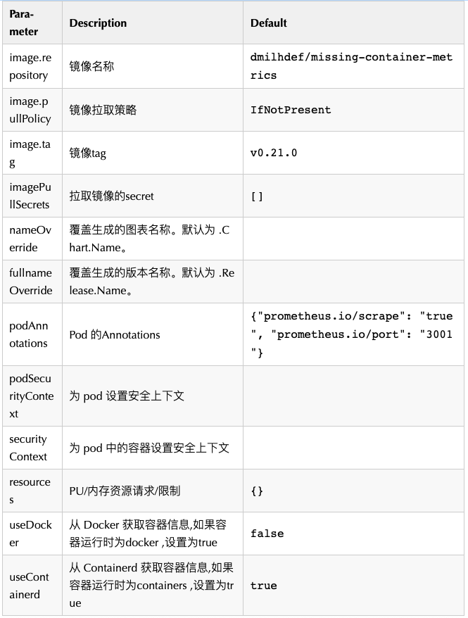
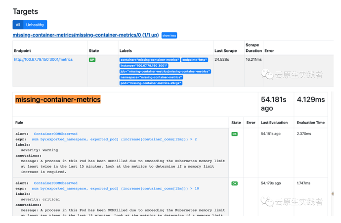

# **Prometheus 使用 missing-container-metrics 监控 Pod oomkill**

Kubernetes 默认情况下使用 cAdvisor 来收集容器的各项指标，足以满足大多数人的需求，但还是有所欠缺，比如缺少对以下几个指标的收集：

* OOM kill
* 容器重启的次数
* 容器的退出码

`missing-container-metrics` 这个项目弥补了 cAdvisor 的缺陷，新增了以上几个指标，集群管理员可以利用这些指标迅速定位某些故障。

**例如，假设某个容器有多个子进程，其中某个子进程被 OOM kill，但容器还在运行，如果不对 OOM kill 进行监控，管理员很难对故障进行定位。**

## 安装

官方提供了helm chart方式来进行安装，我们先添加helm仓库

```
helm repo add missing-container-metrics https://draganm.github.io/missing-container-metrics
```

把这个chart下载到本地，我们需要修改value.yaml文件

```
[root@master-01 addons]# helm pull missing-container-metrics/missing-container-metrics
[root@master-01 addons]# ls
blackbox        dingtalk  harbor_exporter                      mysql-exporter    prometheusalert  rules                          servicemonitor  victoriametrics
blackbox-probe  etcd      missing-container-metrics-0.1.1.tgz  process-exporter  redis-exporter   scheduler-controller-svc.yaml  ssl-exporter
[root@master-01 addons]# tar xf  missing-container-metrics-0.1.1.tgz 
```

可配置项



我们这里修改`missing-container-metrics/values.yaml`中`useDocker为true`，然后安装

```
[root@master-01 addons]# kubectl create namespace missing-container-metrics
namespace/missing-container-metrics created


[root@master-01 addons]# helm install missing-container-metrics  missing-container-metrics -n missing-container-metrics
NAME: missing-container-metrics
LAST DEPLOYED: Tue Jul  6 10:47:35 2021
NAMESPACE: missing-container-metrics
STATUS: deployed
REVISION: 1
TEST SUITE: None


[root@master-01 addons]# helm -n missing-container-metrics list
NAME                            NAMESPACE                       REVISION        UPDATED                                 STATUS          CHART                           APP VERSION
missing-container-metrics       missing-container-metrics       1               2021-07-06 10:47:35.261058822 +0800 CST deployed        missing-container-metrics-0.1.1 0.21.0     
##因为我只有一个节点，所以这里daemonset 就只有一个pod


[root@master-01 addons]# kubectl get pod -n missing-container-metrics 
NAME                              READY   STATUS    RESTARTS   AGE
missing-container-metrics-s9cgk   1/1     Running   0          115s
```

我们可以访问服务的3001端口查看metrics,例如

```
[root@master-01 addons]# curl 100.67.79.150:3001/metrics
# HELP container_last_exit_code Last exit code of the container
# TYPE container_last_exit_code gauge
container_last_exit_code{container_id="docker://0133fb5d739ba98b3985bdc7766fa200334bbbf29de9a61f98a463ec00de53de",container_short_id="0133fb5d739b",docker_container_id="0133fb5d739ba98b3985bdc7766fa200334bbbf29de9a61f98a463ec00de53de",image_id="docker-pullable://k8s.gcr.io/pause:3.2",name="k8s_POD_dns-autoscaler-565bf94d6c-dc6v4_kube-system_96437fe8-200c-4845-a7cc-a27790c6c5a7_0",namespace="kube-system",pod="dns-autoscaler-565bf94d6c-dc6v4"} 0
container_last_exit_code{container_id="docker://0388ba15b0181fead17cfc3606a57aeef0a9b8b73cf3f97eb901565c8aa1702c",container_short_id="0388ba15b018",docker_container_id="0388ba15b0181fead17cfc3606a57aeef0a9b8b73cf3f97eb901565c8aa1702c",image_id="docker-pullable://sha256:e20d2ec0d0ed8ffd693b435af9f2943095a608440e3b845331d6d00344025455",name="k8s_victoriametrics_victoriametrics-0_kube-system_7b381d2c-791b-4e38-8cbb-43485afcb285_0",namespace="kube-system",pod="victoriametrics-0"} 0
container_last_exit_code{container_id="docker://0400f7e29dab47304f97669cb52b5c7c9310fbb5c156c07d0dc9bfca6b8ee14d",container_short_id="0400f7e29dab",docker_container_id="0400f7e29dab47304f97669cb52b5c7c9310fbb5c156c07d0dc9bfca6b8ee14d",image_id="docker-pullable://k8s.gcr.io/pause:3.2",name="k8s_POD_csi-resizer-f6d66495f-s4vkv_longhorn-system_282278da-2638-4e26-8411-802bf57c1ed8_0",namespace="longhorn-system",pod="csi-resizer-f6d66495f-s4vkv"} 0
container_last_exit_code{container_id="docker://04e2c60777ce277c62c7137f1d7b40d9c1523bb3edf9127efd357590f39ba79c",container_short_id="04e2c60777ce",docker_container_id="04e2c60777ce277c62c7137f1d7b40d9c1523bb3edf9127efd357590f39ba79c",image_id="docker-pullable://k8s.gcr.io/pause:3.2",name="k8s_POD_kube-state-metrics-859b6bf99-q8tdf_monitoring_529aa188-f7a0-4b5c-9608-cd8fc473ac8c_2",namespace="monitoring",pod="kube-state-metrics-859b6bf99-q8tdf"} 0
```


**服务公开了如下的指标：**


* `container_restarts `：容器的重启次数。
* `container_ooms` ：容器的 OOM 杀死数。这涵盖了容器 cgroup 中任何进程的 OOM 终止。
* `container_last_exit_code` ：容器的最后退出代码。


**每一个指标包含如下标签：**


* `docker_container_id`：容器的完整 ID。
* `container_short_id`：Docker 容器 ID 的前 6 个字节。
* `container_id`：容器 id 以与 kubernetes pod 指标相同的格式表示 - 以容器运行时为前缀`docker://`并`containerd://`取决于容器运行时。这使得 Prometheus 中的`kube_pod_container_info`指标可以轻松连接。
* `name`：容器的名称。
* `image_id`：图像 id 以与 k8s pod 的指标相同的格式表示。这使得 Prometheus 中的`kube_pod_container_info`指标可以轻松连接。
* pod：如果`io.kubernetes.pod.name`在容器上设置了pod标签，则其值将设置为指标中的标签
* namespace：如果`io.kubernetes.pod.namespace`容器上设置了namespace标签，则其值将设置为指标的标签。


## 添加PodMonitor 和 PrometheusRule（针对Prometheus Operator）

在template目录下创建文件`podmonitor.yaml`

```

{{ if .Values.prometheusOperator.podMonitor.enabled }}
apiVersion: monitoring.coreos.com/v1
kind: PodMonitor
metadata:
  name: {{ include "missing-container-metrics.fullname" . }}
  {{- with .Values.prometheusOperator.podMonitor.namespace }}
  namespace: {{ . }}
  {{- end }}
  labels:
    {{- include "missing-container-metrics.labels" . | nindent 4 }}
    {{- with .Values.prometheusOperator.podMonitor.selector }}
    {{- toYaml . | nindent 4 }}
    {{- end }}
spec:
  selector:
    matchLabels:
      {{- include "missing-container-metrics.selectorLabels" . | nindent 6 }}
  podMetricsEndpoints:
  - port: http
  namespaceSelector:
    matchNames:
      - {{ .Release.Namespace }}
{{ end }}
```

在template目录下创建文件`prometheusrule.yaml`

```
{{ if .Values.prometheusOperator.prometheusRule.enabled }}
apiVersion: monitoring.coreos.com/v1
kind: PrometheusRule
metadata:
  name: {{ include "missing-container-metrics.fullname" . }}
  {{- with .Values.prometheusOperator.prometheusRule.namespace }}
  namespace: {{ . }}
  {{- end }}
  labels:
    {{- include "missing-container-metrics.labels" . | nindent 4 }}
    {{- with .Values.prometheusOperator.prometheusRule.selector }}
    {{- toYaml . | nindent 4 }}
    {{- end }}
spec:
  groups:
  - name: {{ include "missing-container-metrics.fullname" . }}
    rules:
      {{- toYaml .Values.prometheusOperator.prometheusRule.rules | nindent 6 }}
{{ end }}
```

修改`value.yaml`,添加如下

```
useDocker: true
useContainerd: false
###添加
prometheusOperator:
  podMonitor:
    # Create a Prometheus Operator PodMonitor resource
    enabled: true
    # Namespace defaults to the Release namespace but can be overridden
    namespace: ""
    # Additional labels to add to the PodMonitor so it matches the Operator's podMonitorSelector
    selector:
      app.kubernetes.io/name: missing-container-metrics

  prometheusRule:
    # Create a Prometheus Operator PrometheusRule resource
    enabled: true
    # Namespace defaults to the Release namespace but can be overridden
    namespace: ""
    # Additional labels to add to the PrometheusRule so it matches the Operator's ruleSelector
    selector:
      prometheus: k8s
      role: alert-rules
    # The rules can be set here. An example is defined here but can be overridden.
    rules:
    - alert: ContainerOOMObserved
      annotations:
        message: A process in this Pod has been OOMKilled due to exceeding the Kubernetes memory limit at least twice in the last 15 minutes. Look at the metrics to determine if a memory limit increase is required.
      expr: sum(increase(container_ooms[15m])) by (exported_namespace, exported_pod) > 2
      labels:
        severity: warning
    - alert: ContainerOOMObserved
      annotations:
        message: A process in this Pod has been OOMKilled due to exceeding the Kubernetes memory limit at least ten times in the last 15 minutes. Look at the metrics to determine if a memory limit increase is required.
      expr: sum(increase(container_ooms[15m])) by (exported_namespace, exported_pod) > 10
      labels:
        severity: critical
```

使用下面命令更新

```
[root@master-01 addons]# helm upgrade missing-container-metrics -n missing-container-metrics missing-container-metrics/
Release "missing-container-metrics" has been upgraded. Happy Helming!
NAME: missing-container-metrics
LAST DEPLOYED: Tue Jul  6 11:36:02 2021
NAMESPACE: missing-container-metrics
STATUS: deployed
REVISION: 2
TEST SUITE: None
```

更新后会创建podmonitor和prometeusrules


```
[root@master-01 addons]# kubectl get prometheusrules.monitoring.coreos.com  -n monitoring
NAME                        AGE
missing-container-metrics   15s
[root@master-01 addons]# kubectl get podmonitors.monitoring.coreos.com  -n missing-container-metrics 
NAME                        AGE
missing-container-metrics   35s
```


我们可以在prometheus ui 上看到相关target和rules


