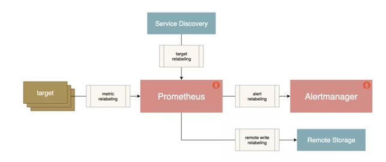
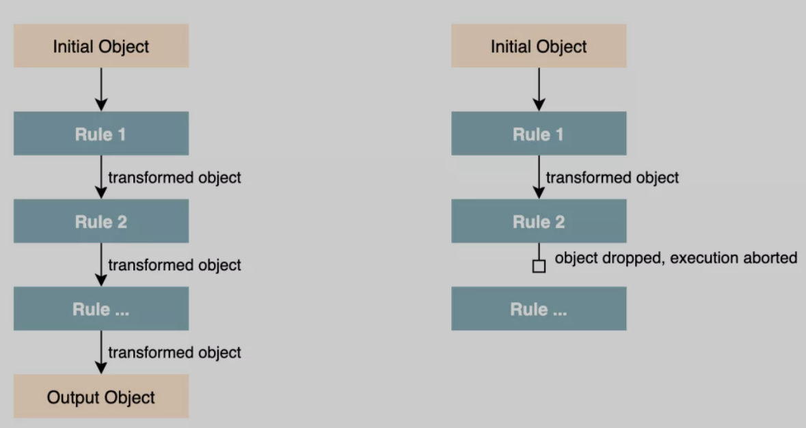

# **Prometheus Relabeling 重新标记的使用**

Relabeling 重新标记是配置 Prometheus 元信息的方式，它是转换和过滤 Prometheus 中 label 标签对象的核心，本文我们将了解 Relabeling 规则的工作原理以及在不同场景中的应用方式。

## **1、概述**

* 只监视具有特定服务发现注解的某些目标，通常在服务发现中使用
* **向目标抓取请求添加 HTTP 查询参数**
* 仅存储从指定目标中提取样本的子集
* **将抓取序列的两个标签值合并为一个标签**

Relabeling 是作为一系列转换步骤实现的，我们可以在 Prometheus 的配置文件中应用这些步骤来过滤或修改标记对象，我们可以对一下类型的标记对象应用 Relabeling 操作：

* **发现的抓取目标（`relabel_configs`）**
* **抓取的单个样本（`metric_relabel_configs`）**
* **发送给 Alertmanager 的报警（`alert_relabel_configs`）**
* **写到远程存储的样本（`write_relabel_configs`）**




所有这些 relabeling 配置块都是相同类型的 `relabel_config`，每个配置块都由一个规则列表组成，这些规则依次应用于每个标记的对象。



例如，一个 relabeling 规则可以根据正则表达式的匹配来保留或丢弃一个对象，可以修改其标签，也可以将一整组标签映射到另一组。

**一旦一个 relabeling 步骤决定放弃一个有标签的对象，就不会对这个对象执行进一步的 relabeling 步骤，它将从输出列表中删除。**


## **2、隐藏的标签与元数据**

**以双下划线`__`开头的标签属于特殊的标签，它们在重新标记后会被删除。**

标记对象的来源最初可以附加**这些**隐藏的标签，以提供关于标记对象的额外元数据，这些特殊的标签可以在 `relabeling` 阶段被用来对对象的标签进行修改。

对于抓取指标，其中就包含一些隐藏的标签，可以用来控制目标应该如何被抓取。

* `__address__`：包含应该被抓取目标的地址，它最初默认为服务发现机制提供的 `<host>:<port>`，如果在此之前没有明确地将实例标签 instance 设置为其他值，那么在` relabeling `之后，`Prometheus` 会将 `instance` 标签设置为 `__address__` 的值。
* `__scheme__`：抓取目标的请求模式，包括 http 与 https，默认为 http。
* `__metrics_path__`：表示用于采集指标的 HTTP 路径，默认为 `/metrics`。
* `__param_<name>`: 包含 HTTP 查询参数名称和它们的值。

上面的这些标签都可以使用 relabeling 规则来设置或覆盖，这样就可以为抓取目标进行自定义抓取行为。


此外，服务发现机制也可以提供一组以 `__meta_` 开头的标签，包含关于目标的特定发现元数据。

例如，当发现 Kubernetes 集群中的 pod 时，Kubernetes 服务发现引擎将为每个 pod 目标提供一个 `__meta_kubernetes_pod_name` 的标签，包含被发现的 pod 的名字，以及一个 `__meta_kubernetes_pod_ready` 标签，表明 pod 是否处于就绪状态，


关于服务发现生成的元标签可以查看官方文档 [https://prometheus.io/docs/prometheus/latest/configuration/configuration/#kubernetes_sd_config](https://prometheus.io/docs/prometheus/latest/configuration/configuration/#kubernetes_sd_config) 了解更多。

如果一个 `relabeling` 步骤需要将一个值保存到一个临时标签中（以便在随后的步骤中处理），那么我们可以使用 `__tmp` 标签名称前缀进行标记，以 `__tmp` 开通的标签是不会被 Prometheus 本身使用的。


## **Relabeling 规则**

Relabeling 规则主要由以下的一些配置属性组成，但对于每种类型的操作，只使用这些字段的一个子集。

* `action`：执行的 `relabeling` 动作，可选值包括 `replace`、`keep`、`drop`、`hashmod`、`labelmap`、`labeldrop` 或者 `labelkeep`，默认值为 `replace`。
* `separator`：分隔符，一个字符串，用于在连接源标签 `source_labels` 时分隔它们，默认为;。
* `source_labels`：源标签，使用配置的分隔符串联的标签名称列表，并与提供的正则表达式进行匹配。
* `target_labe`l：目标标签，当使用 replace 或者 hashmod 动作时，应该被覆盖的标签名。
* `regex`：正则表达式，用于匹配串联的源标签，默认为` (.*)`，匹配任何源标签。
* `modulus`：模数，串联的源标签哈希值的模，主要用于 Prometheus 水平分片。
* `replacement`：replacement 字符串，写在目标标签上，用于替换 `relabeling` 动作，它可以参考由 regex 捕获的正则表达式捕获组。

### **设置或替换标签值**

`Relabeling` 的一个常见操作就是设置或者覆盖一个标签的值，我们可以通过 replace 这个操作来完成，如果没有指定 `action` 字段，则默认就是 `replace`。

一个 replace 动作的规则配置方式如下所示：

```
action: replace
source_labels: [<source label name list>]
separator: <source labels separator> # 默认为 ';'
regex: <regular expression> # 默认为 '(.*)' (匹配任何值))
replacement: <replacement string> # 默认为 '$1' (使用第一个捕获组作为 replacement)
target_label: <target label>
```

该操作按顺序执行以下步骤：

* 使用提供的 separator 分隔符将 `source_labels` 中的标签列表值连接起来
* 测试 `regex` 中的正则表达式是否与上一步连接的字符串匹配，如果不匹配，就跳到下一个 `relabeling` 规则，不替换任何东西
* 如果正则匹配，就提取正则表达式捕获组中的值，并将 `replacement` 字符串中对这些组的引用(2, ...)用它们的值替换
* 把经过正则表达式替换的 replacement 字符串作为 `target_label` 标签的新值存储起来

下面我们来简单看一看 replace 操作的示例。

**设置一个固定的标签值**

最简单的 replace 例子就是将一个标签设置为一个固定的值，比如你可以把 env 标签设置为 `production`：

```
action: replace
replacement: production
target_label: env
```

这里我们并没有设置规则的大部分属性，这是因为大部分的默认值已经可以满足这里的需求了，这里会将替换的字符串 `production` 作为 `target_label` 标签 `env` 的新值存储起来，也就是将 `env `标签的值设置为 `production`。

**替换抓取任务端口**

另一个稍微复杂的示例是重写一个被抓取任务实例的端口，我们可以用一个固定的 80 端口来替换 `__address__` 标签的端口：

```
action: replace
source_labels: [__address__]
regex: ([^:]+)(?::\d+)? # 第一个捕获组匹配的是 host，第二个匹配的是 port 端口。
replacement: "$1:80"
target_label: __address__
```

这里我们替换的源标签为 `__address__`，然后通过正则表达式 `([^:]+)(?::\d+)? `进行匹配，这里有两个捕获组，**第一个匹配的是 `host(1)`，第二个匹配的是端口(2)**，

所以在 `replacement` 字符串中我们保留第一个捕获组 `$1`，然后将端口更改为 `80`，这样就可以将 `__address__` 的实例端口更改为 `80` 端口，然后重新写会 `__address__` 这个目标标签。

### **保留或丢弃对象**

Relabeling 另一个常见的用例就是过滤有标签的对象，`keep` 或 `drop` 这两个动作可以来完成，使用这两个操作，可以帮助我们完成如下的一些操作：

* 来自服务发现的哪些目标应该被抓取
* 从目标中抓取哪些指定的序列样本，或将其发送到远程存储
* 哪些报警要发送到 Alertmanager


一个 `keep` 动作的配置规则如下所示：

```
action: keep
source_labels: [<source label name list>]
separator: <source labels separator> # 默认为 ';'
regex: <regular expression> # 默认为 '(.*)' (匹配任何值)
```

`keep` 操作同样按顺序执行如下步骤：

* 使用 `separator` 分隔符将 `source_labels` 中列出的标签值连接起来
* 测试 regex 中的正则表达式是否与上一步的连接字符串匹配
* 如果不匹配，该对象将从最终输出列表中删除
* 如果匹配，则保留该对象

drop 动作和 keep 类似，只是它是删除一个对象而不是保留。

同样接下来看一看 keep 和 drop 的示例。

**只抓取具有注解的目标**


在服务发现的时候，我们可能只想抓取那些具有特定元数据标签的目标，例如，下面的配置让我们只抓取 Kubernetes 中具有 `example.io/should_be_scraped=true` 这个 annotation 的目标。

```
action: keep
source_labels:
  [__meta_kubernetes_service_annotation_example_io_should_be_scraped]
regex: true
```

Kubernetes 服务发现机制下面会将 labels 标签与 annotation 作为元信息输出到 Prometheus，这些元信息都包含 `__meta_ ` 前缀，这里我们的配置就是保留具有 `example.io/should_be_scraped `这个 `annotation` 标签，且值为 true 的目标。

**只存储特定的指标**

**当使用 `metric_relabel_configs `来控制目标的抓取方式时，我们可以使用下面的规则来只存储指标名称以 `api_` 或 `http_` 开头的指标。**

```
action: keep
source_labels: [__name__]
regex: "(api_|http_).*"
```

### **标签映射**

有时我们可能想把源标签的值映射到一组新的标签中去，这个时候就可以使用 `labelmap` 这个动作了。

`labelmap` 最常用的使用场景就是从服务发现中获取一组隐藏的或临时的元数据标签，并将它们映射到新的目标标签中。

labelmap 动作的配置规则如下所示：

```
action: labelmap
regex: <regular expression> # 默认为 '(.*)'
replacement: <replacement string> # 默认为 '$1'
```

和前面的一些 action 不同，`labelmap` 是对标签名而不是标签值进行重新匹配和操作。`labelmap` 按顺序执行以下步骤：

* 将 regex 中的正则表达式与所有标签名进行匹配
* 将匹配的标签名的任何匹配值复制到由 replacement 字符串决定的新的标签名中

下面我们看一个使用 labelmap 映射 Kubernetes Service 标签的示例。当使用基于 Kubernetes 的服务发现来发现 pod 端点时，我们可能希望每个端点的最终目标标签也包含 Kubernetes Service 标签，这样可以更好的区分端点数据。Kubernetes 服务发现机制会将这些标签添加到 Prometheus 中去，标签名称格式为 `__meta_kubernetes_service_label_<labelname>`，我们可以提取这些元数据标签中的 `<labelname>` 部分，并将相应的标签值映射到一组以 `k8s_` 为前缀的新标签名称上，如下所示：

```
action: labelmap
regex: __meta_kubernetes_service_label_(.+)
replacement: "k8s_$1"
```

通过上面的 labelmap 操作，`regex` 正则表达式中匹配标签名，然后将标签名对应的值复制到 `k8s_$1` 的新标签中，`$1` 就是匹配的标签名这个捕获组。


### **保留或删除标签**

有的时候我们也有保留或删除一些标签的需求，比如有的目标在时间序列上提供了许多额外的标签，这些标签用途不大，这个时候我们就可以使用 labelkeep 和 labeldrop 这两个操作，使用这两个操作可以有选择地保留或删除一些标签。

`labelkeep` 的配置规则如下所示：

```
action: labelkeep
regex: <regular expression> # 默认为'(.*)'
```

* 首先将 regex 中的正则表达式与所有标签名称进行匹配
* 它只保留那些匹配的标签


**`labeldrop` 与 `labelkeep` 类似，只是它是删除那些匹配正则表达式的标签而不是保留。**


下面我们看一看 `labelkeep/labeldrop` 操作的简单示例。

**从报警中删除高可用副本标签**

当运行两个相同的 Prometheus 作高可用的时候，通常两个服务器都被配置为有一个外部标签（通过全局配置选项 `external_labels`），表明它们代表哪个副本，例如：`replica: A` 和 `replica: B`，在从两个副本向同一个 `Alertmanager` 实例发送报警之前，`Prometheus` 需要删除这个副本标签，这样 Alertmanager 就不会把收到的报警看成不同的报警了，否则可能我们会收到两个同样的报警通知。这个时候我们就可以使用 labeldrop 来实现这个操作。

```
action: labeldrop
regex: replica
```

这条配置规则很简单的，就是匹配 replica 这个标签，然后执行 labeldrop 删除标签动作即可。

**删除指标中不需要的标签**

有的时候我们抓取的指标在每个时间序列上都附加了一些额外的标签，这些标签对于我们来说用处不大，还会增加 Prometheus 的存储压力，所以我们可以想办法删除不需要的额外标签。

比如现在我们想要删除一 `info_` 开头的标签，我们可以使用下面的配置规则来完成。

```
action: labeldrop
regex: info_.*
```

同样也只是配置一个要删除的目标标签的正则表达式即可，只要匹配了的标签都会执行 `labeldrop` 操作将该标签进行删除。


### **标签哈希和分片**


在一些场景下我们可能需要运行多个几乎相同的 Prometheus 副本来横向扩展，每个副本只抓取部分目标，这样可以降低 Prometheus 的压力，在这种情况下 hashmod 操作有助于我们对目标进行分片操作。

hashmod 的配置规则如下所示：

```
action: hashmod
source_labels: [<source label name list>]
modulus: <modulus value>
target_label: <target label>
```

该操作按顺序执行下面的步骤：

* 首先使用分隔符将源标签集 `source_labels` 的值连接起来
* 计算连接后的字符串的哈希值
* 将 `modulus` 中提供的模数应用于哈希值，以将哈希值限制在 0 和`modulus-1`之间
* 将上一步的模数值存储在 `target_label` 目标标签中

使用 hashmod 的主要场景是将一个服务的整体目标进行分片，用于水平扩展 `Prometheus`，通过首先根据每个目标的一个或多个标签计算基于哈希的模数来实现的，然后只保留具有特定输出模数值的目标。

比如为了根据 instance 标签对目标进行分片，只保留分片 2 的实例，我们可以把 `hashmod` 和 keep 结合起来操作。

```
- action: hashmod
  source_labels: [instance]
  modulus: 10
  target_label: __tmp_hashmod
- action: keep
  source_labels: [__tmp_hashmod]
  regex: 2
```

首先通过 hashmod 操作对 instance 标签进去哈希操作，将取模后的值存储在临时标签 `__tmp_hashmod` 中，然后通过第二个 `keep` 操作，只保留分片数为 2 的指标，这样就达到了分片的目的。


到这里我们基本上就了解了 relabeling 的使用，后续我们可以再去了解服务发现在 Prometheus 中的使用。


