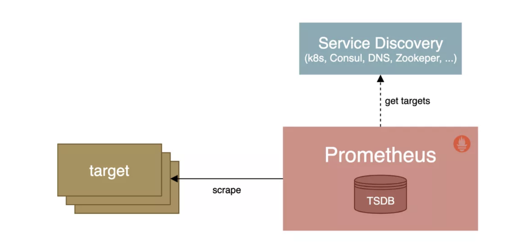
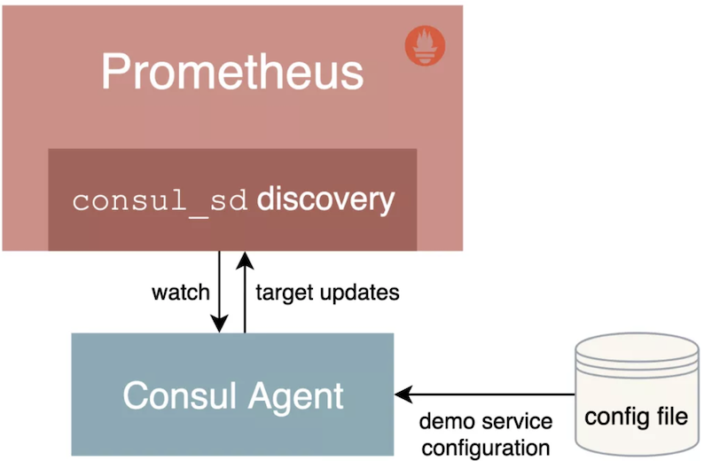
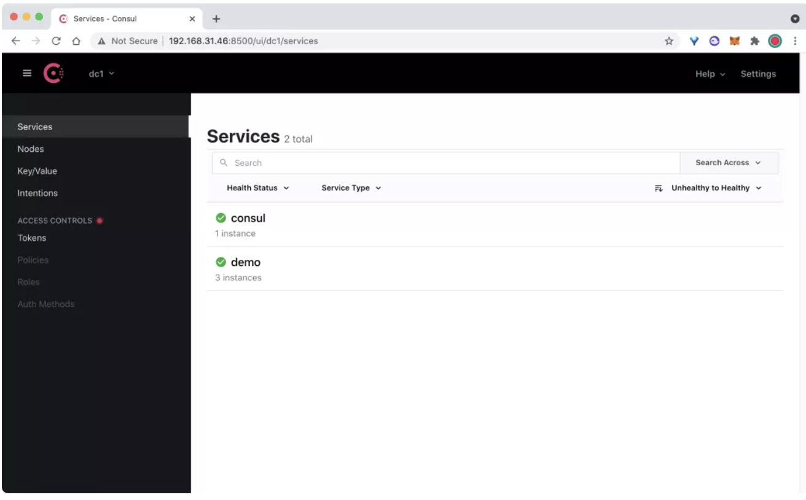
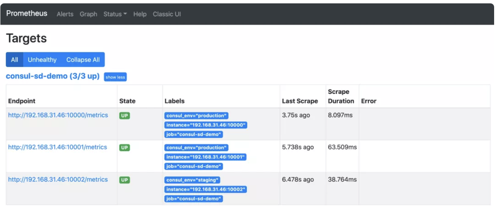
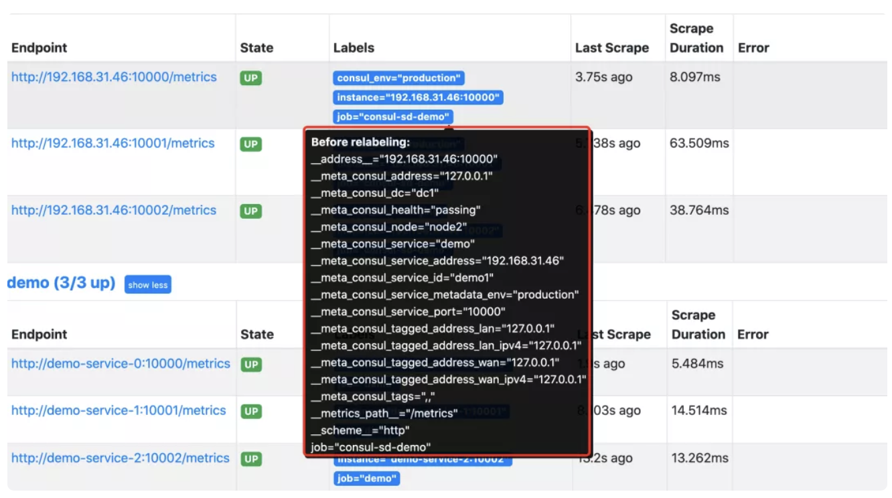
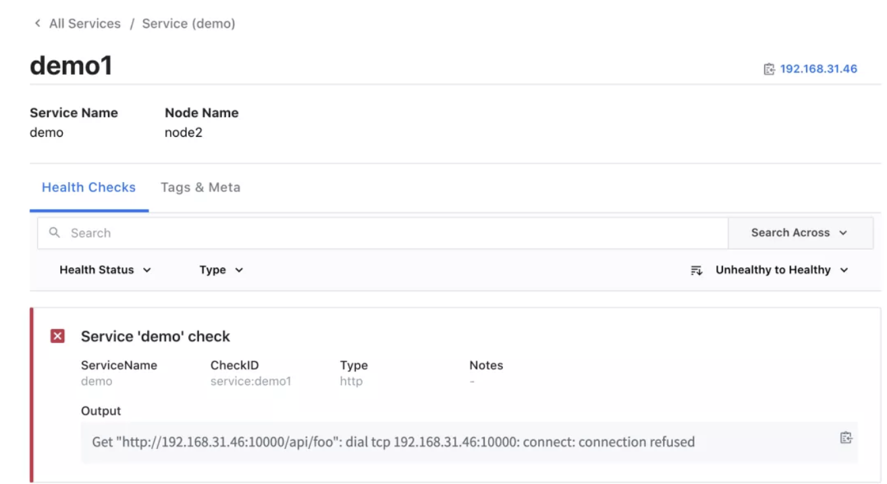
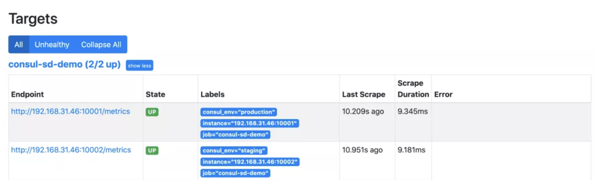
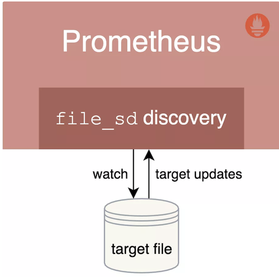
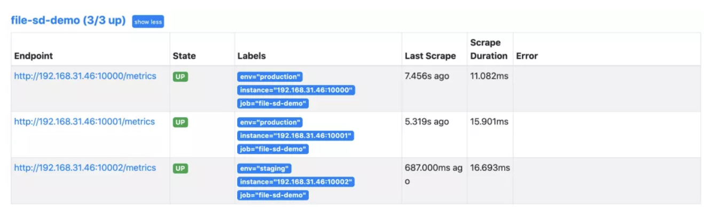
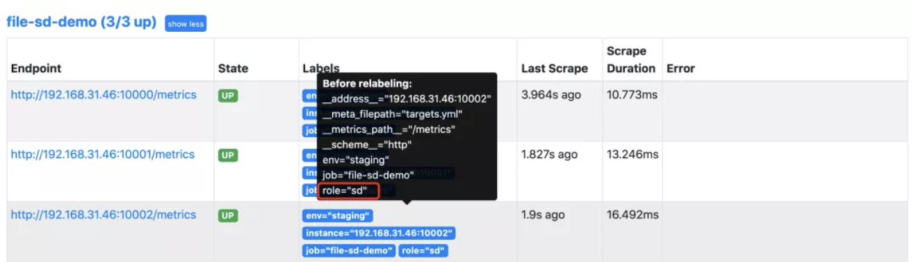

# **Prometheus 服务的自动发现使用**

本文我们将学习 Prometheus 中是如何使用服务发现来查找和抓取目标的。

我们知道在 Prometheus 配置文件中可以通过一个 `static_configs` 来配置静态的抓取任务，但是在云环境下，特别是容器环境下，抓取目标地址是经常变动的，所以用静态的方式就不能满足这些场景了。

**所以我们需要监控系统能够动态感知这个变化，不可能每次变动都去手动重新配置的，为了应对复杂的动态环境，Prometheus 也提供了与基础设施中的服务发现集成的功能。**




Prometheus 已经支持多种内置的服务发现机制：

* 发现云服务商的 VM 虚拟机
* **Kubernetes 上的自动发现**
* **通用的服务查找，例如 DNS、Consul、Zookeeper 或自定义发现机制**

我们都可以通过 Prometheus 配置文件中的 `scrape_config` 部分进行配置，Prometheus 会不断更新动态的抓取目标列表，自动停止抓取旧的实例，开始抓取新的实例，Prometheus 特别适合运行于 Kubernetes 集群下面，可以自动发现监控目标。

**此外大部分服务发现机制还会提供目标的一些元数据，通常都是带有 `__` 的前缀， 比如标签、注解、服务名等等，可以在 `relabeling` 阶段使用这些元数据来过滤修改目标，这些元信息标签在重新标记阶段后被删除。**


## **1、基于 Consul 的服务发现**

Consul 是由 HashiCorp 开发的一个支持多数据中心的分布式服务发现和键值对存储服务的开源软件，是一个通用的服务发现和注册中心工具，被大量应用于基于微服务的软件架构当中。

接下来我们就来尝试使用 Prometheus 基于 Consul 的服务发现来监控前面的 3 个 demo 服务：

```
192.168.31.46:10000
192.168.31.46:10001
192.168.31.46:10002
```

我们将 demo 服务注册到 Consul，然后配置 Prometheus 从 Consul 中发现演示服务实例，并使用 `Relabeling` 操作来过滤调整目标标签。

关于 Consul 本身的使用可以查看官方文档 https://learn.hashicorp.com/consul 了解更多。



### **1-1 安装配置 Consul**

在页面 https://www.consul.io/downloads 下载符合自己系统的安装文件，比如我们这里是 Linux 系统，使用下面命令下载安装即可：

```
$ wget https://releases.hashicorp.com/consul/1.10.2/consul_1.10.2_linux_amd64.zip
$ unzip consul_1.10.2_linux_amd64.zip

# 将 consul 二进制移动到 PATH 路径下去

$ mv consul /usr/local/bin

$ consul version
Consul v1.10.2
Revision 3cb6eeedb
Protocol 2 spoken by default, understands 2 to 3 (agent will automatically use protocol >2 when speaking to compatible agents)
```

**当执行 `consul` 命令后正常有命令提示，证明已经安装完成。**

接着创建一个用于注册 demo 服务的 Consul 配置文件 `demo-service.json`：

```
{
  "services": [
    {
      "id": "demo1",
      "name": "demo",
      "address": "192.168.31.46",
      "port": 10000,
      "meta": {
        "env": "production"
      },
      "checks": [
        {
          "http": "http://192.168.31.46:10000/api/foo",
          "interval": "1s"
        }
      ]
    },
    {
      "id": "demo2",
      "name": "demo",
      "address": "192.168.31.46",
      "port": 10001,
      "meta": {
        "env": "production"
      },
      "checks": [
        {
          "http": "http://192.168.31.46:10001/api/foo",
          "interval": "1s"
        }
      ]
    },
    {
      "id": "demo3",
      "name": "demo",
      "address": "192.168.31.46",
      "port": 10002,
      "meta": {
        "env": "staging"
      },
      "checks": [
        {
          "http": "http://192.168.31.46:10002/api/foo",
          "interval": "1s"
        }
      ]
    }
  ]
}
```

当然一般情况下我们也是在 Consul 中进行动态注册服务，但是这里我们只是简单演示 Prometheus 基于 Consul 的服务发现，这里只使用 Consul 配置文件静态注册服务即可。

`Consul` 允许使用 JSON 中的 `meta` 属性将 `key-value` 元数据与每个注册的服务实例相关联，比如这里我们配置的 `env` 属性和部署环境 `production` 或 `staging` 进行关联，后面我们可以通过使用 `Prometheus` 里面的 `Relabeling` 操作提取该字段并将其映射到每个抓取实例的标签中去。

为了查看更多的日志信息，我们可以在 dev 模式下运行 Consul，如下所示：

```
☸ ➜ consul agent -dev -config-file=demo-service.json -client 0.0.0.0
==> Starting Consul agent...
           Version: '1.10.2'
           Node ID: 'a4a9418c-7f7d-a2da-c81e-94d3d37601aa'
         Node name: 'node2'
        Datacenter: 'dc1' (Segment: '<all>')
            Server: true (Bootstrap: false)
       Client Addr: [0.0.0.0] (HTTP: 8500, HTTPS: -1, gRPC: 8502, DNS: 8600)
      Cluster Addr: 127.0.0.1 (LAN: 8301, WAN: 8302)
           Encrypt: Gossip: false, TLS-Outgoing: false, TLS-Incoming: false, Auto-Encrypt-TLS: false

==> Log data will now stream in as it occurs:
......
```


这里我们在启动命令后面使用 `-client` 参数指定了客户端绑定的 IP 地址，默认为 `127.0.0.1`。除了我们注册的 3 个 demo 服务之外，`Consul agent` 还会将自己注册为一个名为 consul 的服务，我们可以在浏览器中访问 `http://<nodeip>:8500` 查看注册的服务。



在 Consul UI 页面中可以看到有 consul 和 demo 两个 Service 服务。

### **1-2 配置 Consul 自动发现**

上面我们通过 Consul 注册了 3 个 demo 服务，接下来我们将配置 Prometheus 通过 Consul 来自动发现 demo 服务。

在 Prometheus 的配置文件 prometheus.yml 文件中的 scrape_configs 部分添加如下所示的抓取配置：

```
scrape_configs:
  - job_name: "consul-sd-demo"
    consul_sd_configs:
      - server: "localhost:8500"
    relabel_configs:
      - action: keep
        source_labels: [__meta_consul_service, __meta_consul_health]
        regex: demo;passing
      - action: labelmap
        regex: __meta_consul_service_metadata_(.*)
        replacement: consul_$1
```

这里我们添加了一个名为 `consul-sd-demo` 的抓取任务，通过 `consul_sd_configs` 配置用于自动发现的 `Consul `服务地址，然后使用 `relabel_configs` 进行了重新标记配置，

* 首先只保留服务名称为 `demo`，且健康状态为 `passing` 的，否则也会抓取 `Consul Agent` 本身，而它自身是不提供 `metrics` 接口数据的，
* 另外还使用 `labelmap` 进行了标签映射，将所有 `Consul` 元标签映射到 Prometheus 中以 `consul_` 为前缀的标签中。

配置完成后重新启动 Prometheus，然后重新查看 Prometheus 页面上的 targets 页面，验证上面的配置是否存在：



**正常情况下是可以看到会有一个 `consul-sd-demo` 的任务，下面有 3 个自动发现的抓取目标**。

我们将鼠标悬停在 `Labels` 标签区域就可以看到目标任务在重新标记 `Relabeling` 之前的原始标签。

比如我们将查看第一个 `demo` 实例在 Relabel 之前包含如下所示的这些原始标签：



通过查看网络请求接口 `http://<promtheus addr>/api/v1/targets?state=active` 也可以获取对应的原始标签数据：

```
{
  "discoveredLabels": {
    "__address__": "192.168.31.46:10000",
    "__meta_consul_address": "127.0.0.1",
    "__meta_consul_dc": "dc1",
    "__meta_consul_health": "passing",
    "__meta_consul_node": "node2",
    "__meta_consul_service": "demo",
    "__meta_consul_service_address": "192.168.31.46",
    "__meta_consul_service_id": "demo1",
    "__meta_consul_service_metadata_env": "production",
    "__meta_consul_service_port": "10000",
    "__meta_consul_tagged_address_lan": "127.0.0.1",
    "__meta_consul_tagged_address_lan_ipv4": "127.0.0.1",
    "__meta_consul_tagged_address_wan": "127.0.0.1",
    "__meta_consul_tagged_address_wan_ipv4": "127.0.0.1",
    "__meta_consul_tags": ",,",
    "__metrics_path__": "/metrics",
    "__scheme__": "http",
    "job": "consul-sd-demo"
  },
  "labels": {
    "consul_env": "production",
    "instance": "192.168.31.46:10000",
    "job": "consul-sd-demo"
  },
  "scrapePool": "consul-sd-demo",
  "scrapeUrl": "http://192.168.31.46:10000/metrics",
  "globalUrl": "http://192.168.31.46:10000/metrics",
  "lastError": "",
  "lastScrape": "2021-09-28T11:56:01.919216851+08:00",
  "lastScrapeDuration": 0.013357276,
  "health": "up"
}
```

我们在 `relabel_configs` 中首先配置了一个 `keep` 操作，只保留原始标签 `__meta_consul_service` 值为 `demo`，且 `__meta_consul_health` 为 `passing` 状态的抓取任务。


然后使用 labelmap 进行标签映射，这里我们将匹配 `__meta_consul_service_metadata_(.*) ` 所有标签，这里只有 `__meta_consul_service_metadata_env` 这个原始标签符合正则表达式，其中的 `env` 就是匹配的捕获组，在 `replacement` 中用 `$1` 代替，替换成标签 `consul_$1`，也就是 `consul_env `这个标签了，所以 `Relabeling` 过后就只剩下下面的几个目标标签了：

```
instance: "192.168.31.46:10000"
job: "consul-sd-demo"
consul_env: "production"
```

其中的 instance 标签是在重新标记之后，自动从 `__address__` 转变而来的。由于没有重新修改 `__metrics_path__ `和 `__scheme__` 标签，所以默认的抓取目标就是通过 HTTP 端点 /metrics 进行抓取。

现在如果我们将 demo1 这个服务杀掉，则在 Consul 中注册的服务就会出现一个不健康的实例：




当然此时 Prometheus 中就只剩下两个正常 demo 服务的实例了：



当服务正常后就又可以自动发现对应的服务了。这样我们就完成了 Prometheus 基于 Consul 的一个简单的自动发现配置。

## **2、基于文件的服务发现**

除了基于 Consul 的服务发现之外，Prometheus 也允许我们进行自定义的发现集成，可以通过 watch 一组本地文件来获取抓取目标以及标签信息，也就是我们常说的基于文件的服务发现方式。



基于文件的服务发现提供了一种更通用的方式来配置静态目标，并作为一个接口插入自定义服务发现机制。

它读取一组包含零个或多个 `<static_config>` 列表的文件，对所有定义的文件的变更通过磁盘监视被检测到并立即应用，文件可以以 YAML 或 JSON 格式提供。文件必须包含一个静态配置的列表:

```
JSON json [ { "targets": [ "<host>", ... ], "labels": { "<labelname>": "<labelvalue>", ... } }, ... ]

YAML yaml - targets: [ - '<host>' ] labels: [ <labelname>: <labelvalue> ... ]
```

文件内容也会在指定的刷新间隔时间内定期重新读取。

```
# Patterns for files from which target groups are extracted.
files:
  [ - <filename_pattern> ... ]

# Refresh interval to re-read the files.
[ refresh_interval: <duration> | default = 5m ]
```


**其中 `<filename*pattern>` 可以是一个以`.json`、`.yml` 或 .`yaml` 结尾的路径，最后一个路径段可以包含一个匹配任何字符序列的 `*`，例如：`my/path/tg_*.json`。**

### **2-1 创建文件**

```
- targets:
    - "192.168.31.46:10000"
    - "192.168.31.46:10001"
  labels:
    env: production
- targets:
    - "192.168.31.46:10002"
  labels:
    env: staging
```

该文件中我们列举了 3 个 demo 服务实例，给前两个实例添加上了 env=production 的标签，后面一个加上了 `env=staging` 的标签，当然该文件也可以使用 JSON 格式进行配置：

```
[
  {
    "targets": [ "<host>", ... ],
    "labels": {
      "<labelname>": "<labelvalue>", ...
    }
  },
  ...
]
```

如果是 YAML 文件则格式为：

```

- targets:
  [ - '<host>' ]
  labels:
    [ <labelname>: <labelvalue> ... ]
```

### **2-2 配置文件服务发现**


用于发现的目标文件创建完成后，要让 `Prometheus` 能够从上面的 `targets.yml` 文件中自动读取抓取目标，需要在 `prometheus.yml` 配置文件中的 `scrape_configs` 部分添加如下所示的抓取配置：

```
- job_name: "file-sd-demo"
  file_sd_configs:
    - files:
        - "targets.yml"
```
 
重新 `reload` 或者重启下 Prometheus 让其重新读取配置文件信息，然后同样前往 `Prometheus UI` 的 targets 页面下面查看是否有上面定义的抓取目标。



**然后我们可以尝试改变 `targets.yml `的内容，比如为第三个实例增加一个 `role: sd` 的标签，不用重新加载` Prometheus` 配置，`Prometheus` 将 `watch` 该文件，并自动接收任何变化。**

> 注意：当在生产环境 Prometheus 服务器中改变 file_sd 目标文件时，需要确保改变是原子的，以避免重新加载出现错误，最好的方法是在一个单独的位置创建更新的文件，然后将其重命名为目标文件名（使用` mv` 命令或 `rename()` 系统调用）。




这样我们就完成了基于文件的通用服务发现机制，可以让我们动态地改变 Prometheus 的监控目标，而不需要重新启动或重新加载 Prometheus 服务。

当然除了基于 Consul 和文件的服务发现之外，更多的时候我们会在 Kubernetes 环境下面使用 Prometheus，由于这部分内容比较独立，。


