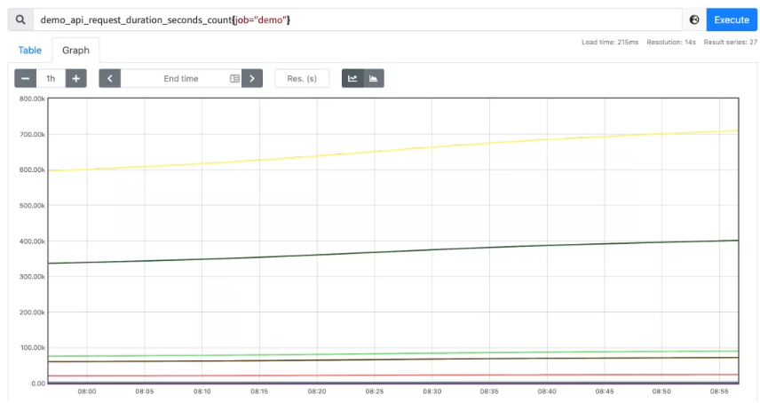

# **PromQL 查询之 rate 函数的使用**

通常来说直接绘制一个原始的 `Counter` 类型的指标数据用处不大，因为它们会一直增加，一般来说是不会去直接关心这个数值的，**因为 `Counter` 一旦重置，总计数就没有意义了，比如我们直接执行下面的查询语句**：

```
demo_api_request_duration_seconds_count{job="demo"}
```

可以得到下图所示的图形：




**可以看到所有的都是不断增长的，一般来说我们更想要知道的是 Counter 指标的变化率，PromQL 提供了不同的函数来计算变化率。**

 
## **rate**

用于计算变化率的最常见函数是 `rate()`，`rate()` 函数用于计算在指定时间范围内计数器每秒增加量的平均值。

**因为是计算一个时间范围内的平均值，所以我们需要在序列选择器之后添加一个范围选择器。**

**例如我们要计算 `demo_api_request_duration_seconds_count` 在最近五分钟内的每秒平均变化率，则可以使用下面的查询语句**：

```
rate(demo_api_request_duration_seconds_count[5m])
```

可以得到如下所示的图形：


现在绘制的图形看起来显然更加有意义了，进行 `rate` 计算的时候是选择指定时间范围下的第一和最后一个样本进行计算，下图是表示瞬时计算的计算方式：

现在绘制的图形看起来显然更加有意义了，进行 rate 计算的时候是选择指定时间范围下的第一和最后一个样本进行计算，下图是表示瞬时计算的计算方式：


往往我们需要的是绘制一个图形，那么就需要进行区间查询，指定一个时间范围内进行多次计算，将结果串联起来形成一个图形：


对于 `rate()` 和相关函数有几个需要说明的：

* 当被抓取指标进的程重启时，Counter 指标可能会重置为 0，但 rate() 函数会自动处理这个问题，它会假设 Counter 指标的值只要是减少了就认为是被重置了，然后它可以调整后续的样本，例如，如果时间序列的值为`[5,10,4,6]`，则将其视为`[5,10,14,16]`。
* 变化率是从指定的时间范围下包含的样本进行计算的，需要注意的是这个时间窗口的边界并不一定就是一个样本数据，可能会不完全对齐，所以，即使对于每次都是增加整数的 Counter，也可能计算结果是非整数。


另外我们需要注意当把 `rate()` 与一个聚合运算符（例如 `sum()`）或一个随时间聚合的函数**（任何以 `_over_time` 结尾的函数）结合起来使用时，总是先取用 `rate()` 函数，然后再进行聚合，否则，当你的目标重新启动时，`rate()` 函数无法检测到 `Counter` 的重置**。

> 注意：`rate()` 函数需要在指定窗口下至少有两个样本才能计算输出。一般来说，比较好的做法是选择范围窗口大小至少是抓取间隔的4倍，这样即使在遇到窗口对齐或抓取故障时也有可以使用的样本进行计算，例如，对于 1 分钟的抓取间隔，你可以使用 4 分钟的 Rate 计算，但是通常将其四舍五入为 5 分钟。所以如果使用 query_range 区间查询，例如在绘图中，那么范围应该至少是步长的大小，否则会丢失一些数据。

## **irate**

由于使用 rate 或者 increase 函数去计算样本的平均增长速率，容易陷入**长尾问题**当中，其无法反应在时间窗口内样本数据的突发变化。

例如，对于主机而言在 2 分钟的时间窗口内，可能在某一个由于访问量或者其它问题导致 CPU 占用 100%的情况，但是通过计算在时间窗口内的平均增长率却无法反应出该问题。

**为了解决该问题，PromQL 提供了另外一个灵敏度更高的函数`irate(v range-vector)`。irate 同样用于计算区间向量的计算率，但是其反应出的是瞬时增长率。**

irate 函数是通过区间向量中最后两个样本数据来计算区间向量的增长速率。

这种方式可以避免在时间窗口范围内的**长尾问题**，并且体现出更好的灵敏度，通过 irate 函数绘制的图标能够更好的反应样本数据的瞬时变化状态。那既然是使用最后两个点计算，**那为什么还要指定类似于 [1m] 的时间范围呢？这个 [1m] 不是用来计算的，irate 在计算的时候会最多向前在 [1m] 范围内找点，如果超过 [1m] 没有找到数据点，这个点的计算就放弃了**。


**由于 `rate()` 提供了更平滑的结果，因此在长期趋势分析或者告警中更推荐使用 rate 函数，因为当速率只出现一个短暂的峰值时，不应该触发该报警。**

使用 `irate()` 函数上面的表达式会出现一些短暂下降的图形：


除了计算每秒速率，你还可以使用 `increase()` 函数查询指定时间范围内的总增量，它基本上相当于速率乘以时间范围选择器中的秒数：

```
increase(demo_api_request_duration_seconds_count{job="demo"}[1h])
```

比如上面表达式的结果和使用 `rate()` 函数计算的结果整体图形趋势都是一样的，只是 Y 轴的数据不一样而已，一个表示数量，一个表示百分比。

**`rate()`、`irate()` 和 `increase()` 函数只能输出非负值的结果，对于跟踪一个可以上升或下降的值的指标（如温度、内存或磁盘空间），可以使用 `delta()` 和 `deriv()` 函数来代替。**

* `deriv()` 函数可以计算一个区间向量中各个时间序列二阶导数，
* 使用简单线性回归，`deriv(v range-vector) `的参数是一个区间向量，返回一个瞬时向量，这个函数一般只用在 Gauge 类型的时间序列上。

例如，要计算在 15 分钟的窗口下，每秒钟磁盘使用量上升或下降了多少：


还有另外一个 `predict_linear()` 函数可以预测一个 `Gauge` 类型的指标在未来指定一段时间内的值，例如我们可以根据过去 `15` 分钟的变化情况，来预测一个小时后的磁盘使用量是多少，可以用如下所示的表达式来查询：

```
predict_linear(demo_disk_usage_bytes{job="demo"}[15m], 3600)
```


这个函数可以用于报警，告诉我们磁盘是否会在几个小时候内用完。


