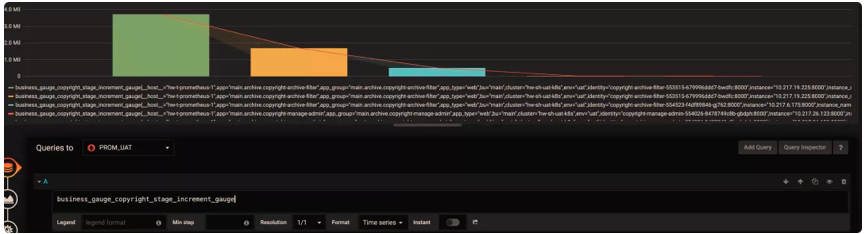
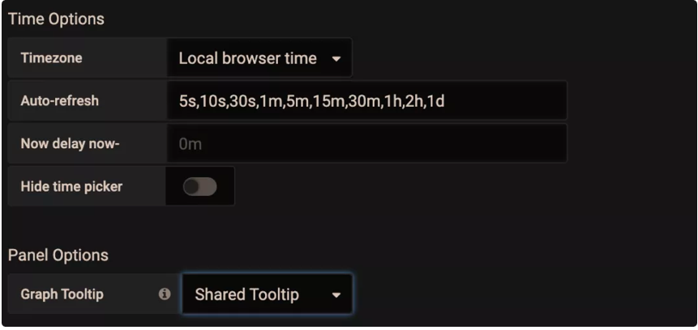
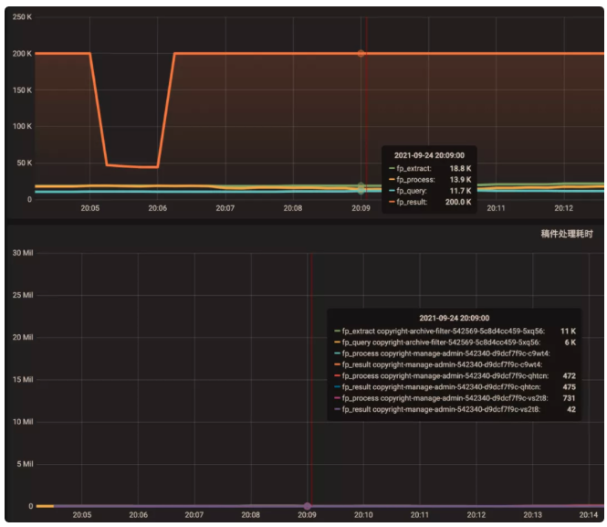

# **Promethues 应用监控的一些实践**

在具体设计 Metrics 之前，首先需要明确需要测量的对象。需要测量的对象应该依据具体的问题背景、需求和需监控的系统本身来确定。

## **从需求出发**

Google 针对大量分布式监控的经验总结出四个监控的黄金指标，这四个指标对于一般性的监控测量对象都具有较好的参考意义。这四个指标分别为：

* **延迟**：服务请求的时间。
* **通讯量**：监控当前系统的流量，用于衡量服务的容量需求。
* **错误**：监控当前系统所有发生的错误请求，衡量当前系统错误发生的速率。
* **饱和度**：衡量当前服务的饱和度。主要强调最能影响服务状态的受限制的资源。例如，如果系统主要受内存影响，那就主要关注系统的内存状态。以上四种指标，其实是为了满足四个监控需求：
* **反映用户体验，衡量系统核心å性能**。如：在线系统的时延，作业计算系统的作业完成时间等。
* **反映系统的吞吐量**。如：请求数，发出和接收的网络包大小等。
* **帮助发现和定位故障和问题**。如：错误计数、调用失败率等。
* **反映系统的饱和度和负载**。如：系统占用的内存、作业队列的长度等。除了以上常规需求，还可根据具体的问题场景，为了排除和发现以前出现过或可能出现的问题，确定相应的测量对象。比如，系统需要经常调用的一个库的接口可能耗时较长，或偶有失败，可制定 Metrics 以测量这个接口的时延和失败数。

## **从需要监控的系统出发**

为了满足相应的需求，不同系统需要观测的测量对象也是不同的。在 官方文档 的最佳实践中，将需要监控的应用分为了三类：

* **线上服务系统（Online-serving systems**）：需对请求做即时的响应，请求发起者会等待响应。如 web 服务器。
* **线下计算系统（Offline processing）**：请求发起者不会等待响应，请求的作业通常会耗时较长。如批处理计算框架 Spark 等。
* **批处理作业（Batch jobs）**：这类应用通常为一次性的，不会一直运行，运行完成后便会结束运行。如数据分析的 MapReduce 作业。对于每一类应用其通常情况下测量的对象是不太一样的。其总结如下：
*** 线上服务系统**：主要有请求、出错的数量，请求的时延等。
* 线下计算系统：最后开始处理作业的时间，目前正在处理作业的数量，发出了多少 items， 作业队列的长度等。
* **批处理作业**：最后成功执行的时刻，每个主要 stage 的执行时间，总的耗时，处理的记录数量等。
*

**除了系统本身，有时还需监控子系统：**

* 使用的库（Libraries）: 调用次数，成功数，出错数，调用的时延。
* 日志（Logging）：计数每一条写入的日志，从而可找到每条日志发生的频率和时间。
* Failures: 错误计数。
* 线程池：排队的请求数，正在使用的线程数，总线程数，耗时，正在处理的任务数等。
* 缓存：请求数，命中数，总时延等。

## **确定 Label**

常见 Label 的选择有：

* resource
* region
* type … 确定 Label 的一个重要原则是：同一维度 Label 的数据是可平均和可加和的，也即单位要统一。如风扇的风速和电压就不能放在一个 Label 里。此外，不建议下列做法：`my_metric{label=a} 1 my_metric{label=b} 6 my_metric{label=total} 7` 即在 Label 中同时统计了分和总的数据，建议采用 PromQL 在服务器端聚合得到总和的结果。或者用另外的 Metric 去测量总的数据。

## **命名 Metrics 和 Label**

好的命名能够见名知义，因此命名也是良好设计的一环。

### **Metric 的命名：**

* 需要符合 `pattern: a-zA-Z*:*`
* 应该包含一个单词作为前缀，表明这个 Metric 所属的域。如：
	* `prometheus_notifications_total`
	* `process_cpu_seconds_total`
	* `ipamd_request_latency`
* 应该包含一个单位的单位作为后缀，表明这个 Metric 的单位。如：
	* `http_request_duration_seconds`
	* `node_memory_usage_bytes`
	* `http_requests_total (for a unit-less accumulating count)`
* 逻辑上与被测量的变量含义相同。
* 尽量使用基本单位，如 seconds，bytes。而不是 Milliseconds, megabytes。

### **Label 的命名：**

依据选择的维度命名，如：

* region: shenzhen/guangzhou/beijing
* owner: user1/user2/user3
* stage: extract/transform/load

## **Buckets 选择**

适宜的 buckets 能使 histogram 的百分位数计算更加准确。

理想情况下，桶会使得数据分布呈阶梯状，即各桶区间内数据个数大致相同。buckets 的设计可遵从如下经验：

* 需要知道数据的大致分布，若事先不知道可先用默认桶 `（{.005, .01, .025, .05, .1, .25, .5, 1, 2.5, 5, 10}）`或 2 倍数桶`（{1,2,4,8…}）`观察数据分布再调整 buckets。
* 数据分布较密处桶间隔制定的较窄一些，分布稀疏处可制定的较宽一些。
* 对于多数时延数据，一般具有长尾的特性，较适宜用指数形式的桶（`ExponentialBuckets`）。
* 初始桶上界一般覆盖10%左右的数据，若不关注头部数据也可以让初始上界更大一些。
* 若为了更准确计算特定百分位数，如90%，可在90%的数据处加密分布桶，即减少桶的间隔。

比如我在监控我们某些任务耗时的时候，就是选根据实际情况估算出大致的 bucket 取值，上线后观察数据和监控再去调整 bucket， 这样经过几次调整应该就能调整到比较合适的 bucket。

## **Grafana 使用技巧**

### **查看所有维度**

如果你想知道是否还能按其它维度分组，并快速查看还有哪些维度，可采用以下技巧：在 query 的表达式上只保留指标名称，不做任何计算，Legend format 也留空。这样就能显示出原始的 metric 数据。如下图所示

### **标尺联动**

在 Settings 面板中，有一个 Graph Tooltip 设置项，默认使用 Default。

下面将图形展示工具分别调整为 Shared crosshair 和 Shared Tooltip 看看效果。可以看到标尺能联动展示了，方便排查问题时确认 2 个指标的关联性。将图形展示工具调整为 Shared Tooltip：

