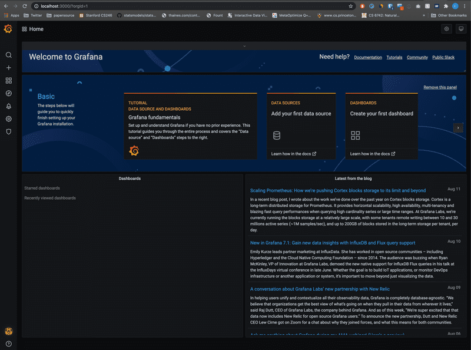
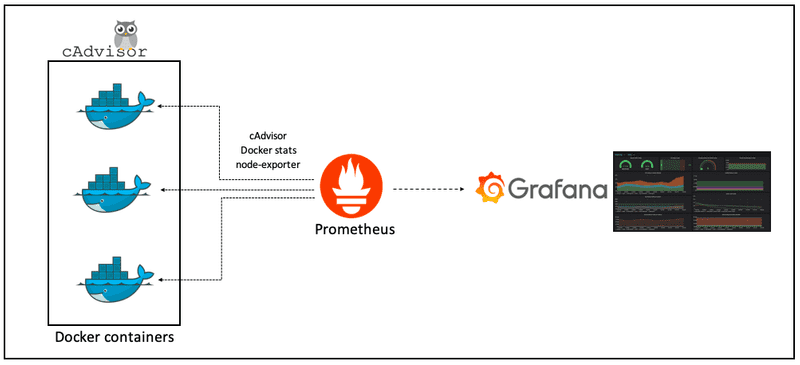
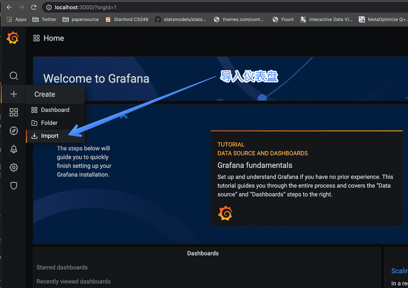
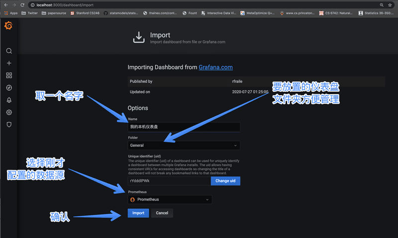
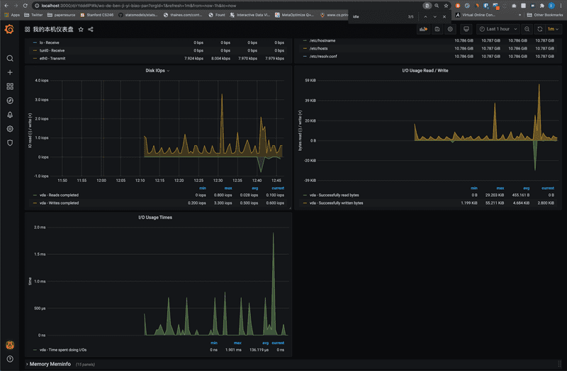

# **使用 Grafana 构建你的第一个仪表盘**


时常对一些工具的存在觉得理所当然。比如说，需要计算资源的时候，一个配置文件就可以要来两百台虚拟化好的机子。需要试下缓存？点下鼠标就可以要到几十个配置好的 Redis 结点。最省心的是，这些工具都已经根据工作流配置好了：鉴权、优化、网络连接等等通通不用你操心。

拿 Grafana 和服务监控来说：

* 服务监控到底咋配置？怎样保证数据安全？
* 保证健康的服务到底应该监控些什么？
* 配置好后的仪表盘为啥消失了？
* 查询 Query 又该咋写？

## **Grafana 是什么**


开始前首先要问一个问题，Grafana 到底是什么。

Grafana 是一个监控仪表系统，它是由 Grafana Labs 公司开源的的一个系统监测 (System Monitoring) 工具。它可以大大帮助你简化监控的复杂度，你只需要提供你需要监控的数据，它就可以帮你生成各种可视化仪表。同时它还有报警功能，可以在系统出现问题时通知你。

Grafana 不对数据源作假设，它支持以下各种数据，也就是说如果你的数据源是以下任意一种，它都可以帮助生成仪表。同时在市面上，如果 Grafana 称第二，那么应该没有敢称第一的仪表可视化工具了。因此，如果你搞定了 Grafana，它几乎是一个会陪伴你到各个公司的一件称心应手的兵器。

**Grafana 支持的数据源**

* Prometheus 本文中的例子，你没听过也没关系不影响阅读，把它想象成带时间戳的 MySQL 就好
* Graphite
* OpenTSDB
* InfluxDB
* MySQL/PostgreSQL
* Microsoft SQL Server
* 等等

### **什么情况下会用到 Grafana**

在任何需要监控系统运行状况的地方就大概率会用到仪表盘，而用到仪表盘的时候就可以用 Grafana （不管你用什么语言）

### **安装和配置 Grafana**

为了简化各种系统不一致的乱七八糟问题，我们用 Docker 来安装 Grafana。


Docker 的配置文件如下，就算你从来没用过 docker 也不用操心，我会在下文里一行一行讲明白。请不要复制粘贴代码，直接到本文的 GitHub 页 clone 代码即可，我会保证 GitHub 上的代码处理最新状态：[https://github.com/Kalasearch/grafana-tutorial](https://github.com/Kalasearch/grafana-tutorial)

```
version: '3.4'
services:
  prometheus: 
    image: prom/prometheus
    container_name: prometheus
    hostname: prometheus
    ports:
      - 9090:9090
    volumes:
      - ./prometheus.yml:/etc/prometheus/prometheus.yml
  prometheus-exporter:
    image: prom/node-exporter
    container_name: prometheus-exporter
    hostname: prometheus-exporter
    ports:
      - 9100:9100
  grafana:
    image: grafana/grafana
    container_name: grafana
    hostname: grafana
    ports:
      - 3000:3000
    volumes:
      - ./grafana.ini:/etc/grafana/grafana.ini
```
在这里我们启动了三个服务

* Prometheus 普罗米修斯时序数据库，用来存储和查询你的监控数据
* Promethues-exporter 一个模拟数据源，用来监控你本机的状态，比如有几个 CPU，CPU 的负载之类
* Grafana 本尊

在 clone 了代码之后，在你的本地运行 `docker-compose up`，应该会看到类似：


在跑起来服务之后，到你的浏览器中，复制 `http://localhost:3000 `应该就可以看到 Grafana 跑起来的初始登录界面。**初始的用户名是 admin，密码也是 admin。输入之后，会要求你改密码**




到这里，你的 Grafana 就已经搭起来了。注意到 Docker 的配置文件中我们创建了三个服务，这三个服务之间分别有什么关系呢？

## **Grfana 工作原理**

上面说到，Grafana 是一个仪表盘，而仪表盘必然是用来显示数据的。

Grafana 本身并不负责数据层，它只提供了通用的接口，让底层的数据库可以把数据给它。而我们起的另一个服务，叫 Prometheus （中文名普罗米修斯数据库）则是负责存储和查询数据的。

也就是说，Grafana 每次要展现一个仪表盘的时候，会向 Prometheus 发送一个查询请求。

那么配置里的另一个服务 Prometheus-exporter 又是什么呢？

这个就是你真正监测的数据来源了，Prometheus-exporter 这个服务，会查询你的本地电脑的信息，比如内存还有多少、CPU 负载之类，然后将数据导出至普罗米修斯数据库。

在真实世界中，你的目的是监控你自己的服务，比如你的 Web 服务器，你的数据库之类。

那么你就需要在你自己的服务器中把数据发送给普罗米修斯数据库。当然，你完全可以把数据发送给 MySQL (Grafana 也支持)，但普罗米修斯几乎是标配的时序数据库，强烈建议你用。

用一张图来说明它们之间的关系：



这里，最左边的 Docker 服务会将服务的数据发送给中间的普罗米修斯（对应上文的 Prometheus-exporter），而最右边的 Grafana 会查询中间的普罗米修斯，来展示仪表盘。

## **搭建你的第一个仪表盘**

### **第 1 步 - 设置数据源**

进入 Grafana 后，在左侧你会发现有一个 Data Source 即数据源选项


点击后进入，点 Add Data Source 即添加数据源，选择 Prometheus


之后设置数据源 URL。请注意，Promethues 的工作原理（下一个教程中会讲）是通过轮询一个 HTTP 请求来获取数据的，而 Grafana 在获取数据源的时候也是通过一个 HTTP 请求，因此这个地方你需要告诉 Grafana 你的 Prometheus 的数据端点是什么。

这里我们填入 http://prometheus:9090 就可以了。


点确认时一定要确认出现 `Data source is working` 这个检测，这时表明你的 Grafana 已经跟普罗米修斯说上话了

### **第 2 步 - 导入 Dashboard**

在 Grafana 里，仪表盘的配置可以通过图形化界面进行，但配置好的仪表盘是以 JSON 存储的。这也就是说，如果你把你的 JSON 数据分享出去，别人导入就可以直接导入同样的仪表盘（前提是你们的监测数据一样）。

对于我们的例子来说，回忆一下，因为我们用了 prometheus-exporter 也就是本机的系统信息监控，那么我们可以先找一个同样用了这个数据源的仪表盘。在 Grafana 网站上，你其实可以找到很多别人已经做好的仪表，可以用来监测非常多标准化的服务。

Grafana 的仪表盘市场：[https://grafana.com/grafana/dashboards]()

比如说针对以下一些服务的标准仪表盘就可以在这里找到

* JVM
* Spring Boot
* MySQL 监控
* Laravel 监控

那么，这里我们就用一个标准的仪表盘：https://grafana.com/grafana/dashboards/1860

在左侧的加号里，点 Import 即导入，在出现的界面中填入 1860 即我们要导入的仪表盘编号即可。



然后填入你需要的信息，比如仪表盘名字等



确认之后 Grafana 就会根据你的本机信息，生成类似 CPU 负载，内存和 I/O 之类的信息。我的磁盘状况如图：



要注意的是，这里的信息真正监控的是你的 Docker 中的系统信息。如果你只给你的 Docker 分配 1 个核和 2G 内存，那么这里应该看到的就是 1 个核和 2G 内存

### **第 3 步 - 生成和创建新的仪表盘**

包括如何用 Prometheus 查询数据


普罗米修斯本身也是个非常大的话题，我们会在之后的博客中继续讨论。普罗米修斯包括所有其它时序数据库通常都会定义一个查询语言，比如说 PromQL，如果需要熟练地构建仪表盘的话，需要对这个查询语言有一定了解。

**如何手动生成一个仪表盘**

假设你已经按上面的步骤生成了一个基本的仪表盘，那么现在可以开始手动添加仪表盘了。同样是点左侧的加号，点 Dashboard 就可以进入添加仪表盘的界面。

这里我们选择一个数据叫 `scrape_duration_seconds`，先不用管它的含义是什么，就当它是双 11 的销售额好了：


添加好后点右上角的 Apply 或 Save 你的仪表盘就被保存了。