# **使用 Node Exporter 监控 Linux 主机**


Node Exporter 是用于暴露 `*NIX` 主机指标的 Exporter，比如采集 CPU、内存、磁盘等信息。采用 Go 编写，不存在任何第三方依赖，所以只需要下载解压即可运行。

## **安装配置**

由于 Node Exporter 是一个独立的二进制文件，可以直接从 Prometheus 下载页面([https://prometheus.io/download/#node_exporter](https://prometheus.io/download/#node_exporter)) 下载解压运行：

```
☸ ➜ wget https://github.com/prometheus/node_exporter/releases/download/v1.2.2/node_exporter-1.2.2.linux-amd64.tar.gz
# 国内加速可以使用下面的命令下载
# wget https://download.fastgit.org/prometheus/node_exporter/releases/download/v1.2.2/node_exporter-1.2.2.linux-amd64.tar.gz
☸ ➜ tar -xvf node_exporter-1.2.2.linux-amd64.tar.gz
node_exporter-1.2.2.linux-amd64/
node_exporter-1.2.2.linux-amd64/LICENSE
node_exporter-1.2.2.linux-amd64/NOTICE
node_exporter-1.2.2.linux-amd64/node_exporter
☸ ➜ cd node_exporter-1.2.2.linux-amd64 && ls -la
total 18084
drwxr-xr-x  2 3434 3434       56 Aug  6 21:50 .
dr-xr-x---. 5 root root     4096 Oct 14 11:50 ..
-rw-r--r--  1 3434 3434    11357 Aug  6 21:49 LICENSE
-rwxr-xr-x  1 3434 3434 18494215 Aug  6 21:45 node_exporter
-rw-r--r--  1 3434 3434      463 Aug  6 21:49 NOTICE
```


直接执行 `node_exporter` 文件即可运行：

```
☸ ➜ ./node_exporter
level=info ts=2021-10-14T03:52:31.947Z caller=node_exporter.go:182 msg="Starting node_exporter" version="(version=1.2.2, branch=HEAD, revision=26645363b486e12be40af7ce4fc91e731a33104e)"
level=info ts=2021-10-14T03:52:31.947Z caller=node_exporter.go:183 msg="Build context" build_context="(go=go1.16.7, user=root@b9cb4aa2eb17, date=20210806-13:44:18)"
......
level=info ts=2021-10-14T03:52:31.948Z caller=node_exporter.go:199 msg="Listening on" address=:9100
level=info ts=2021-10-14T03:52:31.948Z caller=tls_config.go:191 msg="TLS is disabled." http2=false
```


从日志上可以看出 `node_exporter` 监听在 `9100` 端口上，默认的 `metrics` 接口通过 `/metrics` 端点暴露，我们可以通过访问 `http://localhost:9100/metrics` 来获取监控指标数据：

```
☸ ➜ curl http://localhost:9100/metrics
......
# HELP node_load1 1m load average.
# TYPE node_load1 gauge
node_load1 0.01
# HELP node_load15 15m load average.
# TYPE node_load15 gauge
node_load15 0.05
# HELP node_load5 5m load average.
# TYPE node_load5 gauge
node_load5 0.04
# HELP node_memory_Active_anon_bytes Memory information field Active_anon_bytes.
# TYPE node_memory_Active_anon_bytes gauge
node_memory_Active_anon_bytes 8.4393984e+07
# HELP node_memory_Active_bytes Memory information field Active_bytes.
# TYPE node_memory_Active_bytes gauge
node_memory_Active_bytes 1.8167808e+08
# HELP node_memory_Active_file_bytes Memory information field Active_file_bytes.
# TYPE node_memory_Active_file_bytes gauge
node_memory_Active_file_bytes 9.7284096e+07
# HELP node_memory_AnonHugePages_bytes Memory information field AnonHugePages_bytes.
# TYPE node_memory_AnonHugePages_bytes gauge
node_memory_AnonHugePages_bytes 3.5651584e+07
# HELP node_memory_AnonPages_bytes Memory information field AnonPages_bytes.
# TYPE node_memory_AnonPages_bytes gauge
node_memory_AnonPages_bytes 8.159232e+07
# HELP node_memory_Bounce_bytes Memory information field Bounce_bytes.
# TYPE node_memory_Bounce_bytes gauge
node_memory_Bounce_bytes 0
......
```

该 metrics 接口数据就是一个标准的 Prometheus 监控指标格式，我们只需要将该端点配置到 Prometheus 中即可抓取该指标数据。为了了解 node_exporter 可配置的参数，我们可以使用 `./node_exporter -h` 来查看帮助信息：

```
☸ ➜ ./node_exporter -h
    --web.listen-address=":9100"  # 监听的端口，默认是9100
    --web.telemetry-path="/metrics"  # metrics的路径，默认为/metrics
    --web.disable-exporter-metrics  # 是否禁用go、prome默认的metrics
    --web.max-requests=40     # 最大并行请求数，默认40，设置为0时不限制
    --log.level="info"        # 日志等级: [debug, info, warn, error, fatal]
    --log.format=logfmt     # 置日志打印target和格式: [logfmt, json]
    --version                 # 版本号
    --collector.{metric-name} # 各个metric对应的参数
    ......
```

其中最重要的参数就是 `--collector.<name>`，通过该参数可以启用我们收集的功能模块，`node_exporter` 会默认采集一些模块，要禁用这些默认启用的收集器可以通过 `--no-collector.<name>` 标志来禁用，如果只启用某些特定的收集器，基于先使用 `--collector.disable-defaults` 标志禁用所有默认的，然后在通过指定具体的收集器 `--collector.<name>` 来进行启用。

下图列出了默认启用的收集器：

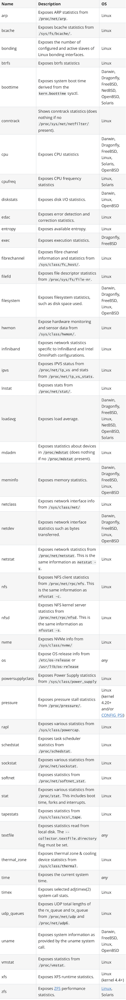

一般来说为了方便管理我们可以使用 docker 容器来运行 `node_exporter`，但是需要注意的是由于采集的是宿主机的指标信息，所以需要访问主机系统，如果使用 `docker` 容器来部署的话需要添加一些额外的参数来允许 `node_exporter` 访问宿主机的命名空间，如果直接在宿主机上运行的，我们可以用 systemd 来管理，创建一个如下所示的 `service unit` 文件：

```
☸ ➜ cat /etc/systemd/system/node_exporter.service
[Unit]
Description=node exporter service
Documentation=https://prometheus.io
After=network.target

[Service]
Type=simple
User=root
Group=root
ExecStart=/usr/local/bin/node_exporter  # 有特殊需求的可以在后面指定参数配置
Restart=on-failure

[Install]
WantedBy=multi-user.target
```

然后就可以使用 systemd 来管理 `node_exporter` 了：

```
☸ ➜ cp node_exporter /usr/local/bin/node_exporter
☸ ➜ systemctl daemon-reload
☸ ➜ systemctl start node_exporter
☸ ➜ systemctl status node_exporter
● node_exporter.service - node exporter servoce
   Loaded: loaded (/etc/systemd/system/node_exporter.service; disabled; vendor preset: disabled)
   Active: active (running) since Thu 2021-10-14 15:29:46 CST; 5s ago
     Docs: https://prometheus.io
 Main PID: 18679 (node_exporter)
    Tasks: 5
   Memory: 6.5M
   CGroup: /system.slice/node_exporter.service
           └─18679 /usr/local/bin/node_exporter

Oct 14 15:29:46 node1 node_exporter[18679]: level=info ts=2021-10-14T07:29:46.137Z caller=node_exporter.go:..._zone
Oct 14 15:29:46 node1 node_exporter[18679]: level=info ts=2021-10-14T07:29:46.137Z caller=node_exporter.go:...=time
Oct 14 15:29:46 node1 node_exporter[18679]: level=info ts=2021-10-14T07:29:46.137Z caller=node_exporter.go:...timex
Oct 14 15:29:46 node1 node_exporter[18679]: level=info ts=2021-10-14T07:29:46.137Z caller=node_exporter.go:...ueues
Oct 14 15:29:46 node1 node_exporter[18679]: level=info ts=2021-10-14T07:29:46.137Z caller=node_exporter.go:...uname
Oct 14 15:29:46 node1 node_exporter[18679]: level=info ts=2021-10-14T07:29:46.137Z caller=node_exporter.go:...mstat
Oct 14 15:29:46 node1 node_exporter[18679]: level=info ts=2021-10-14T07:29:46.137Z caller=node_exporter.go:...r=xfs
Oct 14 15:29:46 node1 node_exporter[18679]: level=info ts=2021-10-14T07:29:46.137Z caller=node_exporter.go:...r=zfs
Oct 14 15:29:46 node1 node_exporter[18679]: level=info ts=2021-10-14T07:29:46.137Z caller=node_exporter.go:...:9100
Oct 14 15:29:46 node1 node_exporter[18679]: level=info ts=2021-10-14T07:29:46.137Z caller=tls_config.go:191...false
Hint: Some lines were ellipsized, use -l to show in full.
```

这里我们用 systemd 的方式在两个节点上（node1、node2）分别启动 `node_exporter`，启动完成后我们使用静态配置的方式在之前的 Prometheus 配置中新增一个 `node_exporter` 的抓取任务，来采集这两个节点的监控指标数据，配置文件如下所示：

```

global:
  scrape_interval: 5s

scrape_configs:
  - job_name: "prometheus"
    static_configs:
      - targets: ["localhost:9090"]
  - job_name: "demo"
    scrape_interval: 15s # 会覆盖global全局的配置
    scrape_timeout: 10s
    static_configs:
      - targets: ["localhost:10000", "localhost:10001", "localhost:10002"]
  - job_name: "node_exporter" # 新增 node_exporter 任务
    static_configs:
      - targets: ["node1:9100", "node2:9100"] # node1、node2 在 hosts 中做了映射
```

上面配置文件最后我们新增了一个名为 `node_exporter` 的抓取任务，采集的目标使用静态配置的方式进行配置，然后重新加载 Prometheus，正常在 Prometheus 的 WebUI 的目标页面就可以看到上面配置的 `node_exporter` 任务了。

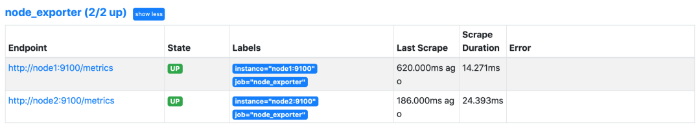

接下来我们来了解一些关于节点监控的常用指标，比如 CPU、内存、IO 监控等。

## **CPU 监控**

对于节点我们首先能想到的就是要先对 CPU 进行监控，因为 CPU 是处理任务的核心，根据 CPU 的状态可以分析出当前系统的健康状态。要对节点进行 CPU 监控，需要用到 `node_cpu_seconds_total` 这个监控指标，在 metrics 接口中该指标内容如下所示：

```
# HELP node_cpu_seconds_total Seconds the CPUs spent in each mode.
# TYPE node_cpu_seconds_total counter
node_cpu_seconds_total{cpu="0",mode="idle"} 13172.76
node_cpu_seconds_total{cpu="0",mode="iowait"} 0.25
node_cpu_seconds_total{cpu="0",mode="irq"} 0
node_cpu_seconds_total{cpu="0",mode="nice"} 0.01
node_cpu_seconds_total{cpu="0",mode="softirq"} 87.99
node_cpu_seconds_total{cpu="0",mode="steal"} 0
node_cpu_seconds_total{cpu="0",mode="system"} 309.38
node_cpu_seconds_total{cpu="0",mode="user"} 79.93
node_cpu_seconds_total{cpu="1",mode="idle"} 13168.98
node_cpu_seconds_total{cpu="1",mode="iowait"} 0.27
node_cpu_seconds_total{cpu="1",mode="irq"} 0
node_cpu_seconds_total{cpu="1",mode="nice"} 0
node_cpu_seconds_total{cpu="1",mode="softirq"} 74.1
node_cpu_seconds_total{cpu="1",mode="steal"} 0
node_cpu_seconds_total{cpu="1",mode="system"} 314.71
node_cpu_seconds_total{cpu="1",mode="user"} 78.83
node_cpu_seconds_total{cpu="2",mode="idle"} 13182.78
node_cpu_seconds_total{cpu="2",mode="iowait"} 0.69
node_cpu_seconds_total{cpu="2",mode="irq"} 0
node_cpu_seconds_total{cpu="2",mode="nice"} 0
node_cpu_seconds_total{cpu="2",mode="softirq"} 66.01
node_cpu_seconds_total{cpu="2",mode="steal"} 0
node_cpu_seconds_total{cpu="2",mode="system"} 309.09
node_cpu_seconds_total{cpu="2",mode="user"} 79.44
node_cpu_seconds_total{cpu="3",mode="idle"} 13185.13
node_cpu_seconds_total{cpu="3",mode="iowait"} 0.18
node_cpu_seconds_total{cpu="3",mode="irq"} 0
node_cpu_seconds_total{cpu="3",mode="nice"} 0
node_cpu_seconds_total{cpu="3",mode="softirq"} 64.49
node_cpu_seconds_total{cpu="3",mode="steal"} 0
node_cpu_seconds_total{cpu="3",mode="system"} 305.86
node_cpu_seconds_total{cpu="3",mode="user"} 78.17
```

从接口中描述可以看出该指标是用来统计 CPU 每种模式下所花费的时间，是一个 Counter 类型的指标，也就是会一直增长，这个数值其实是 CPU 时间片的一个累积值，意思就是从操作系统启动起来 CPU 开始工作，就开始记录自己总共使用的时间，然后保存下来，而且这里的累积的 CPU 使用时间还会分成几个不同的模式，比如用户态使用时间、空闲时间、中断时间、内核态使用时间等等，也就是平时我们使用 top 命令查看的 CPU 的相关信息，而我们这里的这个指标会分别对这些模式进行记录。

接下来我们来对节点的 CPU 进行监控，我们也知道一个一直增长的 CPU 时间对我们意义不大，一般我们更希望监控的是节点的 CPU 使用率，也就是我们使用 top 命令看到的百分比。


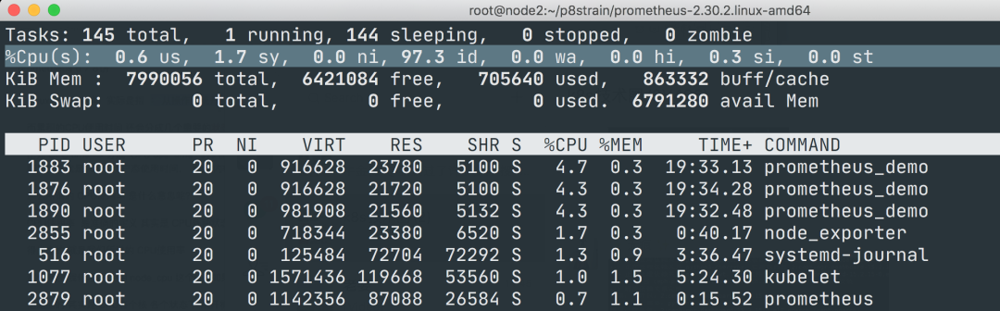

要计算 CPU 的使用率，那么就需要搞清楚这个使用率的含义，**CPU 使用率是 CPU 除空闲（idle）状态之外的其他所有 CPU 状态的时间总和除以总的 CPU 时间得到的结果**，理解了这个概念后就可以写出正确的 promql 查询语句了。

要计算除空闲状态之外的 CPU 时间总和，更好的方式是不是直接计算空闲状态的 CPU 时间使用率，然后用 1 减掉就是我们想要的结果了，所以首先我们先过滤 idle 模式的指标，在 Prometheus 的 WebUI 中输入 `node_cpu_seconds_total{mode="idle"} ` 进行过滤：

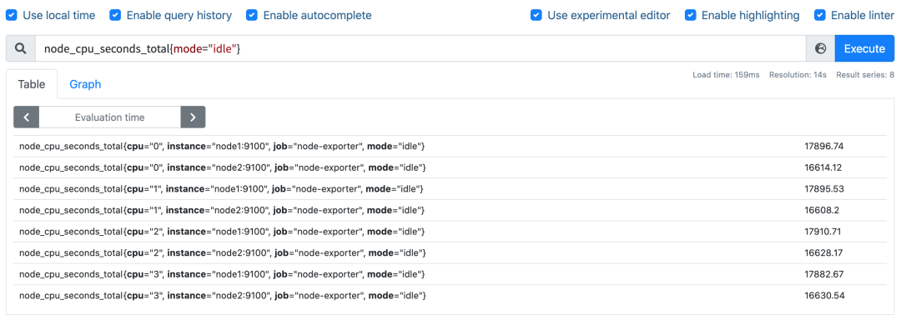

要计算使用率，肯定就需要知道 idle 模式的 CPU 用了多长时间，然后和总的进行对比，由于这是 Counter 指标，我们可以用 increase 函数来获取变化，使用查询语句 `increase(node_cpu_seconds_total{mode="idle"}[1m])`，因为 increase 函数要求输入一个区间向量，所以这里我们取 1 分钟内的数据：

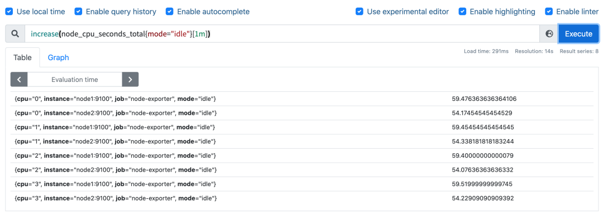

我们可以看到查询结果中有很多不同 cpu 序号的数据，我们当然需要计算所有 CPU 的时间，所以我们将它们聚合起来，我们要查询的是不同节点的 CPU 使用率，所以就需要根据 instance 标签进行聚合，

使用查询语句 `sum(increase(node_cpu_seconds_total{mode="idle"}[1m])) by (instance)`：

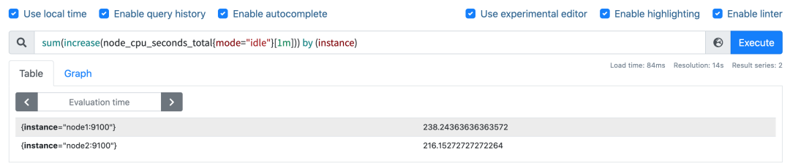

这样我们就分别拿到不同节点 1 分钟内的空闲 CPU 使用时间了，然后和总的 CPU （这个时候不需要过滤状态模式）时间进行比较即可，使用查询语句 

```
sum(increase(node_cpu_seconds_total{mode="idle"}[1m])) by (instance) / sum(increase(node_cpu_seconds_total[1m])) by (instance)：
```

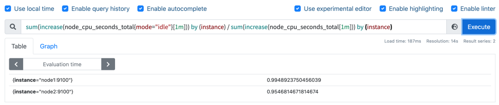

然后计算 CPU 使用率就非常简单了，使用 1 减去乘以 100 即可：

```
(1 - sum(increase(node_cpu_seconds_total{mode="idle"}[1m])) by (instance) / sum(increase(node_cpu_seconds_total[1m])) by (instance) ) * 100
```

这就是能够想到的最直接的 CPU 使用率查询方式了，当然前面我们学习的 promql 语法中提到过更多的时候我们会去使用 rate 函数，而不是用 increase 函数进行计算，所以最终的 CPU 使用率的查询语句为：

```
(1 - sum(increase(node_cpu_seconds_total{mode="idle"}[1m])) by (instance) / sum(increase(node_cpu_seconds_total[1m])) by (instance) ) * 100
```


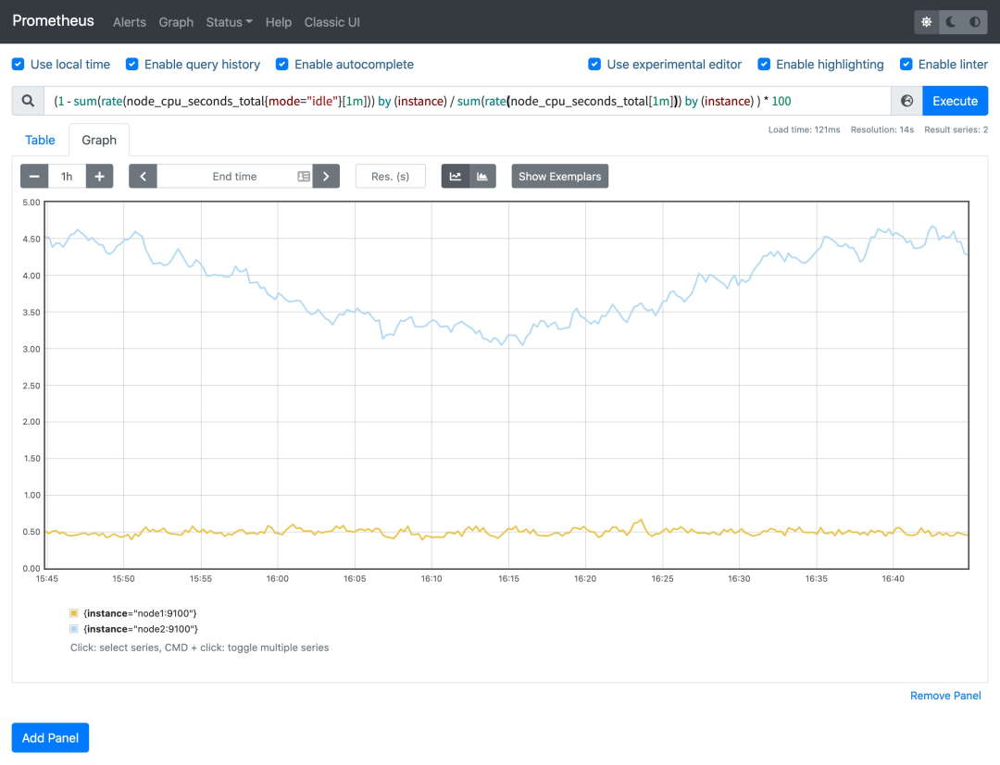

可以和 top 命令的结果进行对比（下图为 node2 节点），基本上是保持一致的，这就是监控节点 CPU 使用率的方式。

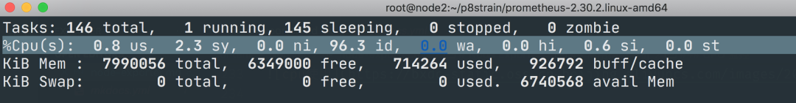

## **内存监控**

除了 CPU 监控之外，我们可能最关心的就是节点内存的监控了，平时我们查看节点的内存使用情况基本上都是使用 free 命令来查看：

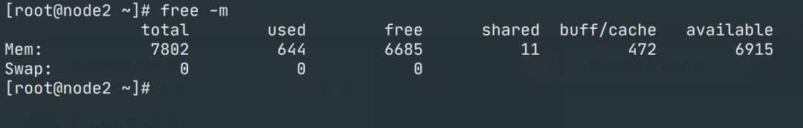

### **free命令**


free 命令的输出会显示系统内存的使用情况，包括物理内存、交换内存(swap)和内核缓冲区内存等，所以要对内存进行监控我们需要先了解这些概念，我们先了解下 free 命令的输出内容：

* Mem 行(第二行)是内存的使用情况
* Swap 行(第三行)是交换空间的使用情况
* total 列显示系统总的可用物理内存和交换空间大小
* used 列显示已经被使用的物理内存和交换空间
* free 列显示还有多少物理内存和交换空间可用使用
* shared 列显示被共享使用的物理内存大小
* buff/cache 列显示被 buffer 和 cache 使用的物理内存大小
* available 列显示还可以被应用程序使用的物理内存大小

其中我们需要重点关注的 `free` 和 `available` 两列。

`free` 是真正尚未被使用的物理内存数量，而 available 是从应用程序的角度看到的可用内存，Linux 内核为了提升磁盘操作的性能，会消耗一部分内存去缓存磁盘数据，就是 buffer 和 cache，所以对于内核来说，buffer 和 cache 都属于已经被使用的内存，只是应用程序需要内存时，如果没有足够的 free 内存可以用，内核就会从 buffer 和 cache 中回收内存来满足应用程序的请求。所以从应用程序的角度来说 `available = free + buffer + cache`，不过需要注意这只是一个理想的计算方式，实际中的数据有较大的误差。


如果要在 Prometheus 中来查询内存使用，则可以用 node_memory_* 相关指标，同样的要计算使用的，我们可以计算可使用的内存，使用 promql 查询语句 `node_memory_Buffers_bytes + node_memory_Cached_bytes + node_memory_MemFree_bytes`。

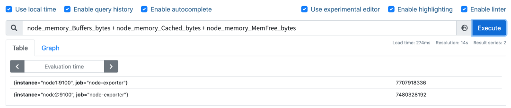

然后计算可用内存的使用率，和总的内存相除，然后同样用 1 减去即可，语句为

` (1- (node_memory_Buffers_bytes + node_memory_Cached_bytes + node_memory_MemFree_bytes) / node_memory_MemTotal_bytes) * 100`，

这样计算出来的就是节点内存使用率。

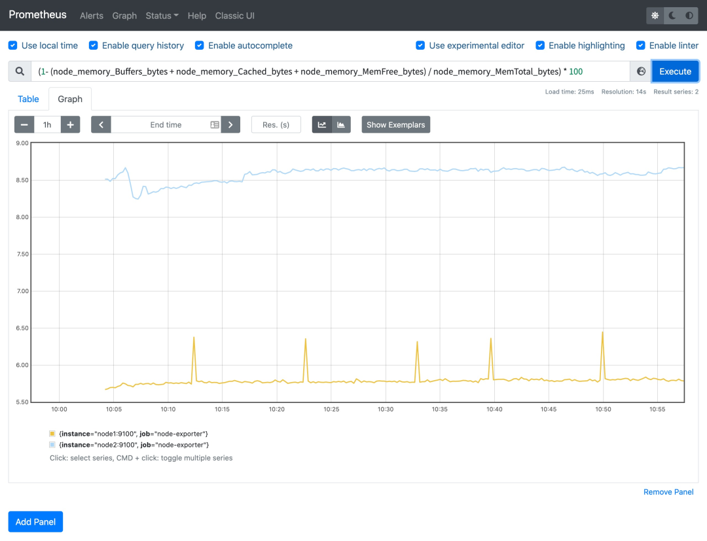

当然如果想要查看各项内存使用直接使用对应的监控指标即可，比如要查看节点总内存，直接使用 `node_memory_MemTotal_bytes` 指标即可获取。

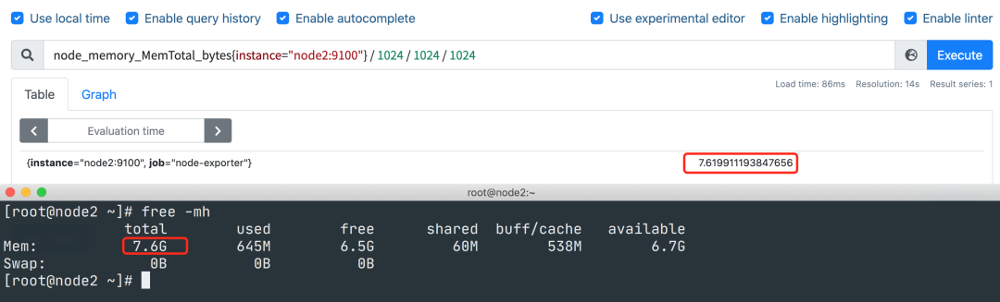

## **磁盘监控**

接下来是比较中的磁盘监控，对于磁盘监控我们不仅对磁盘使用情况感兴趣，一般来说对于磁盘 IO 的监控也是非常有必要的。

**磁盘容量监控**

要监控磁盘容量，需要用到 `node_filesystem_*` 相关的指标，比如要查询节点磁盘空间使用率，则可以同样用总的减去可用的来进行计算，磁盘可用空间使用 `node_filesystem_avail_bytes` 指标，但是由于会有一些我们不关心的磁盘信息，所以我们可以使用 fstype 标签过滤关心的磁盘信息，比如 ext4 或者 xfs 格式的磁盘：

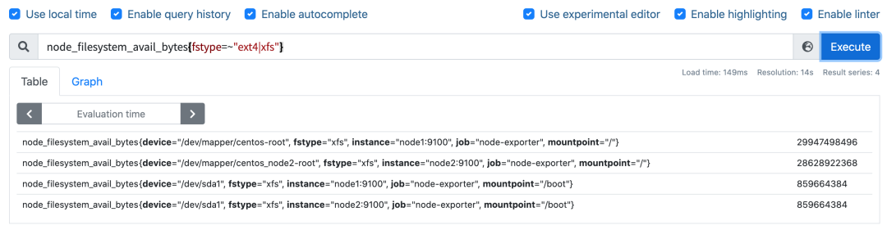

要查询磁盘空间使用率，则使用查询语句 

`(1 - node_filesystem_avail_bytes{fstype=~"ext4|xfs"} / node_filesystem_size_bytes{fstype=~"ext4|xfs"}) * 100 `

即可：

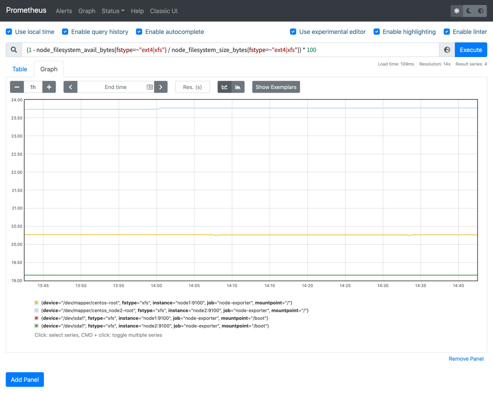

这样就可以得到我们关心的磁盘空间使用率了。

**磁盘 IO 监控**

要监控磁盘 IO，就要区分是读的 IO，还是写的 IO，读 IO 使用 `node_disk_reads_completed` 指标，写 IO 使用 `node_disk_writes_completed_total` 指标。

磁盘读 IO 使用 `sum by (instance) (rate(node_disk_reads_completed_total[5m])) ` 查询语句即可：

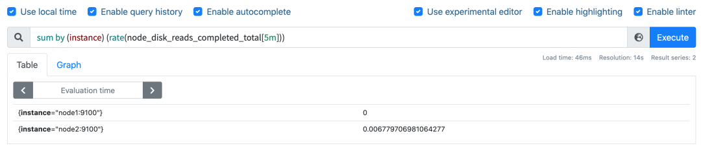


当然如果你想根据 device 进行聚合也是可以的，我们这里是全部聚合在一起了。

磁盘写 IO 使用 `sum by (instance) (rate(node_disk_writes_completed_total[5m])) ` 查询语句即可：

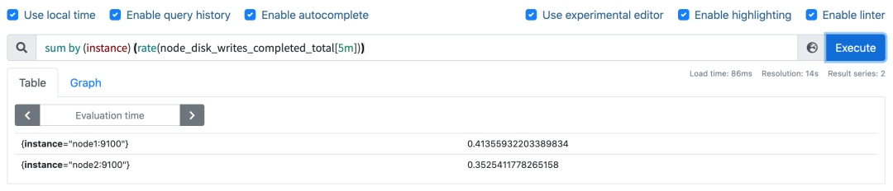


## **网络 IO 监控**

上行带宽需要用到的指标是 node_network_receive_bytes，由于我们对网络带宽的瞬时变化比较关注，所以一般我们会使用 irate 函数来计算网络 IO，比如计算上行带宽用查询语句 

`sum by(instance) (irate(node_network_receive_bytes_total{device!~"bond.*?|lo"}[5m]))`

 即可：

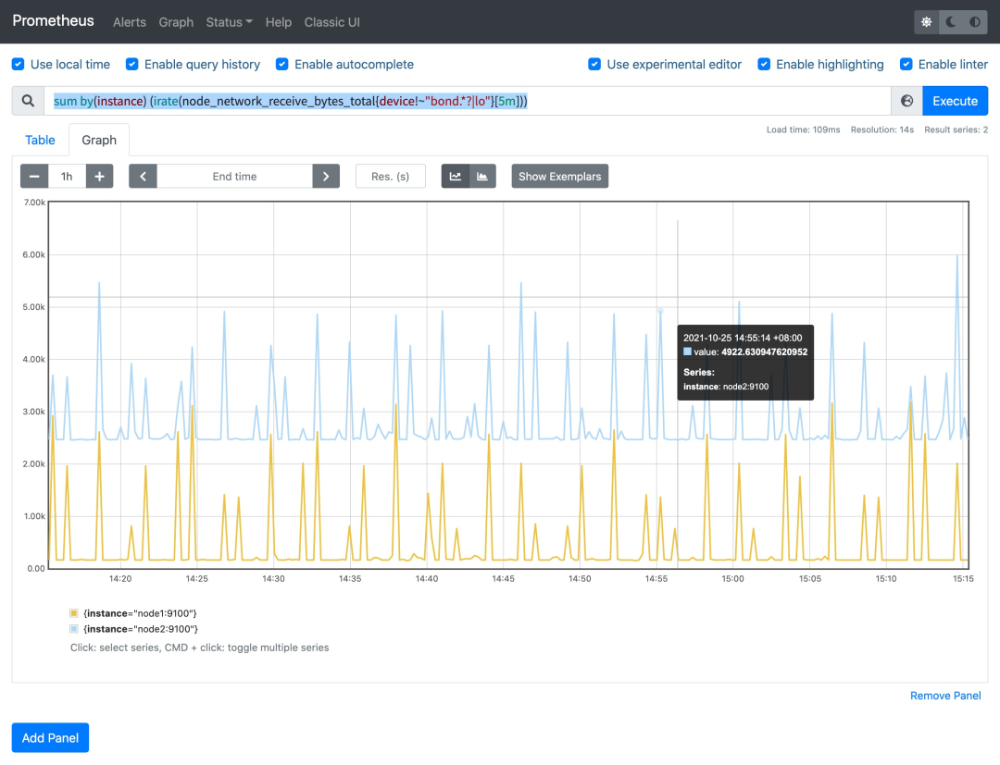


下行带宽用到的指标为 `node_network_transmit_bytes`，同样的方式查询语句为 

`sum by(instance) (irate(node_network_transmit_bytes{device!~"bond.*?|lo"}[5m]))`：

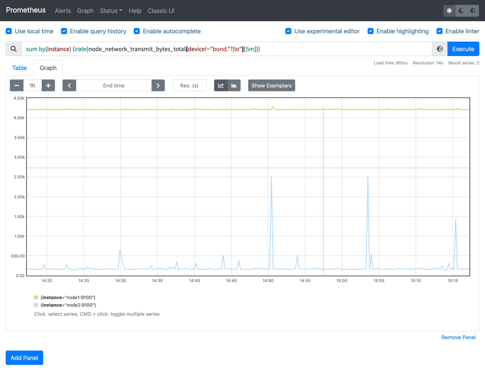

当然我们还可以根据网卡设备进行分别聚合计算，最后还可以根据自己的需求将结果进行单位换算。


