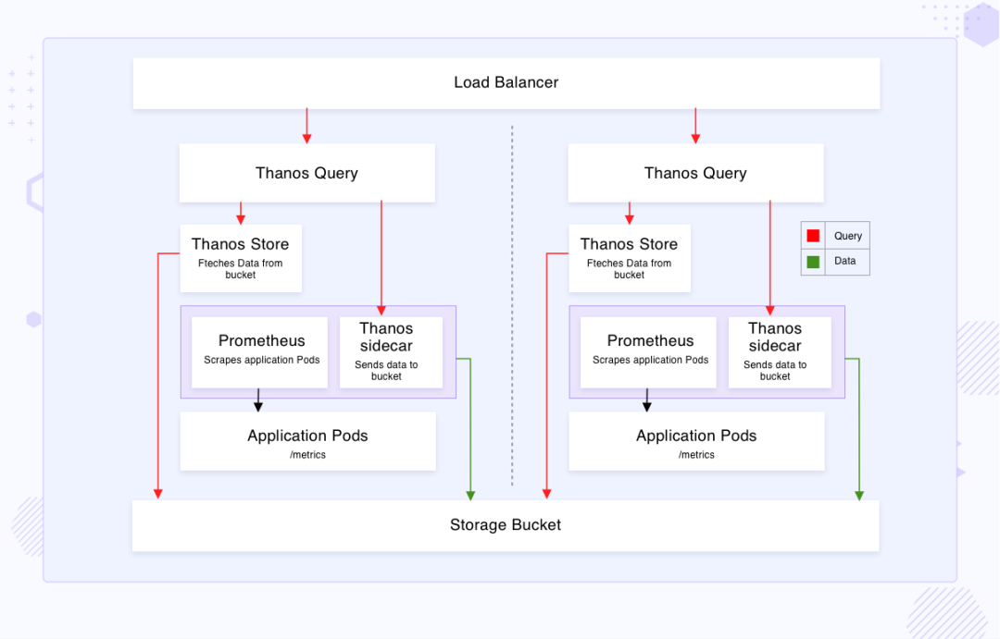
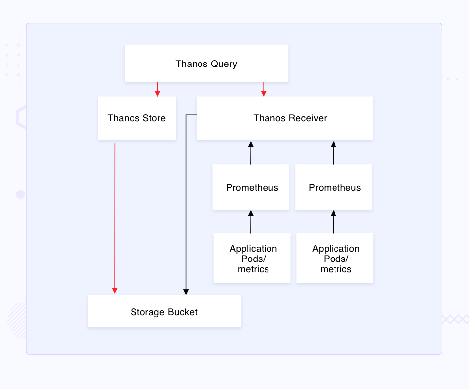

# **如何选择 Thanos 的 Sidecar 和 Receiver 两种模式？**

Prometheus 无疑是现在最热门的监控系统，它已被证明是 Kubernetes 系统中监控和报警的首选解决方案，不过虽然 Prometheus 有一些方案来实现自身的高可用性，但它在数据保留、历史数据检索和多租户方面也有其自身的局限性，而这也是 Thanos 试图去弥补 Prometheus 不足的地方。

本文我们将介绍在 Kubernetes 环境中集成 Thanos 和 Prometheus 的两种不同方法，并将对比这两种方式的异同点。

除了 Thanos 之外，还有一个名为 Cortex 的开源项目也是一种比较流行的解决 Prometheus 不足的解决方案，Thanos 最初只支持 sidecar 的安装模式，而 Cortex 更喜欢基于 push 或者远程写的方式来收集指标数据，但早在2019年，这两个项目其实就进行了合作，在互相学习之后，Thanos 引入了 Receiver 组件，而 Cortex 的块存储则也构建在了几个核心的 Thanos 组件之上。

## **Thanos**

Thanos 支持两种方式与 Prometheus 进行集成：

**sidecar / receiver**

Thanos 中具有以下几个通用的组件：

**Querier / Store / Compactor / Ruler**

另外 Sidecar 和 Receiver 也是 Thanos 的重要组件，他们有各自的运行方式，在比较这两种方式之前，我们先来简单了解下 Sidecar 和 Receiver 的工作原理。

### **Thanos Sidecar 工作原理**

Thanos Sidecar 组件顾名思义是在 Prometheus 服务的 Pod 中作为 sidecar 运行的，无论是普通 Prometheus 还是由 Prometheus Operator 管理的 Prometheus，都是如此，该组件负责将数据（从 Prometheus TSDB）传递到对象存储中。

如上图所示，为了实现高可用性，**多个 Prometheus 实例与 Sidecar 组件一起运行，这些 Prometheus 实例都从目标上独立抓取指标，默认情况下，抓取的 TSDB 块数据块被存储在 Prometheus 提供的持久化卷中**。

**此外 Sidecar 在 Prometheus 的远程读 API 之上实现了 Thanos 的 Store API**，从而可以从 **Thanos Querier 组件中去查询 Prometheus 中的时间序列数据**，

此外，Sidecar 还可以配置为每隔两小时将 TSDB 块上传到对象存储，每两小时创建一次块，存储在 Bucket 桶中的数据可以使用 Thanos Store 组件进行查询，这同样实现了 Store API，都可以被 Thanos Querier 发现。

### **Thanos Receiver 工作原理**

与 Sidecar 不同，Receiver 是作为一个单独的 StatefulSet 来运行的，在这种方法中，Thanos 的所有其他组件都以与 Sidecar 方式相同的方式存在和运行，**但 Receiver 取代了 Sidecar 组件，TSDB 的查询和传输到对象存储的方式发生了巨大的变化**

Receiver 组件实现了 Prometheus 的远程写 API，直接接收 Prometheus 的数据，Receiver 将数据上传到对象存储 Bucket 中去，并且也有自己的保留期，Querier 被配置为通过 Store 查询 Receiver 和存储桶上的数据。

## **Sidecar 和 Receiver 对比**

接下来我们在高可用性、与 Prometheus 集成、存储和数据采集等方面来全面比较下 Thanos Sidecar 和 Receiver 模式的异同点。

> 高可用性

### **Sidecar**

高可用是通过将 Sidecar 容器与 Prometheus 实例的每个副本集成在一起来实现的，每个实例都单独的抓取目标，Sidecar 将 TSDB 块上传到对象存储。

Prometheus 每两小时写一个 TSDB 块，考虑到有多个 Prometheus 副本，其中一个发生故障，最新的块将丢失，在特定的 Prometheus 实例的图表中会显示一个空白出来，但由于有两个副本，这个空白会被另一个实例的块数据填补，Thanos Querier 组件负责填补这些空白和重复的数据去重。

### **Receiver**

与 Sidecar 类似，多个 Prometheus 实例被部署来抓取相同的目标，**并被配置为远程写入 Receiver StatefulSet**，在这里，不仅是 Prometheus 副本，Receiver 副本也在 HA 中发挥了重要作用。

除此以外，Receiver 还支持多租户，比如设置 factor=2，**这将确保传入的数据在两个 Receiver pod 之间进行复制。单个 Prometheus 实例的故障由另一个实例覆盖，因为两者都是远程写入Receiver 的，由于复制系数为2，单个 Receiver pod 的故障会由其他的来补偿**。

> 与 Prometheus 集成

**Sidecar**

只需在 Prometheus 实例 pod 中简单地添加一个 sidecar 容器，所有其他 Thanos 组件就可以和它一起工作了，Sidecar 可以选择每两小时将一个 TSDB 块写入对象存储，另外只需将 Sidecar 作为服务暴露给 Thanos Querier 组件，存储在对象存储中的数据会通过 Store 组件暴露。因此，集成 Sidecar 非常简单，适用于大多数场景。

**Receiver**

Receiver 模式需要更改 Prometheus 实例的配置，将 TSDB 远程写入 Receiver，同时部署一个额外的 Receiver StatefulSet。

Receiver 将 TSDB 保留在本地存储中，要实现负载均衡和数据复制需要运行多个 Receiver 实例作为哈希环的一部分，需要对哈希环进行配置，使 HTTP 请求中的租户 Header 可以匹配专属的 Receiver 端点，整合 Receiver 是一项复杂而繁琐的任务。

> 存储

**Sidecar**

**Sidecar 从 Prometheus 的本地存储中读取数据，因此 TSDB 不需要额外的本地存储**。

此外，它还可以大大减少 TSDB 在 Prometheus 本地存储中的保留时间，因为它每两小时上传一次，同时它们的历史数据通过对象存储变得持久和可查询。

默认情况下，Prometheus 存储的数据为15天，在监控一个大规模生产集群的情况下，它需要相当大的本地存储，而且本地存储比对象存储要昂贵得多**。由于 Sidecar 每2小时将 Prometheus 的指标导出到存储桶中，它使 Prometheus 更接近于无状态。虽然在 Thanos 文档中，建议 Prometheus 的保留时间不要低于最小块持续时间的3倍，所以它变成了6小时**。

**Receiver**

Receiver 是一个 StatefulSet，需要使用 PV，需要的本地存储容量取决于 `--receive.replication-factor`、`--tsdb.retention` 这两个参数以及pod 副本数，TSDB 保留越高，当然就会使用更多的本地存储，由于数据被持续写入 Receiver，因此 Prometheus 本地的数据保留可以保持在最小值。与 Sidecar 相比，这种方案需要更多的本地存储。

> 数据采集

**Sidecar**

在这里，TSDB 块是从 Prometheus 实例的本地存储中读取的，要么提供给 Querier 进行查询，要么导出到对象存储中。Sidecar 以 pull 的模式上运行（Thanos Querier 在查询时从 Prometheus 拉取序列数据），数据不会不断地写入其他实例中。

**Receiver**

Receiver 则是基于 push 的模式，TSDB 由 Prometheus 实例本身远程写入到 Receiver，从而使 Prometheus 最接近无状态。然后数据从 Receiver 进一步上传到对象存储。

## **结论**

选择哪种方案完全取决于要实现的 Prometheus HA 和多租户的环境。在需要为单个集群实现 Prometheus HA 或使用 Prometheus Operator 进行特定应用程序监控的情况下，Sidecar 似乎是一个不错的选择，因为它易于操作和集成轻量。**Sidecar 也可以通过分层的 Thanos Querier 方法用于多租户**。

而如果需要对多租户进行更集中的查看，或者在只有出流量的网络环境中，则可以在考虑推送指标方式后使用 Receiver，不建议通过 Receiver 实现单租户的全局视图。当试图实现具有不同环境限制的多个租户的全局视图时，可以采用同时使用 Sidecar 和 Receiver 的混合方法

