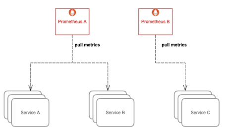
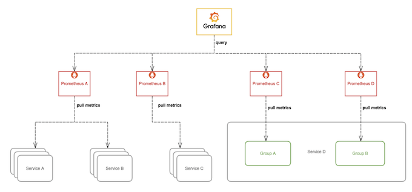
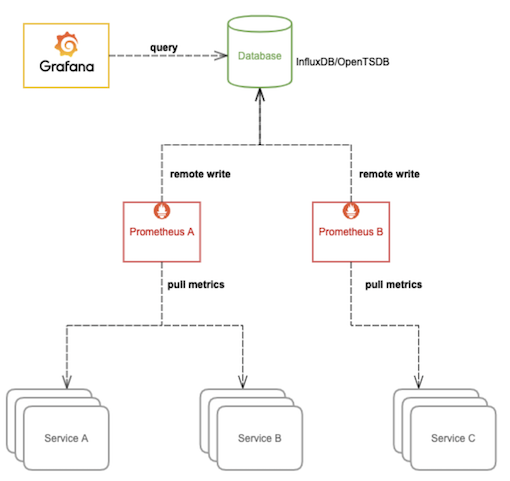
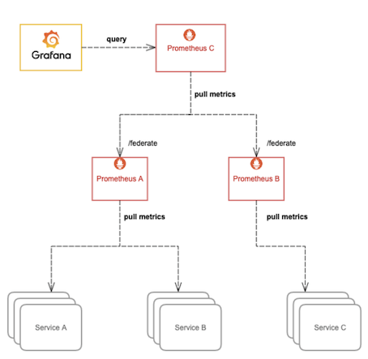
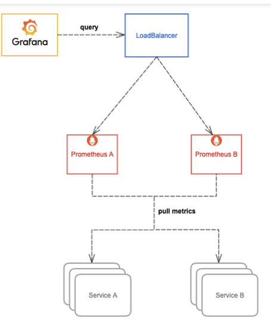

# **(Thaos1) 大规模场景下 Prometheus 的优化手段**

## **概述**

Prometheus 几乎已成为监控领域的事实标准，它自带高效的时序数据库存储，可以让单台 Prometheus 能够高效的处理大量的数据，还有友好并且强大的 PromQL 语法，可以用来灵活的查询各种监控数据以及配置告警规则，同时它的 pull 模型指标采集方式被广泛采纳，非常多的应用都实现了 Prometheus 的 metrics 接口以暴露自身各项数据指标让 Prometheus 去采集，很多没有适配的应用也会有第三方 exporter 帮它去适配 Prometheus，所以监控系统我们通常首选用 Prometheus，本系列文章也将基于 Prometheus 来打造云原生环境下的大型分布式监控系统。


## **大规模场景下 Prometheus 的痛点**

Prometheus 本身只支持单机部署，没有自带支持集群部署，也就不支持高可用以及水平扩容，在大规模场景下，最让人关心的问题是它的存储空间也受限于单机磁盘容量，磁盘容量决定了单个 Prometheus 所能存储的数据量，数据量大小又取决于被采集服务的指标数量、服务数量、采集速率以及数据过期时间。

**在数据量大的情况下，我们可能就需要做很多取舍，比如丢弃不重要的指标、降低采集速率、设置较短的数据过期时间(默认只保留15天的数据，看不到比较久远的监控数据)。**


这些痛点实际也是可以通过一些优化手段来改善的，下面我们来细讲一下。


## **从服务维度拆分 Prometheus**

Prometheus 主张根据功能或服务维度进行拆分，即如果要采集的服务比较多，一个 Prometheus 实例就配置成仅采集和存储某一个或某一部分服务的指标，**这样根据要采集的服务将 Prometheus 拆分成多个实例分别去采集，也能一定程度上达到水平扩容的目的**。




通常这样的扩容方式已经能满足大部分场景的需求了，毕竟单机 Prometheus 就能采集和处理很多数据了，很少有 Prometheus 撑不住单个服务的场景。不过在超大规模集群下，有些单个服务的体量也很大，就需要进一步拆分了，我们下面来继续讲下如何再拆分。

## **对超大规模的服务做分片**

想象一下，如果集群节点数量达到上千甚至几千的规模，对于一些节点级服务暴露的指标，比如 kubelet 内置的 cadvisor 暴露的容器相关的指标，又或者部署的 `DeamonSet node-exporter` 暴露的节点相关的指标，在集群规模大的情况下，它们这种单个服务背后的指标数据体量就非常大；

还有一些用户量超大的业务，单个服务的 pod 副本数就可能过千，这种服务背后的指标数据也非常大，当然这是最罕见的场景，对于绝大多数的人来说这种场景都只敢 YY 一下，实际很少有单个服务就达到这么大规模的业务。

那么如何优化呢？**我们可以给这种大规模类型的服务做一下分片(Sharding)，将其拆分成多个 group，让一个 Prometheus 实例仅采集这个服务背后的某一个 group 的数据，这样就可以将这个大体量服务的监控数据拆分到多个 Prometheus 实例上。**


如何将一个服务拆成多个 group 呢？下面介绍两种方案，以对 kubelet cadvisor 数据做分片为例。

第一，我们可以不用 Kubernetes 的服务发现，自行实现一下 sharding 算法，比如针对节点级的服务，可以将某个节点 shard 到某个 group 里，然后再将其注册到 Prometheus 所支持的服务发现注册中心，推荐 `consul`，最后在 Prometheus 配置文件加上 [`consul_sd_config`](https://prometheus.io/docs/prometheus/latest/configuration/configuration/#consul_sd_config) 的配置，指定每个 Prometheus 实例要采集的 group。

```
 - job_name: 'cadvisor-1'
    consul_sd_configs:
      - server: 10.0.0.3:8500
        services:
          - cadvisor-1 # This is the 2nd slave
```

在未来，你甚至可以直接利用 Kubernetes 的 [EndpointSlice](https://kubernetes.io/docs/concepts/services-networking/endpoint-slices/) 特性来做服务发现和分片处理，在超大规模服务场景下就可以不需要其它的服务发现和分片机制。不过暂时此特性还不够成熟，没有默认启用，不推荐用(当前 Kubernentes 最新版本为 1.18)。

第二，用 Kubernetes 的 node 服务发现，再利用 Prometheus relabel 配置的 hashmod 来对 node 做分片，每个 Prometheus 实例仅抓其中一个分片中的数据:

```
- job_name: 'cadvisor-1'
  metrics_path: /metrics/cadvisor
  scheme: https

	# 请求 kubelet metrics 接口也需要认证和授权，通常会用 webhook 方式让 apiserver 代理进行RBAC 校验，所以还是用 ServiceAccount 的 token
  bearer_token_file: /var/run/secrets/kubernetes.io/serviceaccount/token

  kubernetes_sd_configs:
  - role: node

  # 通常不校验 kubelet 的 server 证书，避免报 x509: certificate signed by unknown authority
  tls_config:
    insecure_skip_verify: true

  relabel_configs:
  - source_labels: [__address__]
    modulus:       4    # 将节点分片成 4 个 group
    target_label:  __tmp_hash
    action:        hashmod
  - source_labels: [__tmp_hash]
    regex:         ^1$  # 只抓第 2 个 group 中节点的数据(序号 0 为第 1 个 group)
    action:        keep
```
 
**拆分引入的新问题**

 前面我们通过不通层面对 Prometheus 进行了拆分部署，**一方面使得 Prometheus 能够实现水平扩容，另一方面也加剧了监控数据落盘的分散程度**，使用 Grafana 查询监控数据时我们也需要添加许多数据源，而且不同数据源之间的数据还不能聚合查询，监控页面也看不到全局的视图，造成查询混乱的局面。

 
 
 要解决这个问题，我们可以从下面的两方面入手，任选其中一种方案。

### **集中数据存储**

我们可以让 Prometheus 不负责存储，仅采集数据并通过 remote write 方式写入远程存储的 adapter，远程存储使用 OpenTSDB 或 InfluxDB 这些支持集群部署的时序数据库，Prometheus 配置:

```
remote_write:
- url: http://10.0.0.2:8888/write
```

然后 Grafana 添加我们使用的时序数据库作为数据源来查询监控数据来展示，架构图:

 
 
 这种方式相当于更换了存储引擎，由其它支持存储水平扩容的时序数据库来存储庞大的数据量，这样我们就可以将数据集中到一起。OpenTSDB 支持 HBase, BigTable 作为存储后端，InfluxDB 企业版支持集群部署和水平扩容(开源版不支持)。**不过这样的话，我们就无法使用友好且强大的 PromQL 来查询监控数据了，必须使用我们存储数据的时序数据库所支持的语法来查询**。

### **Prometheus 联邦**

除了上面更换存储引擎的方式，还可以将 Prometheus 进行联邦部署。

 


简单来说，就是将多个 Prometheus 实例采集的数据再用另一个 Prometheus 采集汇总到一起，这样也意味着需要消耗更多的资源。通常我们只把需要聚合的数据或者需要在一个地方展示的数据用这种方式采集汇总到一起，比如 Kubernetes 节点数过多，cadvisor 的数据分散在多个 Prometheus 实例上，我们就可以用这种方式将 cadvisor 暴露的容器指标汇总起来，以便于在一个地方就能查询到集群中任意一个容器的监控数据或者某个服务背后所有容器的监控数据的聚合汇总以及配置告警；

又或者多个服务有关联，比如通常应用只暴露了它应用相关的指标，但它的资源使用情况(比如 cpu 和 内存) 由 cadvisor 来感知和暴露，这两部分指标由不同的 Prometheus 实例所采集，这时我们也可以用这种方式将数据汇总，在一个地方展示和配置告警。

更多说明和配置示例请参考官方文档: [https://prometheus.io/docs/prometheus/latest/federation/](https://prometheus.io/docs/prometheus/latest/federation/)

### **Prometheus 高可用**

虽然上面我们通过一些列操作将 Prometheus 进行了分布式改造，但并没有解决 Prometheus 本身的高可用问题，即如果其中一个实例挂了，数据的查询和完整性都将受到影响。

我们可以将所有 Prometheus 实例都使用两个相同副本，分别挂载数据盘，它们都采集相同的服务，所以它们的数据是一致的，查询它们之中任意一个都可以，所以可以在它们前面再挂一层负载均衡，所有查询都经过这个负载均衡分流到其中一台 Prometheus，如果其中一台挂掉就从负载列表里踢掉不再转发。

这里的负载均衡可以根据实际环境选择合适的方案，可以用 Nginx 或 HAProxy，在 Kubernetes 环境，通常使用 Kubernentes 的 Service，由 kube-proxy 生成的 iptables/ipvs 规则转发，如果使用 Istio，还可以用 VirtualService，由 envoy sidecar 去转发。


 

这样就实现了 Prometheus 的高可用，简单起见，上面的图仅展示单个 Prometheus 的高可用，当你可以将其拓展，代入应用到上面其它的优化手段中，实现整体的高可用。

## **总结**

通过本文一系列对 Prometheus 的优化手段，我们在一定程度上解决了单机 Prometheus 在大规模场景下的痛点，但操作和运维复杂度比较高，并且不能够很好的支持数据的长期存储(long term storage)。对于一些时间比较久远的监控数据，我们通常查看的频率很低，但也希望能够低成本的保留足够长的时间，数据如果全部落盘到磁盘成本是很高的，并且容量有限，即便利用水平扩容可以增加存储容量，但同时也增大了资源成本，不可能无限扩容，所以需要设置一个数据过期策略，也就会丢失时间比较久远的监控数据。

对于这种不常用的冷数据，最理想的方式就是存到廉价的对象存储中，等需要查询的时候能够自动加载出来。Thanos 可以帮我们解决这些问题，它完全兼容 Prometheus API，提供统一查询聚合分布式部署的 Prometheus 数据的能力，同时也支持数据长期存储到各种对象存储(无限存储能力)以及降低采样率来加速大时间范围的数据查询。