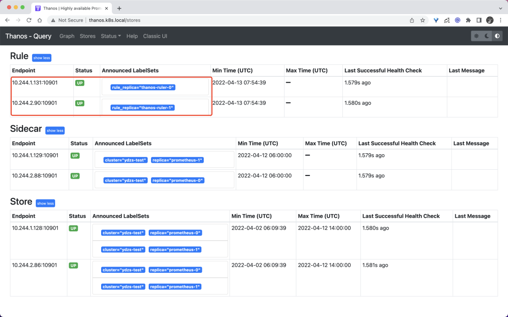
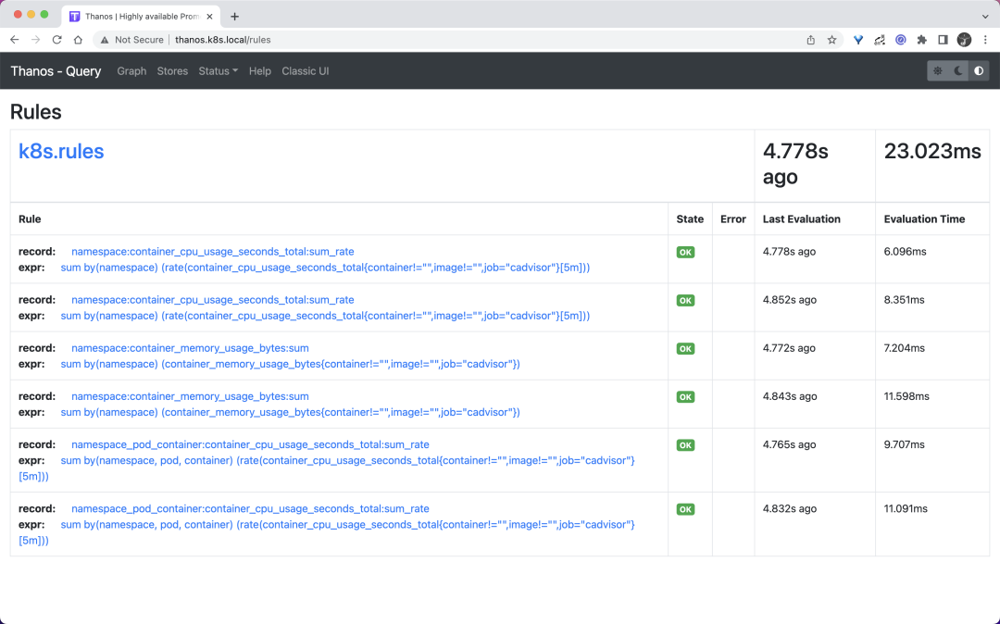
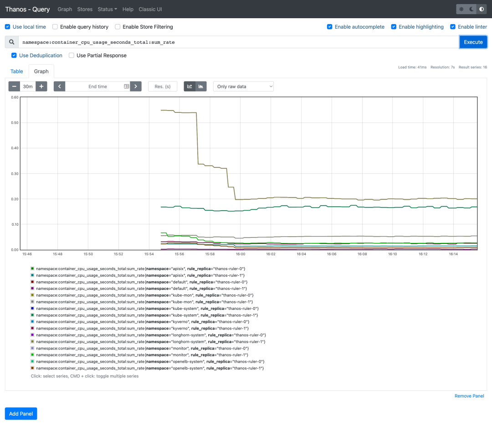
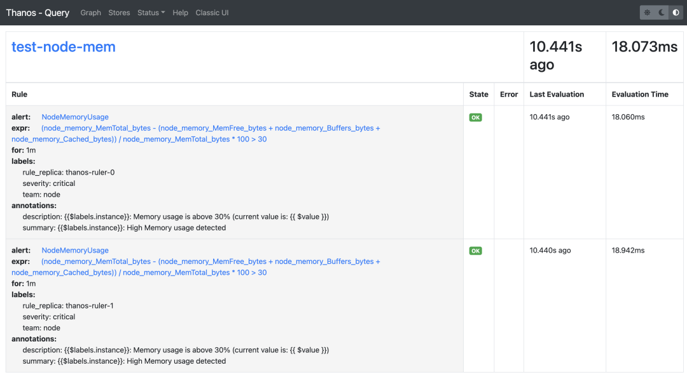
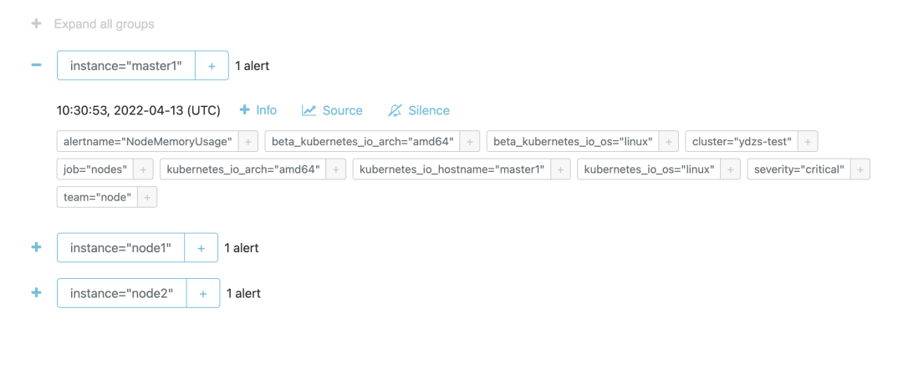

# **Thanos Ruler 组件的使用**

Thano Ruler 组件是用于评估 Prometheus 的记录规则和报警规则的组件，其本身不会抓取 metrics 接口数据，而是通过 Query API 从 query 组件定期地获取指标数据，如果配置了多个 query 地址，则会采用轮询方式获取。


其中记录规则评估生成的数据会保存在本地，并且定期地扫描本地生成的 TSDB 数据块上传到对象存储桶中作为历史数据长期保存。同时也实现了 Store API 可用于查询本地保存的数据。与 Prometheus 节点类似，每个 ruler 节点都使用独立的存储，可以同时运行多个副本，而且需要为每个副本实例分配不同的标签以作区分，因为 store 组件在查询对象存储中的历史数据时是以该标签进行分组查询的。

## **安装**

由于 ruler 组件也实现了 Store API，所以我们也可以直接将该组件对接到 store 组件中去，只需要给创建的 Pod 带上 `thanos-store-api: "true"` 这个标签即可（Service 会进行自动关联）被 query 组件服务发现。

**<mark>整体上我们可以把 ruler 节点理解为一个简单的 Prometheus 节点，只是不需要 thanos sidecar，不抓取指标数据，只负责执行 PromQL 查询，由于本身会保留独立的存储，所以同样这里我们需要做数据的持久化。</mark>**

然后可以通过部署两个副本来实现高可用，

* 这里我们添加了一个 `--label=rule_replica` 标签来给数据添加一个 `rule_replica` 的标签, 
* 同时指定 `--alert.label-drop` 为 `rule_replica`，这样在触发告警发送通知给 AlertManager 时可以去掉这个 label，以便让 AlertManager 自动去重，可以避免重复告警。


然后通过 `--query` 参数指定 query 组件地址，我们这里还是使用 DNS SRV 来做服务发现，这样就可以从查询组件中获取指标数据了。

ruler 同样也需要对象存储的配置，用于上传计算出的数据到对象存储，所以要挂载对象存储的配置文件。`--rule-file` 参数可以用来指定挂载的 rule 配置，`ruler` 组件会根据配置来生成数据和触发报警。

完整的资源清单文件如下所示：

```
# thanos-ruler.yaml
apiVersion: apps/v1
kind: StatefulSet
metadata:
  name: thanos-ruler
  namespace: kube-mon
  labels:
    app: thanos-ruler
spec:
  replicas: 2
  selector:
    matchLabels:
      app: thanos-ruler
  serviceName: thanos-rule
  podManagementPolicy: Parallel
  template:
    metadata:
      labels:
        app: thanos-ruler
        thanos-store-api: "true"
    spec:
      affinity:
        podAntiAffinity:
          preferredDuringSchedulingIgnoredDuringExecution:
            - weight: 100
              podAffinityTerm:
                topologyKey: kubernetes.io/hostname
                labelSelector:
                  matchExpressions:
                    - key: app
                      operator: In
                      values:
                        - thanos-ruler
      containers:
      - name: thanos-ruler
        image: thanosio/thanos:v0.25.1
        args:
        - rule
        - --grpc-address=0.0.0.0:10901
        - --http-address=0.0.0.0:10902
        - --rule-file=/etc/thanos/rules/*rules.yaml
        - --objstore.config-file=/etc/secret/thanos.yaml
        - --data-dir=/var/thanos/rule
        - --label=rule_replica="$(NAME)"
        - --alert.label-drop=rule_replica
        - --query=dnssrv+_http._tcp.thanos-querier.kube-mon.svc.cluster.local
        ports:
        - containerPort: 10901
          name: grpc
        - containerPort: 10902
          name: http
        env:
        - name: NAME
          valueFrom:
            fieldRef:
              fieldPath: metadata.name
        livenessProbe:
          httpGet:
            path: /-/healthy
            port: 10902
            scheme: HTTP
        readinessProbe:
          httpGet:
            path: /-/ready
            port: 10902
            scheme: HTTP
        volumeMounts:
        - mountPath: /var/thanos/rule
          name: data
          readOnly: false
        - name: object-storage-config
          mountPath: /etc/secret
          readOnly: false
        - name: thanos-rules
          mountPath: /etc/thanos/rules
      volumes:
      - name: object-storage-config
        secret:
          secretName: thanos-objectstorage
      - name: thanos-rules
        configMap:
          name: thanos-rules
  volumeClaimTemplates:
  - metadata:
      name: data
    spec:
      accessModes:
      - ReadWriteOnce
      storageClassName: longhorn
      resources:
        requests:
          storage: 1Gi
```

要注意上面挂载的对象存储配置的 Secret，另外还需要通过一个 ConfigMap 来配置 rules 规则：

```
# thanos-rules-config.yaml
apiVersion: v1
kind: ConfigMap
metadata:
  name: thanos-rules
  namespace: kube-mon
data:
  record.rules.yaml: |-
    groups:
    - name: k8s.rules
      rules:
      - expr: |
          sum(rate(container_cpu_usage_seconds_total{job="cadvisor", image!="", container!=""}[5m])) by (namespace)
        record: namespace:container_cpu_usage_seconds_total:sum_rate
      - expr: |
          sum(container_memory_usage_bytes{job="cadvisor", image!="", container!=""}) by (namespace)
        record: namespace:container_memory_usage_bytes:sum
      - expr: |
          sum by (namespace, pod, container) (
            rate(container_cpu_usage_seconds_total{job="cadvisor", image!="", container!=""}[5m])
          )
        record: namespace_pod_container:container_cpu_usage_seconds_total:sum_rate
``` 
 
这里我们简单配置了几个记录规则，配置方式和之前的规则一样的。然后直接创建上面的资源对象即可：

```
☸ ➜ kubectl apply -f https://p8s.io/docs/thanos/manifests/thanos-rules-config-0.yaml 
☸ ➜ kubectl apply -f https://p8s.io/docs/thanos/manifests/thanos-ruler-0.yaml 
☸ ➜ kubectl get pods -n kube-mon -l app=thanos-ruler
NAME             READY   STATUS    RESTARTS   AGE
thanos-ruler-0   1/1     Running   0          16m
thanos-ruler-1   1/1     Running   0          16m
```

部署完成后我们可以去查看 query 组件页面的 store 信息是否包含上面的 ruler 实例：




同样在 rules 页面可以看到我们定义的记录规则信息：





现在我们可以尝试去查询下上面的记录规则，比如查询 

`namespace:container_cpu_usage_seconds_total:sum_rate`：



可以看到可以正常获取到这条记录规则的数据。

## **对接告警**

如果要进行报警，首先我们需要通过启动参数 `--alertmanagers.url` 来指定 Alertmanager 的地址，如果需要更高级的配置，可以通过启动参数 `--alertmanagers.config` 或者 `--alertmanagers.config-file` 来指定对接 `Alertmanager` 的配置，格式如下所示：

```
alertmanagers:
- http_config:
    basic_auth:
      username: ""
      password: ""
      password_file: ""
    bearer_token: ""
    bearer_token_file: ""
    proxy_url: ""
    tls_config:
      ca_file: ""
      cert_file: ""
      key_file: ""
      server_name: ""
      insecure_skip_verify: false
  static_configs: []
  file_sd_configs:
  - files: []
    refresh_interval: 0s
  scheme: http
  path_prefix: ""
  timeout: 10s
  api_version: v1
```

比如我们这里对接前面章节中的 Alertmanager，则直接这上面的资源对象容器启动参数中增加 `- --alertmanagers.url=http://alertmanager:9093` 即可。然后在上面的 thanos-rules 的 ConfigMap 中新增一个 `alert.rules.yaml` 的配置，用来配置报警规则，如下所示：

```
# thanos-rules-config.yaml
apiVersion: v1
kind: ConfigMap
metadata:
  name: thanos-rules
  namespace: kube-mon
data:
  record.rules.yaml: |-
  # ......
  alert.rules.yaml: |-
    groups:
    - name: test-node-mem
      rules:  
      - alert: NodeMemoryUsage  
        expr: (node_memory_MemTotal_bytes - (node_memory_MemFree_bytes + node_memory_Buffers_bytes + node_memory_Cached_bytes)) / node_memory_MemTotal_bytes * 100 > 30
        for: 1m
        labels:
          team: node
          severity: critical
        annotations:
          summary: "{{$labels.instance}}: High Memory usage detected"
          description: "{{$labels.instance}}: Memory usage is above 30% (current value is: {{ $value }})"
```

直接更新上面的两个资源对象即可：

```
☸ ➜ kubectl apply -f https://p8s.io/docs/thanos/manifests/thanos-rules-config.yaml 
☸ ➜ kubectl apply -f https://p8s.io/docs/thanos/manifests/thanos-ruler.yaml
```

更新完成后这 query 的 rules 页面也可以看到上面新增的报警规则了，因为我们部署的是两个副本，所以能看到两条一样的规则：



由于我们这 ruler 组件启动参数中配置了参数 `- --alert.label-drop=rule_replica`，所以 Alertmanager 中不会收到重复报警，不过需要注意的是经测试这里的 `rule_replica` 不能加引号，加上引号会去重失效，我们可以前往 Alertmanager 查看触发的报警信息：




由于 ruler 组件获取评估数据的路径是 `ruler --> query --> sidecar --> prometheus`，需要经整个查询链条，这也提升了发生故障的风险，而且评估原本就可以在 Prometheus 中进行，所以在非必要的情况下更加推荐使用原本的 Prometheus 方式来做报警和记录规则的评估。