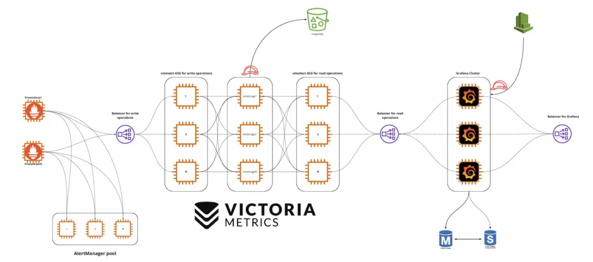

# **1 Prometheus 远程存储 VictoriaMetrics 简介**

VictoriaMetrics 是一个快速、经济高效且可扩展的监控解决方案和时间序列数据库，不仅可以作为 Prometheus 的远程存储，还可以使用其组件完全替换 Prometheus。




它主要有以下特性:

* 支持 Prometheus querying API,Graphite API. 可以在 Grafana 中直接使用
* 实现了基于 PromQL 的查询语言 - MetricsQL, 提供了一些高级功能
* 提供了全局视图，支持多个 Prometheus 实例或任何其他数据源同时向 VictoriaMetrics 写入数据，查询时数据可以保证唯一
* 占用资源少，且高性能.

* 支持多种方式获取 metrics. 如:

	* **`file_sd_config`**
	* **`kubernetes_sd_config`**
	* **`consul_sd_config`**
	* 从 exporter 直接获取，与 prometheus 完全兼容。**除 `static_config` 外，还支持多种服务发现方式**，如: 
		* 通过 Prometheus 远程写入
		* 通过 Post 请求将指定 JSON 格式的数据直接写入


## **单机模式**

单机模式比较简单，直接下载二进制或 Docker 镜像 并使用指定的命令行启动.

单机模式可能用到的组件.

```
- victoria-metrics: metrics 数据抓取或存储
- vmalert: 按照指定的规则将 metrics 数据聚合或向 alertmanager 发送告警
- vmauth: 启用用户认证功能
```

以二进制为例，可以通过

* `-storageDataPath` 参数指定数据存储的目录。默认为 `victoria-metrics-data`
* `-retentionPeriod` 参数指定数据保存的时长。默认为 1 month
* `-httpListenAddr `参数指定监听的 HTTP 套接字。默认为 :8428
* `-loggerTimezon` 参数指定日志的时区，默认为 UTC. 建议设置为 Asia/Shanghai
* `-maxInsertRequestSize` 参数限制 `Prometheus remote_write API` 的请求大小。默认为 33554432 byte. 支持可选的单位为 KB, MB, GB, KiB, MiB, GiB
* `-promscrape.config` 参数指定 Prometheus 配置文件路径。该配置文件只需要包含 `scrape_configs` 部分配置即可.(经测试 `VictoriaMetrics` 支持` scrape_configs` 中的 `relabel_configs` 和 `metric_relabel_configs` )
* `-promscrape.config.strictParse` 参数设置是否会严格校验 `-promscrape.config` 指定的配置文件。默认情况下，不支持的字段会跳过，兼容 Prometheus 的配置文件
* `-promscrape.configCheckInterval` 参数设置检查 Prometheus 配置文件是否变更的时间间隔。若变更，则重新加载。默认关闭
* `-relabelConfig` 参数指定 relabel 的规则.
* `-relabelDebug` 参数指定日志中是否指定 relabel 前后的 metrics. 多用于调试.
* `-selfScrapeInstance` 参数设置抓取自身 metrics 时，instance 标签的值。默认 self
* `-selfScrapeInterval` 参数设置抓取自身 metrics 的时间间隔
* `-selfScrapeJob` 参数设置设置抓取自身 metrics 时，instance 标签的值。默认 `victoria-metrics`

从参数看来，单机模式下的 VictoriaMetrics 可以

作为 Prometheus 的远程存储

启动 VictoriaMetrics 脚本如下:

```
# start_VictoriaMetrics.sh
cd ${victoria-metrics-home}
./victoria-metrics \
  -storageDataPath <storageDataPath> \
  -retentionPeriod <dataKeepTime> \
  -maxInsertRequestSize <req_size> \
  -httpListenAddr <IP:port> \
  -loggerTimezon Asia/Shanghai &> victoria-metrics.log &
```

Prometheus 远程写入相关配置如下:

```
# prometheus.yml
# ...
remote_write:
  - url: http://<victoriametrics-addr>:8428/api/v1/write
```

* 指定 `promscrape.config` 直接抓取并存储 metrics.

这种方式启动与作为远程存储启动方式基本与存储方式大同小异，只需要指定对应配置文件即可。在直接抓取 metrics 过程中，`VictoriaMetrics` 需要一些其他的组件去实现 Prometheus 中的功能。比如

* Prometheus 中规则 (包括 metrics 聚合规则与告警规则) 需要 vmalert 组件来实现。且 `vmalert` 只是发送告警到 `Alertmanager.vmalert` 支持的规则与 Prometheus 的规则一致。有关 vmalert 的使用，参见官方文档
* Prometheus 中认证相配置 需要 vmauth 组件来实现，参见官方文档

```
cd ${victoria-metrics-home}

./victoria-metrics \
  -storageDataPath <storageDataPath> \
  -retentionPeriod <dataKeepTime> \
  -maxInsertRequestSize <req_size> \
  -httpListenAddr <metrics_IP:port> \
  -promscrape.config <prometheus.yml> \
  -promscrape.configCheckInterval 1m \
  -loggerTimezon Asia/Shanghai &> victoria-metrics.log &

./vmalert \
  -httpListenAddr ":8880" \
  -rule <record_rule_file or alert_rule_file> \
  -datasource.url <metrics_IP:port> \
  -notifier.url <AlertManager URL> \ # AlertManager URL
  -remoteWrite.url <metrics_IP:port> \ # 聚合后的 metrics 写入的位置,一般为 victoria-metrics 的端口
  -remoteRead.url <metrics_IP:port> \
  -external.label <key=value> # 为聚合后的 metrics 添加标签

./vmauth \
  -httpListenAddr ":8427" \
  -auth.config <auth_config>
```

为了加强数据的安全性，可以将 `victoria-metrics` 存储监听在 localhost. 启用 auth. 配置一些自定义用户信息. vmauth 配置文件示例如下. Grafana 可使用该用户获取数据.

## **集群模式**

VictoriaMetrics 集群模式相对来说比较复杂。主要由 vmstorage ,vminsert,vmselect 三部分组成，这三个组件每个组件都可以单独进行扩展。其中:

* vmstorage 负责提供数据存储服务
* vminsert 是数据存储 vmstorage 的代理，使用一致性 hash 算法进行写入分片
* vmselect 负责数据查询，根据输入的查询条件从 vmstorage 中查询数据

vmstorage 采用 shared-nothing 架构，优点是 vmstorage 的节点相互之间无感知，相互之间无需通信，不共享任何数据，增加了集群的可用性，简化了集群的扩展的难度与运维工作.

### **特性**

VictoriaMetrics 集群模式支持

**1 性能和容量水平扩展**

* vminsert 和 vmselect 是无状态的。可以随时添加 / 删除。添加更多的 vminsert 和 vmselect 节点可以扩展数据写入与查询的效率
* vmstorage 节点保存抓取的数据，因此无法在不丢失数据的情况下删除它们。添加更多 vmstorage 节点可扩展集群容量。添加 vmstorage 的步骤如下:
	1. 使用与集群中现有节点相同的 `-retentionPeriod` 启动新的 vmstorage 节点
	2. 使用包含 `<new_vmstorage_host>` 的新 `-storageNode` 参数逐渐重新启动所有 `vmselect` 节点
	3. 使用包含 `<new_vmstorage_host>` 的新 `-storageNode` 参数逐渐重新启动所有 `vminsert` 节点

**支持时间序列数据的多个名称空间 (租户). 多个租户之间相互隔离**

VictoriaMetrics 集群支持多个独立的租户。租户由 accountID 或 `accountID:projectID `标识，他们放在 url 中。如 

`http://<vminsert>:8480/insert/<accountID>/<suffix>,http://<vmselect>:8481/select/<accountID>/prometheus/<suffix>`.  等.

* 每个 accountID 和 projectID 由范围 `[0 .. 2^32) ` 中的任意 32 位整数标识。如果不指定，则默自动分配为 0.
* 当第一个数据点写入给定租户时，会自动创建租户
* 所有租户的数据均匀分布在可用的 vmstorage 节点中。这保证了当不同租户具有不同的数据量和不同的查询负载时，vmstorage 节点之间的负载均匀
* 数据库性能依赖于租户的数量，主要取决于所有租户中活动的时间序列的总数.
* VictoriaMetrics 不支持在单个请求中查询多个租户

**支持数据副本**

默认情况下，VictoriaMetrics 将副本写入到 -storageDataPath 指向的底层存储.

可以通过 vminsert 指定 `-replicationFactor=N` 标志位来启用数据副本。这保证在最多 N-1 个 vmstorage 节点不可用时，所有数据扔可用于查询。集群必须至少包含 2*N-1 个 vmstorage 节点.

启用复制后，vmselect 必须指定 `-dedup.minScrapeInterval=1ms` 命令行标志.

### **快速部署**

使用 3 个节点部署相关服务。节点 IP 分别为 IP1, IP2, IP3

在每个节点上运行如下脚本来启动 vmstroage,vminsert,vmselect

```
#!/bin/bash

victoria_home="/data1/victoria-metrics"
bin=${victoria_home}/bin
conf=${victoria_home}/conf
data=${victoria_home}/data
log=${victoria_home}/log

LOG_LEVEL=INFO
TIMEZONE="Asia/Shanghai"

cd ${victoria_home}

${bin}/vmstorage-prod \
  -httpListenAddr "nodeIP:8482" \
  -storageDataPath ${data} \
  -retentionPeriod 30d \
  -vminsertAddr "nodeIP:8400" \  # insert 端口,由 vminsert 连接
  -vmselectAddr "nodeIP:8401" \   # select 端口,由 vmselect 连接
  -loggerTimezone ${TIMEZONE} \
  -loggerLevel ${LOG_LEVEL} &> ${log}/storage.log &

${bin}/vminsert-prod \
  -httpListenAddr "nodeIP:8480" \
  -storageNode IP1:8400,IP2:8400,IP3:8400 \
  -loggerTimezone ${TIMEZONE} \
  -loggerLevel ${LOG_LEVEL} &> ${log}/insert.log &

${bin}/vmselect-prod \
  -httpListenAddr "nodeIP:8481" \
  -selectNode IP1:8481,IP2:8481,IP3:8481 \
  -storageNode IP1:8401,IP2:8401,IP3:8401 \
  -loggerTimezone ${TIMEZONE} \
  -loggerLevel ${LOG_LEVEL} &> ${log}/select.log &
```

启动后，可以分别配置 Prometheus 和 Grafana 对 metrics 数据写入读取。详见官方文档

```
# prometheus.yml
remote_write:
  - url: "http://<vminsert>:8480/insert/<accountID>/<suffix>"
   # accountID 默认为 0
   # suffix 可以为 `prometheus` 或 `prometheus/api/v1/write`
    write_relabel_configs:
      - source_labels: [__name__]
        regex: 'go_.*'
        action: drop
```

Grafana 数据源地址可配置为 `http://<vmselect>:8481/select/<accountID>/prometheus`. 此时 accountID 必须与 prometheus.yml 中配置的 accountID 一致.

最后可使用 vmauth 对数据读取时进行验证，保证数据安全性.
