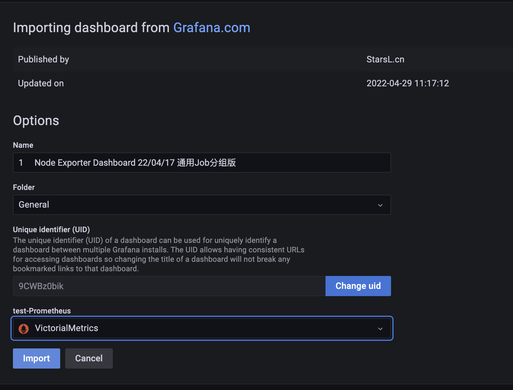
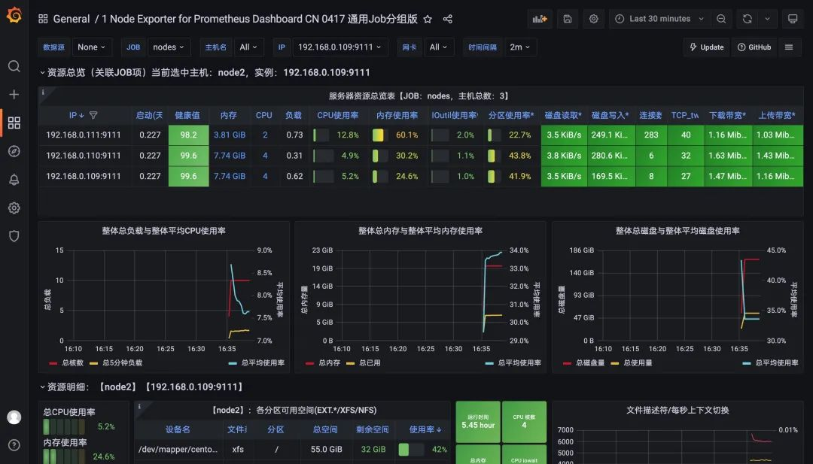

# **3 VictorialMetrics 集群模式的使用**


单节点版本可根据 CPU 内核、RAM 和可用存储空间的数量进行扩展。单节点版本比集群版本更容易配置和操作，所以在使用集群版本之前要三思而后行。上面我们介绍了 VM 的单节点版本的基本使用，接下来我们来介绍下如何使用集群版。

集群版主要特点：

* 支持单节点版本的所有功能。
* 性能和容量水平扩展。
* 支持时间序列数据的多个独立命名空间（多租户）。
* 支持多副本。

## **Node-Exporter**

```
---
apiVersion: apps/v1
kind: DaemonSet
metadata:
  name: node-exporter
  namespace: kube-vm
  labels:
    k8s-app: node-exporter
spec:
  selector:
    matchLabels:
      k8s-app: node-exporter
  template:
    metadata:
      labels:
        k8s-app: node-exporter
    spec:
      containers:
      - image: prom/node-exporter
        name: node-exporter
        ports:
        - containerPort: 9100
          protocol: TCP
          name: http
---
apiVersion: v1
kind: Service
metadata:
  labels:
    k8s-app: node-exporter
  name: node-exporter
  namespace: kube-vm
spec:
  ports:
  - name: http
    port: 9100
    targetPort: 9100
    protocol: TCP
  selector:
    k8s-app: node-exporter
```

```
$ kubectl apply -f cluster-prom-nodexpo.yaml 
daemonset.apps/node-exporter created
service/node-exporter created
```

## **组件**

前面我们了解了 VM 的基本架构，对于集群模式下主要包含以下几个服务：

* vmstorage：存储原始数据并返回指定标签过滤器在给定时间范围内的查询数据，当 `-storageDataPath` 指向的目录包含的可用空间少于 `-storage.minFreeDiskSpaceBytes` 时，`vmstorage` 节点会自动切换到只读模式，`vminsert` 节点也会停止向此类节点发送数据并开始将数据重新路由到剩余的 vmstorage 节点。
* `vminsert`：接受摄取的数据并根据指标名称及其所有标签的一致性哈希将其分散存储到 `vmstorage` 节点。
* **vmselect：通过从所有配置的 `vmstorage` 节点获取所需数据来执行查询**。

每个服务都可以进行独立扩展，vmstorage 节点之间互不了解、互不通信，并且不共享任何数据。这样可以增加集群的可用性，并且简化了集群的维护和扩展。最小的集群必须包含以下节点：

* 带有 `-retentionPeriod`  和 `-storageDataPath` 参数的单 `vmstorage` 节点
* 带有 `-storageNode=<vmstorage_host>` 的单 vminsert 节点
* 带有 `-storageNode=<vmstorage_host>` 的单 vmselect 节点

但是我们建议为每个服务组件运行至少两个节点以实现高可用性，这样当单个节点暂时不可用时，集群会继续工作，而且其余节点还可以处理增加的工作负载。

**如果你的集群规模较大，那么可以运行多个小型的 vmstorage 节点，因为这样可以在某些 vmstorage 节点暂时不可用时减少剩余 vmstorage 节点上的工作负载增加。**

各个服务除了可以通过参数标志进行配置之外，也可以通过环境变量的方式进行配置：

* `-envflag.enable` 标志必须设置
* 每个标志中的 `.` 必须替换为 `_`，例如 `-insert.maxQueueDuration <duration>` 可以转换为 `insert_maxQueueDuration=<duration>`
* 对于重复的标志，可以使用另一种语法，通过使用 `, ` 作为分隔符将不同的值连接成一个，例如 `-storageNode <nodeA> -storageNode <nodeB>` 将转换为 `-storageNode=<nodeA>,<nodeB>`
* 可以使用 `-envflag.prefix` 为环境变量设置前缀，例如设置了 `-envflag.prefix=VM*`，则环境变量参数必须以 `VM*` 开头

### **多租户**

**VM 集群也支持多个独立的租户（也叫命名空间），租户由 `accountID` 或 `accountID:projectID` 来标识，它们被放在请求的 urls 中**。


* 每个 `accountID` 和 `projectID` 都由一个 `[0 .. 2^32]` 范围内的任意 32 位整数标识，如果缺少 projectID，则自动将其分配为 0。有关租户的其他信息，例如身份验证令牌、租户名称、限额、计费等，将存储在一个单独的关系型数据库中。此数据库必须由位于 VictoriaMetrics 集群前面的单独服务管理，例如 `vmauth` 或 `vmgateway`。
* 当第一个数据点写入指定租户时，租户被自动创建。
* 所**有租户的数据均匀分布在可用的 vmstorage 节点中，当不同租户有不同的数据量和不同的查询负载时，这保证了 vmstorage 节点之间的均匀负载**。
* 数据库性能和资源使用不依赖于租户的数量，它主要取决于所有租户中活跃时间序列的总数。如果一个时间序列在过去一小时内至少收到一个样本，或者在过去一小时内被查询，则认为时间序列是活跃的。
* **VictoriaMetrics 不支持在单个请求中查询多个租户**。

### **集群扩展**

VM 集群的性能和容量可以通过两种方式进行扩展：

* 通过向集群中的现有节点添加更多资源（CPU、RAM、磁盘 IO、磁盘空间、网络带宽），也叫垂直可扩展性。
* 通过向集群添加更多节点，又叫水平扩展性。


对于集群扩展有一些通用的建议：


* 向现有 vmselect 节点添加**更多 CPU 和内存**，可以提高复杂查询的性能，这些查询可以处理大量的时间序列和大量的原始样本。
* **添加更多 vmstorage 节点可以增加集群可以处理的活跃时间序列的数量**，这也提高了对高流失率(churn rate)的时间序列的查询性能。集群稳定性也会随着 vmstorage 节点数量的增加而提高，当一些 vmstorage 节点不可用时，活跃的 vmstorage 节点需要处理较低的额外工作负载。
* **向现有 vmstorage 节点添加更多 CPU 和内存，可以增加集群可以处理的活跃时间序列的数量**。与向现有 vmstorage 节点添加更多 CPU 和内存相比，最好添加更多 vmstorage 节点，因为更多的 vmstorage 节点可以提高集群稳定性，并提高对高流失率的时间序列的查询性能。
* **添加更多的 vminsert 节点会提高数据摄取的最大速度，因为摄取的数据可以在更多的 vminsert 节点之间进行拆分**。


### **集群可用性**

* **HTTP 负载均衡器需要停止将请求路由到不可用的 vminsert 和 vmselect 节点**。
* 如果至少存在一个 vmstorage 节点，则集群仍然可用：
	* **vminsert 将传入数据从不可用的 vmstorage 节点重新路由到健康的 vmstorage 节点**
	* **如果至少有一个 vmstorage 节点可用，则 vmselect 会继续提供部分响应**。如果优先考虑可用性的一致性，则将 `-search.denyPartialResponse` 标志传递给 vmselect 或将请求中的 `deny_partial_response=1` 查询参数传递给 vmselect。

### **去重**


如果 `-dedup.minScrapeInterval` 命令行标志设置为大于 0 的时间，`VictoriaMetrics` 会去除重复数据点。例如，`-dedup.minScrapeInterval=60s `将对同一时间序列上的数据点进行重复数据删除，如果它们位于同一离散的 60 秒存储桶内，最早的数据点将被保留。在时间戳相等的情况下，将保留任意数据点。

**`-dedup.minScrapeInterval ` 的推荐值是等于 Prometheus 配置中的 `scrape_interval` 的值，建议在所有抓取目标中使用一个 `scrape_interval` 配置。**

如果 HA 中多个相同配置的 vmagent 或 Prometheus 实例将数据写入同一个 VictoriaMetrics 实例，则重复数据删除会减少磁盘空间使用。这些 vmagent 或 Prometheus 实例在其配置中必须具有相同的 external_labels 部分，因此它们将数据写入相同的时间序列。

### **容量规划**

集群容量随着可用资源的增加而线性扩展，每个节点类型所需的 CPU 和内存数量很大程度上取决于工作负载 - 活跃时间序列的数量、序列流失率、查询类型、查询 QPS 等。建议为你的生产工作负载部署一个测试的 VictoriaMetrics 集群，并反复调整每个节点的资源和每个节点类型的节点数量，直到集群变得稳定。同样也建议为集群设置监控，有助于确定集群设置中的瓶颈问题。

指定保留所需的存储空间（可以通过 vmstorage 中的 `-retentionPeriod` 命令行标志设置）可以从测试运行中的磁盘空间使用情况推断出来。例如，如果在生产工作负载上运行一天后的存储空间使用量为 10GB，那么对于 `-retentionPeriod=100d`（100 天保留期）来说，它至少需要 `10GB*100=1TB` 的磁盘空间。可以使用 VictoriaMetrics 集群的官方 Grafana 仪表板([https://grafana.com/grafana/dashboards/11176](https://grafana.com/grafana/dashboards/11176))监控存储空间使用情况。

建议留出以下数量的备用资源。

* 所有节点类型中 50% 的空闲内存，以减少工作负载临时激增时因为 OOM 崩溃的可能性。
* 所有节点类型中 50% 的空闲 CPU，以减少工作负载临时高峰期间的慢速概率。
* vmstorage 节点上 `-storageDataPath` 命令行标志指向的目录中至少有 30% 的可用存储空间。

VictoriaMetrics 集群的一些容量规划技巧：


* 副本集将集群所需的资源量最多增加 N 倍，其中 N 是复制因子。
* 可以通过添加更多 vmstorage 节点和/或通过增加每个 vmstorage 节点的内存和 CPU 资源来增加活跃时间序列的集群容量。
* 可以通过增加 vmstorage 节点的数量和/或通过增加每个 vmselect 节点的内存和 CPU 资源来减少查询延迟。
* 所有 vminsert 节点所需的 CPU 内核总数可以通过摄取率计算：`CPUs = ingestion_rate / 100K`。
* vminsert 节点上的 `-rpc.disableCompression` 命令行标志可以增加摄取容量，但代价是 **vminsert** 和 **vmstorage** 之间的网络带宽使用率会更高。


### **副本和数据安全**

默认情况下，VictoriaMetrics 的数据复制依赖 `-storageDataPath` 指向的底层存储来完成。

**但是我们也可以手动通过将 `-replicationFactor=N` 命令参数传递给 vminsert 来启用复制，这保证了如果多达 N-1 个 `vmstorage` 节点不可用，所有数据仍可用于查询。集群必须至少包含 `2*N-1` 个 vmstorage 节点，其中 N 是复制因子，以便在 `N-1` 个存储节点丢失时为新摄取的数据维持指定的复制因子。**

例如，当 `-replicationFactor=3` 传递给 vminsert 时，它将所有摄取的数据复制到 3 个不同的 `vmstorage` 节点，因此最多可以丢失 2 个 vmstorage 节点而不会丢失数据。

`vmstorage` 节点的最小数量应该等于 `2*3-1 = 5`，因此当 2 个 `vmstorage` 节点丢失时，剩余的 3 个 vmstorage 节点可以为新摄取的数据提供服务。

启用复制后，必须将 `-dedup.minScrapeInterval=1ms` 命令行标志传递给 `vmselect` 节点，当多达 N-1 个 vmstorage 节点响应缓慢和/或暂时不可用时，可以将可选的 `-replicationFactor=N` 参数传递给 `vmselect` 以提高查询性能，因为 `vmselect` 不等待来自多达 `N-1` 个 vmstorage 节点的响应。有时，vmselect 节点上的 `-replicationFactor` 可能会导致部分响应。`-dedup.minScrapeInterval=1ms` 在查询期间对复制的数据进行重复数据删除，如果重复数据从配置相同的 vmagent 实例或 Prometheus 实例推送到 VictoriaMetrics，则必须根据重复数据删除文档将 `-dedup.minScrapeInterval` 设置为更大的值。


请注意，复制不会从灾难中保存，因此建议执行定期备份。另外 复制会增加资源使用率 - CPU、内存、磁盘空间、网络带宽 - 最多 -replicationFactor 倍。所以可以将复制转移 -storageDataPath 指向的底层存储来做保证，例如 Google Compute Engine 永久磁盘，该磁盘可以防止数据丢失和数据损坏，它还提供始终如一的高性能，并且可以在不停机的情况下调整大小。对于大多数用例来说，基于 HDD 的永久性磁盘应该足够了。

### **备份**

建议从即时快照执行定期备份，以防止意外数据删除等错误。必须为每个 vmstorage 节点执行以下步骤来创建备份：

* 可以通过访问 `/snapshot/create` 这个 HTTP handler 来创建即时快照，它将创建快照并返回其名称。
* 使用 vmbackup 组件从 `<-storageDataPath>/snapshots/<snapshot_name>` 文件夹归档创建的快照。归档过程不会干扰 vmstorage 工作，因此可以在任何合适的时间执行。
* 通过 `/snapshot/delete?snapshot=<snapshot_name>` 或 `/snapshot/delete_all` 删除未使用的快照，以释放占用的存储空间。
* 无需在所有 vmstorage 节点之间同步备份。

从备份恢复：

* 使用 kill -INT 停止 vmstorage 节点。
* 使用 `vmrestore` 组件将备份中的数据还原到 `-storageDataPath` 目录。
* 启动 `vmstorage` 节点。


在了解了 VM 集群的一些配置细节后，接下来我们就来开始部署 VM 集群。

## **部署**

如果你已经对 VM 组件非常了解了，那么推荐使用 Helm Chart 的方式进行一键安装。

```

☸ ➜ helm repo add vm https://victoriametrics.github.io/helm-charts/
☸ ➜ helm repo update
# 导出默认的 values 值到 values.yaml 文件中
☸ ➜ helm show values vm/victoria-metrics-cluster > values.yaml
# 根据自己的需求修改 values.yaml 文件配置
# 执行下面的命令进行一键安装
☸ ➜ helm install victoria-metrics vm/victoria-metrics-cluster -f values.yaml -n NAMESPACE
# 获取 vm 运行的 pods 列表
☸ ➜ kubectl get pods -A | grep 'victoria-metrics'
```

我们这里选择手动方式进行部署，之所以选择手动部署的方式是为了能够了解各个组件的更多细节。

**由于 vmstorage 组件是无状态的，这里我们先使用 StatefulSet 进行部署，由于该组件也是可以进行扩展的，这里我们首先部署两个副本，**对应的资源清单如下所示：

```
# cluster-vmstorage.yaml
apiVersion: v1
kind: Service
metadata:
  name: cluster-vmstorage
  namespace: kube-vm
  labels:
    app: vmstorage
spec:
  clusterIP: None
  ports:
    - port: 8482
      targetPort: http
      name: http
    - port: 8401
      targetPort: vmselect
      name: vmselect
    - port: 8400
      targetPort: vminsert
      name: vminsert
  selector:
    app: vmstorage
---
apiVersion: apps/v1
kind: StatefulSet
metadata:
  name: vmstorage
  namespace: kube-vm
  labels:
    app: vmstorage
spec:
  serviceName: cluster-vmstorage
  selector:
    matchLabels:
      app: vmstorage
  replicas: 2
  podManagementPolicy: OrderedReady
  template:
    metadata:
      labels:
        app: vmstorage
    spec:
      containers:
        - name: vmstorage
          image: "victoriametrics/vmstorage:v1.77.0-cluster"
          imagePullPolicy: "IfNotPresent"
          args:
            - "--retentionPeriod=1"
            - "--storageDataPath=/storage"
            - --envflag.enable=true
            - --envflag.prefix=VM_
            - --loggerFormat=json
          ports:
            - name: http
              containerPort: 8482
            - name: vminsert
              containerPort: 8400
            - name: vmselect
              containerPort: 8401
          livenessProbe:
            failureThreshold: 10
            initialDelaySeconds: 30
            periodSeconds: 30
            tcpSocket:
              port: http
            timeoutSeconds: 5
          readinessProbe:
            failureThreshold: 3
            initialDelaySeconds: 5
            periodSeconds: 15
            timeoutSeconds: 5
            httpGet:
              path: /health
              port: http
          volumeMounts:
            - name: storage
              mountPath: /storage
  volumeClaimTemplates:
    - metadata:
        name: storage
      spec:
        storageClassName: hostpath
        accessModes:
          - ReadWriteOnce
        resources:
          requests:
            storage: "1Gi"
 ```
 
 首先需要创建一个 Headless 的 Service，因为后面的组件需要访问到每一个具体的 Pod，在 vmstorage 启动参数中通过 `--retentionPeriod` 参数指定指标数据保留时长，1 表示一个月，这也是默认的时长，然后通过 `--storageDataPath` 参数指定了数据存储路径，记得要将该目录进行持久化。
 
 ```
$ kubectl apply -f cluster-vmstorage.yaml 
service/cluster-vmstorage created
statefulset.apps/vmstorage created
```
 
```
 $ kubectl get pod -n kube-vm
NAME          READY   STATUS    RESTARTS   AGE
vmstorage-0   1/1     Running   0          31s
```

同样直接应用该资源即可：

```
☸ ➜ kubectl apply -f https://p8s.io/docs/victoriametrics/manifests/cluster-vmstorage.yaml
☸ ➜ kubectl get pods -n kube-vm -l app=vmstorage
NAME          READY   STATUS    RESTARTS   AGE
vmstorage-0   1/1     Running   0          5m40s
vmstorage-1   1/1     Running   0          3m31s
☸ ➜ kubectl get svc -n kube-vm -l app=vmstorage
NAME                TYPE        CLUSTER-IP   EXTERNAL-IP   PORT(S)                      AGE
cluster-vmstorage   ClusterIP   None         <none>        8482/TCP,8401/TCP,8400/TCP   5m46s
```

接着可以部署 vmselect 组件，由于该组件是无状态的，我们可以直接使用 Deployment 来进行管理，对应的资源清单文件如下所示：

```
# cluster-vmselect.yaml
apiVersion: v1
kind: Service
metadata:
  name: vmselect
  namespace: kube-vm
  labels:
    app: vmselect
spec:
  ports:
    - name: http
      port: 8481
      targetPort: http
  selector:
    app: vmselect
---
apiVersion: apps/v1
kind: Deployment
metadata:
  name: vmselect
  namespace: kube-vm
  labels:
    app: vmselect
spec:
  selector:
    matchLabels:
      app: vmselect
  template:
    metadata:
      labels:
        app: vmselect
    spec:
      containers:
        - name: vmselect
          image: "victoriametrics/vmselect:v1.77.0-cluster"
          imagePullPolicy: "IfNotPresent"
          args:
            - "--cacheDataPath=/cache"
            - --storageNode=vmstorage-0.cluster-vmstorage.kube-vm.svc.cluster.local:8401
            - --storageNode=vmstorage-1.cluster-vmstorage.kube-vm.svc.cluster.local:8401
            - --envflag.enable=true
            - --envflag.prefix=VM_
            - --loggerFormat=json
          ports:
            - name: http
              containerPort: 8481
          readinessProbe:
            httpGet:
              path: /health
              port: http
            initialDelaySeconds: 5
            periodSeconds: 15
            timeoutSeconds: 5
            failureThreshold: 3
          livenessProbe:
            tcpSocket:
              port: http
            initialDelaySeconds: 5
            periodSeconds: 15
            timeoutSeconds: 5
            failureThreshold: 3
          volumeMounts:
            - mountPath: /cache
              name: cache-volume
      volumes:
        - name: cache-volume
          emptyDir: {}
```

```
$ kubectl apply -f cluster-vmselect.yaml 
service/vmselect created
deployment.apps/vmselect created

$ kubectl get pod -n kube-vm
NAME                       READY   STATUS    RESTARTS   AGE
vmselect-bcb54965f-sfrcw   1/1     Running   0          39s
vmstorage-0                1/1     Running   0          4m11s
```

其中最重要的部分是通过 `--storageNode` 参数指定所有的 `vmstorage` 节点地址，上面我们使用的 StatefulSet 部署的，所以可以直接使用 FQDN 的形式进行访问。直接应用上面的对象：

```
☸ ➜ kubectl apply -f https://p8s.io/docs/victoriametrics/manifests/cluster-vmselect.yaml
☸ ➜ kubectl get pods -n kube-vm -l app=vmselect
NAME                       READY   STATUS    RESTARTS   AGE
vmselect-bcb54965f-5rkml   1/1     Running   0          2m4s
☸ ➜ kubectl get svc -n kube-vm -l app=vmselect
NAME       TYPE        CLUSTER-IP       EXTERNAL-IP   PORT(S)    AGE
vmselect   ClusterIP   10.107.227.214   <none>        8481/TCP   2m17s
```

如果要进行查询，那么我们可以直接对外暴露 vmselect 这个 Service 服务即可，修改 Grafana 数据源地址为 `http://<select-service>/select/0/prometheus/`。

**`vm-grafana.yaml`**

```
# vm-grafana.yaml
apiVersion: apps/v1
kind: Deployment
metadata:
  name: grafana
  namespace: kube-vm
spec:
  selector:
    matchLabels:
      app: grafana
  template:
    metadata:
      labels:
        app: grafana
    spec:
      volumes:
        - name: storage
          persistentVolumeClaim:
            claimName: grafana-data
      containers:
        - name: grafana
          image: grafana/grafana:main
          imagePullPolicy: IfNotPresent
          ports:
            - containerPort: 3000
              name: grafana
          securityContext:
            runAsUser: 0
          env:
            - name: GF_SECURITY_ADMIN_USER
              value: admin
            - name: GF_SECURITY_ADMIN_PASSWORD
              value: admin321
          volumeMounts:
            - mountPath: /var/lib/grafana
              name: storage
---
apiVersion: v1
kind: Service
metadata:
  name: grafana
  namespace: kube-vm
spec:
  type: NodePort
  ports:
    - port: 3000
  selector:
    app: grafana
# ---
# apiVersion: v1
# kind: PersistentVolume
# metadata:
#   name: grafana-data
# spec:
#   accessModes:
#     - ReadWriteOnce
#   capacity:
#     storage: 500Mi
#   storageClassName: hostpath
#   local:
#     path: /data/k8s/grafana
#   persistentVolumeReclaimPolicy: Retain
---
apiVersion: v1
kind: PersistentVolumeClaim
metadata:
  name: grafana-data
  namespace: kube-vm
spec:
  accessModes:
    - ReadWriteOnce
  resources:
    requests:
      storage: 500Mi
  storageClassName: hostpath
```


如果要进行查询，那么我们可以直接对外暴露 vmselect 这个 Service 服务即可，修改 Grafana 数据源地址为 `http://<select-service>/select/0/prometheus/`。

`http://vmselect:8481/select/0/prometheus/`


接着就需要部署用来接收指标数据插入的 vminsert 组件，同样该组件是无状态的，其中最重要的也是需要通过 `--storageNode` 参数指定所有的 vmstorage 节点：

```
# cluster-vminsert.yaml
apiVersion: v1
kind: Service
metadata:
  name: vminsert
  namespace: kube-vm
  labels:
    app: vminsert
spec:
  ports:
    - name: http
      port: 8480
      targetPort: http
  selector:
    app: vminsert
---
apiVersion: apps/v1
kind: Deployment
metadata:
  name: vminsert
  namespace: kube-vm
  labels:
    app: vminsert
spec:
  selector:
    matchLabels:
      app: vminsert
  template:
    metadata:
      labels:
        app: vminsert
    spec:
      containers:
        - name: vminsert
          image: "victoriametrics/vminsert:v1.77.0-cluster"
          imagePullPolicy: "IfNotPresent"
          args:
            # - -replicationFactor=2 # 可以开启数据副本
            - --storageNode=vmstorage-0.cluster-vmstorage.kube-vm.svc.cluster.local:8400
            - --storageNode=vmstorage-1.cluster-vmstorage.kube-vm.svc.cluster.local:8400
            - --envflag.enable=true
            - --envflag.prefix=VM_
            - --loggerFormat=json
          ports:
            - name: http
              containerPort: 8480
          readinessProbe:
            httpGet:
              path: /health
              port: http
            initialDelaySeconds: 5
            periodSeconds: 15
            timeoutSeconds: 5
            failureThreshold: 3
          livenessProbe:
            tcpSocket:
              port: http
            initialDelaySeconds: 5
            periodSeconds: 15
            timeoutSeconds: 5
            failureThreshold: 3
```
 
由于本身是无状态的，所以可以根据需要增加副本数量，也可以配置 HPA 进行自动扩缩容。直接应用上面的资源清单：

```
$ kubectl apply -f cluster-vminsert.yaml 
service/vminsert created
deployment.apps/vminsert created
```

```

☸ ➜ kubectl apply -f https://p8s.io/docs/victoriametrics/manifests/cluster-vminsert.yaml
☸ ➜ kubectl get pods -n kube-vm -l app=vminsert
NAME                        READY   STATUS    RESTARTS   AGE
vminsert-66c88cd497-l64ps   1/1     Running   0          2m27s
☸ ➜ kubectl get svc -n kube-vm -l app=vminsert
NAME       TYPE        CLUSTER-IP      EXTERNAL-IP   PORT(S)    AGE
vminsert   ClusterIP   10.96.125.134   <none>        8480/TCP   70s
```
```
$ ifconfig | grep 192.168
	inet 192.168.1.6 netmask 0xffffff00 broadcast 192.168.1.255
```

**集群模式的相关组件部署完成后，同样我们可以先去配置前面的 Prometheus，将其数据远程写入到 VM 中来，修改 `remote_write` 的地址为 `http://vminsert:8480/insert/0/prometheus/`**，注意和单节点模式的 API 路径不一样，如下所示：

```
# vm-prom-config3.yaml
apiVersion: v1
kind: ConfigMap
metadata:
  name: prometheus-config
  namespace: kube-vm
data:
  prometheus.yaml: |
    global:
      scrape_interval: 15s
      scrape_timeout: 15s
    remote_write:    # 写入到远程 VM 存储，url 是远程写入接口地址
    - url: http://vminsert:8480/insert/0/prometheus/
      # queue_config:    # 如果 Prometheus 抓取指标很大，可以加调整 queue，但是会提高内存占用
      #   max_samples_per_send: 10000  # 每次发送的最大样本数
      #   capacity: 20000  
      #   max_shards: 30   # 最大分片数，即并发量。
    scrape_configs:
    - job_name: "nodes"
      static_configs:
      # - targets: ['192.168.0.109:9111', '192.168.0.110:9111', '192.168.0.111:9111']
      - targets: ['192.168.1.6:9100']
      relabel_configs: # 通过 relabeling 从 __address__ 中提取 IP 信息，为了后面验证 VM 是否兼容 relabeling
      - source_labels: [__address__]
        regex: "(.*):(.*)"
        replacement: "${1}"
        target_label: 'ip'
        action: replace
```

```
$ kubectl get pod -n kube-vm
NAME                        READY   STATUS    RESTARTS   AGE
grafana-bbd99dc7-gv59q      1/1     Running   0          11m
vminsert-66c88cd497-9k6fx   1/1     Running   0          88s
vmselect-bcb54965f-sfrcw    1/1     Running   0          22m
vmstorage-0                 1/1     Running   0          26m
```

```
$ kubectl apply -f vm-prom-config3.yaml 
configmap/prometheus-config created
```

更新 Prometheus 配置，然后启动 Prometheus，前面的单机模式的 VM 可以先停掉：

```
☸ ➜ kubectl apply -f https://p8s.io/docs/victoriametrics/manifests/vm-prom-config3.yaml
☸ ➜ kubectl scale deploy victoria-metrics --replicas=0 -n kube-vm
☸ ➜ kubectl scale deploy prometheus --replicas=1 -n kube-vm
```

```
# vm-prom-deploy.yaml
apiVersion: apps/v1
kind: Deployment
metadata:
  name: prometheus
  namespace: kube-vm
spec:
  selector:
    matchLabels:
      app: prometheus
  template:
    metadata:
      labels:
        app: prometheus
    spec:
      volumes:
        - name: data
          persistentVolumeClaim:
            claimName: prometheus-data
        - name: config-volume
          configMap:
            name: prometheus-config
      containers:
        - image: prom/prometheus:v2.35.0
          name: prometheus
          args:
            - "--config.file=/etc/prometheus/prometheus.yaml"
            - "--storage.tsdb.path=/prometheus" # 指定tsdb数据路径
            - "--storage.tsdb.retention.time=2d"
            - "--web.enable-lifecycle" # 支持热更新，直接执行localhost:9090/-/reload立即生效
          ports:
            - containerPort: 9090
              name: http
          securityContext:
            runAsUser: 0
          volumeMounts:
            - mountPath: "/etc/prometheus"
              name: config-volume
            - mountPath: "/prometheus"
              name: data
---
apiVersion: v1
kind: Service
metadata:
  name: prometheus
  namespace: kube-vm
spec:
  selector:
    app: prometheus
  type: NodePort
  ports:
    - name: web
      port: 9090
      targetPort: http
---
apiVersion: v1
kind: PersistentVolumeClaim
metadata:
  name: prometheus-data
  namespace: kube-vm
spec:
  accessModes:
    - ReadWriteOnce
  resources:
    requests:
      storage: 500Mi
  storageClassName: hostpath
```


配置成功后正常数据就可以开始写入到 vmstorage 了，查看 vmstorage 日志可以看到成功创建了 partition，证明现在已经在开始接收数据了：

```
☸ ➜ kubectl logs -f vmstorage-0 -n kube-vm
......
{"ts":"2022-05-06T08:35:15.786Z","level":"info","caller":"VictoriaMetrics/lib/storage/partition.go:206","msg":"creating a partition \"2022_05\" with smallPartsPath=\"/storage/data/small/2022_05\", bigPartsPath=\"/storage/data/big/2022_05\""}
{"ts":"2022-05-06T08:35:15.802Z","level":"info","caller":"VictoriaMetrics/lib/storage/partition.go:222","msg":"partition \"2022_05\" has been created"}
```

然后导入 16098 这个 Dashboard，导入后效果如下图所示。



然后可以去 Grafana 重新查看 Dashboard 是否正常：



如果现在需要新增 vmstorage 节点，那么需要按照下面的步骤进行操作：

* 使用与集群中现有节点相同的 `-retentionPeriod` 配置启动新的 vmstorage 节点。
* 逐步重新启动所有的 vmselect 节点，添加新的 `-storageNode` 参数包含 `<new_vmstorage_host>`。
* 逐步重新启动所有的 vminsert 节点，添加新的 `-storageNode` 参数包含 `<new_vmstorage_host>`。

