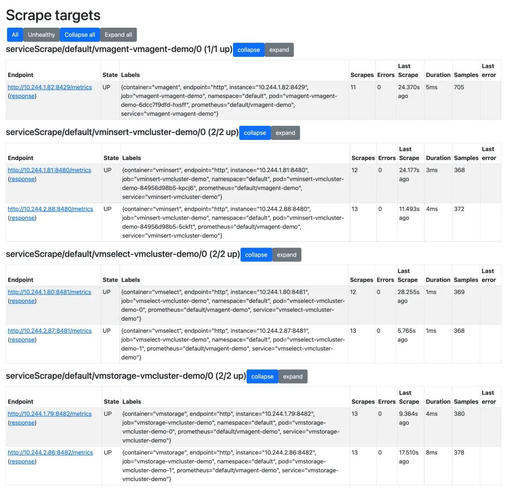
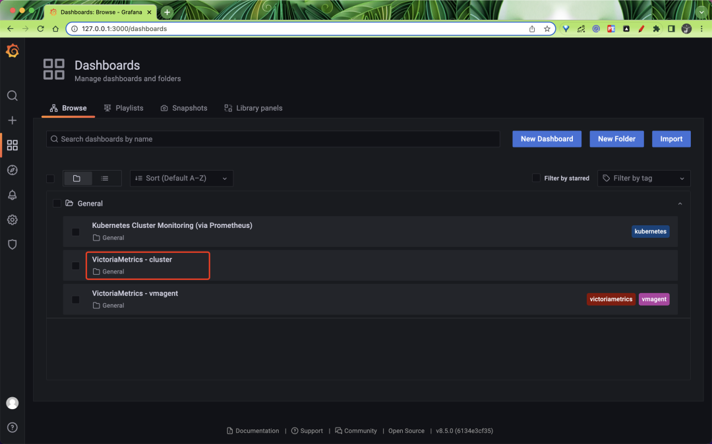
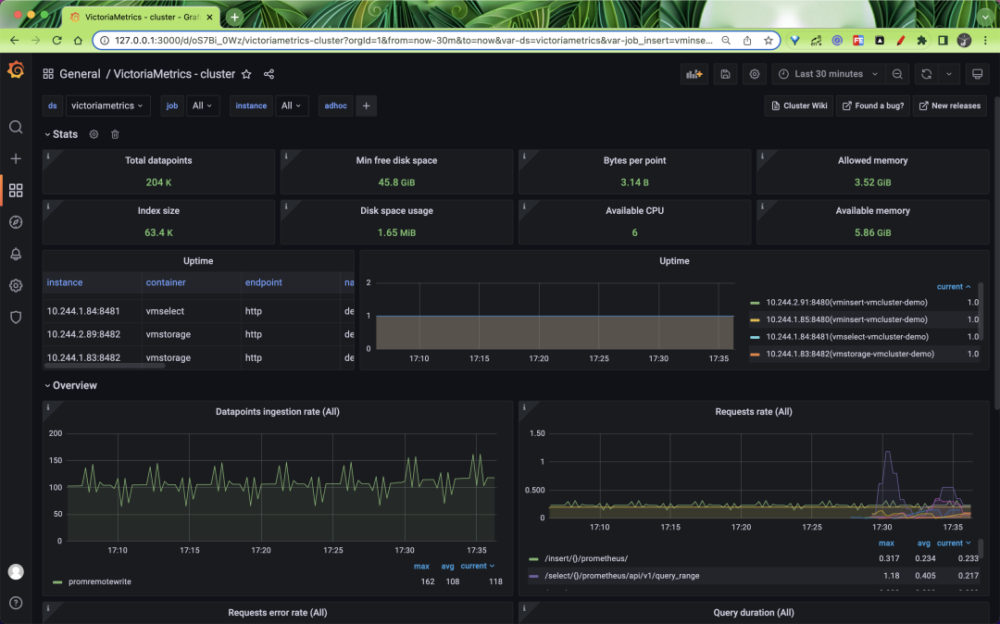
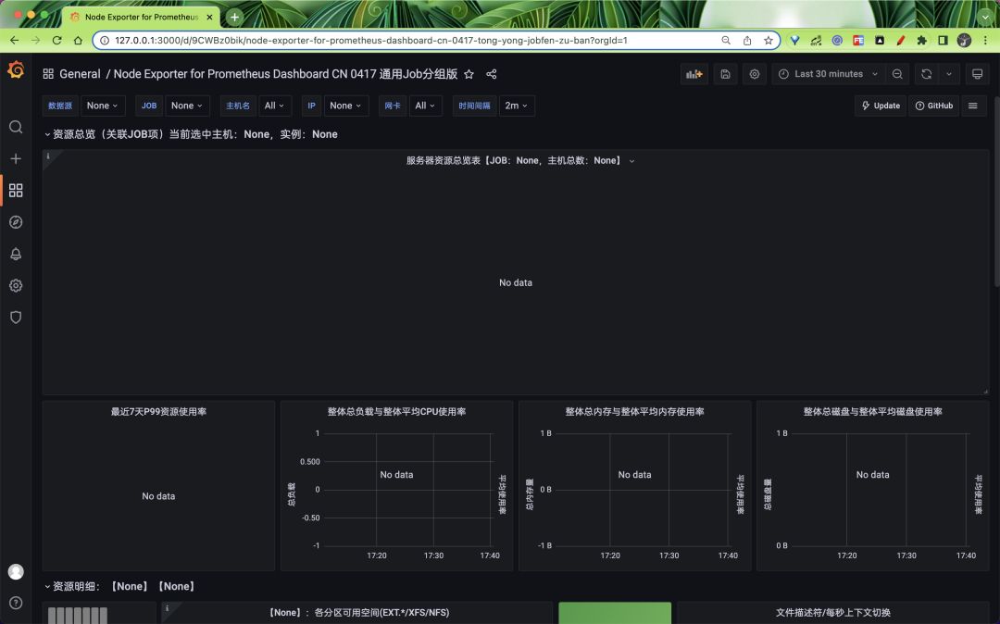
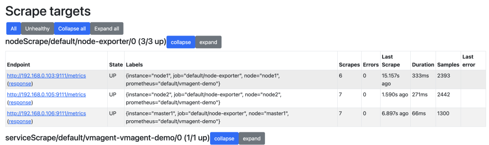
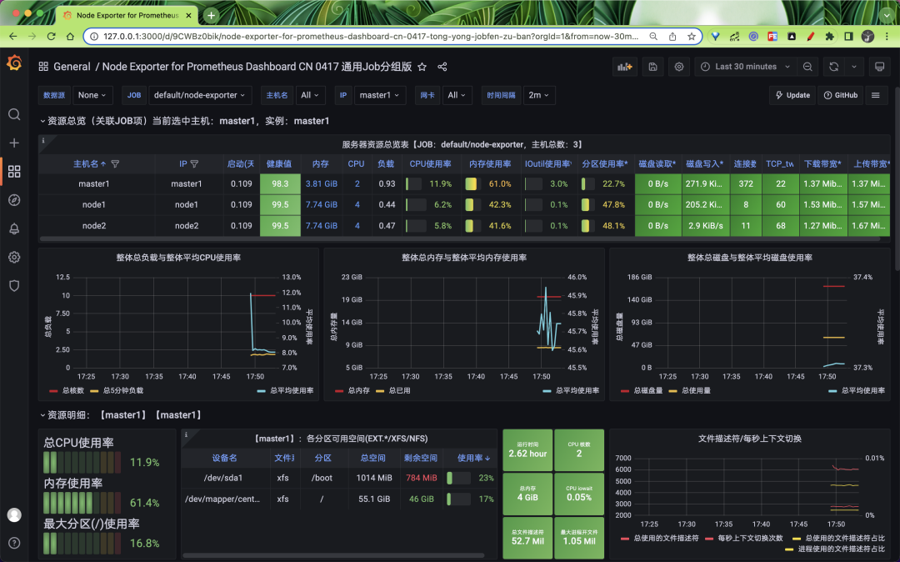

# **使用 Victoria Metrics Operator 管理 VM 集群**

Operator 我们知道是 Kubernetes 的一大杀器，可以大大简化应用的安装、配置和管理，同样对于 `VictoriaMetrics` 官方也开发了一个对应的 Operator 来进行管理 - `vm-operator`，它的设计和实现灵感来自 `prometheus-operator`，它是管理应用程序监控配置的绝佳工具。


vm-operator 定义了如下一些 CRD：

* **VMCluster**：定义 VM 集群
* **VMAgent**：定义 vmagent 实例
* **VMServiceScrape**：定义从 Service 支持的 Pod 中抓取指标配置
* **VMPodScrape**：定义从 Pod 中抓取指标配置
* **VMRule**：定义报警和记录规则
* **VMProbe**：使用 blackbox exporter 为目标定义探测配置

此外该 Operator 默认还可以识别 `prometheus-operator` 中的 `ServiceMonitor`、`PodMonitor`、`PrometheusRule` 和 `Probe` 对象，还允许你使用 CRD 对象来管理 Kubernetes 集群内的 VM 应用。

## **安装**

vm-operator 提供了 Helm Charts 包，所以可以使用 Helm 来进行一键安装：

```
☸ ➜ helm repo add vm https://victoriametrics.github.io/helm-charts/
☸ ➜ helm repo update
```

根据自己的需要定制 values 值，默认的 `values.yaml `可以通过下面的命令获得：

```
☸ ➜ helm show values vm/victoria-metrics-operator > values.yaml
```

我们这里只对下面的内容做了修改：

```
# values.yaml
rbac:
  create: true
  pspEnabled: false # 不创建psp

operator:
  # -- 默认情况下，vm-operator会转换prometheus-operator对象
  disable_prometheus_converter: false
  # -- 默认情况下，vm-operator会为它的对象创建psp
  psp_auto_creation_enabled: false
  # -- 启用转换后的 prometheus-operator 对象的所有权引用，如果删除 prometheus 对象，它将删除相应的 victoria-metrics 对象。
  enable_converter_ownership: false
  # -- Enables custom config-reloader, bundled with operator.
  # It should reduce  vmagent and vmauth config sync-time and make it predictable.
  useCustomConfigReloader: true
# -- 是否开启资源校验的准入控制器(生产环境建议开启)
# admissionWebhooks:
#   # -- Enables validation webhook.
#   enabled: false
#   # -- What to do in case, when operator not available to validate request.
#   policy: Fail
#   # -- Enables custom ca bundle, if you are not using cert-manager.
#   # -- in case of custom ca, you have to create secret - {{chart-name}}-validation
#   # -- with keys: tls.key, tls.crt, ca.crt
#   caBundle: ""
#   certManager:
#     # -- Enables cert creation and injection by cert-manager.
#     enabled: false
#     # --If needed, provide own issuer. Operator will create self-signed if empty.
#     issuer: {}
```

然后使用下面的命令即可一键安装 vm-operator：

```
☸ ➜ helm upgrade --install victoria-metrics-operator vm/victoria-metrics-operator -f values.yaml -n vm-operator --create-namespace
NAME: victoria-metrics-operator
LAST DEPLOYED: Tue May 17 15:51:40 2022
NAMESPACE: vm-operator
STATUS: deployed
REVISION: 1
TEST SUITE: None
NOTES:
victoria-metrics-operator has been installed. Check its status by running:
  kubectl --namespace vm-operator get pods -l "app.kubernetes.io/instance=victoria-metrics-operator"

Get more information on https://github.com/VictoriaMetrics/helm-charts/tree/master/charts/victoria-metrics-operator.
See "Getting started guide for VM Operator" on https://docs.victoriametrics.com/guides/getting-started-w
```

安装完成后可以查看 vm-operator 的状态来验证是否安装成功：

```

☸ ➜ helm ls -n vm-operator
NAME                            NAMESPACE       REVISION        UPDATED                                 STATUS       CHART                           APP VERSION
victoria-metrics-operator       vm-operator     1               2022-05-17 15:53:14.60667 +0800 CST     deployed     victoria-metrics-operator-0.9.0 0.24.0
☸ ➜ kubectl --namespace vm-operator get pods -l "app.kubernetes.io/instance=victoria-metrics-operator"
NAME                                        READY   STATUS    RESTARTS   AGE
victoria-metrics-operator-d467cf69c-glh6v   1/1     Running   0          2m58s
```

## **部署 VM 集群**

Operator 安装完成后会包含如下所示的一些 CRD：

```
☸ ➜ kubectl get crd |grep victoriametrics
vmagents.operator.victoriametrics.com                2022-05-17T07:51:42Z
vmalertmanagerconfigs.operator.victoriametrics.com   2022-05-17T07:51:42Z
vmalertmanagers.operator.victoriametrics.com         2022-05-17T07:51:42Z
vmalerts.operator.victoriametrics.com                2022-05-17T07:51:42Z
vmauths.operator.victoriametrics.com                 2022-05-17T07:51:42Z
vmclusters.operator.victoriametrics.com              2022-05-17T07:51:42Z
vmnodescrapes.operator.victoriametrics.com           2022-05-17T07:51:42Z
vmpodscrapes.operator.victoriametrics.com            2022-05-17T07:51:42Z
vmprobes.operator.victoriametrics.com                2022-05-17T07:51:42Z
vmrules.operator.victoriametrics.com                 2022-05-17T07:51:42Z
vmservicescrapes.operator.victoriametrics.com        2022-05-17T07:51:42Z
vmsingles.operator.victoriametrics.com               2022-05-17T07:51:42Z
vmstaticscrapes.operator.victoriametrics.com         2022-05-17T07:51:42Z
vmusers.operator.victoriametrics.com                 2022-05-17T07:51:42Z
```

比如现在我们要来部署 VM，**如果只是想要单节点模式则可以直接使用 VMSingle 对象**，如果要部署一套 VM 的集群则可以直接使用 VMCluster 来定义一个对象即可，完全不需要我们去手动创建各个组件，Operator 会根据我们的定义去帮我们拉起一套集群起来。

比如这里我们定义一个如下所示的 VMCluster 对象：

```
# vmcluster-demo.yaml
apiVersion: operator.victoriametrics.com/v1beta1
kind: VMCluster
metadata:
  name: vmcluster-demo
spec:
  replicationFactor: 1
  retentionPeriod: "1w"
  vmstorage:
    replicaCount: 2
    storage:
      volumeClaimTemplate:
        spec:
          accessModes:
            - ReadWriteOnce
          resources:
            requests:
              storage: 10G
          storageClassName: nfs-client
    storageDataPath: /vm-data
  vmselect:
    replicaCount: 2
    cacheMountPath: /cache
    storage:
      volumeClaimTemplate:
        spec:
          storageClassName: nfs-client
          accessModes:
            - ReadWriteOnce
          resources:
            requests:
              storage: 1G
  vminsert:
    replicaCount: 2
```

这里我们通过 `spec.retentionPeriod` 指定了数据保留的时长为 1 周，`replicaCount` 用来指定各个组件的副本数为 2，通过` storage.volumeClaimTemplate` 指定了数据持久化的 PVC 模板，整个对象可配置的属性我们可以通过 kubectl explain 来获取：

```
☸ ➜ kubectl explain VMCluster.spec
KIND:     VMCluster
VERSION:  operator.victoriametrics.com/v1beta1

RESOURCE: spec <Object>

DESCRIPTION:
     VMClusterSpec defines the desired state of VMCluster

FIELDS:
   clusterVersion       <string>
     ClusterVersion defines default images tag for all components. it can be
     overwritten with component specific image.tag value.

   imagePullSecrets     <[]Object>
     ImagePullSecrets An optional list of references to secrets in the same
     namespace to use for pulling images from registries see
     http://kubernetes.io/docs/user-guide/images#specifying-imagepullsecrets-on-a-pod

   podSecurityPolicyName        <string>
     PodSecurityPolicyName - defines name for podSecurityPolicy in case of empty
     value, prefixedName will be used.

   replicationFactor    <integer>
     ReplicationFactor defines how many copies of data make among distinct
     storage nodes

   retentionPeriod      <string> -required-
     RetentionPeriod for the stored metrics Note VictoriaMetrics has data/ and
     indexdb/ folders metrics from data/ removed eventually as soon as partition
     leaves retention period reverse index data at indexdb rotates once at the
     half of configured retention period
     https://docs.victoriametrics.com/Single-server-VictoriaMetrics.html#retention

   serviceAccountName   <string>
     ServiceAccountName is the name of the ServiceAccount to use to run the
     VMSelect Pods.

   vminsert     <Object>

   vmselect     <Object>

   vmstorage    <Object>
```

同样要想获取组件可以定义的属性也可以通过该方式来获取，比如查看 vmstorage 对象可以配置的属性：

```
☸ ➜ kubectl explain VMCluster.spec.vmstorage
KIND:     VMCluster
VERSION:  operator.victoriametrics.com/v1beta1

RESOURCE: vmstorage <Object>

DESCRIPTION:
     <empty>

FIELDS:
   affinity     <>
     Affinity If specified, the pod's scheduling constraints.

   configMaps   <[]string>
     ConfigMaps is a list of ConfigMaps in the same namespace as the VMSelect
     object, which shall be mounted into the VMSelect Pods. The ConfigMaps are
     mounted into /etc/vm/configs/<configmap-name>.

   containers   <[]>
     Containers property allows to inject additions sidecars or to patch
     existing containers. It can be useful for proxies, backup, etc.

   dnsConfig    <Object>
     Specifies the DNS parameters of a pod. Parameters specified here will be
     merged to the generated DNS configuration based on DNSPolicy.

   dnsPolicy    <string>
     DNSPolicy sets DNS policy for the pod

   extraArgs    <map[string]string>

   extraEnvs    <[]>
     ExtraEnvs that will be added to VMSelect pod

   hostNetwork  <boolean>
     HostNetwork controls whether the pod may use the node network namespace

   image        <Object>
     Image - docker image settings for VMStorage

   initContainers       <[]>
     InitContainers allows adding initContainers to the pod definition. Those
     can be used to e.g. fetch secrets for injection into the VMSelect
     configuration from external sources. Any errors during the execution of an
     initContainer will lead to a restart of the Pod. More info:
     https://kubernetes.io/docs/concepts/workloads/pods/init-containers/ Using
     initContainers for any use case other then secret fetching is entirely
     outside the scope of what the maintainers will support and by doing so, you
     accept that this behaviour may break at any time without notice.

   livenessProbe        <>
     LivenessProbe that will be added CRD pod

   logFormat    <string>
     LogFormat for VMSelect to be configured with. default or json

   logLevel     <string>
     LogLevel for VMSelect to be configured with.

   maintenanceInsertNodeIDs     <[]integer>
     MaintenanceInsertNodeIDs - excludes given node ids from insert requests
     routing, must contain pod suffixes - for pod-0, id will be 0 and etc. lets
     say, you have pod-0, pod-1, pod-2, pod-3. to exclude pod-0 and pod-3 from
     insert routing, define nodeIDs: [0,3]. Useful at storage expanding, when
     you want to rebalance some data at cluster.

   maintenanceSelectNodeIDs     <[]integer>
     MaintenanceInsertNodeIDs - excludes given node ids from select requests
     routing, must contain pod suffixes - for pod-0, id will be 0 and etc.

   name <string>
     Name is deprecated and will be removed at 0.22.0 release

   nodeSelector <map[string]string>
     NodeSelector Define which Nodes the Pods are scheduled on.

   podDisruptionBudget  <Object>
     PodDisruptionBudget created by operator

   podMetadata  <Object>
     PodMetadata configures Labels and Annotations which are propagated to the
     VMSelect pods.

   port <string>
     Port for health check connetions

   priorityClassName    <string>
     Priority class assigned to the Pods

   readinessProbe       <>
     ReadinessProbe that will be added CRD pod

   replicaCount <integer> -required-
     ReplicaCount is the expected size of the VMStorage cluster. The controller
     will eventually make the size of the running cluster equal to the expected
     size.

   resources    <Object>
     Resources container resource request and limits,
     https://kubernetes.io/docs/concepts/configuration/manage-resources-containers/

   rollingUpdateStrategy        <string>
     RollingUpdateStrategy defines strategy for application updates Default is
     OnDelete, in this case operator handles update process Can be changed for
     RollingUpdate

   runtimeClassName     <string>
     RuntimeClassName - defines runtime class for kubernetes pod.
     https://kubernetes.io/docs/concepts/containers/runtime-class/

   schedulerName        <string>
     SchedulerName - defines kubernetes scheduler name

   secrets      <[]string>
     Secrets is a list of Secrets in the same namespace as the VMSelect object,
     which shall be mounted into the VMSelect Pods. The Secrets are mounted into
     /etc/vm/secrets/<secret-name>.

   securityContext      <>
     SecurityContext holds pod-level security attributes and common container
     settings. This defaults to the default PodSecurityContext.

   serviceScrapeSpec    <>
     ServiceScrapeSpec that will be added to vmselect VMServiceScrape spec

   serviceSpec  <Object>
     ServiceSpec that will be create additional service for vmstorage

   startupProbe <>
     StartupProbe that will be added to CRD pod

   storage      <Object>
     Storage - add persistent volume for StorageDataPath its useful for
     persistent cache

   storageDataPath      <string>
     StorageDataPath - path to storage data

   terminationGracePeriodSeconds        <integer>
     TerminationGracePeriodSeconds period for container graceful termination

   tolerations  <[]Object>
     Tolerations If specified, the pod's tolerations.

   topologySpreadConstraints    <[]>
     TopologySpreadConstraints embedded kubernetes pod configuration option,
     controls how pods are spread across your cluster among failure-domains such
     as regions, zones, nodes, and other user-defined topology domains
     https://kubernetes.io/docs/concepts/workloads/pods/pod-topology-spread-constraints/

   vmBackup     <Object>
     VMBackup configuration for backup

   vmInsertPort <string>
     VMInsertPort for VMInsert connections

   vmSelectPort <string>
     VMSelectPort for VMSelect connections

   volumeMounts <[]Object>
     VolumeMounts allows configuration of additional VolumeMounts on the output
     Deployment definition. VolumeMounts specified will be appended to other
     VolumeMounts in the VMSelect container, that are generated as a result of
     StorageSpec objects.

   volumes      <[]>
     Volumes allows configuration of additional volumes on the output Deployment
     definition. Volumes specified will be appended to other volumes that are
     generated as a result of StorageSpec objects.
```

直接应用上面定义的对象：

```
☸ ➜ kubectl apply -f vmcluster-demo.yaml
☸ ➜ kubectl get vmcluster
NAME             INSERT COUNT   STORAGE COUNT   SELECT COUNT   AGE     STATUS
vmcluster-demo   2              2               2              7m21s   expanding
```

应用后 `vm-operator` 会 watch 到我们创建了该 CRD 对象，然后会根据我们的定义去自动创建对应的 VM 集群，也就是前面提到的几个组件服务：

```

☸ ➜ kubectl get pods
NAME                                       READY   STATUS    RESTARTS      AGE
vminsert-vmcluster-demo-84956d98b5-5ckft   1/1     Running   0             93s
vminsert-vmcluster-demo-84956d98b5-kpcj6   1/1     Running   0             93s
vmselect-vmcluster-demo-0                  1/1     Running   0             3m7s
vmselect-vmcluster-demo-1                  1/1     Running   0             3m7s
vmstorage-vmcluster-demo-0                 1/1     Running   0             4m54s
vmstorage-vmcluster-demo-1                 1/1     Running   0             4m54s
☸ ➜ kubectl get svc
NAME                       TYPE        CLUSTER-IP      EXTERNAL-IP   PORT(S)                      AGE
vminsert-vmcluster-demo    ClusterIP   10.102.145.24   <none>        8480/TCP                     4m57s
vmselect-vmcluster-demo    ClusterIP   None            <none>        8481/TCP                     6m31s
vmstorage-vmcluster-demo   ClusterIP   None            <none>        8482/TCP,8400/TCP,8401/TCP   8m18s
```

我们只通过定义简单的 VMCluster 对象就可以来管理 VM 集群了，是不是非常方便，特别是当你组件副本数量非常多的时候不需要我们去手动配置 `-storageNode` 参数了。

现在 VM 集群安装成功了，但是现在还没有任何数据，所以还需要去配置监控指标的抓取，这里我们可以直接去创建一个 VMAgent 对象即可，创建一个如下所示的对象：

```
# vmagent-demo.yaml
apiVersion: operator.victoriametrics.com/v1beta1
kind: VMAgent
metadata:
  name: vmagent-demo
spec:
  serviceScrapeNamespaceSelector: {}
  podScrapeNamespaceSelector: {}
  podScrapeSelector: {}
  serviceScrapeSelector: {}
  nodeScrapeSelector: {}
  nodeScrapeNamespaceSelector: {}
  staticScrapeSelector: {}
  staticScrapeNamespaceSelector: {}
  replicaCount: 1
  remoteWrite:
    - url: "http://vminsert-vmcluster-demo.default.svc.cluster.local:8480/insert/0/prometheus/api/v1/write"
```

同样要获取 VMAgent 的所有可配置的属性可以通过 `kubectl explain VMAgent.spec` 来获取，这里最主要的配置就是通过 `remoteWrite.url` 来指定远程写入的 URL 地址，也就是 vminsert 组件的服务地址，其他几个属性可以用来对要抓取的指标进行过滤。

直接应用上面的 VMAgent 对象即可开始抓取监控数据：

```
☸ ➜ kubectl apply -f vmagent-demo.yaml
☸ ➜ kubectl get vmagent
NAME           AGE
vmagent-demo   6s
```

创建后 vm-operator 会根据对应的描述创建一个对应的 vmagent 实例：

```
☸ ➜ kubectl get pods -l app.kubernetes.io/name=vmagent
NAME                                    READY   STATUS    RESTARTS   AGE
vmagent-vmagent-demo-6dcc7f9dfd-hxsff   2/2     Running   0          4m24s
```

可以看到 vmagent 有两个容器，一个是 vmagent 应用容器，另外一个是用于挂载 Secret 对象的 config-reloader 容器，它会 watch 配置的变化，并发送信号为 vmagent 重新加载配置，该 Secret 对象中就是定义的 vmagent 抓取指标的配置内容。

我们可以运行以下命令使 vmagent 的端口可以从本地机器上访问。

```
☸ ➜ kubectl port-forward svc/vmagent-vmagent-demo 8429:8429
Forwarding from 127.0.0.1:8429 -> 8429
Forwarding from [::1]:8429 -> 8429
```

我们可以在浏览器中访问 `http://127.0.0.1:8429/targets` 来检查 vmagent 采集的集群指标：



vmagent 会通过 Kubernetes 服务发现去获取需要抓取的目标，此服务发现由 vm-operator 控制

## **验证 VM 集群**

接下来我们安装 Grafana 来验证 VM 集群，这里为了简单我们就直接使用 Helm Chart 进行安装：

```
☸ ➜ helm repo add grafana https://grafana.github.io/helm-charts
☸ ➜ helm repo update
```

我们可以在 values 中提前定义数据源和内置一些 dashboard，如下所示：

```
cat <<EOF | helm install grafana grafana/grafana -f -
  datasources:
    datasources.yaml:
      apiVersion: 1
      datasources:
        - name: victoriametrics
          type: prometheus
          orgId: 1
          url: http://vmselect-vmcluster-demo.default.svc.cluster.local:8481/select/0/prometheus/
          access: proxy
          isDefault: true
          updateIntervalSeconds: 10
          editable: true

  dashboardProviders:
   dashboardproviders.yaml:
     apiVersion: 1
     providers:
     - name: 'default'
       orgId: 1
       folder: ''
       type: file
       disableDeletion: true
       editable: true
       options:
         path: /var/lib/grafana/dashboards/default

  dashboards:
    default:
      victoriametrics:
        gnetId: 11176
        revision: 18
        datasource: victoriametrics
      vmagent:
        gnetId: 12683
        revision: 7
        datasource: victoriametrics
      kubernetes:
        gnetId: 14205
        revision: 1
        datasource: victoriametrics
EOF
NAME: grafana
LAST DEPLOYED: Tue May 17 17:13:14 2022
NAMESPACE: default
STATUS: deployed
REVISION: 1
NOTES:
1. Get your 'admin' user password by running:

   kubectl get secret --namespace default grafana -o jsonpath="{.data.admin-password}" | base64 --decode ; echo

2. The Grafana server can be accessed via port 80 on the following DNS name from within your cluster:

   grafana.default.svc.cluster.local

   Get the Grafana URL to visit by running these commands in the same shell:

     export POD_NAME=$(kubectl get pods --namespace default -l "app.kubernetes.io/name=grafana,app.kubernetes.io/instance=grafana" -o jsonpath="{.items[0].metadata.name}")
     kubectl --namespace default port-forward $POD_NAME 3000

3. Login with the password from step 1 and the username: admin
#################################################################################
######   WARNING: Persistence is disabled!!! You will lose your data when   #####
######            the Grafana pod is terminated.                            #####
#################################################################################
```

安装完成后可以使用上面提示的命令在本地暴露 Grafana 服务：

```

☸ ➜ export POD_NAME=$(kubectl get pods --namespace default -l "app.kubernetes.io/name=grafana,app.kubernetes.io/instance=grafana" -o jsonpath="{.items[0].metadata.name}")
     kubectl --namespace default port-forward $POD_NAME 3000
Forwarding from 127.0.0.1:3000 -> 3000
Forwarding from [::1]:3000 -> 3000
```

登录的用户名为 admin，密码可以通过下面的命令获取：

```
☸ ➜ kubectl get secret --namespace default grafana -o jsonpath="{.data.admin-password}" | base64 --decode ; echo
```

我们可以查看下 victoriametrics cluster 的 dashboard：



正常可以看到如下所示的页面：



这是因为默认情况下 VMAgent 会采集 VM 集群相关组件的指标，包括 vmagent 本身的，所以我们可以正常看到 VM 集群的 Dashboard，但是没有采集其他的指标，比如 `node-exporter`，我们可以在 Grafana 中导入 16098 这个 dashboard：



这个时候我们可以通过 VMNodeScrape 这个 CRD 对象来进行定义，VMNodeScrape 对象可以用来自动发现 Kubernetes 节点，创建如下所示的资源对象来采集 node-exporter 指标：

```
# vmnode-exporter-scrape.yaml
apiVersion: operator.victoriametrics.com/v1beta1
kind: VMNodeScrape
metadata:
  name: node-exporter
spec:
  path: /metrics
  port: "9111" # 指定 node-exporter 的端口
  scrape_interval: 15s
#   relabelConfigs：  # relabel配置
#   selector:  # 过滤节点
```

直接应用上面的对象即可：

```
☸ ➜ kubectl apply -f vmnode-exporter-scrape.yaml
☸ ➜ kubectl get vmnodescrape
NAME            AGE
node-exporter   19s
```

创建后 vmagent 就会自动去识别该对象去对 node-exporter 进行抓取了：




这个时候再去查看 node-exporter 的 dashboard 就正常了：



此外还可以通过 `VMServiceScrape` 去定义要抓取的 Service 服务（Endpoints），它基于选择器为 vmagent 生成抓取配置，如果想要抓取没有定义 Service 的 Pod 的指标，则可以通过 VMPodScrape 来进行定义，同样还有报警相关的也都有相应的 CRD 来进行管理。vm-operator 大大降低了我们对 VM 集群的管理，非常推荐使用。