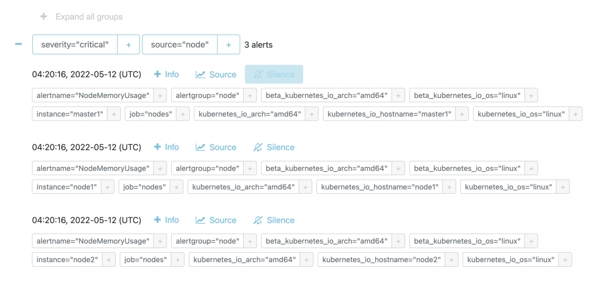
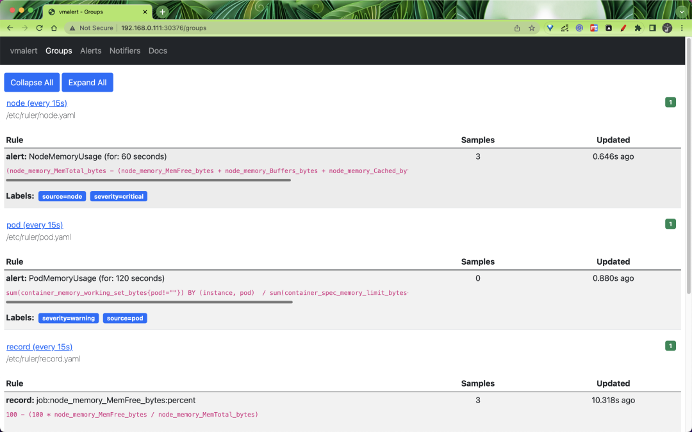
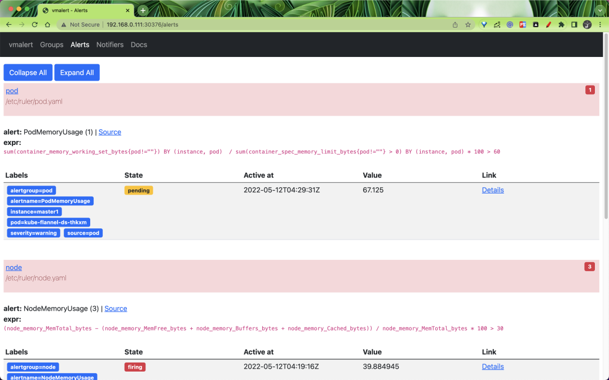
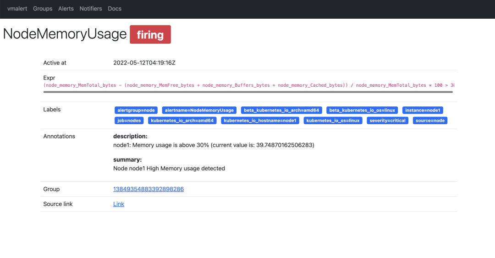
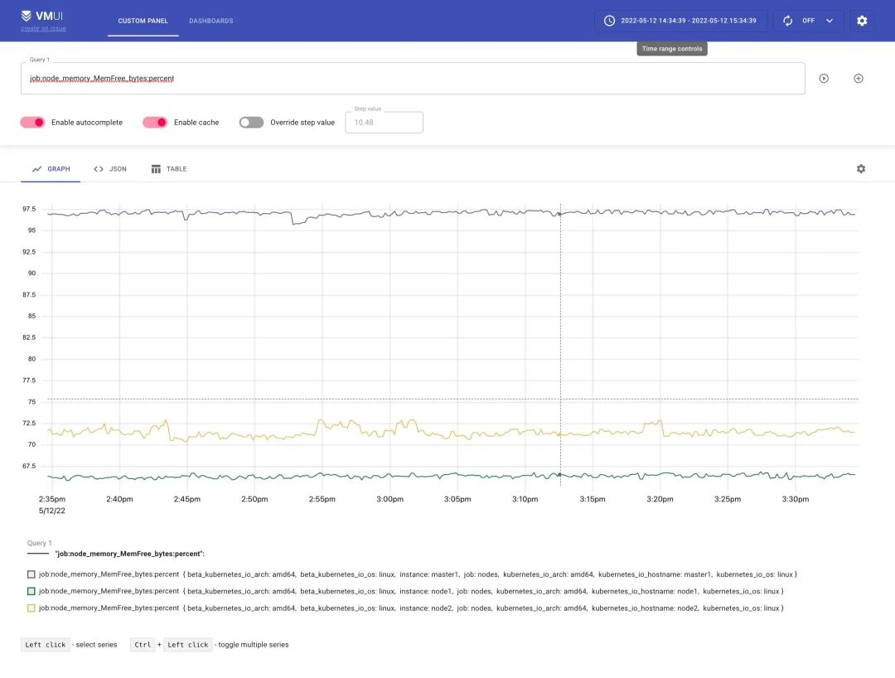

# **使用 vmalert 代替 Prometheus 监控报警**

前面我们已经介绍了可以使用 vmagent 代替 prometheus 抓取监控指标数据，要想完全替换 prometheus 还有一个非常重要的部分就是报警模块，之前我们都是在 prometheus 中定义报警规则评估后发送给 alertmanager 的，同样对应到 vm 中也有一个专门来处理报警的模块：vmalert。

vmalert 会针对 `-datasource.url` 地址执行配置的报警或记录规则，然后可以将报警发送给 `-notifier.url` 配置的 Alertmanager，记录规则结果会通过远程写入的协议进行保存，所以需要配置 `-remoteWrite.url`。

## **特性**

* 与 VictoriaMetrics TSDB 集成
* VictoriaMetrics MetricsQL 支持和表达式验证
* Prometheus 告警规则定义格式支持
* 与 Alertmanager 集成
* 在重启时可以保持报警状态
* Graphite 数据源可用于警报和记录规则
* 支持记录和报警规则重放
* 非常轻量级，没有额外的依赖

要开始使用 vmalert，需要满足以下条件：

* 报警规则列表：要执行的 PromQL/MetricsQL 表达式
* 数据源地址：可访问的 VictoriaMetrics 实例，用于规则执行
* 通知程序地址：可访问的 Alertmanager 实例，用于处理，汇总警报和发送通知


## **安装**

首先需要安装一个 Alertmanager 用来接收报警信息，前面章节中我们已经详细讲解过了，这里不再赘述了，对应的资源清单如下所示：

```
# alertmanager.yaml
apiVersion: v1
kind: ConfigMap
metadata:
  name: alert-config
  namespace: kube-vm
data:
  config.yml: |-
    global:
      resolve_timeout: 5m
      smtp_smarthost: 'smtp.163.com:465'
      smtp_from: 'xxx@163.com'  
      smtp_auth_username: 'xxx@163.com'
      smtp_auth_password: '<auth code>'  # 使用网易邮箱的授权码
      smtp_hello: '163.com'
      smtp_require_tls: false
    route:
      group_by: ['severity', 'source']
      group_wait: 30s
      group_interval: 5m
      repeat_interval: 24h 
      receiver: email
    receivers:
    - name: 'email'
      email_configs:
      - to: 'xxxxxx@qq.com'
        send_resolved: true
---
apiVersion: v1
kind: Service
metadata:
  name: alertmanager
  namespace: kube-vm
  labels:
    app: alertmanager
spec:
  selector:
    app: alertmanager
  type: NodePort
  ports:
    - name: web
      port: 9093
      targetPort: http
---
apiVersion: apps/v1
kind: Deployment
metadata:
  name: alertmanager
  namespace: kube-vm
  labels:
    app: alertmanager
spec:
  selector:
    matchLabels:
      app: alertmanager
  template:
    metadata:
      labels:
        app: alertmanager
    spec:
      volumes:
        - name: cfg
          configMap:
            name: alert-config
      containers:
        - name: alertmanager
          image: prom/alertmanager:v0.21.0
          imagePullPolicy: IfNotPresent
          args:
            - "--config.file=/etc/alertmanager/config.yml"
          ports:
            - containerPort: 9093
              name: http
          volumeMounts:
            - mountPath: "/etc/alertmanager"
              name: cfg
```

Alertmanager 这里我们只配置了一个默认的路由规则，根据 severity、source 两个标签进行分组，然后将触发的报警发送到 email 接收器中去。

接下来需要添加用于报警的规则配置，配置方式和 Prometheus 一样的：

```
# vmalert-config.yaml
apiVersion: v1
kind: ConfigMap
metadata:
  name: vmalert-config
  namespace: kube-vm
data:
  record.yaml: |
    groups:
    - name: record
      rules:
      - record: job:node_memory_MemFree_bytes:percent  # 记录规则名称
        expr: 100 - (100 * node_memory_MemFree_bytes / node_memory_MemTotal_bytes)
  pod.yaml: |
    groups:
    - name: pod
      rules:
      - alert: PodMemoryUsage
        expr: sum(container_memory_working_set_bytes{pod!=""}) BY (instance, pod)  / sum(container_spec_memory_limit_bytes{pod!=""} > 0) BY (instance, pod) * 100 > 60
        for: 2m
        labels:
          severity: warning
          source: pod
        annotations:
          summary: "Pod {{ $labels.pod }} High Memory usage detected"
          description: "{{$labels.instance}}: Pod {{ $labels.pod }} Memory usage is above 60% (current value is: {{ $value }})"
  node.yaml: |
    groups:
    - name: node
      rules:  # 具体的报警规则
      - alert: NodeMemoryUsage  # 报警规则的名称
        expr: (node_memory_MemTotal_bytes - (node_memory_MemFree_bytes + node_memory_Buffers_bytes + node_memory_Cached_bytes)) / node_memory_MemTotal_bytes * 100 > 30
        for: 1m
        labels:
          source: node
          severity: critical
        annotations:
          summary: "Node {{$labels.instance}} High Memory usage detected"
          description: "{{$labels.instance}}: Memory usage is above 30% (current value is: {{ $value }})"
```

这里我们添加了一条记录规则，两条报警规则，更多报警规则配置可参考 https://awesome-prometheus-alerts.grep.to/。

然后就可以部署 vmalert 组件服务了：

```
# vmalert.yaml
apiVersion: v1
kind: Service
metadata:
  name: vmalert
  namespace: kube-vm
  labels:
    app: vmalert
spec:
  ports:
    - name: vmalert
      port: 8080
      targetPort: 8080
  type: NodePort
  selector:
    app: vmalert
---
apiVersion: apps/v1
kind: Deployment
metadata:
  name: vmalert
  namespace: kube-vm
  labels:
    app: vmalert
spec:
  selector:
    matchLabels:
      app: vmalert
  template:
    metadata:
      labels:
        app: vmalert
    spec:
      containers:
        - name: vmalert
          image: victoriametrics/vmalert:v1.77.0
          imagePullPolicy: IfNotPresent
          args:
            - -rule=/etc/ruler/*.yaml
            - -datasource.url=http://vmselect.kube-vm.svc.cluster.local:8481/select/0/prometheus
            - -notifier.url=http://alertmanager.kube-vm.svc.cluster.local:9093
            - -remoteWrite.url=http://vminsert.kube-vm.svc.cluster.local:8480/insert/0/prometheus
            - -evaluationInterval=15s
            - -httpListenAddr=0.0.0.0:8080
          volumeMounts:
            - mountPath: /etc/ruler/
              name: ruler
              readOnly: true
      volumes:
        - configMap:
            name: vmalert-config
          name: ruler
```

上面的资源清单中将报警规则以 volumes 的形式挂载到了容器中，通过 `-rule` 指定了规则文件路径，`-datasource.url` 指定了 `vmselect` 的路径，`-notifier.url `指定了` Alertmanager `的地址，其中 `-evaluationInterval` 参数用来指定评估的频率的，由于我们这里添加了记录规则，所以还需要通过 `-remoteWrite.url` 指定一个远程写入的地址。

直接创建上面的资源清单即可完成部署。

```
☸ ➜ kubectl apply -f https://p8s.io/docs/victoriametrics/manifests/alertmanager.yaml
☸ ➜ kubectl apply -f https://p8s.io/docs/victoriametrics/manifests/vmalert-config.yaml
☸ ➜ kubectl apply -f https://p8s.io/docs/victoriametrics/manifests/vmalert.yaml
☸ ➜ kubectl get pods -n kube-vm -l app=alertmanager
NAME                           READY   STATUS    RESTARTS   AGE
alertmanager-d88d95b4f-z2j8g   1/1     Running   0          30m
☸ ➜ kubectl get svc -n kube-vm -l app=alertmanager
NAME           TYPE       CLUSTER-IP     EXTERNAL-IP   PORT(S)          AGE
alertmanager   NodePort   10.100.230.2   <none>        9093:31282/TCP   31m
☸ ➜ kubectl get pods -n kube-vm -l app=vmalert
NAME                       READY   STATUS    RESTARTS   AGE
vmalert-866674b966-675nb   1/1     Running   0          7m17s
☸ ➜ kubectl get svc -n kube-vm -l app=vmalert
NAME      TYPE       CLUSTER-IP       EXTERNAL-IP   PORT(S)          AGE
vmalert   NodePort   10.104.193.183   <none>        8080:30376/TCP   22m
```

部署成功后，如果有报警规则达到了阈值就会触发报警，我们可以通过 Alertmanager 页面查看触发的报警规则：



同样 vmalert 也提供了一个简单的页面，可以查看所有的 Groups：



也可以查看到报警规则列表的状态：



还可以查看到具体的一条报警规则的详细信息，如下所示：



> 报警规则触发后怎么发送，发送到哪个接收器就是 Alertmanager 决定的了。

同样的上面我们添加的记录规则会通过 remote write 传递给 vminsert 保留下来，所以我们也可以通过 vmselect 查询到。



到这里基本上我们就完成了使用 vm 代替 prometheus 来进行监控报警了，vmagent 采集监控指标，vmalert 用于报警监控，vmstorage 存储指标数据，vminsert 接收指标数据，vmselect 查询指标数据，已经完全可以不使用 prometheus 了，而且性能非常高，所需资源也比 prometheus 低很多。