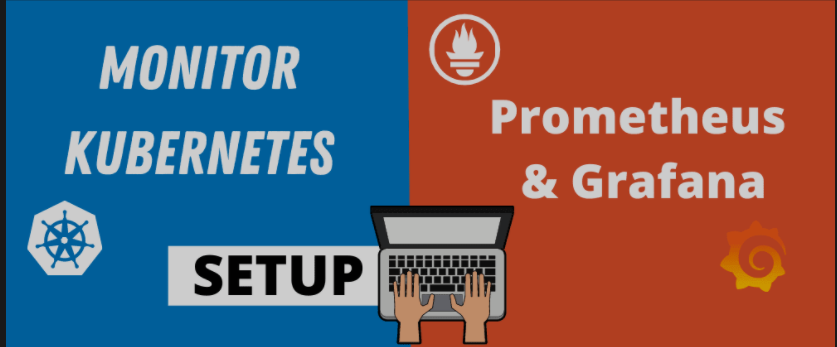
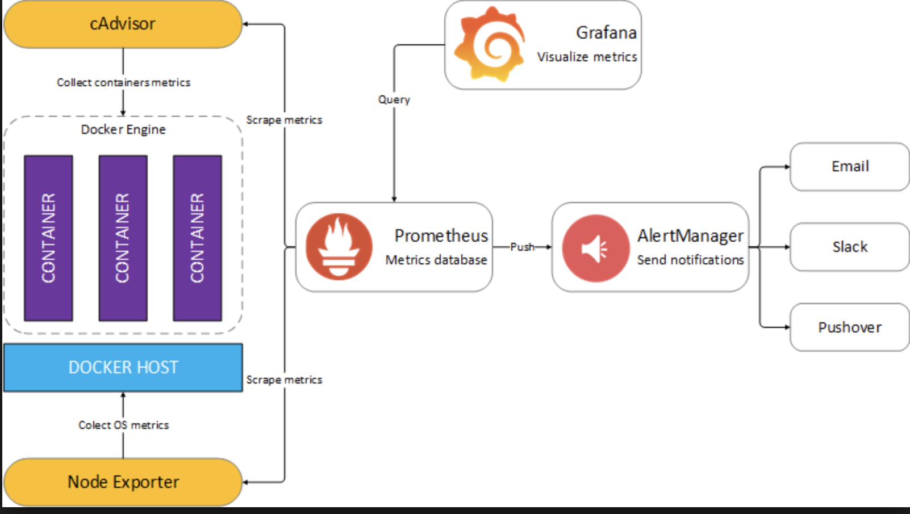
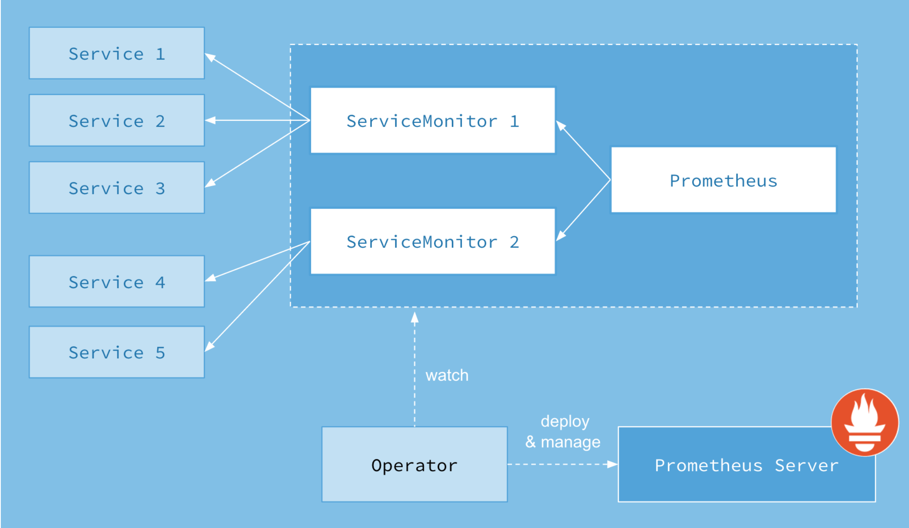

# Kubernetes monitoring with Prometheus 

1. [Kubernetes 使用 Prometheus搭建监控平台](1.prometheus_setup.md)
2. [Prometheus 报警 && AlertManager 实战](2.prometheus_AlertManager.md)
3. [Grafana 显示参数设置](3.changes_on_Grafana.md)

## Prometheus Adv. tutorial

1. [在 Kubernetes 中手动部署 Prometheus](4.Adv_Prometheus_setup.md)
2. [Kubernetes 应用监控](5Adv_Prometheus_monitor.md)
3. [监控 Kubernetes 集群节点](6Adv_K8S_Nodes_monitor.md)
4. [监控 Kubernetes 常用资源对象](7Adv_K8S_Resource_monitor.md)
5. [Grafana 在 Kubernetes 中的使用](8Adv_K8S_Grafana.md)
6. [报警神器 AlertManager 的使用](10Adv_k8s_AlertManger.md)
7. [Prometheus 删除数据指标](16Adv_Prometheus_Del_index.md)

#### Prometheus on Linux 

1. [深入Prometheus设计-指标定义与分类](18Adv_Prometheus_index_classfication.md)
2. [Prometheus安装部署+监控+绘图+告警](19centos7_Prometheus_Alertmanager_Grafana.md)

### Metrics Collector

1. [`kube-state-metrics`与`metric-server`的对比](https://github.com/Chao-Xi/JacobTechBlog/blob/master/k8s_tutorial/k8s_adv39_kube_state_metrics.md)
2. [`Metrics Server` 安装与排错](17Adv_K8S_Metrics_Server.md)
3. [Install Kubernetes `Metrics Server` on `SAP Converged Cloud`](20Install_metrics_server_SAP_CC.md)
4. [从`kubectl top`看K8S监控原理](37kubectl_top.md)
5. [Kubernetes HPA 使用详解](38k8s_hpa_metricsserver.md)
	* Metrics Server
	* 基于 CPU 的 HPA
	* 基于内存 的 HPA
	* 基于自定义指标 和 `Prometheus-adapater` 的 HPA 

## Prometheus Operator Framework

1. [Prometheus Operator 初体验](11Adv_Prometheus_Operator.md)
2. [使用 Prometheus Operator 监控 etcd](13Adv_Prometheus_Operator_etcd.md)
3. [Prometheus Operator 自定义报警](14Adv_Prometheus_Operator_alarm.md)
4. [Prometheus Operator **自动发现以及数据持久化**](15Adv_Prometheus_Operator_Setting.md)
5. [Install prometheus-operator with Helm in Ubertest Cluster](21Install_Prometheus_Operator_SAP_CC.md)
6. [Add Custom Alert and Send Alert Email with Alertmanager (SAP - Converged Cloud - Ubertest Cluster)](22Customize_Alert_Email.md)
7. [Prometheus 黑盒监控](24Kubernetes_Prometheus_blackbox.md)
8. [AlertManager 何时报警](29AlertManager_SendAlerts_when.md)
9. [Troubleshooting ServiceMonitor changes](32Prometheus_troubleshoot_Servicemonitor.md)
10. [基于`Prometheus`构建`MySQL`可视化监控平台](36Prometheus_Mysql.md)
11. [`Prometheus` 监控外部 `Kubernetes` 集群](41Prometheus_Monitor_OutCluster.md)
12. [使用`ssl_exporter`监控K8S集群证书](43Prometheus_operator_ssl_exporter.md)
13. [**Promethuse-operator2021 - 使用KubeNurse进行集群网络监控**](44Prometheus_KubeNurse.md)
14. [**Prometheus Operator 安装配置 | 2021**](45Prom-operator_2021.md)
15. [**Traefik之使用 Prometheus 进行监控报警 (2021)(Traefik/Prometheus/PrometheusRule/Grafana 配置/测试)**](46Prometheus_traefik.md)
16. [**Prometheus Operator 使用 AlertmanagerConfig 进行报警配置**](47Prometheus_opt_AlertmanagerConfig.md)
17. [通过Prometheus来做SLI/SLO监控展示](49Prometheus_SLI_SLO.md)
18. [Prometheus 中使用 PrometheusAlert 进行聚合报警](50PrometheusAlert.md)
19. [Prometheus 使用 missing-container-metrics 监控 Pod oomkill](51missing-container-metrics.md)

### Jam prometheus Monitor

1. [Alertmanager alerts with Amazon SES SMTP](25Alertmanager_AWS_SES.md)
2. [Prometheus Operator Monitor on ArgoCD](26Prometheus_Monitor_Argocd.md)
3. [Prometheus Operator Monitor on ElasticSearch](27Prometheus_Monitor_elasticsearch.md)
4. [Prometheus Operator Monitor on Rabbitmq](31Prometheus_Monitor_rabbitmq.md)
5. [Prometheus Operator Monitor on Memcached](33Prometheus_Monitor_memcached.md)

## Prometheus-Adapter

* [ 对 `Kubernetes` 应用进行自定义指标扩缩容 by `Prometheus-Adapter` and `Flask Promethues Exporter`](23Kubernetes_Scale_Prometheus-Adapter.md)

## Grafana Plugins

* [优秀的 Grafana K8S 插件 - `DevOpsProdigy KubeGraf`](28Grafana_plugin_DevOpsProdigy.md)
* [用 `Kubernetes darks` 资源对象创建 `Grafana Dashboard`](30Create_Grafana_dashboards.md)
* [Grafana 图表加速神器 - Trickster](48grafana_Trickster.md)

## Other monitor tools

1. [安装使用 360 开源 K8S Dashboard: `Wayne`](9Adv_Wayne_dashboard.md) 
2. [Grafana 日志聚合工具 Loki](12Adv_Grafana_Loki.md)
3. [使用 Loki 进行日志监控和报警](40Loki_monitor_alert.md)

## Prometheus-Grafana 高级教程(2021)

1. [Prometheus Relabeling 重新标记的使用](52Prometheus_Relabeling.md)
2. [Prometheus 服务的自动发现使用](53Prometheus_auto_discovery.md)
3. [如何使用 Prometheus 仪表化应用](54prometheus_go_metrics.md)
4. [为 Go 应用添加 Prometheus 监控指标](55prometheus_go_metrics.md)

## PromQL and Prometheus Alerts

### PromQL 

1. [初识 PromQL](1Promql_basic1.md)
2. [`PromQL` 操作符](2Promql_basic2.md)
3. [`PromQL` 内置函数](3Promql_basic3.md)
4. [ `PromQL` 简单示例](4Promql_basic4.md)
5. [在 `HTTP API` 中使用 `PromQL`](5Promql_basic5.md)
6. [Prometheus 记录规则的使用(`Recording Rule`)](6Promql_adv1.md)

### Marvelous Prometheus Alerts

* [Marvelous Prometheus Alerts](prom-alerts/README.md)
* [**Prometheus Operator 常用指标**](42Prometheus_operator_metrics.md)

## Thanos

* [**大规模场景下 Prometheus 的优化手段 & Thanos 架构详解**](39Thanos_tutorial.md)
* [使用 Thanos 实现 Prometheus 的高可用介绍](34Thanos_intro.md)
* [Prometheus高可用Thanos学习-`sidercar`和`query` & Thanos部署](35Thanos_install.md)

