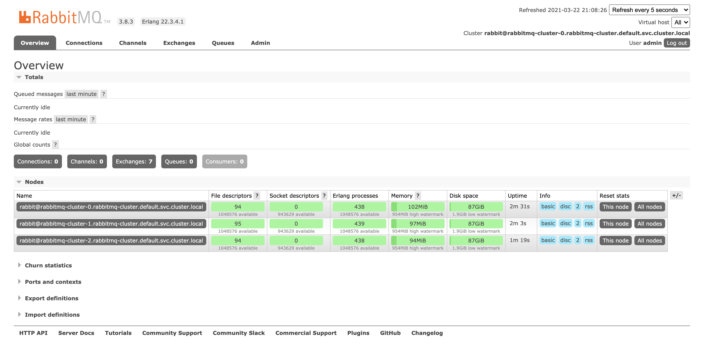

# **基于k8s手动部署rabbitmq集群**

## **1、rabbitmq介绍**

`RabbitMQ` 是实现了高级消息队列协议`AMQP`的开源消息代理软件（亦称面向消息的中间件）。

`RabbitMQ`服务器是用`Erlang`语言编写的，而集群和故障转移是构建在开放电信平台框架上的。

`AMQP：Advanced Message Queue`，高级消息队列协议。它是应用层协议的一个开放标准，为面向消息的中间件设计，基于此协议的客户端与消息中间件可传递消息，并不受产品、开发语言灯条件的限制

AMQP具有如下的特性：

* 可靠性Reliablity：使用了一些机制来保证可靠性，比如持久化、传输确认、发布确认
* 灵活的路由`Flexible Routing`：在**消息进入队列之前，通过`Exchange`来路由消息**。
	* 对于典型的路由功能，`Rabbit`已经提供了一些内置的`Exchange`来实现。
	* 针对更复杂的路由功能，可以将多个`Exchange`绑定在一起，也通过插件机制实现自己的`Exchange`
* 消息集群`Clustering`：多个`RabbitMQ`服务器可以组成一个集群，形成一个逻辑`Broker`
* 高可用`Highly Avaliable Queues`：队列可以在集群中的机器上进行镜像，使得在部分节点出问题的情况下队列仍然可用\
* 多种协议`Multi-protocol`：支持多种消息队列协议，如`STOMP`、`MQTT`等
* 多种语言客户端`Many Clients`：几乎支持所有常用语言，比如Java、.NET、Ruby等
* 管理界面Management UI：提供了易用的用户界面，使得用户可以监控和管理消息Broker的许多方面
* 跟踪机制Tracing：如果消息异常，RabbitMQ提供了消息的跟踪机制，使用者可以找出发生了什么
* 插件机制Plugin System：提供了许多插件，来从多方面进行扩展，也可以编辑自己的插件


## **2、RabbitMQ的持久化和镜像队列**

* RabbitMQ持久化分为`Exchange`、`Queue`、`Message`

* **`Exchange`和`Queue`持久化：指持久化`Exchange`、`Queue`元数据，持久化的是自身，服务宕机`Exchange`和`Queue`自身就没有了**
* `Message`持久化：顾名思义就是把每一条消息体持久化，服务宕机，消息不丢失


**RabbitMQ的队列Queue镜像，指`master node`在接受到请求后，会同步到其他节点上，以此来保证高可用。在confirm模式下，具体过程如下**

```
clientpublisher发送消息 –> 
master node接到消息 –> 
master node将消息持久化到磁盘 –> 
将消息异步发送给其他节点 –> 
master将ack返回给client publisher
```

## **3、RabbitMQ集群在k8s中的部署**

将RabbitMQ以集群的方式部署在k8s中，前提是RabbitMQ的每个节点都能像传统方式一样进行相互的服务发现。

**因此`RabbitMQ`在k8s集群中通过`rabbitmq_peer_discovery_k8s plugin`与`k8s apiserver`进行交互，获取各个服务的`URL`，且`RabbitMQ`在k8s集群中必须用`statefulset`和`headless servic`进行匹配**

**需要注意的是，`rabbitmq_peer_discovery_k8s`是`RabbitMQ`官方基于第三方开源项目`rabbitmq-autocluster`开发，**

对`3.7.X`及以上版本提供的Kubernetes下的对等发现插件，可实现`rabbitmq`集群在`k8s`中的自动化部署，因此低于`3.7.X`版本请使用`rabbitmq-autocluster`

### **3.1 环境介绍**

本文部署的版本是3.8.3


**默认部署在default命名空间下，**


持久化存储为`storageclass`动态存储，底层为`nfs`提供

镜像地址rabbitmq:3.8.3-management

以下yaml参考自官方示例[https://github.com/rabbitmq/diy-kubernetes-examples](https://github.com/rabbitmq/diy-kubernetes-examples)


### **3.2 创建configmap**

**`01-rabbitmq-configmap.yaml`**

```
kind: ConfigMap
apiVersion: v1
metadata:
  name: rabbitmq-cluster-config
  namespace: default
  labels:
    addonmanager.kubernetes.io/mode: Reconcile
data:
    enabled_plugins: |
      [rabbitmq_management,rabbitmq_peer_discovery_k8s].
    rabbitmq.conf: |
      default_user = admin
      default_pass = admin
      ## Cluster formation. See https://www.rabbitmq.com/cluster-formation.html to learn more.
      cluster_formation.peer_discovery_backend = rabbit_peer_discovery_k8s
      cluster_formation.k8s.host = kubernetes.default.svc.cluster.local
      ## Should RabbitMQ node name be computed from the pod's hostname or IP address?
      ## IP addresses are not stable, so using [stable] hostnames is recommended when possible.
      ## Set to "hostname" to use pod hostnames.
      ## When this value is changed, so should the variable used to set the RABBITMQ_NODENAME
      ## environment variable.
      cluster_formation.k8s.address_type = hostname
      ## How often should node cleanup checks run?
      cluster_formation.node_cleanup.interval = 30
      ## Set to false if automatic removal of unknown/absent nodes
      ## is desired. This can be dangerous, see
      ##  * https://www.rabbitmq.com/cluster-formation.html#node-health-checks-and-cleanup
      ##  * https://groups.google.com/forum/#!msg/rabbitmq-users/wuOfzEywHXo/k8z_HWIkBgAJ
      cluster_formation.node_cleanup.only_log_warning = true
      cluster_partition_handling = autoheal
      ## See https://www.rabbitmq.com/ha.html#master-migration-data-locality
      queue_master_locator=min-masters
      ## See https://www.rabbitmq.com/access-control.html#loopback-users
      loopback_users.guest = false
      cluster_formation.randomized_startup_delay_range.min = 0
      cluster_formation.randomized_startup_delay_range.max = 2
      # default is rabbitmq-cluster's namespace
      # hostname_suffix
      cluster_formation.k8s.hostname_suffix = .rabbitmq-cluster.default.svc.cluster.local
      # memory
      vm_memory_high_watermark.absolute = 1GB
      # disk
      disk_free_limit.absolute = 2GB
```

部分参数说明：

* `enabled_plugins`：声明开启的插件名
* `default_pass/default_pass`：声明用户名和密码（虽然有部分文章记录可以通过环境变量的方式声明，但是经测试，针对此版本如果指定了`configmap`即`rabbitmq`的配置文件，声明的环境变量是没有用的，都需要在配置文件中指定）
* `cluster_formation.k8s.address_type`：从k8s返回的Pod容器列表中计算对等节点列表，这里只能使用主机名，官方示例中是ip，但是默认情况下在k8s中pod的ip都是不固定的，因此可能导致节点的配置和数据丢失，后面的`yaml`中会通过引用元数据的方式固定pod的主机名。

### **3.3 创建service**

**`02-rabbitmq-service.yaml`**

```
kind: Service
apiVersion: v1
metadata:
  labels:
    app: rabbitmq-cluster
  name: rabbitmq-cluster
  namespace: default
spec:
  clusterIP: None
  ports:
  - name: rmqport
    port: 5672
    targetPort: 5672
  selector:
    app: rabbitmq-cluster

---
kind: Service
apiVersion: v1
metadata:
  labels:
    app: rabbitmq-cluster
  name: rabbitmq-cluster-manage
  namespace: default
spec:
  ports:
  - name: http
    port: 15672
    protocol: TCP
    targetPort: 15672
  selector:
    app: rabbitmq-cluster
  type: NodePort
```

**上面定义了两个`Service`，一个是`rabbitmq`的服务端口，一个是管理界面的端口，用户外部访问，这里通过`NodePort`方式进行暴露**

### **3.4 创建rbac授权**

前面的介绍中提到了RabbitMQ通过插件与k8s apiserver交互获得集群中节点相关信息，因此需要对其进行RBAC授权

**`03-rabbitmq-rbac.yaml`**

```
apiVersion: v1
kind: ServiceAccount
metadata:
  name: rabbitmq-cluster
  namespace: default
---
kind: Role
apiVersion: rbac.authorization.k8s.io/v1beta1
metadata:
  name: rabbitmq-cluster
  namespace: default
rules:
- apiGroups: [""]
  resources: ["endpoints"]
  verbs: ["get"]
---
kind: RoleBinding
apiVersion: rbac.authorization.k8s.io/v1beta1
metadata:
  name: rabbitmq-cluster
  namespace: default
roleRef:
  apiGroup: rbac.authorization.k8s.io
  kind: Role
  name: rabbitmq-cluster
subjects:
- kind: ServiceAccount
  name: rabbitmq-cluster
  namespace: default
```

### **3.5 创建statefulset**

RabbitMQ在k8s中作为一个有状态应用进行部署，因此控制器类型为StatefulSet，yaml中还定义了pvc相关内容

**04-rabbitmq-cluster-sts.yaml**

```
kind: StatefulSet
apiVersion: apps/v1
metadata:
  labels:
    app: rabbitmq-cluster
  name: rabbitmq-cluster
  namespace: default
spec:
  replicas: 3
  selector:
    matchLabels:
      app: rabbitmq-cluster
  serviceName: rabbitmq-cluster
  template:
    metadata:
      labels:
        app: rabbitmq-cluster
    spec:
      containers:
      - args:
        - -c
        - cp -v /etc/rabbitmq/rabbitmq.conf ${RABBITMQ_CONFIG_FILE}; exec docker-entrypoint.sh
          rabbitmq-server
        command:
        - sh
        env:
        - name: TZ
          value: 'Asia/Shanghai'
        - name: RABBITMQ_ERLANG_COOKIE
          value: 'SWvCP0Hrqv43NG7GybHC95ntCJKoW8UyNFWnBEWG8TY='
        - name: K8S_SERVICE_NAME
          value: rabbitmq-cluster
        - name: POD_IP
          valueFrom:
            fieldRef:
              fieldPath: status.podIP
        - name: POD_NAME
          valueFrom:
            fieldRef:
              fieldPath: metadata.name
        - name: POD_NAMESPACE
          valueFrom:
            fieldRef:
              fieldPath: metadata.namespace
        - name: RABBITMQ_USE_LONGNAME
          value: "true"
        - name: RABBITMQ_NODENAME
          value: rabbit@$(POD_NAME).$(K8S_SERVICE_NAME).$(POD_NAMESPACE).svc.cluster.local
        - name: RABBITMQ_CONFIG_FILE
          value: /var/lib/rabbitmq/rabbitmq.conf
        image: rabbitmq:3.8.3-management
        imagePullPolicy: IfNotPresent
        livenessProbe:
          exec:
            command:
            - rabbitmq-diagnostics
            - status
          # See https://www.rabbitmq.com/monitoring.html for monitoring frequency recommendations.
          initialDelaySeconds: 60
          periodSeconds: 60
          timeoutSeconds: 15
        name: rabbitmq
        ports:
        - containerPort: 15672
          name: http
          protocol: TCP
        - containerPort: 5672
          name: amqp
          protocol: TCP
        readinessProbe:
          exec:
            command:
            - rabbitmq-diagnostics
            - status
          initialDelaySeconds: 20
          periodSeconds: 60
          timeoutSeconds: 10
        volumeMounts:
        - mountPath: /etc/rabbitmq
          name: config-volume
          readOnly: false
        - mountPath: /var/lib/rabbitmq
          name: rabbitmq-storage
          readOnly: false
        - name: timezone
          mountPath: /etc/localtime
          readOnly: true
      serviceAccountName: rabbitmq-cluster
      terminationGracePeriodSeconds: 30
      volumes:
      - name: config-volume
        configMap:
          items:
          - key: rabbitmq.conf
            path: rabbitmq.conf
          - key: enabled_plugins
            path: enabled_plugins
          name: rabbitmq-cluster-config
      - name: timezone
        hostPath:
          path: /usr/share/zoneinfo/Asia/Shanghai
  volumeClaimTemplates:
  - metadata:
      name: rabbitmq-storage
    spec:
      accessModes:
      - ReadWriteMany
      # storageClassName: "managed-nfs-storage"
      storageClassName: "hostpath"
      resources:
        requests:
          storage: 2Gi
```


### **3.6 部署检查**


```
$ kubectl get po,sts -l app=rabbitmq-cluster
NAME                     READY   STATUS    RESTARTS   AGE
pod/rabbitmq-cluster-0   1/1     Running   0          3m11s
pod/rabbitmq-cluster-1   1/1     Running   0          2m17s
pod/rabbitmq-cluster-2   1/1     Running   0          96s

NAME                                READY   AGE
statefulset.apps/rabbitmq-cluster   3/3     3m11s
```

查看日志，从日志的最后部分观察集群建立的状态

```
kubectl logs -f rabbitmq-cluster-0

$ kubectl logs -f rabbitmq-cluster-0
'/etc/rabbitmq/rabbitmq.conf' -> '/var/lib/rabbitmq/rabbitmq.conf'
2021-03-22 12:16:48.978 [info] <0.9.0> Feature flags: list of feature flags found:
2021-03-22 12:16:48.978 [info] <0.9.0> Feature flags:   [ ] drop_unroutable_metric
2021-03-22 12:16:48.979 [info] <0.9.0> Feature flags:   [ ] empty_basic_get_metric
2021-03-22 12:16:48.979 [info] <0.9.0> Feature flags:   [ ] implicit_default_bindings
2021-03-22 12:16:48.979 [info] <0.9.0> Feature flags:   [ ] quorum_queue
2021-03-22 12:16:48.979 [info] <0.9.0> Feature flags:   [ ] virtual_host_metadata
2021-03-22 12:16:48.979 [info] <0.9.0> Feature flags: feature flag states written to disk: yes
2021-03-22 12:16:49.006 [info] <0.269.0> ra: meta data store initialised. 0 record(s) recovered
2021-03-22 12:16:49.007 [info] <0.274.0> WAL: recovering []
2021-03-22 12:16:49.015 [info] <0.278.0> 
 Starting RabbitMQ 3.8.3 on Erlang 22.3.4.1
 Copyright (c) 2007-2020 Pivotal Software, Inc.
 Licensed under the MPL 1.1. Website: https://rabbitmq.com

  ##  ##      RabbitMQ 3.8.3
  ##  ##
  ##########  Copyright (c) 2007-2020 Pivotal Software, Inc.
  ######  ##
  ##########  Licensed under the MPL 1.1. Website: https://rabbitmq.com

  Doc guides: https://rabbitmq.com/documentation.html
  Support:    https://rabbitmq.com/contact.html
  Tutorials:  https://rabbitmq.com/getstarted.html
  Monitoring: https://rabbitmq.com/monitoring.html

  Logs: <stdout>

  Config file(s): /var/lib/rabbitmq/rabbitmq.conf

  Starting broker...2021-03-22 12:16:49.016 [info] <0.278.0> 
 node           : rabbit@rabbitmq-cluster-0.rabbitmq-cluster.default.svc.cluster.local
 home dir       : /var/lib/rabbitmq
 config file(s) : /var/lib/rabbitmq/rabbitmq.conf
 cookie hash    : H+IQL2spD4MDV4jPi7mMAg==
 log(s)         : <stdout>
 database dir   : /var/lib/rabbitmq/mnesia/rabbit@rabbitmq-cluster-0.rabbitmq-cluster.default.svc.cluster.local
2021-03-22 12:16:49.029 [info] <0.278.0> Running boot step pre_boot defined by app rabbit
2021-03-22 12:16:49.029 [info] <0.278.0> Running boot step rabbit_core_metrics defined by app rabbit
2021-03-22 12:16:49.030 [info] <0.278.0> Running boot step rabbit_alarm defined by app rabbit
2021-03-22 12:16:49.035 [info] <0.284.0> Memory high watermark set to 953 MiB (1000000000 bytes) of 7964 MiB (8351621120 bytes) total
2021-03-22 12:16:49.041 [info] <0.286.0> Enabling free disk space monitoring
2021-03-22 12:16:49.041 [info] <0.286.0> Disk free limit set to 2000MB
2021-03-22 12:16:49.045 [info] <0.278.0> Running boot step code_server_cache defined by app rabbit
2021-03-22 12:16:49.045 [info] <0.278.0> Running boot step file_handle_cache defined by app rabbit
2021-03-22 12:16:49.045 [info] <0.289.0> Limiting to approx 1048479 file handles (943629 sockets)
2021-03-22 12:16:49.045 [info] <0.290.0> FHC read buffering:  OFF
2021-03-22 12:16:49.045 [info] <0.290.0> FHC write buffering: ON
2021-03-22 12:16:49.046 [info] <0.278.0> Running boot step worker_pool defined by app rabbit
2021-03-22 12:16:49.046 [info] <0.279.0> Will use 5 processes for default worker pool
2021-03-22 12:16:49.046 [info] <0.279.0> Starting worker pool 'worker_pool' with 5 processes in it
2021-03-22 12:16:49.046 [info] <0.278.0> Running boot step database defined by app rabbit
2021-03-22 12:16:49.047 [info] <0.278.0> Node database directory at /var/lib/rabbitmq/mnesia/rabbit@rabbitmq-cluster-0.rabbitmq-cluster.default.svc.cluster.local is empty. Assuming we need to join an existing cluster or initialise from scratch...
2021-03-22 12:16:49.047 [info] <0.278.0> Configured peer discovery backend: rabbit_peer_discovery_k8s
2021-03-22 12:16:49.047 [info] <0.278.0> Will try to lock with peer discovery backend rabbit_peer_discovery_k8s
2021-03-22 12:16:49.047 [info] <0.278.0> Peer discovery backend does not support locking, falling back to randomized delay
2021-03-22 12:16:49.047 [info] <0.278.0> Peer discovery backend rabbit_peer_discovery_k8s supports registration.
2021-03-22 12:16:49.047 [info] <0.278.0> Will wait for 1408 milliseconds before proceeding with registration...
2021-03-22 12:16:50.648 [info] <0.278.0> k8s endpoint listing returned nodes not yet ready: rabbitmq-cluster-0
2021-03-22 12:16:50.649 [info] <0.278.0> All discovered existing cluster peers: 
2021-03-22 12:16:50.649 [info] <0.278.0> Discovered no peer nodes to cluster with. Some discovery backends can filter nodes out based on a readiness criteria. Enabling debug logging might help troubleshoot.
2021-03-22 12:16:50.654 [info] <0.44.0> Application mnesia exited with reason: stopped
2021-03-22 12:16:50.813 [info] <0.278.0> Waiting for Mnesia tables for 30000 ms, 9 retries left
2021-03-22 12:16:50.846 [info] <0.278.0> Waiting for Mnesia tables for 30000 ms, 9 retries left
2021-03-22 12:16:50.846 [info] <0.278.0> Feature flag `drop_unroutable_metric`: supported, attempt to enable...
2021-03-22 12:16:50.846 [info] <0.278.0> Feature flag `drop_unroutable_metric`: mark as enabled=state_changing
2021-03-22 12:16:50.861 [info] <0.278.0> Feature flags: list of feature flags found:
2021-03-22 12:16:50.861 [info] <0.278.0> Feature flags:   [~] drop_unroutable_metric
2021-03-22 12:16:50.861 [info] <0.278.0> Feature flags:   [ ] empty_basic_get_metric
2021-03-22 12:16:50.861 [info] <0.278.0> Feature flags:   [ ] implicit_default_bindings
2021-03-22 12:16:50.861 [info] <0.278.0> Feature flags:   [ ] quorum_queue
2021-03-22 12:16:50.861 [info] <0.278.0> Feature flags:   [ ] virtual_host_metadata
2021-03-22 12:16:50.861 [info] <0.278.0> Feature flags: feature flag states written to disk: yes
2021-03-22 12:16:50.873 [info] <0.278.0> Feature flag `drop_unroutable_metric`: mark as enabled=true
2021-03-22 12:16:50.889 [info] <0.278.0> Feature flags: list of feature flags found:
2021-03-22 12:16:50.889 [info] <0.278.0> Feature flags:   [x] drop_unroutable_metric
2021-03-22 12:16:50.890 [info] <0.278.0> Feature flags:   [ ] empty_basic_get_metric
2021-03-22 12:16:50.890 [info] <0.278.0> Feature flags:   [ ] implicit_default_bindings
2021-03-22 12:16:50.890 [info] <0.278.0> Feature flags:   [ ] quorum_queue
2021-03-22 12:16:50.891 [info] <0.278.0> Feature flags:   [ ] virtual_host_metadata
2021-03-22 12:16:50.891 [info] <0.278.0> Feature flags: feature flag states written to disk: yes
2021-03-22 12:16:50.905 [info] <0.278.0> Feature flag `empty_basic_get_metric`: supported, attempt to enable...
2021-03-22 12:16:50.905 [info] <0.278.0> Feature flag `empty_basic_get_metric`: mark as enabled=state_changing
2021-03-22 12:16:50.920 [info] <0.278.0> Feature flags: list of feature flags found:
2021-03-22 12:16:50.920 [info] <0.278.0> Feature flags:   [x] drop_unroutable_metric
2021-03-22 12:16:50.920 [info] <0.278.0> Feature flags:   [~] empty_basic_get_metric
2021-03-22 12:16:50.920 [info] <0.278.0> Feature flags:   [ ] implicit_default_bindings
2021-03-22 12:16:50.920 [info] <0.278.0> Feature flags:   [ ] quorum_queue
2021-03-22 12:16:50.920 [info] <0.278.0> Feature flags:   [ ] virtual_host_metadata
2021-03-22 12:16:50.920 [info] <0.278.0> Feature flags: feature flag states written to disk: yes
2021-03-22 12:16:50.935 [info] <0.278.0> Feature flag `empty_basic_get_metric`: mark as enabled=true
2021-03-22 12:16:50.952 [info] <0.278.0> Feature flags: list of feature flags found:
2021-03-22 12:16:50.952 [info] <0.278.0> Feature flags:   [x] drop_unroutable_metric
2021-03-22 12:16:50.952 [info] <0.278.0> Feature flags:   [x] empty_basic_get_metric
2021-03-22 12:16:50.952 [info] <0.278.0> Feature flags:   [ ] implicit_default_bindings
2021-03-22 12:16:50.952 [info] <0.278.0> Feature flags:   [ ] quorum_queue
2021-03-22 12:16:50.952 [info] <0.278.0> Feature flags:   [ ] virtual_host_metadata
2021-03-22 12:16:50.952 [info] <0.278.0> Feature flags: feature flag states written to disk: yes
2021-03-22 12:16:50.964 [info] <0.278.0> Feature flag `implicit_default_bindings`: supported, attempt to enable...
2021-03-22 12:16:50.964 [info] <0.278.0> Feature flag `implicit_default_bindings`: mark as enabled=state_changing
2021-03-22 12:16:50.979 [info] <0.278.0> Feature flags: list of feature flags found:
2021-03-22 12:16:50.979 [info] <0.278.0> Feature flags:   [x] drop_unroutable_metric
2021-03-22 12:16:50.979 [info] <0.278.0> Feature flags:   [x] empty_basic_get_metric
2021-03-22 12:16:50.979 [info] <0.278.0> Feature flags:   [~] implicit_default_bindings
2021-03-22 12:16:50.979 [info] <0.278.0> Feature flags:   [ ] quorum_queue
2021-03-22 12:16:50.979 [info] <0.278.0> Feature flags:   [ ] virtual_host_metadata
2021-03-22 12:16:50.979 [info] <0.278.0> Feature flags: feature flag states written to disk: yes
2021-03-22 12:16:50.995 [info] <0.278.0> Waiting for Mnesia tables for 30000 ms, 0 retries left
2021-03-22 12:16:50.995 [info] <0.278.0> Feature flag `implicit_default_bindings`: mark as enabled=true
2021-03-22 12:16:51.013 [info] <0.278.0> Feature flags: list of feature flags found:
2021-03-22 12:16:51.013 [info] <0.278.0> Feature flags:   [x] drop_unroutable_metric
2021-03-22 12:16:51.013 [info] <0.278.0> Feature flags:   [x] empty_basic_get_metric
2021-03-22 12:16:51.013 [info] <0.278.0> Feature flags:   [x] implicit_default_bindings
2021-03-22 12:16:51.013 [info] <0.278.0> Feature flags:   [ ] quorum_queue
2021-03-22 12:16:51.013 [info] <0.278.0> Feature flags:   [ ] virtual_host_metadata
2021-03-22 12:16:51.013 [info] <0.278.0> Feature flags: feature flag states written to disk: yes
2021-03-22 12:16:51.025 [info] <0.278.0> Feature flag `quorum_queue`: supported, attempt to enable...
2021-03-22 12:16:51.025 [info] <0.278.0> Feature flag `quorum_queue`: mark as enabled=state_changing
2021-03-22 12:16:51.040 [info] <0.278.0> Feature flags: list of feature flags found:
2021-03-22 12:16:51.040 [info] <0.278.0> Feature flags:   [x] drop_unroutable_metric
2021-03-22 12:16:51.040 [info] <0.278.0> Feature flags:   [x] empty_basic_get_metric
2021-03-22 12:16:51.040 [info] <0.278.0> Feature flags:   [x] implicit_default_bindings
2021-03-22 12:16:51.040 [info] <0.278.0> Feature flags:   [~] quorum_queue
2021-03-22 12:16:51.041 [info] <0.278.0> Feature flags:   [ ] virtual_host_metadata
2021-03-22 12:16:51.041 [info] <0.278.0> Feature flags: feature flag states written to disk: yes
2021-03-22 12:16:51.053 [info] <0.278.0> Waiting for Mnesia tables for 30000 ms, 9 retries left
2021-03-22 12:16:51.053 [info] <0.278.0> Feature flag `quorum_queue`:   migrating Mnesia table rabbit_queue...
2021-03-22 12:16:51.068 [info] <0.278.0> Feature flag `quorum_queue`:   migrating Mnesia table rabbit_durable_queue...
2021-03-22 12:16:51.081 [info] <0.278.0> Feature flag `quorum_queue`:   Mnesia tables migration done
2021-03-22 12:16:51.081 [info] <0.278.0> Feature flag `quorum_queue`: mark as enabled=true
2021-03-22 12:16:51.095 [info] <0.278.0> Feature flags: list of feature flags found:
2021-03-22 12:16:51.095 [info] <0.278.0> Feature flags:   [x] drop_unroutable_metric
2021-03-22 12:16:51.095 [info] <0.278.0> Feature flags:   [x] empty_basic_get_metric
2021-03-22 12:16:51.095 [info] <0.278.0> Feature flags:   [x] implicit_default_bindings
2021-03-22 12:16:51.095 [info] <0.278.0> Feature flags:   [x] quorum_queue
2021-03-22 12:16:51.095 [info] <0.278.0> Feature flags:   [ ] virtual_host_metadata
2021-03-22 12:16:51.095 [info] <0.278.0> Feature flags: feature flag states written to disk: yes
2021-03-22 12:16:51.107 [info] <0.278.0> Feature flag `virtual_host_metadata`: supported, attempt to enable...
2021-03-22 12:16:51.108 [info] <0.278.0> Feature flag `virtual_host_metadata`: mark as enabled=state_changing
2021-03-22 12:16:51.121 [info] <0.278.0> Feature flags: list of feature flags found:
2021-03-22 12:16:51.121 [info] <0.278.0> Feature flags:   [x] drop_unroutable_metric
2021-03-22 12:16:51.121 [info] <0.278.0> Feature flags:   [x] empty_basic_get_metric
2021-03-22 12:16:51.122 [info] <0.278.0> Feature flags:   [x] implicit_default_bindings
2021-03-22 12:16:51.122 [info] <0.278.0> Feature flags:   [x] quorum_queue
2021-03-22 12:16:51.122 [info] <0.278.0> Feature flags:   [~] virtual_host_metadata
2021-03-22 12:16:51.122 [info] <0.278.0> Feature flags: feature flag states written to disk: yes
2021-03-22 12:16:51.134 [info] <0.278.0> Waiting for Mnesia tables for 30000 ms, 9 retries left
2021-03-22 12:16:51.153 [info] <0.278.0> Feature flag `virtual_host_metadata`: mark as enabled=true
2021-03-22 12:16:51.168 [info] <0.278.0> Feature flags: list of feature flags found:
2021-03-22 12:16:51.168 [info] <0.278.0> Feature flags:   [x] drop_unroutable_metric
2021-03-22 12:16:51.168 [info] <0.278.0> Feature flags:   [x] empty_basic_get_metric
2021-03-22 12:16:51.169 [info] <0.278.0> Feature flags:   [x] implicit_default_bindings
2021-03-22 12:16:51.169 [info] <0.278.0> Feature flags:   [x] quorum_queue
2021-03-22 12:16:51.169 [info] <0.278.0> Feature flags:   [x] virtual_host_metadata
2021-03-22 12:16:51.169 [info] <0.278.0> Feature flags: feature flag states written to disk: yes
2021-03-22 12:16:51.181 [info] <0.278.0> Waiting for Mnesia tables for 30000 ms, 9 retries left
2021-03-22 12:16:51.212 [info] <0.278.0> Waiting for Mnesia tables for 30000 ms, 9 retries left
2021-03-22 12:16:51.212 [info] <0.278.0> Will register with peer discovery backend rabbit_peer_discovery_k8s
2021-03-22 12:16:51.219 [info] <0.278.0> Running boot step database_sync defined by app rabbit
2021-03-22 12:16:51.219 [info] <0.278.0> Running boot step feature_flags defined by app rabbit
2021-03-22 12:16:51.219 [info] <0.278.0> Running boot step codec_correctness_check defined by app rabbit
2021-03-22 12:16:51.220 [info] <0.278.0> Running boot step external_infrastructure defined by app rabbit
2021-03-22 12:16:51.220 [info] <0.278.0> Running boot step rabbit_registry defined by app rabbit
2021-03-22 12:16:51.220 [info] <0.278.0> Running boot step rabbit_auth_mechanism_cr_demo defined by app rabbit
2021-03-22 12:16:51.220 [info] <0.278.0> Running boot step rabbit_queue_location_random defined by app rabbit
2021-03-22 12:16:51.220 [info] <0.278.0> Running boot step rabbit_event defined by app rabbit
2021-03-22 12:16:51.220 [info] <0.278.0> Running boot step rabbit_auth_mechanism_amqplain defined by app rabbit
2021-03-22 12:16:51.221 [info] <0.278.0> Running boot step rabbit_auth_mechanism_plain defined by app rabbit
2021-03-22 12:16:51.221 [info] <0.278.0> Running boot step rabbit_exchange_type_direct defined by app rabbit
2021-03-22 12:16:51.221 [info] <0.278.0> Running boot step rabbit_exchange_type_fanout defined by app rabbit
2021-03-22 12:16:51.221 [info] <0.278.0> Running boot step rabbit_exchange_type_headers defined by app rabbit
2021-03-22 12:16:51.221 [info] <0.278.0> Running boot step rabbit_exchange_type_topic defined by app rabbit
2021-03-22 12:16:51.222 [info] <0.278.0> Running boot step rabbit_mirror_queue_mode_all defined by app rabbit
2021-03-22 12:16:51.222 [info] <0.278.0> Running boot step rabbit_mirror_queue_mode_exactly defined by app rabbit
2021-03-22 12:16:51.222 [info] <0.278.0> Running boot step rabbit_mirror_queue_mode_nodes defined by app rabbit
2021-03-22 12:16:51.222 [info] <0.278.0> Running boot step rabbit_priority_queue defined by app rabbit
2021-03-22 12:16:51.222 [info] <0.278.0> Priority queues enabled, real BQ is rabbit_variable_queue
2021-03-22 12:16:51.222 [info] <0.278.0> Running boot step rabbit_queue_location_client_local defined by app rabbit
2021-03-22 12:16:51.223 [info] <0.278.0> Running boot step rabbit_queue_location_min_masters defined by app rabbit
2021-03-22 12:16:51.223 [info] <0.278.0> Running boot step kernel_ready defined by app rabbit
2021-03-22 12:16:51.223 [info] <0.278.0> Running boot step rabbit_sysmon_minder defined by app rabbit
2021-03-22 12:16:51.223 [info] <0.278.0> Running boot step rabbit_epmd_monitor defined by app rabbit
2021-03-22 12:16:51.224 [info] <0.528.0> epmd monitor knows us, inter-node communication (distribution) port: 25672
2021-03-22 12:16:51.225 [info] <0.278.0> Running boot step guid_generator defined by app rabbit
2021-03-22 12:16:51.227 [info] <0.278.0> Running boot step rabbit_node_monitor defined by app rabbit
2021-03-22 12:16:51.228 [info] <0.532.0> Starting rabbit_node_monitor
2021-03-22 12:16:51.228 [info] <0.278.0> Running boot step delegate_sup defined by app rabbit
2021-03-22 12:16:51.230 [info] <0.278.0> Running boot step rabbit_memory_monitor defined by app rabbit
2021-03-22 12:16:51.231 [info] <0.278.0> Running boot step core_initialized defined by app rabbit
2021-03-22 12:16:51.231 [info] <0.278.0> Running boot step upgrade_queues defined by app rabbit
2021-03-22 12:16:51.259 [info] <0.278.0> message_store upgrades: 1 to apply
2021-03-22 12:16:51.260 [info] <0.278.0> message_store upgrades: Applying rabbit_variable_queue:move_messages_to_vhost_store
2021-03-22 12:16:51.260 [info] <0.278.0> message_store upgrades: No durable queues found. Skipping message store migration
2021-03-22 12:16:51.260 [info] <0.278.0> message_store upgrades: Removing the old message store data
2021-03-22 12:16:51.260 [info] <0.278.0> message_store upgrades: All upgrades applied successfully
2021-03-22 12:16:51.289 [info] <0.278.0> Running boot step rabbit_connection_tracking defined by app rabbit
2021-03-22 12:16:51.290 [info] <0.278.0> Running boot step rabbit_connection_tracking_handler defined by app rabbit
2021-03-22 12:16:51.290 [info] <0.278.0> Running boot step rabbit_exchange_parameters defined by app rabbit
2021-03-22 12:16:51.290 [info] <0.278.0> Running boot step rabbit_mirror_queue_misc defined by app rabbit
2021-03-22 12:16:51.291 [info] <0.278.0> Running boot step rabbit_policies defined by app rabbit
2021-03-22 12:16:51.292 [info] <0.278.0> Running boot step rabbit_policy defined by app rabbit
2021-03-22 12:16:51.292 [info] <0.278.0> Running boot step rabbit_queue_location_validator defined by app rabbit
2021-03-22 12:16:51.292 [info] <0.278.0> Running boot step rabbit_quorum_memory_manager defined by app rabbit
2021-03-22 12:16:51.292 [info] <0.278.0> Running boot step rabbit_vhost_limit defined by app rabbit
2021-03-22 12:16:51.292 [info] <0.278.0> Running boot step rabbit_mgmt_reset_handler defined by app rabbitmq_management
2021-03-22 12:16:51.292 [info] <0.278.0> Running boot step rabbit_mgmt_db_handler defined by app rabbitmq_management_agent
2021-03-22 12:16:51.292 [info] <0.278.0> Management plugin: using rates mode 'basic'
2021-03-22 12:16:51.293 [info] <0.278.0> Running boot step recovery defined by app rabbit
2021-03-22 12:16:51.294 [info] <0.278.0> Running boot step load_core_definitions defined by app rabbit
2021-03-22 12:16:51.294 [info] <0.278.0> Running boot step empty_db_check defined by app rabbit
2021-03-22 12:16:51.294 [info] <0.278.0> Adding vhost '/' (description: 'Default virtual host')
2021-03-22 12:16:51.309 [info] <0.573.0> Making sure data directory '/var/lib/rabbitmq/mnesia/rabbit@rabbitmq-cluster-0.rabbitmq-cluster.default.svc.cluster.local/msg_stores/vhosts/628WB79CIFDYO9LJI6DKMI09L' for vhost '/' exists
2021-03-22 12:16:51.314 [info] <0.573.0> Starting message stores for vhost '/'
2021-03-22 12:16:51.314 [info] <0.577.0> Message store "628WB79CIFDYO9LJI6DKMI09L/msg_store_transient": using rabbit_msg_store_ets_index to provide index
2021-03-22 12:16:51.316 [info] <0.573.0> Started message store of type transient for vhost '/'
2021-03-22 12:16:51.316 [info] <0.580.0> Message store "628WB79CIFDYO9LJI6DKMI09L/msg_store_persistent": using rabbit_msg_store_ets_index to provide index
```


进入到`pod`中通过客户端查看集群状态

```
$  kubectl exec -it rabbitmq-cluster-0 bash
 root@rabbitmq-cluster-0:/# rabbitmqctl cluster_status
Cluster status of node rabbit@rabbitmq-cluster-0.rabbitmq-cluster.default.svc.cluster.local ...
Basics

Cluster name: rabbit@rabbitmq-cluster-0.rabbitmq-cluster.default.svc.cluster.local

Disk Nodes

rabbit@rabbitmq-cluster-0.rabbitmq-cluster.default.svc.cluster.local
rabbit@rabbitmq-cluster-1.rabbitmq-cluster.default.svc.cluster.local
rabbit@rabbitmq-cluster-2.rabbitmq-cluster.default.svc.cluster.local

Running Nodes

rabbit@rabbitmq-cluster-0.rabbitmq-cluster.default.svc.cluster.local
rabbit@rabbitmq-cluster-1.rabbitmq-cluster.default.svc.cluster.local
rabbit@rabbitmq-cluster-2.rabbitmq-cluster.default.svc.cluster.local

Versions

rabbit@rabbitmq-cluster-0.rabbitmq-cluster.default.svc.cluster.local: RabbitMQ 3.8.3 on Erlang 22.3.4.1
rabbit@rabbitmq-cluster-1.rabbitmq-cluster.default.svc.cluster.local: RabbitMQ 3.8.3 on Erlang 22.3.4.1
rabbit@rabbitmq-cluster-2.rabbitmq-cluster.default.svc.cluster.local: RabbitMQ 3.8.3 on Erlang 22.3.4.1

Alarms

(none)

Network Partitions

(none)

Listeners

Node: rabbit@rabbitmq-cluster-0.rabbitmq-cluster.default.svc.cluster.local, interface: [::], port: 25672, protocol: clustering, purpose: inte
r-node and CLI tool communication
Node: rabbit@rabbitmq-cluster-0.rabbitmq-cluster.default.svc.cluster.local, interface: [::], port: 5672, protocol: amqp, purpose: AMQP 0-9-1 
and AMQP 1.0
Node: rabbit@rabbitmq-cluster-0.rabbitmq-cluster.default.svc.cluster.local, interface: [::], port: 15672, protocol: http, purpose: HTTP API
Node: rabbit@rabbitmq-cluster-1.rabbitmq-cluster.default.svc.cluster.local, interface: [::], port: 25672, protocol: clustering, purpose: inte
r-node and CLI tool communication
Node: rabbit@rabbitmq-cluster-1.rabbitmq-cluster.default.svc.cluster.local, interface: [::], port: 5672, protocol: amqp, purpose: AMQP 0-9-1 and AMQP 1.0
Node: rabbit@rabbitmq-cluster-1.rabbitmq-cluster.default.svc.cluster.local, interface: [::], port: 15672, protocol: http, purpose: HTTP API
Node: rabbit@rabbitmq-cluster-2.rabbitmq-cluster.default.svc.cluster.local, interface: [::], port: 25672, protocol: clustering, purpose: inter-node and CLI tool communication
Node: rabbit@rabbitmq-cluster-2.rabbitmq-cluster.default.svc.cluster.local, interface: [::], port: 5672, protocol: amqp, purpose: AMQP 0-9-1 and AMQP 1.0
Node: rabbit@rabbitmq-cluster-2.rabbitmq-cluster.default.svc.cluster.local, interface: [::], port: 15672, protocol: http, purpose: HTTP API

Feature flags

Flag: drop_unroutable_metric, state: enabled
Flag: empty_basic_get_metric, state: enabled
Flag: implicit_default_bindings, state: enabled
Flag: quorum_queue, state: enabled
Flag: virtual_host_metadata, state: enabled
```

通过NodePort访问管理界面


```
$ kubectl get svc -l app=rabbitmq-cluster
NAME                      TYPE        CLUSTER-IP     EXTERNAL-IP   PORT(S)           AGE
rabbitmq-cluster          ClusterIP   None           <none>        5672/TCP          10m
rabbitmq-cluster-manage   NodePort    10.96.171.11   <none>        15672:30682/TCP   10m
```

* admin
* 123!@#

`http://127.0.0.1:30682/`


