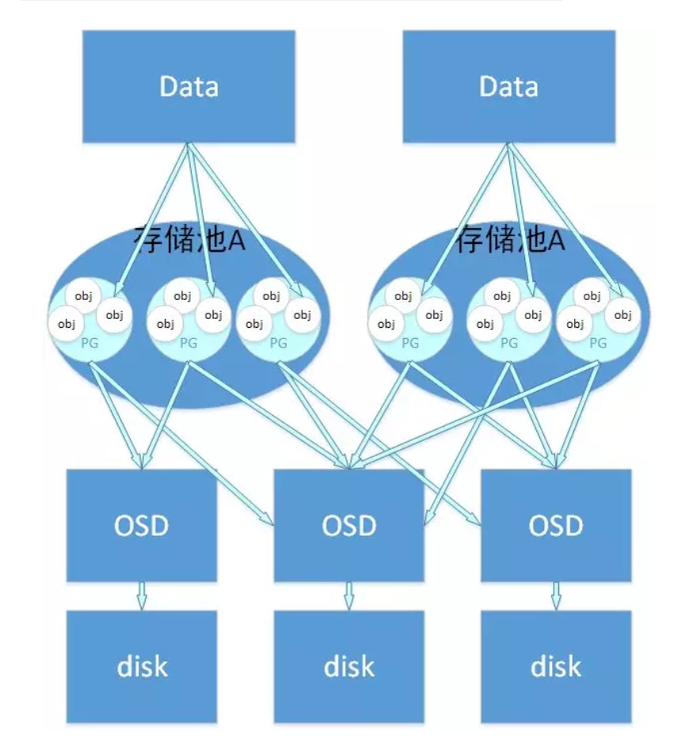
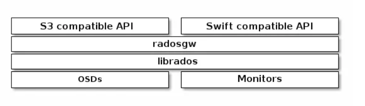
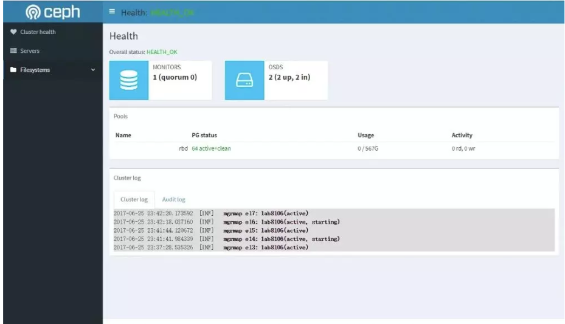

# 基于 Ceph 的 Kubernetes 数据持久化

## `Ceph` 是什么？

**`Ceph` 是一个可扩展的分布式存储系统，性能卓越，安全可靠，面向对象、块与文件存储。**


Ceph 是加州大学 Santa Cruz 分校的 Sage Weil（DreamHost 的联合创始人）专为博士论文设计的新一代自由软件分布式文件系统。自 2007 年毕业之后，Sage 开始全职投入到 Ceph 开 发之中，使其能适用于生产环境。Ceph 的主要目标是设计成基于 POSIX 的没有单点故障的分布式文件系统，使数据能容错和无缝的复制。2010 年 3 月，Linus Torvalds 将Ceph client 合并到内核 2.6.34 中。


## Ceph 组件与服务

### Ceph 组件/术语

* **`MON`：`Monitor`，Ceph 监视器**

集群运行起来后，你可以用 `Ceph` 工具来监控，典型的监控包括检查 `OSD` 状态、监视器状态、归置组状态和元数据服务器状态。

* **`OSD`：对象存储设备**

* `mgr`：**`Ceph` 管理器守护进程（ `ceph-mgr` ）附着在监视器守护进程上**，为外部的监控和管理系统提供了额外的监控和接口。

* **`MDS`：`Ceph Metadata Server`，Ceph 元数据服务器**

* `Pool`：**`Pool` 是 `Ceph` 存储数据时的逻辑分区**，它起到 `namespace` 的作用。其他分布式存储系统，比如 `Mogilefs`、`Couchbase`、`Swift` 都有 `Pool` 的概念，只是叫法不同。每个 `Pool` 包含一定数量的 `PG`，`PG` 里的对象被映射到不同的 `OSD` 上，因此 `Pool` 是分布到整个集群的。

* `PG`：**`PG` 是用来存放 `Object` 的，`PGP` 相当于是 `PG` 存放 `OSD` 的一种排列组合**

* `PG` 和 `Pool` 的关系：`Pool` 也是一个逻辑存储概念，我们创建存储池 `Pool` 的时候，都需要指定 `PG` 和 `PGP` 的数量，逻辑上来说 `PG` 是属于某个存储池的，就有点像 `Object` 是属于某个 `PG` 的。

以下这个图表明了存储数据，Object、PG、Pool、OSD、存储磁盘的关系。



### Ceph 服务

* `RBD`：块是一个字节序列（例如，一个 512 字节的一块数据），基于块的存储接口是最常见的存储数据方法，它们基于旋转媒体，像硬盘、 CD 、软盘、甚至传统的 9 磁道磁带。无处不在的块设备接口使虚拟块设备成为与 Ceph 这样的海量存储系统交互的理想之选。


* `Ceph` 块设备是瘦接口、大小可调且数据条带化到集群内的多个 `OSD` 。`Ceph` 块设备均衡多个 `RADOS` 能力，如快照、复制和一致性， `Ceph` 的 `RADOS` 块设备（ RBD ）用内核模块或 `librbd` 库与 `OSD` 交互。

内核模块可使用 Linux 页缓存。对基于 librbd 的应用程序， Ceph 可提供 RBD 缓存。


* **`Ceph` 块设备靠无限伸缩性提供了高性能，如向内核模块**、或向 `abbr:KVM（kernel virtual machines）`（如 QEMU 、依赖 libvirt 和 QEMU 的 OpenStack 和 CloudStack 云计算系统都可与 Ceph 块设备集成）。你可以用同一个集群同时运行 Ceph RADOS 网关、 Ceph FS 文件系统、和 Ceph 块设备。

* **`CephFS`：Ceph 文件系统（ Ceph FS ）是个与 POSIX 标准兼容的文件系统，它使用 Ceph 存储集群来存储数据**。`Ceph` 文件系统与 `Ceph` 块设备、同时提供 `S3` 和 `Swift API` 的 `Ceph` 对象存储、或者原生库（ librados ）一样，都使用着相同的 Ceph 存储集群系统。


### Object Gateway：



**`Ceph` 对象网关是个对象存储接口，在 `librados` 之上为应用程序构建了一个 `RESTful` 风格的 `Ceph` 存储集群网关。`Ceph` 对象存储支持 `2` 种接口**：

* `S3-compatible`：提供了对象存储接口，与亚马逊的 `S3 RESTful` 风格的接口兼容。
* `Swift-compatible`：提供了对象存储接口，与 `OpenStack` 的 `Swift` 接口兼容。

`Ceph` 对象存储使用 `Ceph` 对象网关守护进程（ `radosgw` ），它是个与 `Ceph` 存储集群交互的 `FastCGI` 模块。


因为它提供了与 `OpenStack Swift` 和 `Amazon S3` 兼容的接口， `RADOS` 要有它自己的用户管理。

`Ceph` 对象网关可与 `Ceph FS` 客户端或 `Ceph` 块设备客户端共用一个存储集群。

`S3` 和 `Swift API` 共用一个通用命名空间，所以你可以用一个 `API` 写、然后用另一个读。

**`Ceph` 对象存储不使用 `Ceph` 元数据服务器**。


### Ceph 功能特性

#### 自动恢复：

* 在断电重启后，集群能快速恢复。
* 在集群内部多块磁盘故障时，也能快速恢复（取决于实际磁盘数量）。

#### 快照：

**一份快照是某映像在一个特定时间点的一份只读副本。**

`Ceph` 块设备的一个高级功能就是你可以为映像创建快照来保留其历史；`Ceph` 还支持分层快照，让你快速、容易地克隆映像（如 `VM` 映像）。

`Ceph` 的快照功能支持 RDB 命令和多种高级接口，包括 `QEMU` 、 `libvirt` 、 `OpenStack` 和 `CloudStack`。

#### 分级缓存：

分级缓存可提升后端存储内某些（热点）数据的 `I/O` 性能。

**分级缓存需创建一个由高速而昂贵存储设备（如 SSD ）组成的存储池、作为缓存层，以及一个相对低速/廉价设备组成的后端存储池（或纠删码编码的）、作为经济存储层。**

`Ceph` 的对象处理器决定往哪里存储对象，分级代理决定何时把缓存内的对象刷回后端存储层；所以缓存层和后端存储层对 `Ceph ` 客户端来说是完全透明的。


### CRUSH 图：


* CRUSH 算法通过计算数据存储位置来确定如何存储和检索。CRUSH 授权 Ceph 客户端直接连接 OSD ，而非通过一个中央服务器或经纪人。数据存储、检索算法的使用，使 Ceph 避免了单点故障、性能瓶颈、和伸缩的物理限制。

* CRUSH 需要一张集群的地图，且使用 CRUSH 把数据伪随机地存储、检索于整个集群的 OSD 里。CRUSH 的讨论详情参见 CRUSH - 可控、可伸缩、分布式地归置多副本数据 。

* CRUSH 图包含 OSD 列表、把设备汇聚为物理位置的“桶”列表、和指示 CRUSH 如何复制存储池里的数据的规则列表。由于对所安装底层物理组织的表达， CRUSH 能模型化、并因此定位到潜在的相关失败设备源头，典型的源头有物理距离、共享电源、和共享网络，把这些信息编码到集群运行图里， CRUSH 归置策略可把对象副本分离到不同的失败域，却仍能保持期望的分布。例如，要定位同时失败的可能性，可能希望保证数据复制到的设备位于不同机架、不同托盘、不同电源、不同控制器、甚至不同物理位置。

* 当你写好配置文件，用 ceph-deploy 部署 Ceph 后，它生成了一个默认的 CRUSH 图，对于你的沙盒环境来说它很好。然而，部署一个大规模数据集群的时候，应该好好设计自己的 CRUSH 图，因为它帮你管理 Ceph 集群、提升性能、和保证数据安全性。

* 例如，如果一个 OSD 挂了， CRUSH 图可帮你定位此事件中 OSD 所在主机的物理数据中心、房间、机柜和机架，据此你可以请求在线支持或替换硬件。类似地， CRUSH 可帮你更快地找出问题。例如，如果一个机架上的所有 OSD 同时挂了，问题可能在于机架的交换机或电源，而非 OSD 本身。

* 定制的 CRUSH 图也能在归置组降级时，帮你找出冗余副本所在主机的物理位置。


**Dashboard**：



### 对象存储


一般来说，业务系统使用对象存储需求更多一些。

Harbor 也支持使用基于 S3 的对象存储来存储 Docker 镜像。


### Harbor 高可用


使用 CephFS 挂载到两台虚机的相应目录，配置目录到 Harbor 数据存储路径即可。

### Kubernetes 数据持久化

`Ceph` 与 `Kubernetes` 对接的时候，通常使用两种方法：

* **`CSI`**：Ceph 官方提供了 CSI，通过 kubeadm 启动的集群只能使用 CSI 接入。
* **传统模式**：传统模式下，在 Kubernetes 的所有节点安装 ceph-comm 包即可，内有 rbd 等命令。


但不管是 `CSI` 还是传统模式，最终我们接入 `Kubernetes` 集群使用的时候，还是通过 `Storage Class`。

```
apiVersion: storage.k8s.io/v1	
kind: StorageClass	
metadata:	
	name: data	
provisioner: kubernetes.io/rbd	
parameters:	
	monitors: your-ceph-monitor-servers	adminId: admin	
	adminSecretName: ceph-secret	
	adminSecretNamespace: kube-system	pool: data	
	userId: kube
	userSecretName: ceph-secret-kube
```

```
kind: PersistentVolumeClaim	
apiVersion: v1	
  metadata:	
    name: data-mysql	
    namespace: mysql	
    annotations:	
      volume.beta.kubernetes.io/storage-class: data	
  spec:	
    accessModes:	
      - ReadWriteOnce	
    resources:	
      requests:	
			storage: 50G
```

在 Kubernetes 的数据持久化中，一般会面临 2 种比较常见的需求：

* 单点挂载读写，一些应用，比如 MySQL、Kafka 等服务，需要将运行过程中的数据保留下来，并在 Pod 被重新调度的时候一并将数据调度走，才能确保被重新调度的 Pod 启动后仍然使用之前的数据。如果服务自带集群数据同步机制，如 MongoDB、Elasticsearch、Kafka 等，那么使用这种模式就非常合适。

* 多点挂载读写，适用于多个 Pod 同时读写相同数据。如机器学习，在同一时间，多个任务Pod可能会同时对数据进行大量读写。


## 管理维护

因为服务类型的特殊性，Ceph 的管理维护通常都是在线进行。

**存储池 Pool**

* 添加存储池
* 删除存储池
* 修改存储池

## 在线扩容

### Ceph Cluster 在线扩容


我们可以通过下面5个步骤来进行快速的在线扩容。

**1. 防火墙**

使用 `firewall-cmd` 命令：

```
firewall-cmd --zone=public --add-port=3300/tcp --permanent	
firewall-cmd --zone=public --add-port=6789/tcp --permanent	
firewall-cmd --zone=public --add-port=6800-6810/tcp --permanent	
firewall-cmd --reload
```

**2. 时间同步**

Ceph 对节点时间一致性要求较高，需要同步时间。

全部节点应使用同一个时间服务器。

时间服务器使用 `cn.pool.ntp.org`。

安装 `ntpdate`：

`yum install -y ntpdate`

先同步一下时间：

`ntpdate cn.pool.ntp.org`


将 `ntpdate` 设置到计划任务中：

`echo -e "\n00  00  *  *  * \troot\tntpdate cn.pool.ntp.org" >> /etc/crontab`

设置每天 00:00 执行同步。

如果机器比较老旧，可以更频繁的进行同步，如每隔 6 小时一次。


**3. 安装 yum 源**

本步骤要在每一个节点上执行。

安装 EPEL 源。

在新节点（ceph-3）上执行。

```
rpm -ivh https://mirrors.tuna.tsinghua.edu.cn/centos/7/extras/x86_64/Packages/epel-release-7-11.noarch.rpm
```

复制 `ceph.repo` 到 `ceph-3`。

在 `ceph-0` 上执行。

```
scp /etc/yum.repos.d/ceph.repo ceph-3:/etc/yum.repos.d/ceph.repo
```

**4. 安装 Ceph**

在新节点（ceph-3）上执行。

```
 yum install -y ceph
```

**5. 添加OSD到集群**

在 ceph-0 上执行。

```
ceph-deploy osd create ceph-3 --data /dev/vdc	
ceph-deploy osd create ceph-3 --data /dev/vdd
```

**6. 查看OSD**

在 `ceph-0` 上执行。

```
ceph -s
```

## 用户权限


* 添加用户权限
* 修改用户权限
* 删除用户权限

## 监控

通过 `Zabbix/Prometheus` 进行监控。

## Q&A


Q：Kubernetes 里面使用 Ceph，假设 Ceph 出问题。这样会导致节点 hang 住吗？导致集群不可用情况。如果会，那该如何避免。谢谢。
A：并不会，因为 Ceph 本身是分布式高可用的，而且即使 Ceph 节点全挂， 也仅仅会影响使用 Ceph 的 Pod，而不是节点。

Q：Ceph 是通过 Kubernetes 部署还是原生部署。Ceph 和 Kubernetes 节点超融合吗，还是分开？
A：一般生产环境中都是独立部署的，3 或 5 Monitor， 3 ～ 60+ OSD 等规模。

Q：在 Kubernetes 中对于需要共享的存储，使用 CephFS 需要注意什么，会不会存在一些坑？
A：目前存在一种说法，就是 CephFS 不稳定，不推荐使用。具体如何不稳定、如何触发、怎么避免就很少有人知道了，另外还有，如果 CephFS 不稳定，那么我们还有其它哪些替代品呢？

Q：Kubernetes 对外暴露服务用的是那种方式呢？如果在一个集群里面跑不同的业务，在对他们做对外的域名解析，访问控制是怎样实现的，会不会存在一些性能问题或端口的冲突？
A：一般比较常见的就是单节点访问的 NodePort，配置高可用模式的Ingress等等。由于每个 `Pod/Service` 端口都是独立的，所以并不用担心会跟其它冲突。除非使用了 `NodePort` 且指定了端口。

Q：`Rook` 和原生的 `Ceph` 部署方式在性能和维护上是否有区别，这两种方式如何选择？
A：抱歉， Rook还没有使用过，不过相对来说，Ceph 集群维护的重点一般都在 `OSD`。在生产环境，一般也会独立部署 `Ceph`，毕竟即使快速的重新调度 `Monitor`，也可能会对集群产生轻微影响。

Q：对于小中型公司来说 Ceph 是个好选择么？自行维护，可以从多个方面说说 Kubernetes 下如何进行存储选型么？谢谢！
A：相对可以接受，运维并不复杂。目前 Kubernetes 上存储还是以 RBD 比较多一些。当然也有一些 NFS，不过因为其性能与稳定性，所以不推荐使用。

Q：`Ceph` 中 `Pool` 数量是如何设定的，如果对集群进行扩容，`PG` 的数量是否需要调整，调整的时候需注意什么？网络方面怎么去规划比较合理，谢谢。
A：目前 `PG` 的限制多一些，因为 `Pool` 里面 `PG` 是存在一定数量的，而 `PG` 数量又跟硬盘数量挂钩，所以调整时需要计算 `Pool` 的数量与 `OSD` 数量。网络方面的话，在生产环境，推荐使用至少 `10Gbps` 网络，双网卡以便分离业务和集群网络，提升性能。

Q：1、OSD 是否需要做阵列？20 台物理机，单台物理机 1 个 OSD 阵列还是单台物理机 8 个 OSD 裸盘？2、当大量 OSD 出现 slow ops 如何处理？3、纠删码和三副本，应该如何选择？
A：1、磁盘数量较少时，不推荐 RAID，建议由 Ceph 直接管理磁盘，通过并行获取更好性能。另外 PG 的数量计算方式也跟 OSD 数量有关，所以需要综合考虑。2、这个可能需要结合监控系统，及时发现异常情况，是设备还是服务或者节点呀网络原因等等判断处理。3、可以结合业务场景需求与集群规模和硬件配置等情况来综合考虑决定采用哪种方式。

Q：分布式存储应用于 `HDFS` 是否可行，相对于本地存储，分布式存储的读写性能如何提高，另外 `Cep`h 的 `bluestore` 效果怎么样呢？
A：这个不太合适，因为 HDFS 本身自己就是做分布式的文件系统，且业务场景也不相同。Ceph 的性能提升无外乎两个方面：更快的磁盘/SSD 和更大带宽的网络。由于直接管理了硬盘，所以其性能还是很好的。

Q：请问怎样在 Kubernetes 中，实现多个容器共享一个 Ceph 文件系统，共享文件存储建议用哪种方式？
A：这种需求就需要用 CephFS 了。共享文件存储的话，看最终客户场景，如果是给 Windows 等客户端使用的共享，那么可以通过 ISCSI 来挂载 RBD 到 Windows 共享服务器。

Q：Ceph 最大支持多大的存储容量不影响性能，与分布式存储 HDFS 的区别有哪些？PGP 和 PG 什么关系？
A：官方号称是 PB 级的。HDFS 适合大文件，上百 G 的那种单个文件。PG 是指定存储池存储对象的目录有多少个，PGP 是存储池 PG 的 OSD 分布组合个数

