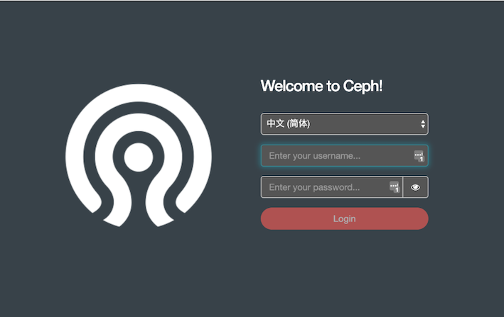
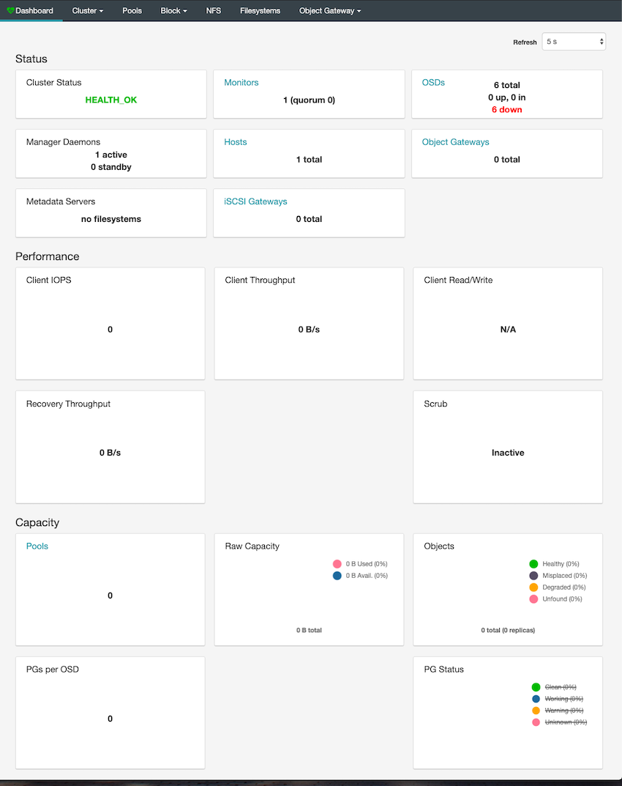
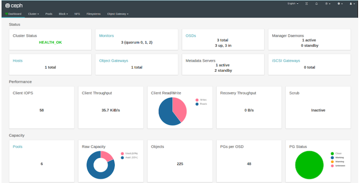

# 使用 Rook 快速搭建 Ceph 集群


[Rook](https://rook.io/) 是一个开源的云原生存储编排工具，提供平台、框架和对各种存储解决方案的支持，以和云原生环境进行本地集成。

`Rook` 将**存储软件转变成自我管理、自我扩展和自我修复的存储服务，通过自动化部署、启动、配置、供应、扩展、升级、迁移、灾难恢复、监控和资源管理来实现**。

`Rook` 底层使用云原生容器管理、调度和编排平台提供的能力来提供这些功能。


**`Rook` 利用扩展功能将其深度集成到云原生环境中，并为调度、生命周期管理、资源管理、安全性、监控等提供了无缝的体验。**

有关 Rook 当前支持的存储解决方案的状态的更多详细信息，可以参考 Rook 仓库 的项目介绍。不过目前 Rook 已经很好地提供了对 Ceph 的支持，本文简单为大家介绍如何使用 Rook 来快速搭建 Ceph 集群。

> Ceph 是一种高度可扩展的分布式存储解决方案，用于具有多年生产部署的块存储，对象存储和共享文件系统。

本文试验环境：

* Kubernetes: v1.15.1
* Docker：19.03.4
* Rook：release-1.1


## 部署 Rook Operator

我们这里部署 `release-1.1` 版本的 `Rook`，点击查看部署使用的 [部署清单文件](https://github.com/rook/rook/tree/release-1.1/cluster/examples/kubernetes/ceph)。

从上面链接中下载 [common.yaml](/resource/common.yaml) 与 [operator.yaml](/resourcecommon.yaml) 两个资源清单文件：

```
$ kubectl apply -f common.yaml
$ kubectl apply -f operator.yaml
```

在继续操作之前，验证 `rook-ceph-operator` 是否处于`“Running”`状态：

```
$  kubectl get pod -n rook-ceph
NAME                                 READY   STATUS    RESTARTS   AGE
rook-ceph-operator-88866dbf5-hzkfj   1/1     Running   0          6m41s
rook-discover-qw8vp                  1/1     Running   0          47s
```

## 创建 Rook Ceph 集群

现在 `Rook Operator` 处于 `Running` 状态，接下来我们就可以创建 `Ceph` 集群了。

为了使集群在重启后不受影响，请确保设置的 `dataDirHostPath` 属性值为有效得主机路径。更多相关设置，可以查看[集群配置相关文档](https://rook.io/docs/rook/v1.1/ceph-cluster-crd.html)。

创建如下的资源清单文件：(`cluster.yaml`)

```
apiVersion: ceph.rook.io/v1
kind: CephCluster
metadata:
  name: rook-ceph
  namespace: rook-ceph
spec:
  cephVersion:
    # 最新得 ceph 镜像, 可以查看 https://hub.docker.com/r/ceph/ceph/tags
    image: ceph/ceph:v14.2.4-20190917
  dataDirHostPath: /data/rook  # 主机有效目录
  mon:
    count: 3
  dashboard:
    enabled: true
  storage:
    useAllNodes: true
    useAllDevices: false
    # 重要: Directories 应该只在预生产环境中使用
    directories:
    - path: /var/lib/rook
```

然后直接创建即可：

```
$ kubectl apply -f cluster.yaml
```

我们可以通过 `kubectl` 来查看 `rook-ceph` 命名空间下面的 `Pod` 状态，出现类似于如下的情况，证明已经全部运行了：

```
$ kubectl get pods -n rook-ceph
NAME                                            READY   STATUS      RESTARTS   AGE
csi-cephfsplugin-cp5mc                          3/3     Running     0          24m
csi-cephfsplugin-fs9s5                          3/3     Running     0          24m
csi-cephfsplugin-provisioner-75c965db4f-b5wf4   4/4     Running     0          24m
csi-cephfsplugin-provisioner-75c965db4f-zkrth   4/4     Running     0          24m
csi-cephfsplugin-qvfpb                          3/3     Running     0          24m
csi-cephfsplugin-vgzl6                          3/3     Running     0          24m
csi-rbdplugin-cj842                             3/3     Running     0          24m
csi-rbdplugin-ksc24                             3/3     Running     0          24m
csi-rbdplugin-provisioner-56cbc4d585-5dkzg      5/5     Running     0          24m
csi-rbdplugin-provisioner-56cbc4d585-xdqw9      5/5     Running     0          24m
csi-rbdplugin-s5kjc                             3/3     Running     0          24m
csi-rbdplugin-z6bj2                             3/3     Running     0          24m
rook-ceph-mgr-a-68977dd7ff-t9rmk                1/1     Running     0          17m
rook-ceph-mon-a-84f4d48897-5lqtl                1/1     Running     0          22m
rook-ceph-mon-b-5d4858f579-5z9ld                1/1     Running     0          19m
rook-ceph-mon-c-8675b47cf7-82q8r                1/1     Running     0          19m
rook-ceph-operator-587d765957-lrmsr             1/1     Running     0          152m
rook-ceph-osd-1-856db94654-smdhp                1/1     Running     0          16m
rook-ceph-osd-20-77d7f7787f-h2dkg               1/1     Running     0          8m50s
rook-ceph-osd-prepare-ydzs-node1-qgmsc          0/1     Completed   0          5m2s
rook-ceph-osd-prepare-ydzs-node2-h667n          0/1     Completed   0          4m59s
rook-discover-bd8qh                             1/1     Running     0          139m
rook-discover-bq6w8                             1/1     Running     4          85m
rook-discover-c8qmz                             1/1     Running     0          116m
rook-discover-ncjts                             1/1     Running     0          139m
```

`OSD Pod` 的数量将取决于集群中的节点数量以及配置的设备和目录的数量。

> **`OSD`：对象存储设备**

如果用上面我们的资源清单，则每个节点将创建一个 OSD。rook-ceph-agent 和 rook-discover 是否存在也是依赖于我们的配置的。

## Rook 工具箱


**要验证集群是否处于正常状态**，我们可以使用 [Rook 工具箱](https://rook.io/docs/rook/v1.1/ceph-toolbox.html) 来运行 `ceph status` 命令查看。

`Rook` 工具箱是一个用于调试和测试 `Rook` 的常用工具容器，该工具基于 `CentOS `镜像，所以可以使用 `yum` 来轻松安装更多的工具包。


```
apiVersion: apps/v1
kind: Deployment
metadata:
  name: rook-ceph-tools
  namespace: rook-ceph
  labels:
    app: rook-ceph-tools
spec:
  selector:
    matchLabels:
      app: rook-ceph-tools
  template:
    metadata:
      labels:
        app: rook-ceph-tools
    spec:
      dnsPolicy: ClusterFirstWithHostNet
      containers:
      - name: rook-ceph-tools
        image: rook/ceph:v1.1.0
        command: ["/tini"]
        args: ["-g", "--", "/usr/local/bin/toolbox.sh"]
        imagePullPolicy: IfNotPresent
        env:
          - name: ROOK_ADMIN_SECRET
            valueFrom:
              secretKeyRef:
                name: rook-ceph-mon
                key: admin-secret
        securityContext:
          privileged: true
        volumeMounts:
          - mountPath: /dev
            name: dev
          - mountPath: /sys/bus
            name: sysbus
          - mountPath: /lib/modules
            name: libmodules
          - name: mon-endpoint-volume
            mountPath: /etc/rook
      # 如果设置 hostNetwork: false,  "rbd map" 命令会被 hang 住, 参考 https://github.com/rook/rook/issues/2021
      hostNetwork: true
      volumes:
        - name: dev
          hostPath:
            path: /dev
        - name: sysbus
          hostPath:
            path: /sys/bus
        - name: libmodules
          hostPath:
            path: /lib/modules
        - name: mon-endpoint-volume
          configMap:
            name: rook-ceph-mon-endpoints
            items:
            - key: data
              path: mon-endpoints
```

然后直接运行这个 `rook-ceph-tools pod`：

```
$ kubectl apply -f toolbox.yaml
```

一旦 `toolbox` 的 `Pod` 运行成功后，我们就可以使用下面的命令进入到工具箱内部进行操作：


```
$ kubectl -n rook-ceph exec -it $(kubectl -n rook-ceph get pod -l "app=rook-ceph-tools" -o jsonpath='{.items[0].metadata.name}') bash
```

工具箱中的所有可用工具命令均已准备就绪，可满足您的故障排除需求。例如：

```
ceph status
ceph osd status
ceph df
rados df
```

比如现在我们要查看集群的状态，需要满足下面的条件才认为是健康的：

* 所有 `mons` 应该达到法定数量
* `mgr` 应该是激活状态
* 至少有一个 `OSD` 处于激活状态
* 如果不是 `HEALTH_OK` 状态，则应该查看告警或者错误信息

```
[root@docker-desktop /]# ceph status
  cluster:
    id:     8eb52efa-8bb0-4738-ab5f-6d46ed95a87a
    health: HEALTH_OK
 
  services:
    mon: 1 daemons, quorum a (age 33s)
    mgr: a(active, starting, since 3s)
    osd: 0 osds: 0 up, 0 in
 
  data:
    pools:   0 pools, 0 pgs
    objects: 0 objects, 0 B
    usage:   0 B used, 0 B / 0 B avail
    pgs:
```

```
$ ceph status
ceph status
  cluster:
    id:     dae083e6-8487-447b-b6ae-9eb321818439
    health: HEALTH_OK

  services:
    mon: 3 daemons, quorum a,b,c (age 15m)
    mgr: a(active, since 2m)
    osd: 31 osds: 2 up (since 6m), 2 in (since 6m)

  data:
    pools:   0 pools, 0 pgs
    objects: 0 objects, 0 B
    usage:   79 GiB used, 314 GiB / 393 GiB avail
    pgs:
```

```
# ceph osd status
+----+------+-------+-------+--------+---------+--------+---------+------------+
| id | host |  used | avail | wr ops | wr data | rd ops | rd data |   state    |
+----+------+-------+-------+--------+---------+--------+---------+------------+
| 0  |      |    0  |    0  |    0   |     0   |    0   |     0   | exists,new |
| 1  |      |    0  |    0  |    0   |     0   |    0   |     0   | exists,new |
| 2  |      |    0  |    0  |    0   |     0   |    0   |     0   | exists,new |
+----+------+-------+-------+--------+---------+--------+---------+------------+
```

如果群集运行不正常，可以查看 [`Ceph` 常见问题](https://rook.io/docs/rook/v1.1/ceph-common-issues.html)以了解更多详细信息和可能的解决方案。

## 存储

对于 Rook 暴露的三种存储类型可以查看对应的文档：

* [块存储](https://rook.io/docs/rook/v1.1/ceph-block.html)：创建一个 Pod 使用的块存储
* [对象存储](https://rook.io/docs/rook/v1.1/ceph-object.html)：创建一个在 Kubernetes 集群内部和外部都可以访问的对象存储
* [共享文件系统](https://rook.io/docs/rook/v1.1/ceph-filesystem.html):创建要在多个 Pod 之间共享的文件系统


## Ceph Dashboard

`Ceph` 有一个 `Dashboard` 工具，我们可以在上面查看集群的状态，包括总体运行状态，`mgr`、`osd` 和其他 `Ceph` 进程的状态，查看池和 `PG` 状态，以及显示守护进程的日志等等。


我们可以在上面的 `cluster CRD` 对象中开启 `dashboard`，设置`dashboard.enable=true`即可，这样 `Rook Operator` 就会启用 `ceph-mgr dashboard` 模块，并将创建一个 `Kubernetes Service` 来暴露该服务，将启用端口 `7000` 进行 `https` 访问，如果 `Ceph` 集群部署成功了，我们可以使用下面的命令来查看 `Dashboard` 的 `Service`：

```
$ kubectl get service -n rook-ceph
NAME                         TYPE        CLUSTER-IP       EXTERNAL-IP   PORT(S)          AGE
rook-ceph-mgr                            ClusterIP   10.96.49.29     <none>        9283/TCP            23m
rook-ceph-mgr-dashboard                  ClusterIP   10.109.8.98     <none>        7000/TCP            23m
```

* 这里的 `rook-ceph-mgr` 服务用于报告 `Prometheus metrics` 指标数据的，
* 而后面的的 `rook-ceph-mgr-dashboard` 服务就是我们的 `Dashboard` 服务，

如果在集群内部我们可以通过 `DNS` 名称 `http://rook-ceph-mgr-dashboard.rook-ceph:7000` 或者 `CluterIP http://10.109.8.98:7000` 来进行访问，但是如果要在集群外部进行访问的话，我们就需要通过 `Ingress` 或者 `NodePort` 类型的 `Service` 来暴露了，为了方便测试我们这里创建一个新的 `NodePort` 类型的服务来访问 `Dashboard`，资源清单如下所示：（`dashboard-external.yaml`）

```
apiVersion: v1
kind: Service
metadata:
  name: rook-ceph-mgr-dashboard-external
  namespace: rook-ceph
  labels:
    app: rook-ceph-mgr
    rook_cluster: rook-ceph
spec:
  ports:
  - name: dashboard
    port: 7000
    protocol: TCP
    targetPort: 7000
  selector:
    app: rook-ceph-mgr
    rook_cluster: rook-ceph
  type: NodePort
```
同样直接创建即可：

```
$ kubectl apply -f dashboard-external.yaml
```

创建完成后我们可以查看到新创建的 `rook-ceph-mgr-dashboard-external` 这个 `Service` 服务：


```
$ kubectl get service -n rook-ceph 
NAME                                    TYPE        CLUSTER-IP       EXTERNAL-IP   PORT(S)          AGE
rook-ceph-mgr                           ClusterIP   10.96.49.29     <none>        9283/TCP            23m
rook-ceph-mgr-dashboard                 ClusterIP   10.109.8.98     <none>        7000/TCP            23m
rook-ceph-mgr-dashboard-external        NodePort    10.98.8.0       <none>        7000:32381/TCP      3m30s
```


现在我们需要通过 `http://<NodeIp>:32381` 就可以访问到 Dashboard 了。

或者通过`port-forward`访问集群内部`cluster`

```
kubectl -n rook-ceph port-forward rook-ceph-mgr-a-54cd69f8b-8dj4d 7000:7000
```



但是在访问的时候需要我们登录才能够访问，`Rook` 创建了一个默认的用户 `admin`，并在运行 `Rook` 的命名空间中生成了一个名为 `rook-ceph-dashboard-admin-password` 的 `Secret`，要获取密码，可以运行以下命令：

```
kubectl -n rook-ceph get secret rook-ceph-dashboard-password -o jsonpath="{['data']['password']}" | base64 --decode && echo
iCYUmtOGQS
```

用上面获得的密码和用户名 `admin` 就可以登录 `Dashboard` 了，在 `Dashboard` 上面可以查看到整个集群的状态：

#### Mine 



#### sample



## 配置 Dashboard

除此之外在使用上面的 `CRD` 创建 `ceph` 集群的时候我们还可以通过如下的配置来配置 `Dashboard`：

```
spec:
  dashboard:
    urlPrefix: /ceph-dashboard
    port: 8443
    ssl: true
```

* `urlPrefix`：如果通过反向代理访问 `Dashboard`，则可能希望在 `URL` 前缀下来访问，要让 `Dashboard` 使用包含前缀的的链接，可以设置 `urlPrefix`
* `port`：可以使用端口设置将为 `Dashboard` 提供服务的端口从默认值修改为其他端口，`K8S` 服务暴露的端口也会相应的更新
* `ssl`：通过设置 `ssl=false`，可以在不使用 `SSL` 的情况下为 `Dashboard` 提供服务


## 开启 Object Gateway 管理


为了在 Dashboard 上面使用 `Object Gateway` 管理功能，你需要提供一个一个带有 `system` 标志的登录认证用户。如果没有这样的用户，可以使用下面的命令创建一个：

```
# 先进入 Rook 工具箱 Pod
$ kubectl -n rook-ceph exec -it $(kubectl -n rook-ceph get pod -l "app=rook-ceph-tools" -o jsonpath='{.items[0].metadata.name}') bash
# 创建用户
$ radosgw-admin user create --uid=myuser --display-name=test-user \
    --system
{
    "user_id": "myuser",
    "display_name": "test-user",
    "email": "",
    "suspended": 0,
    "max_buckets": 1000,
    "subusers": [],
    "keys": [
        {
            "user": "myuser",
            "access_key": "<记住ak这个值>",
            "secret_key": "<记住sk这个值>"
        }
    ],
    ......
}
```

创建后会为当前用户生成一个 `access_key` 和 `secret_key` 这两个值，记住这两个值，下面需要使用到。

然后执行下面的命令进行配置：

```
$ ceph dashboard set-rgw-api-user-id myuser
Option RGW_API_USER_ID updated
$ ceph dashboard set-rgw-api-access-key <access-key>
Option RGW_API_ACCESS_KEY updated
$ ceph dashboard set-rgw-api-secret-key <secret-key>
Option RGW_API_SECRET_KEY updated
```

现在就可以访问 `Object Gateway` 的菜单了。

## 监控

每个 Rook 群集都有一些内置的指标 collectors/exporters，用于使用 Prometheus 进行监控。要了解如何为 Rook 群集设置监控，可以按照[监控指南](https://rook.io/docs/rook/v1.1/ceph-monitoring.html)中的步骤进行操作。

