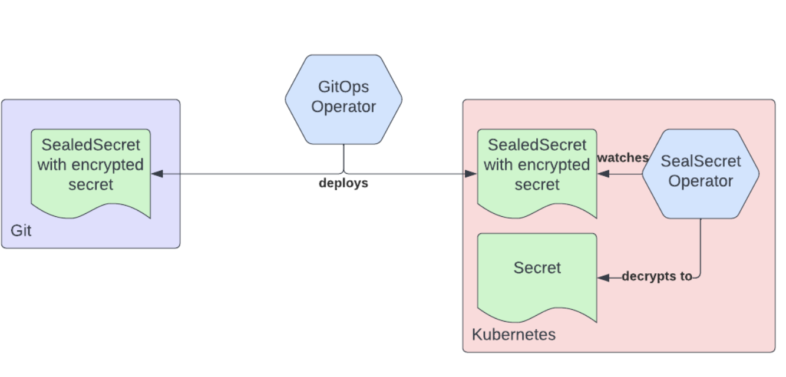
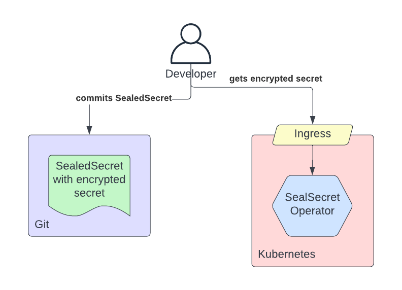
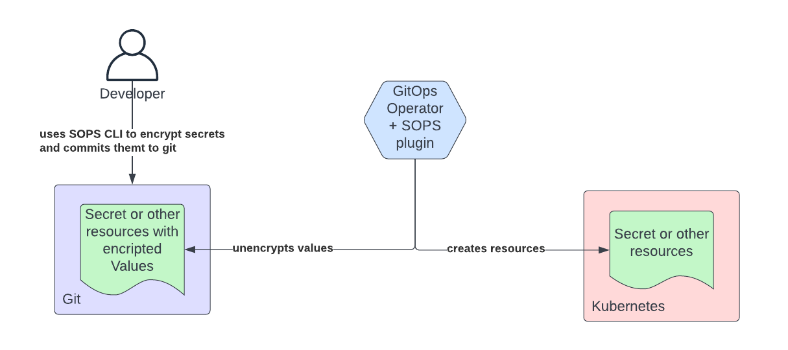
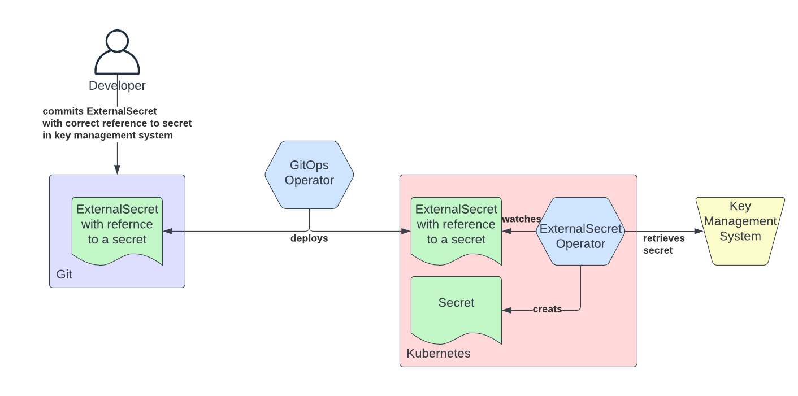
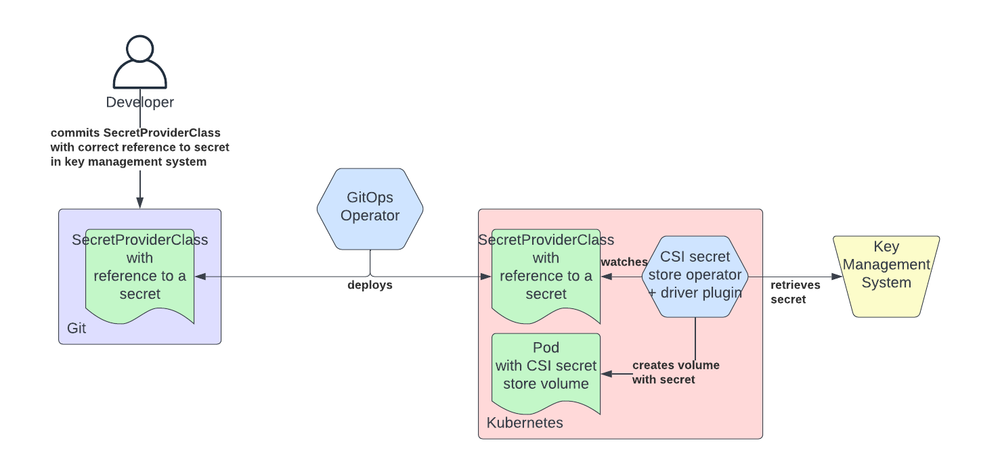

# **GitOps 和 Kubernetes 中的 secret 管理**

> https://cloud.redhat.com/blog/a-guide-to-secrets-management-with-gitops-and-kubernetes

GitOps 是使用 Git 作为基础设施和应用程序配置的来源，利用 Git 工作流，实现 Git 仓库中描述配置的自动化。

我们知道基础设施配置和应用程序配置经常都需要访问某种敏感资产，**也就是我们通常说的 Secrets（比如身份认证 Token、私钥等），才能正确运行、访问数据或以其他方式与第三方系统以安全的方式进行通信**。

但是如果直接在 Git 中存储 Secrets 数据显然是非常不安全的行为，我们也不应该这样做，即使是有访问权限控制的私有 Git 仓库。

那么我们应该如何才能解决 Secrets 数据的存储问题呢？

并为实施 GitOps 的用户和客户提供在不损害私密性的情况下为其应用程序提供 Secrets 的机制呢？这 Kubernetes 生态系统中有一些方法和开源项目可以帮助我们来解决这些问题，我们将在本文介绍几种比较流行的方案。

**在 GitOps 中管理 Secrets 主要有两种主要的架构方法：**

* 将加密后的 secret 数据存储在 Git 仓库中，通过自动化的一些工具将这些数据进行解密变成 Kubernetes 的 Secrets 对象。
* 存储在 Git 仓库中的 secert 数据的引用，自动化工具可以根据这些引用检索到实际的 secret 数据，最后将获取到的数据渲染为 Kubernetes Secrets 对象。

## **Git 中加密的 Secrets**

目前有两个比较流行的开源项目遵循在 Git 中存储加密数据的方法：Bitnami 的 Sealed Secrets 与 Mozilla 的[ SOPS 项目](https://github.com/mozilla/sops)，使用这两个项目需要注意以下事项：

* 纯文本私密数据由用户处理加密后存储在 Git 仓库中。
* 通过查看 Git 中的提交日志，可以轻松追踪加密数据的 Git 提交者的身份，此信息可用于发起社会工程攻击。
* 如果加密密钥被泄露，则可能很难追踪使用泄露密钥加密的所有数据并将其撤消，因为这些数据可能会散布在大量存储库中。

### **Sealed Secrets**

Sealed Secrets 项目使用公钥加密的方式来对私密数据进行加密，使用起来非常方便。Sealed Secrets 由两个主要部分组成：

* 一个 Kubernetes 控制器，它了解用于解密和加密数据的私钥和公钥，并负责对资源对象的调谐。
* 一个简单的 CLI（kubeseal）工具提供给开发人员将数据提交到Git 仓库之前对其进行加密操作。

Sealed Secrets 引入了一个新的自定义资源 **SealedSecret**，**控制器会 watch 这些 CRD 的变更，对 SealedSecret 资源中的加密数据进行解密**，并将结果保存在 Kubernetes Secret 对象中，**用于解密的私钥以 Kubernetes Secret 方式存储在 etcd 中**。

KubeSeal CLI 工具允许开发人员获取普通的 Kubernetes Secret 资源并将其转换为 SealedSecret 对象，可以从控制器自动获取执行加密所需的公钥，否则，公钥必须由用户提供作为输入。

Sealed Secrets 控制器支持私钥的自动密钥轮转，也支持以前使用过的密钥过期，以执行数据的重新加密。此外，在加密数据时，会使用一个随机的 nonce 与加密数据一起进行加密，这使得通过暴力破解非常难以实现。

这种方法虽然看起来非常方便，但是仍然会带来初始 Secret 资源被意外放进 Git 仓库的风险，因为原始的 Secret 资源需要供开发者使用，不过也可以通过一些方式来降低这种风险，**比如在 Git 仓库中添加一个 `pre-commit ` 的 hooks，拒绝提交 Kubernetes Secrets 数据**。

**此外，如果在集群中的私钥丢失（由于意外删除或在灾难情况下），并且没有备份，则必须使用新私钥的公钥重新加密所有加密数据，然后提交到所有 Git 存储库。**

随着集群数量的增加，SealedSecrets 方法也不能很好地扩展。

**每个集群都会有自己的 SealedSecrets 控制器和私钥，这意味着如果需要将同一个 Secret 部署到多个集群，则需要创建多个 SealedSecret 对象，增加了维护开销和 GitOps 配置的复杂性。**

最后，**私钥的安全性主要取决于集群的 RBAC 和 etcd 的保护程度**，而私钥的泄露则超出了集群本身的范围。每一个与私密数据相关的 Git 仓库也可能会泄露，考虑到 Git 的分布式特性，可能难以追踪和撤销。

### **Mozilla SOPS**

**SOPS（Secrets OPerationS），简称 sops**，是 Mozilla 开发的一种专用的加解密工具，完全不受 Kubernetes Secrets 资源或 Kubernetes 的限制。支持多种输入格式，包括 YAML、JSON、ENV、INI 和 BINARY 格式。

SOPS 还支持与一些常用的密钥管理系统 (KMS) 集成，例如 AWS KMS、GCP KMS、Azure Key Vault 和 Hashicorp 的 Vault。

**值得注意的是，这些密钥管理系统实际上并不是用来存储 Secrets 本身的，而是提供用于保护数据安全的加密密钥，如果没有这样的系统，则可以使用 PGP 密钥对代替**。这种方法的好处是给用户提供了迭代需求的机会，同时让开发者能够快速采用。例如，PGP 可以在开发环境中使用，而在更高层次的环境中使用 KMS，而不需要更换任何底层工具。

**但是由于 SOPS 是一个命令行工具，它在 Kubernetes 中的使用是比较有限的，虽然有一些插件，比如 [helm-secrets](https://github.com/jkroepke/helm-secrets) 可以在安装到集群之前解密与 Helm Chart 一起存储的 values.yaml 文件，但是在 GitOps 工具（比如 ArgoCD）中并不支持**。

对于 Argo CD，用户必须构建包含 SOPS 的自定义容器镜像，然后使用 [Helm 扩展](https://github.com/jkroepke/helm-secrets/wiki/ArgoCD-Integration) 或 [Kustomize 扩展]( https://github.com/viaduct-ai/kustomize-sops)来处理。而 Flux 中对 SOPS 的支持更加成熟，SOPS 可以直接在 Flux 的清单中配置。

有一个 [sops-secrets-operator](https://github.com/isindir/sops-secrets-operator) 工具尝试将 SOPS 和 SealedSecrets 的概念结合起来，它使用 SealedSecrets 工作流程，但没使用其特有的加密方案，而是使用 SOPS 进行加密。

随着团队和个人数量的增加，SOPS 方法无法很好地扩展，用户必须执行加密并管理 PGP 密钥或对其他加密传输系统的身份进行认证，这是该方法的一个弱点。

最后当然用户会成为安全链中较弱的环节，比起直接使用 PGP 密钥，与密钥管理系统的整合更为可取，虽然这并没有消除人为因素和直接与 Secret 交互的需求，但至少它消除了必须管理密钥的负担。

## **存储在 Git 中的 Secret 引用**

在这种方法中，我们会在 Git 中存储一个清单，该清单表示对位于密钥管理系统中的 Secret 的引用。然后，**GitOps Operator 将该清单部署到 Kubernetes 集群，操作人员获取数据并将其作为 Kubernetes Secret 对象应用到集群**

有两个主要项目实现了这种方式：[ExternalSecrets](https://github.com/isindir/sops-secrets-operator) 和 [Kubernetes Secret Store CSI Driver](https://github.com/external-secrets/external-secrets)。

### **ExternalSecrets**

ExternalSecrets 项目最初由 GoDaddy 开发，目的是在 Kubernetes 中安全使用外部 secret 管理系统，如 HashiCorp 的 Vault、AWS Secrets Manager、Azure Key Vault、阿里巴巴 KMS 和 GCP Secret Manager 等。通过社区的发展，项目支持的密钥管理系统也在不断增加。

**ExternalSecrets 是一个 Kubernetes 控制器，它可以将来自自定义资源 (ExternalSecrets) 的 Secret 应用到集群中，其中包括对外部密钥管理系统中密钥的引用。**

自定义资源指定包含机密数据的后端，以及如何通过定义模板将其转换为 Secret，该模板可以包含动态元素（以 lodash 格式），并可用于向最终的 Secret 资源添加标签或注解，或者在从后端存储加载后对某些数据进行修改。

**ExternalSecrets 资源本身可以安全地存储在 Git 中，因为它们不包含任何机密信息。ExternalSecrets 本身不执行任何加密操作，完全依赖于 Secret Store 后端的安全性。**

该 Operator 对多租户的支持也比较成熟了，可以采用不同的方法来确保不同的租户彼此隔离，可以使用具有命名空间级别本地凭证的 SecretStore 资源来进行管理，这样每个租户将使用不同的凭据来对密钥管理系统进行身份验证。

### **Kubernetes Secret Store CSI Driver**

Secrets Store CSI 驱动程序也是一个旨在将 Secret 从外部存储带入 Kubernetes 集群的项目，支持的后端包括 HashiCorp Vault、Azure Key Vault 和 GCP Secret Manager，其他后端可以从外部开发，并按照插件模式作为"供应商"进行整合。

**与 ExternalSecrets 项目相反，Secrets Store CSI 驱动程序不是作为控制器将数据协调到 Secret 资源中，而是使用一个单独的卷，该卷被挂载到 Kubernetes pod 中，以包含加密数据，对于那些不被 pod 直接消费的加密数据场景，这种方法会变得有些复杂，甚至无法使用**。

**目前，对轮转密钥的支持有限，该功能仍处于 alpha 状态，并非所有提供商都支持。**

与 ExternalSecrets 类似，Secrets Store CSI 驱动程序本身不执行任何加密操作，而是利用后端系统加密和存储私密数据。

用于连接后端系统的提供程序由外部第三方开发和维护，虽然这种方法有利于新提供商的开发，但它也对代码的安全性、成熟度和兼容性提出了问题。但是，Secrets Store CSI 驱动程序提供了一些在开发此类提供程序时要遵循的规则和模式，风险似乎可以忽略不计。在采用提供商时，了解如何管理多租户非常重要，一些提供商使用一个共享凭证来访问所有租户的私密数据。

总体而言，Secret Store CSI 驱动程序项目的目标并不完全清楚。一**方面，它似乎赞同我们不应使用 Kubernetes Secrets 的想法，而只是将临时的内存卷挂载到包含从密钥管理系统获取的 secret 的 pod 上。但是，与此同时，包括使用 Kubernetes Secrets 的能力，最终通过 etcd 暴露私密信息。**

## **总结**

我们已经看到了两种使用 GitOps 管理 secret 的架构方法：存储在 **Git 中的加密 secret** 和**在 Git 中存储对 secret 的引用**。

后一种方法似乎更有希望，因为它可以跨团队/人员和集群的维度进行扩展，同时不影响安全性。前一种方法也许适合在没有企业密钥管理系统的情况下，或者是在 GitOps 初期的时候。这种方法的挑战在于它可能无法适当地扩展以适应企业的规模。

**如果你的目的是有一个可靠的方法来创建 Kubernetes Secrets，那么 External Secret 项目是一个很好的选择**。

如果你的目的是将 secret 信息提供给 pod，则最好使用 Secret Store CSI Driver，因为它不需要在集群中创建 Kubernetes Secret 信息。**在后一种情况下，还可以选择使用 sidecar 从密钥管理系统获取和刷新secret 信息。**

避免创建 Kubernetes Secret 可以减轻一些保护 etcd 的需求，但是在 Kubernetes 中几乎不可避免，因为太多的核心和附加功能依赖于 Kubernetes Secret。因此我们必须在可以反映为 Kubernetes Secrets 的 Secrets 和那些被 Pod 直接使用的 Secrets 之间取得平衡。

此外，如果我们的目标是使用 GitOps 方式管理我们所有的 IT 配置，那么这也应该适用于密钥管理系统。Operators，**例如 External Secrets，并没有解决与管理 Secrets 相关的问题，而是将它们提升一个级别，从 Kubernetes 中的 Secret 创建，到 Key Management System 中的 Secret 创建**。

**为了打破这种循环，密钥管理系统必须能够与需要验证凭据的端点协调，动态生成密钥，从而消除将外部生成的密钥输入密钥管理系统的要求，这些密钥通常是由用户来处理的。**

例如，密钥管理系统可以与数据库协调，动态创建范围更小、寿命较短的数据库凭证。该功能的实现可以在带有 secret 引擎的 [Hashicorp Vault ](https://www.vaultproject.io/docs/secrets)或带有动态 secret 的 [Akeyless](https://www.akeyless.io/) 中找到。

