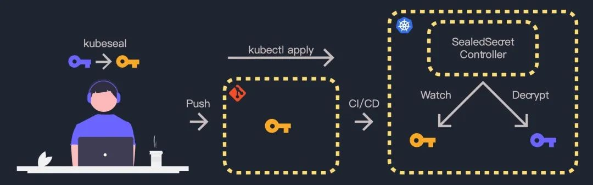

# **KubeSeal: 高效加密和管理 K8s 集群的 Secret 2022**



在 K8s 的管理过程中，像 Secret 这种资源并不好维护，KubeSeal 提供了一种相对简单的方式来对原始 Secret 资源进行加密，并通过控制器进行解密，以此来规避 Secret 泄露风险。

## 安装kubeseal

```
$ wget https://github.com/bitnami-labs/sealed-secrets/releases/download/v0.18.0/kubeseal-0.18.0-linux-amd64.tar.gz
$ tar -xvf kubeseal-0.18.0-linux-amd64.tar.gz
$ cp kubeseal /usr/local/bin/
$ kubeseal --version
```

## **安装controller**

```
$ kubectl apply -f https://github.com/bitnami-labs/sealed-secrets/releases/download/v0.18.0/controller.yaml
```

执行上述命令之后会在 kube-system 命名空间下启动一个控制器 Pod：

```
$ kubectl get pod -n kube-system |grep seal
sealed-secrets-controller-b9fb75d85-k4csm    1/1     Running   0          7h28m
```

Pod 启动之后，使用端口转发映射到本地：

```
$ kubectl -n kube-system port-forward svc/sealed-secrets-controller 8080:8080
```

### **生成加密文件**

首先在本地创建一个名为 `secret-example.yaml` 的文件，编码前的 `secret `字段为：`mysupersecret`

```

apiVersion: v1
kind: Secret
metadata:
  name: secret-example
data:
  secret: bXlzdXBlcnNlY3JldAo=
```

```
$ echo bXlzdXBlcnNlY3JldAo= | base64 -D
mysupersecret
```

使用如下命令将` secret-example.yaml`，转换为加密后的文件 `sealed-secret-example.yaml`

```
$ kubeseal --secret-file secret-example.yaml --sealed-secret-file sealed-secret-example.yaml
```

`sealed-secret-example.yaml` 的内容如下，`spec.encryptedData.secret `就是加密后的内容：

```

apiVersion: bitnami.com/v1alpha1
kind: SealedSecret
metadata:
  creationTimestamp: null
  name: secret-example
  namespace: kube-system
spec:
  encryptedData:
    secret: AgB1ZZg8+J+0HLymOQZdTfWVQZiNkhm5X6WULJuBAAEaQQNhM8i2TV2I1SgKT4sUOCRv90XA1oeFld3XoGPjvYE3leOD1cvK1dDVqno6mNLRziokISk/9fB3cVE2GVgyCud//M53xNpVemDufgsJS2q/KGIOeNEijk9ZM2FaKoLDwtPaVNL0NfmC2xne2XtWJp+/eMOREhbubQhnj5M/Se75axazviuDNf6Ss9fAuR38Msd5DXnKBtyrckEHSa8TDn8ErssOh0ogX14e0/ThN3EWJecSBtx7Xfd0m90+vjmvWevMag442349aquR/qLo0mg40mhcCqSBw/MjaIGZ2F5XRufG1WEP43OgLMTixN2lLSU3eYTrv5t075taI9WJgoOl0DD8UA74EMpX7RMKTiXD6C0XngKmMKg5fUK7JNLFfwHMRPi4zNTwJa9ViDyD0iAJrGGbmMso/nHEtwOtrLE5Rrf0kLQ5N6Lj57gOBdqu903/vDM4Jm695GvEWL2aR3ShOxasHCuZeXj8Q5+KYWeF9sySiJH8bwEtaw6x7j9AxBOwjxWYD0Jvj9KhtlqBa4okSDc3bcgRKGhsSXQx6jOumI5rj+V542hkB6Z8JOtJ17VmzR6XDQDmqSl1FqqwKD5n5yUy5Kf6pJYBnsgKn3TzesQ6JfQbyRLTh1Pn3odOYCnp+Ixbd0Tgn0n5m0KO3RX0hiwGoe0hObIZcsF36g==
  template:
    data: null
    metadata:
      creationTimestamp: null
      name: secret-example
      namespace: kube-system
```

可以将加密后的文件保存到 Gitlab。

创建加密文件：

```
$ k create -f sealed-secret-example.yaml
sealedsecret.bitnami.com/secret-example created

$ k get sealedsecrets.bitnami.com
NAME             AGE
secret-example   6s
```

在创建完加密文件之后，Controller 会解密并生成对应的 secret：

```
$ kubectl get secrets |grep secret-example
secret-example                                   Opaque                                1      2m15s
```

查看由 Controller 生成的 secret 资源内容，可以看到 data.secret 与上面创建的 `secret-example.yaml` 文件内容一致：

```

$ kubectl get secret secret-example -oyaml
apiVersion: v1
data:
  secret: bXlzdXBlcnNlY3JldAo=
kind: Secret
metadata:
  creationTimestamp: "2022-06-10T00:50:40Z"
  name: secret-example
  namespace: kube-system
  ownerReferences:
  - apiVersion: bitnami.com/v1alpha1
    controller: true
    kind: SealedSecret
    name: secret-example
    uid: 57a5b691-9bb5-4dac-800a-1a1baa878299
  resourceVersion: "675560"
  uid: e0db31ad-082b-4596-9fd0-28cc810d86f4
type: Opaque
```

> 注：SealedSecret 和对应的 secret 资源必须位于相同的命名空间

### **tips**

Route	Description


* `/healthz`	Health check route useful for the readiness and liveness probes and for creating an external probe; for example with blackbox exporter.
* `/metrics`	Endpoint for the Prometheus to retrieve the controller’s metrics.
* `/v1/verify	`   Validates a secret.
* `/v1/rotate`	Rotates the secret.
* `/v1/cert.pem`	Retrieves the public certificate.

上例中 Controller 用的证书是自己生成的，还可以指定自己的证书，更方便迁移和管理

使用 KubeSeal 可能会有一种困惑，如果用户直接挂载其他命名空间的 secret，那么这样可能会导致 secret 泄露。官方对此有作解释，如可以通过 RBAC 限制用户可以访问的命名空间以及资源类型。更多参见README