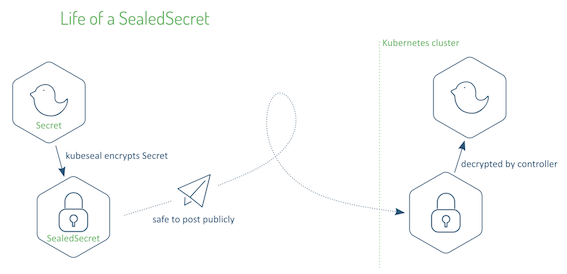

# sealed-secrets, 一种Kubernetes控制器和一种加密密钥

* 源代码网址: [http://www.github.com/bitnami-labs/sealed-secrets](http://www.github.com/bitnami-labs/sealed-secrets)
* Installation: [https://github.com/bitnami-labs/sealed-secrets/releases](https://github.com/bitnami-labs/sealed-secrets/releases)
* **Introduction**: [https://engineering.bitnami.com/articles/sealed-secrets.html
](https://engineering.bitnami.com/articles/sealed-secrets.html)
*  [Kubernetes Secret 资源对象使用方法](https://github.com/Chao-Xi/JacobTechBlog/blob/master/k8s_tutorial/k8s_adv12_secret.md)

有一种情况，我们需要用 `YAML` 的形式生成一个 `Secret`，但是我们希望 `YAML` 自身的内容是加密的，以保证传输过程中，`Secret` 自身的内容不会被截获，但是同时这个 `YAML` 还能用于生成我们需要的 `Secret`。



`Kubeseal` 就可以解决这个问题，它在安装时，生成一个 `TLS Secret`，

* 可以用来对 `Secret` 进行加密，用 `CRD` 的方式来进行 `Secret` 保存，
* 把加密的 `CRD YAML` 提交到集群，
* `Kubeseal` 的服务端控制器会根据 `CRD` 内容进行解密，生成真正的 `Secret`。


## 安装

### 客户端（Homebrew）

```
$ brew install kubeseal

$ kubeseal -h
Usage of kubeseal:
      --allow-empty-data                 Allow empty data in the secret object
      --alsologtostderr                  log to standard error as well as files
      --as string                        Username to impersonate for the operation
      ...
```

### Cluster Side

```
$ kubectl apply -f https://github.com/bitnami-labs/sealed-secrets/releases/download/v0.9.7/controller.yamlcustomresourcedefinition.apiextensions.k8s.io/sealedsecrets.bitnami.com created
rolebinding.rbac.authorization.k8s.io/sealed-secrets-service-proxier created
role.rbac.authorization.k8s.io/sealed-secrets-key-admin created
clusterrole.rbac.authorization.k8s.io/secrets-unsealer created
rolebinding.rbac.authorization.k8s.io/sealed-secrets-controller created
clusterrolebinding.rbac.authorization.k8s.io/sealed-secrets-controller created
serviceaccount/sealed-secrets-controller created
deployment.apps/sealed-secrets-controller created
service/sealed-secrets-controller created
role.rbac.authorization.k8s.io/sealed-secrets-service-proxier created
```
The `SealedSecrets` implementation consists of two components:

* A controller that runs in-cluster, and implements a new SealedSecret Kubernetes API object via the "third party resource" mechanism.
* A `kubeseal` command line tool that encrypts a regular Kubernetes Secret object (as YAML or JSON) into a SealedSecret.


安装结束后，在 `kube-system` 命名空间中，生成了 `Kubeseal` 的控制器，以及用于加解密的 `Secret`：

```
$ kubectl get secret,deploy -n kube-system  |  grep seal
secret/sealed-secrets-controller-token-5h4r9            kubernetes.io/service-account-token   3      116s
secret/sealed-secrets-keyxsck7                          kubernetes.io/tls                     2      107s

deployment.extensions/sealed-secrets-controller       1/1     1            1           116s
```

```
$ kubectl api-resources| grep seal
sealedsecrets                bitnami.com                    true         SealedSecrets
```

### 创建一个“加密”的 Secret

* 生成 `Secret` 的 YAML

```
$ kubectl create secret generic top-secret  --dry-run --from-literal=cloud=grass -o json  > mario.json
```

*  `mario.json`

```
{
    "kind": "Secret",
    "apiVersion": "v1",
    "metadata": {
        "name": "top-secret",
        "creationTimestamp": null
    },
    "data": {
        "cloud": "Z3Jhc3M="
    }
}
```

* 加密

```
cat mario.json | kubeseal > mario-secret.json
```

查看新生成的 `mario-secret.json`：

```
{
  "kind": "SealedSecret",
  "apiVersion": "bitnami.com/v1alpha1",
  "metadata": {
    "name": "top-secret",
    "namespace": "default",
    "creationTimestamp": null
  },
  "spec": {
    "template": {
      "metadata": {
        "name": "top-secret",
        "namespace": "default",
        "creationTimestamp": null
      }
    },
    "encryptedData": {
      "cloud": "AgAFHA1w+n5bvl5rcQ5uQ9dEKUd1Na1vo1QbXAbnkmbgK0koCwVrNIrX7pQ5syBw7fQW+bcSU2NvhiOjZvkcKG2RY8tabkDtuaELC9Fl29spD4Fczly3wlASRCCCRGCUd36oW10rXtpvrOZwXIwqdq+cyOgvBedsP3H03KivpV3C1q1K+wG2BxjZSUVmBPN3ZKhp2pCMk5kZEYZfanYjOWYNQwiL8wc2SP5X6CHN9674BXqd31LLRczDkhtGc7wxuZhPbRjhwMG7uQNFaL77pdzptnNjqRlZqQHzng2giGbFcG/UGiu3jHXjgYu8c+HY1Rdj3eHtjtuzZZFJjvWt4PlJ52BYy8tHFFd4fagwmkgi1EX/zGULC2/foVKuK8qf+6yPHdSTrb2Fiz9+0uKPQQo60koKZGN0mpQ0w0DXc9hWytk3zD1SZ9Hh9Iexa1BZzFtAbalNSX3lXXYkHTkxp/P9/lxDBBSLFQrIDkOLe10Kj2SYG+vbySrt5Oc5LfBTKiu4YwKHWKS/GwELX4ic3Grqsx+RInZ7knV1pqUjKHkyYl1rmdMmlfTG4AAOdcZvypxzy3GSdqrGNvJmaCnRosajoi4ZSP+m04PrTX7RDj32D+8YrYgtkBQFmX/mE9LreSXEtxCyiR3syV0dpW606MfnX8HsW7XgjVZogOjV6Xs28bLpGIIHdoF+MMMROc0lkezloq3hLw=="
    }
  },
  "status": {
    
  }
}
```

把这个文件提交到集群，并查看生成的 `Secret`：

```
$ kubectl create -f mario-secret.json
sealedsecret.bitnami.com/top-secret created
```

```
$ kubectl get secrets | grep top-secret
top-secret                             Opaque                                1      59s
```

```
$ kubectl get secret  top-secret  -oyaml
apiVersion: v1
data:
  cloud: Z3Jhc3M=
kind: Secret
metadata:
  creationTimestamp: "2020-02-05T03:24:53Z"
  name: top-secret
  namespace: default
  ownerReferences:
  - apiVersion: bitnami.com/v1alpha1
    controller: true
    kind: SealedSecret
    name: top-secret
    uid: 0fdc14f4-a9e6-481a-b06e-f117615303ee
  resourceVersion: "2477698"
  selfLink: /api/v1/namespaces/default/secrets/top-secret
  uid: 7cedd004-bf67-49d5-b44f-5d6159616012
type: Opaque
```

```
$ echo Z3Jhc3M= | base64 -D
grass
```


## 详细信息

这里控制器添加一个新的`SealedSecret` 自定义资源。

**`SealedSecret`的有趣部分是`base64-encoded`非对称加密 `Secret`.**

### 控制器在启动

控制器在启动时查找群集群 `private/public` 密钥对，如果未找到，则生成新的`4096`位( 默认情况) `RSA`密钥对。 

键在与`Controller`在相同的名称空间中保持在常规的`Secret` 中。(以自签署证书的形式)的`public` 关键部分应该公开使用，任何人都可以使用这个集群使用 `SealedSecrets`。 

在启动时将证书打印到控制器日志，并通过 `HTTP GET` 到控制器上的`/v1/cert.pem `提供该证书。

### 加密期间

* 原始 `Secret` 中的每个值都使用 `gcm ( aes-256 )` 对称加密，并随机生成 `32`字节会话密钥
* 然后使用 `rsa OAEP` ( 使用弹出菜单) 使用控制器密钥的`public` 将会话密钥不对称加密，原始的`Secret` 命名空间/名称作为`OAEP`输入参数( aka标签)。
*  最终输出为：
	*  2字节加密会话密钥长度
	*  加密会话密钥,
	*  加密密钥。

请注意，**在由控制器解密期间，`SealedSecret `命名空间/名称用作，参数，确保 `SealedSecret` 和 `Secret` 绑定到同一名称。**

**生成的`Secret` 被 `SealedSecret` 标记为"拥有"，如果删除了 `SealedSecret`，它将被垃圾回收。**


## 备份、恢复和轮转

前面提到，Kubeseal 安装过程中除了生成 Deployment 之外，还生成了一个 Secret，仔细观察会看到这个 Secret 带有一个标签：`sealedsecrets.bitnami.com/sealed-secrets-key=active`

```
$ kubectl get secret --show-labels  -n kube-system  |  grep seal
sealed-secrets-controller-token-5h4r9            kubernetes.io/service-account-token   3      20m   <none>
sealed-secrets-keyxsck7                          kubernetes.io/tls                     2      20m   sealedsecrets.bitnami.com/sealed-secrets-key=active
```

代表这个 `Secret` 是正用于加密的。只要把这个 `Secret` 进行备份，或者复制到其它集群上，就可以用同样的密钥进行加密了。

```
kubectl get secret -n kube-system sealed-secrets-key -o yaml> master.key
```

如果把这个标签值修改为 `compromised`，就代表这一密钥已经过期。

对 `Secret` 进行上述的修改之后，可以删除控制器 `Pod`，以便生成并启用新的密钥，当然，过去生成的加密内容也不再有效，需要重新进行加密。


## 常见问题解答


### 如果不再访问群集，你仍然能够解密？

否，`private` 密钥仅存储在由控制器( 除非你有k8s对象的其他备份) 管理的密钥中。 没有后门-没有那个 `private` 密钥，那么你就不能解密 `SealedSecrets`。 如果你不能使用加密密钥，也不能在群集中使用密钥，则需要重新生成新密码。

### 我如何备份我的`SealedSecrets`？

如果你想要对加密 `private` 密钥进行备份，那么很容易从具有适当访问权限的帐户中进行操作：

```
kubectl get secret -n kube-system sealed-secrets-key -o yaml> master.key
```

注意：这是`Controller`+ `private` 键的`public`，应该保持安全 ！

若要在一些灾难之后恢复备份，请在启动控制器之前将该机密放回控制器，或者重新启动控制器：

```
kubectl replace secret -n kube-system sealed-secrets-key master.keykubectl delete pod -n kube-system -l name=sealed-secrets-controller
```

### 有哪些标志可以用于 kubeseal？

你可以使用 `kubeseal --help` 检查可用的标志。
