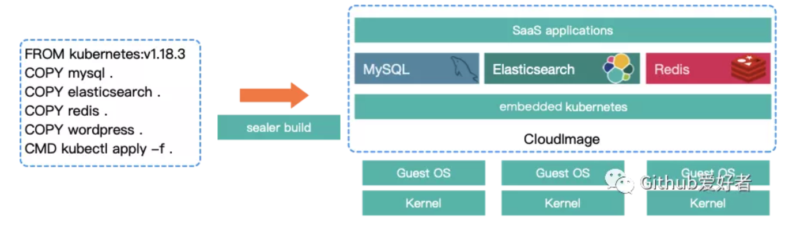
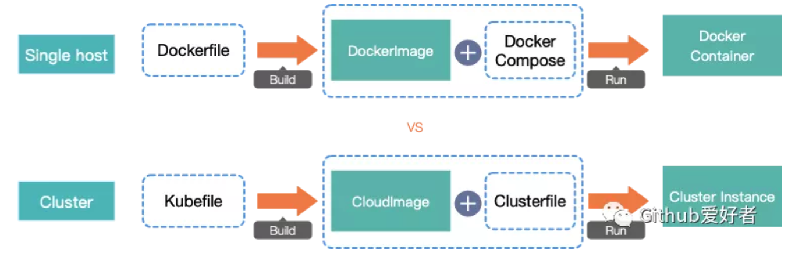

# **Sealer 把Kubernetes集群打包成一个镜像**

`sealer[ˈsiːlər]`是一款分布式应用打包交付运行的解决方案，通过把分布式应用及其数据库中间件等依赖一起打包以解决复杂应用的交付问题。


sealer 构建出来的产物我们称之为**集群镜像**, 集群镜像里内嵌了一个 kubernetes, 解决了分布式应用的交付一致性问题。

集群镜像可以 push 到 registry 中共享给其他用户使用，也可以在官方仓库中找到非常通用的分布式软件直接使用。




Docker 可以把一个操作系统的 `rootfs+` 应用 build 成一个容器镜像，`sealer` 把 `kubernetes` 看成操作系统，在这个更高的抽象纬度上做出来的镜像就是集群镜像。实现整个集群的 Build Share Run !!!

有了集群镜像用户实践云原生生态技术将变得极其简单，如：

**1.安装一个 kubernetes 集群**

```
#安装sealer
wget https://github.com/alibaba/sealer/releases/download/v0.1.4/sealer-0.1.4-linux-amd64.tar.gz && \
tar zxvf sealer-0.1.4-linux-amd64.tar.gz && mv sealer /usr/bin
#运行集群
sealer run kubernetes:v1.19.9 # 在公有云上运行一个kubernetes集群
sealer run kubernetes:v1.19.9 --masters 3 --nodes 3 # 在公有云上运行指定数量节点的kuberentes集群
# 安装到已经存在的机器上
sealer run kubernetes:v1.19.9 --masters 192.168.0.2,192.168.0.3,192.168.0.4 --nodes 192.168.0.5,192.168.0.6,192.168.0.7 --passwd xxx
```

**2.安装 prometheus 集群**

```
sealer run prometheus:2.26.0
```

上面命令就可以帮助你安装一个包含 prometheus 的 kubernetes 集群, 同理其它软件如 istio ingress grafana 等都可以通过这种方式运行。



还没完，Sealer 最出色的地方是可以非常方便的让用户自定义一个集群的镜像，通过像 Dockerfile 一样的文件来描述和 build，也就是 `Kubefile`：

```
FROM registry.cn-qingdao.aliyuncs.com/sealer-io/kubernetes:v1.19.9
RUN wget https://raw.githubusercontent.com/kubernetes/dashboard/v2.2.0/aio/deploy/recommended.yaml
CMD kubectl apply -f recommended.yaml
```

使用下面的 `sealer build` 命令就可以构建集群镜像：

```
sealer build -t registry.cn-qingdao.aliyuncs.com/sealer-io/dashboard:latest .
```

然后一个包含 dashboard 的集群镜像就被制作出来了，可以运行或者分享给别人。

把制作好的集群镜像推送到镜像仓库，集群镜像仓库兼容 docker 镜像仓库标准，可以把集群镜像推送到 docker hub、阿里 ACR、或者 Harbor 中

```
sealer push registry.cn-qingdao.aliyuncs.com/sealer-io/dashboard:latest
```

**使用场景&特性**

* [x] 极其简单的方式在生产环境中或者离线环境中安装 kubernetes、以及 kubernetes 生态中其它软件
* [x] 通过 Kubefile 可以非常简单的自定义 kubernetes 集群镜像对集群和应用进行打包，并可以提交到仓库中进行分享
* [x] 强大的生命周期管理能力，以难以想象的简单的方式去做如集群升级，集群备份恢复，节点阔缩等操作
* [x] 速度极快 3min 以内完成集群安装
* [x] 支持 ARM x86, v1.20 以上版本支持 containerd，几乎兼容所有支持 systemd 的 linux 操作系统
* [x] **不依赖 ansible haproxy keepalived, 高可用通过 ipvs 实现，占用资源少，稳定可靠**
* [x] 官方仓库中有非常多的生态软件镜像可以直接使用，包含所有依赖，一键安装

## 快速开始


### 安装一个 kubernetes 集群

```
sealer run kubernetes:v1.19.9 --masters 192.168.0.2 --passwd xxx
```

如果是在云上安装：

```
export ACCESSKEYID=xxx
export ACCESSKEYSECRET=xxx
sealer run registry.cn-qingdao.aliyuncs.com/sealer-io/dashboard:latest
# 或者指定节点数量运行集群
sealer run registry.cn-qingdao.aliyuncs.com/sealer-io/dashboard:latest \
  --masters 3 --nodes 3
```

```
[root@iZm5e42unzb79kod55hehvZ ~]# kubectl get node
NAME                      STATUS   ROLES    AGE   VERSION
izm5e42unzb79kod55hehvz   Ready    master   18h   v1.16.9
izm5ehdjw3kru84f0kq7r7z   Ready    master   18h   v1.16.9
izm5ehdjw3kru84f0kq7r8z   Ready    master   18h   v1.16.9
izm5ehdjw3kru84f0kq7r9z   Ready    <none>   18h   v1.16.9
izm5ehdjw3kru84f0kq7raz   Ready    <none>   18h   v1.16.9
izm5ehdjw3kru84f0kq7rbz   Ready    <none>   18h   v1.16.9
```

查看镜像默认启动配置：


```
sealer inspect -c registry.cn-qingdao.aliyuncs.com/sealer-io/dashboard:latest
```

### 使用 Clusterfile 拉起一个 k8s 集群

使用已经提供好的官方基础镜像(sealer-io/kubernetes:v1.19.9)就可以快速拉起一个 k8s 集群。

场景 1. 往已经存在的服务器上去安装，provider 类型为 BAREMETAL

Clusterfile 内容：


```
apiVersion: sealer.aliyun.com/v1alpha1
kind: Cluster
metadata:
  name: my-cluster
spec:
  image: registry.cn-qingdao.aliyuncs.com/sealer-io/kubernetes:v1.19.9
  provider: BAREMETAL
  ssh:
    passwd:
    pk: xxx
    pkPasswd: xxx
    user: root
  network:
    interface: eth0
    cniName: calico
    podCIDR: 100.64.0.0/10
    svcCIDR: 10.96.0.0/22
    withoutCNI: false
  certSANS:
    - aliyun-inc.com
    - 10.0.0.2

  masters:
    ipList:
     - 172.20.125.234
     - 172.20.126.5
     - 172.20.126.6
  nodes:
    ipList:
     - 172.20.126.8
     - 172.20.126.9
     - 172.20.126.10
```

执行如下所示命令：


```
[root@iZm5e42unzb79kod55hehvZ ~]# sealer apply -f Clusterfile
[root@iZm5e42unzb79kod55hehvZ ~]# kubectl get node
NAME                      STATUS   ROLES    AGE   VERSION
izm5e42unzb79kod55hehvz   Ready    master   18h   v1.16.9
izm5ehdjw3kru84f0kq7r7z   Ready    master   18h   v1.16.9
izm5ehdjw3kru84f0kq7r8z   Ready    master   18h   v1.16.9
izm5ehdjw3kru84f0kq7r9z   Ready    <none>   18h   v1.16.9
izm5ehdjw3kru84f0kq7raz   Ready    <none>   18h   v1.16.9
izm5ehdjw3kru84f0kq7rbz   Ready    <none>   18h   v1.16.9
```

场景 2. 自动申请阿里云服务器进行安装, `provider: ALI_CLOUD`

Clusterfile:


```
apiVersion: sealer.aliyun.com/v1alpha1
kind: Cluster
metadata:
  name: my-cluster
spec:
  image: registry.cn-qingdao.aliyuncs.com/sealer-io/kubernetes:v1.19.9
  provider: ALI_CLOUD
  ssh:
    passwd:
    pk: xxx
    pkPasswd: xxx
    user: root
  network:
    interface: eth0
    cniName: calico
    podCIDR: 100.64.0.0/10
    svcCIDR: 10.96.0.0/22
    withoutCNI: false
  certSANS:
    - aliyun-inc.com
    - 10.0.0.2

  masters:
    cpu: 4
    memory: 4
    count: 3
    systemDisk: 100
    dataDisks:
    - 100
  nodes:
    cpu: 4
    memory: 4
    count: 3
    systemDisk: 100
    dataDisks:
    - 100
```


准备好阿里云的ak sk


```
[root@iZm5e42unzb79kod55hehvZ ~]# ACCESSKEYID=xxxxxxx ACCESSKEYSECRET=xxxxxxx sealer apply -f Clusterfile

```


基础设置的一些源信息会被写入到 Clusterfile 中，存储在 `/root/.sealer/[cluster-name]/Clusterfile` 中, 所以可以这样释放集群：

```
./sealer delete -f /root/.sealer/my-cluster/Clusterfile

```

制作一个自定义的集群镜像, 这里以制作一个 dashboard 镜像为例

新建一个 dashboard 目录,创建一个文件 Kubefile 内容为:

```
FROM registry.cn-qingdao.aliyuncs.com/sealer-io/kubernetes:v1.19.9
RUN wget https://raw.githubusercontent.com/kubernetes/dashboard/v2.2.0/aio/deploy/recommended.yaml
CMD kubectl apply -f recommended.yaml
```

```
[root@iZm5e42unzb79kod55hehvZ dashboard]# export ACCESSKEYID=xxxxxxx
[root@iZm5e42unzb79kod55hehvZ dashboard]# export ACCESSKEYSECRET=xxxxxxx
[root@iZm5e42unzb79kod55hehvZ dashboard]# sealer build -f Kubefile -t my-kuberentes-cluster-with-dashboard:latest .
```


创建一个带有 dashboard 的自定义集群, 操作同上，替换掉 Clusterfile 中的 image 字段即可：


```
apiVersion: sealer.aliyun.com/v1alpha1
kind: Cluster
metadata:
  name: my-cluster
spec:
  image: my-kuberentes-cluster-with-dashboard:latest
  provider: ALI_CLOUD
  ssh:
    passwd:
    pk: xxx
    pkPasswd: xxx
    user: root
  network:
    interface: eth0
    cniName: calico
    podCIDR: 100.64.0.0/10
    svcCIDR: 10.96.0.0/22
    withoutCNI: false
  certSANS:
    - aliyun-inc.com
    - 10.0.0.2

  masters:
    cpu: 4
    memory: 4
    count: 3
    systemDisk: 100
    dataDisks:
    - 100
  nodes:
    cpu: 4
    memory: 4
    count: 3
    systemDisk: 100
    dataDisks:
    - 100
```

```
# 准备好阿里云的ak sk
[root@iZm5e42unzb79kod55hehvZ ~]# ACCESSKEYID=xxxxxxx ACCESSKEYSECRET=xxxxxxx sealer apply -f Clusterfile
```

把制作好的集群镜像推送到镜像仓库：

```
sealer tag my-kuberentes-cluster-with-dashboard:latest registry.cn-qingdao.aliyuncs.com/sealer-io/my-kuberentes-cluster-with-dashboard:latest
sealer push registry.cn-qingdao.aliyuncs.com/sealer-io/my-kuberentes-cluster-with-dashboard:latest
```

就可以把镜像复用给别人进行使用。


