# Apache Spark on K8S and HDFS Security 

There is growing interest in running Apache Spark natively on Kubernetes. 

This article will explain the design idioms, architecture and internal mechanics of Spark orchestrations over Kubernetes and the on-going work of the community. 

Since data for Spark analytics is often stored in HDFS, **This article will also explain how to make Spark on Kubernetes work seamlessly with HDFS by addressing challenges such as data locality and security through the use of Kubernetes constructs such as secrets and RBAC rules.**

## Why Kubernetes

### More isolation is good 

Kubernetes provides each program with: 

* **a lightweight virtual file system -- Docker image**
   * an independent set of S/W packages 
* **a virtual network interface** 
  * a unique virtual IP address 
  * an entire range of ports 

### Other isolation layers 

* Separate process ID space 
* Max memory limit 
* CPU share throttling 
* Mountable volumes 
  * **Config files -- ConfigMaps** 
  * **Credentials -- Secrets** 
  * **Local storages -- EmptyDir, HostPath** 
  * **Network storages -- PersistentVolumes** 

### Kubernetes architecture 

**Pod**, a unit of scheduling and isolation. 

* runs a user program in a primary container 
* holds isolation layers like a virtual IP in an infra container 

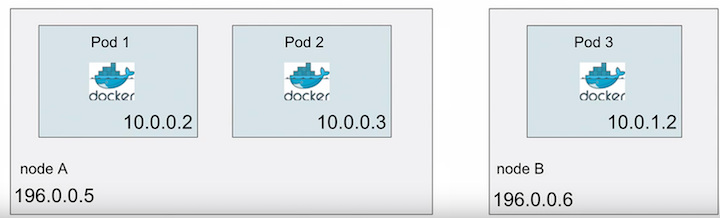
  

## Big Data on Kubernetes 

**Since Spark 2.3**, the community has added features: 

* **on-JVM** binding support and memory customization 
* client-mode support for running interactive apps 
* large framework refactors: `rm init-container`; `schedule`


### Spark on Kubernetes

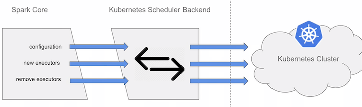

* Resource Requests 
* Authnz 
* Communication with K8s 

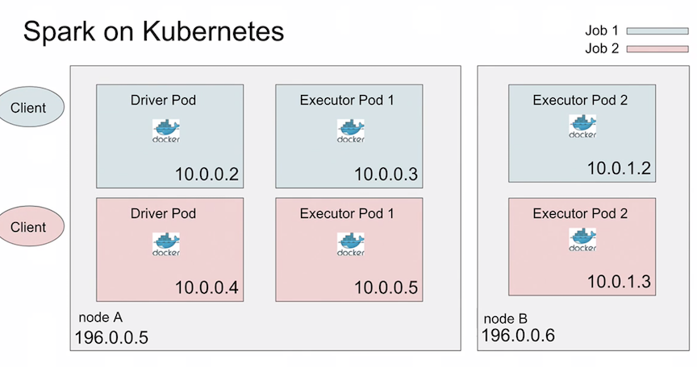

### What about storage? 

Spark on Kubernetes supports cloud storages like S3. 

**Your data is often stored on HDFS:**

**Access remote HDFS running outside Kubernetes**

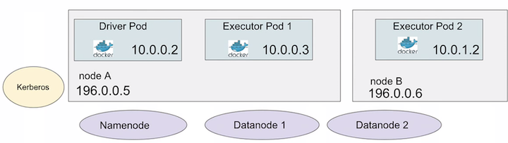

## Demo: Spark k8s Accessing Secure HDFS

**Running a Spark Job on Kubernetes accessing Secure HDFS**

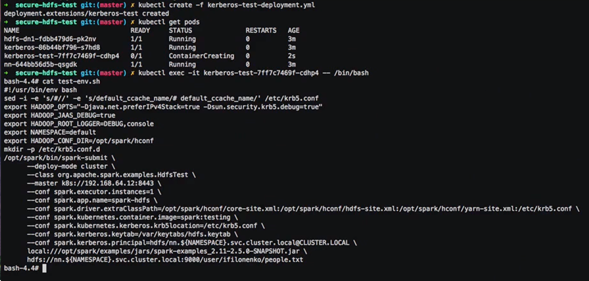

## Security HDFS deep dive 

* Kerberos tickets 
* HDFS tokens 
* Long running jobs 
* Access Control of Secrets 


### Kerberos Simplified 

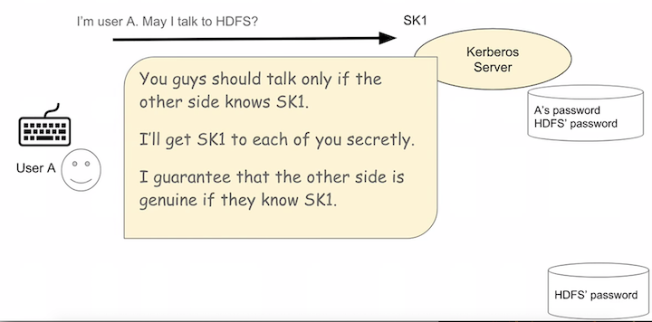

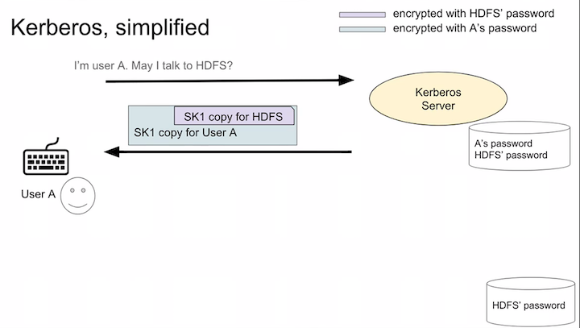

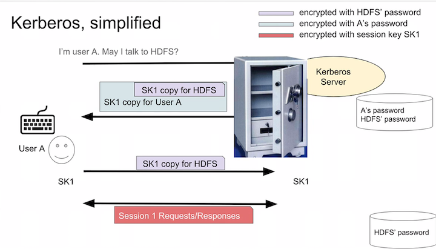

## HDFS Delegation Token 

**Kerberos ticket, no good for executors on cluster nodes.**

* Stamped with the client IP. 

**Give tokens to driver and executors instead.**

* Issued by namenode only if the client has a valid Kerberos ticket. 
* No client IP stamped. 
* Permit for driver and executors to use HDFS on your behalf across all cluster nodes. 


**How to do that:** Share tokens via K8s Secret 


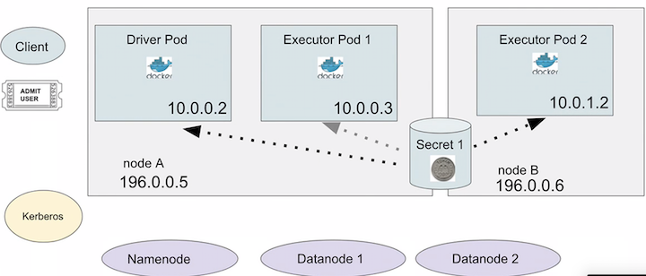


#### 1.How to deal with token expires problem

**Refresh tokens with k8s micro-services**

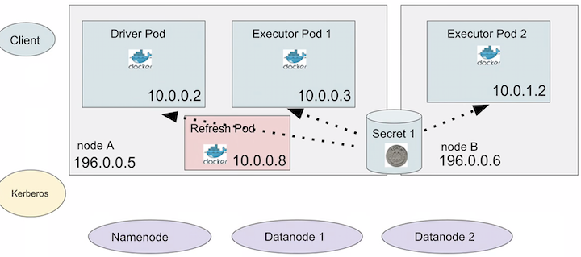

#### 2.Secrets can be exposed to others

**Keep secrets to yourself with k8s RBAC**

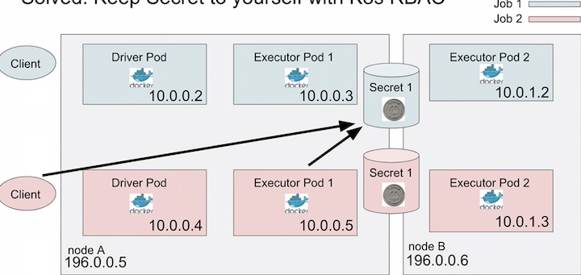

#### Access Control of Secrets

**HDFS DTs and renewal service keytab in Secrets**

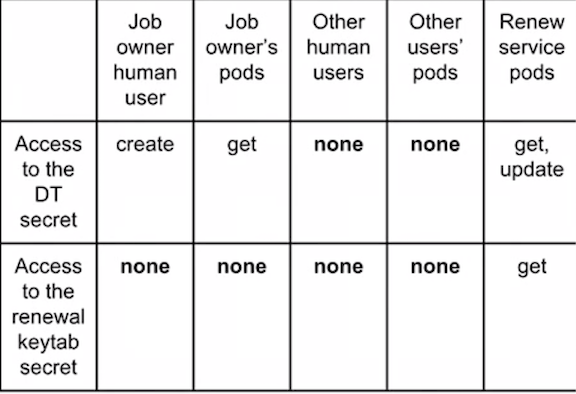

### Access Control of Secrets 

HDFS DTs and renewal service keytab in Secrets 

Admin can restrict access by: 

1. Per-user AC, manual 
2. Per-group AC, manual 
3. **Per-user AC (automated, upcoming)** 

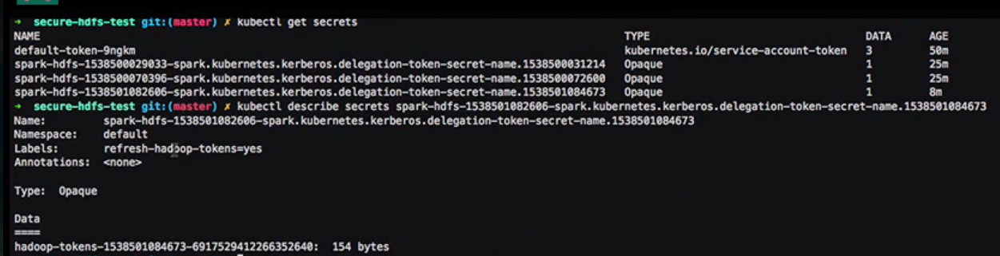

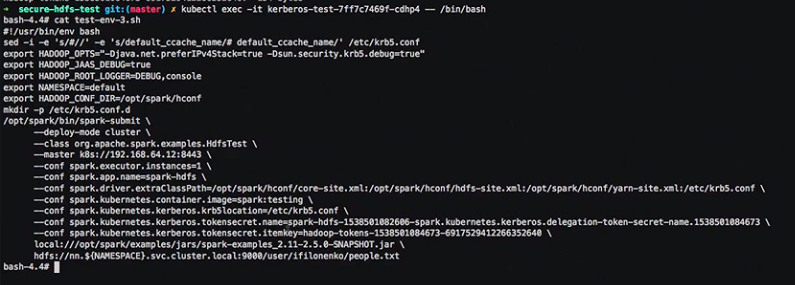

## Run HDFS itself on K8S

[https://github.com/apache-spark-on-k8s/kubernetes-HDFS](https://github.com/apache-spark-on-k8s/kubernetes-HDFS)


## Data Locality deep dive 

Send compute to data

* Node locality 
* Rack locality 
* Where to launch executors
 
**Spark on K8s had to be fixed**

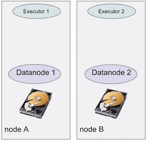

### 1.Problem: Node locality broken with virtual pod IPS

```
(/fileA Datanode 1 —> 196.0.0.5) == Location of Executor 1 
```
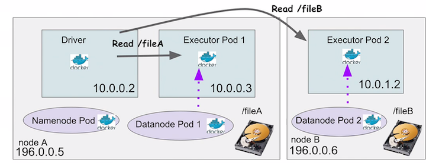

### 2.Problem: Rack locality broken with virtual pod IPs

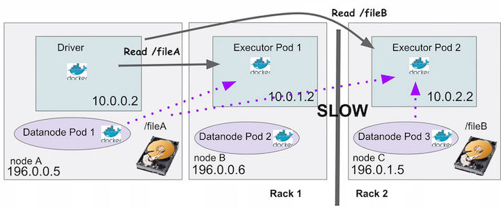

**Soloved: Rack locality**

```
(/fileA —> Datanode 1 —> 196.0.0.5 -> Rack 1) == (Executor 1 —>10.0.1.2 —> 196.0.0.6 -> Rack 1)
```

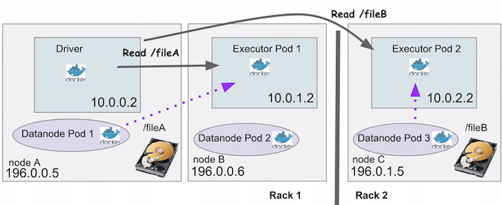

**Soloved: Node preference**

I'd like node A much more for my executors

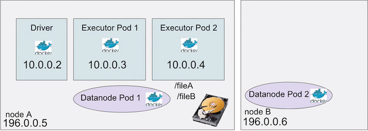


