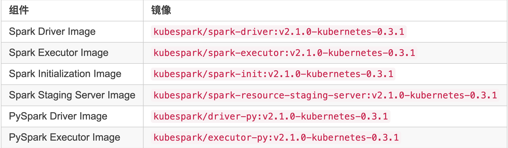

# K8S Spark 安装指南

我们可以直接使用官方已编译好的 docker 镜像来部署，下面是官方发布的镜像：



我将这些镜像放到了我的私有镜像仓库中了。

还需要安装支持 kubernetes 的 spark 客户端，[在这里下载](https://github.com/apache-spark-on-k8s/spark/releases)


根据使用的镜像版本，我下载的是 [v2.1.0-kubernetes-0.3.1](https://github.com/apache-spark-on-k8s/spark/releases/tag/v2.1.0-kubernetes-0.3.1)

运行 `SparkPi` 测试

```
./bin/spark-submit \
  --deploy-mode cluster \
  --class org.apache.spark.examples.SparkPi \
  --master k8s://https://172.20.0.113:6443 \
  --kubernetes-namespace spark-cluster \
  --conf spark.executor.instances=5 \
  --conf spark.app.name=spark-pi \
  --conf spark.kubernetes.driver.docker.image=sz-pg-oam-docker-hub-001.tendcloud.com/library/kubespark-spark-driver:v2.1.0-kubernetes-0.3.1 \
  --conf spark.kubernetes.executor.docker.image=sz-pg-oam-docker-hub-001.tendcloud.com/library/kubespark-spark-executor:v2.1.0-kubernetes-0.3.1 \
  --conf spark.kubernetes.initcontainer.docker.image=sz-pg-oam-docker-hub-001.tendcloud.com/library/kubespark-spark-init:v2.1.0-kubernetes-0.3.1 \
local:///opt/spark/examples/jars/spark-examples_2.11-2.1.0-k8s-0.3.1-SNAPSHOT.jar
```

关于该命令参数的介绍请参考：[running on kubernetes](https://apache-spark-on-k8s.github.io/userdocs/running-on-kubernetes.html)


注意： 该 jar 包实际上是

```
spark.kubernetes.executor.docker.image
```

镜像中的。


这时候提交任务运行还是失败，报错信息中可以看到两个问题：

* Executor 无法找到 `driver pod`
* 用户 `system:serviceaccount:spark-cluster:defaul` 没有权限获取 `spark-cluster` 中的 `pod` 信息。


需要为 spark 集群创建一个 `serviceaccount` 和 `clusterrolebinding`：

```
kubectl create serviceaccount spark --namespace spark-cluster
kubectl create rolebinding spark-edit --clusterrole=edit --serviceaccount=spark-cluster:spark --namespace=spark-cluster
```

该 Bug 将在新版本中修复。


## 开发文档

### 编译

Fork 并克隆项目到本地：

```
git clone https://github.com/rootsongjc/spark.git
```

编译前请确保你的环境中已经安装 **Java8** 和 **Maven3**。

```
## 第一次编译前需要安装依赖
build/mvn install -Pkubernetes -pl resource-managers/kubernetes/core -am -DskipTests

## 编译 spark on kubernetes
build/mvn compile -Pkubernetes -pl resource-managers/kubernetes/core -am -DskipTests

## 发布
dev/make-distribution.sh --tgz -Phadoop-2.7 -Pkubernetes
```

### 构建镜像

[使用该脚本来自动构建容器镜像](https://github.com/apache-spark-on-k8s/spark/pull/488)

将该脚本放在 dist 目录下，执行：

```
./build-push-docker-images.sh -r sz-pg-oam-docker-hub-001.tendcloud.com/library -t v2.1.0-kubernetes-0.3.1-1 build
./build-push-docker-images.sh -r sz-pg-oam-docker-hub-001.tendcloud.com/library -t v2.1.0-kubernetes-0.3.1-1 push
```

注意：如果你使用的 MacOS，bash 的版本可能太低，执行改脚本将出错，请检查你的 bash 版本：


```
bash --version
GNU bash, version 3.2.57(1)-release (x86_64-apple-darwin16)
Copyright (C) 2007 Free Software Foundation, Inc.
```

上面我在升级 `bash` 之前获取的版本信息，使用下面的命令升级 `bash`：

```
brew install bash
```
升级后的 bash 版本为 `4.4.12(1)-release (x86_64-apple-darwin16.3.0)`。

编译并上传镜像到我的私有镜像仓库，将会构建出如下几个镜像：

```
sz-pg-oam-docker-hub-001.tendcloud.com/library/spark-driver:v2.1.0-kubernetes-0.3.1-1
sz-pg-oam-docker-hub-001.tendcloud.com/library/spark-resource-staging-server:v2.1.0-kubernetes-0.3.1-1
sz-pg-oam-docker-hub-001.tendcloud.com/library/spark-init:v2.1.0-kubernetes-0.3.1-1
sz-pg-oam-docker-hub-001.tendcloud.com/library/spark-shuffle:v2.1.0-kubernetes-0.3.1-1
sz-pg-oam-docker-hub-001.tendcloud.com/library/spark-executor:v2.1.0-kubernetes-0.3.1-1
sz-pg-oam-docker-hub-001.tendcloud.com/library/spark-executor-py:v2.1.0-kubernetes-0.3.1-1
sz-pg-oam-docker-hub-001.tendcloud.com/library/spark-driver-py:v2.1.0-kubernetes-0.3.1-1
```

## 运行测试

在 `dist/bin` 目录下执行 `spark-pi` 测试：

```
./spark-submit \
  --deploy-mode cluster \
  --class org.apache.spark.examples.SparkPi \
  --master k8s://https://172.20.0.113:6443 \
  --kubernetes-namespace spark-cluster \
  --conf spark.kubernetes.authenticate.driver.serviceAccountName=spark \
  --conf spark.executor.instances=5 \
  --conf spark.app.name=spark-pi \
  --conf spark.kubernetes.driver.docker.image=sz-pg-oam-docker-hub-001.tendcloud.com/library/spark-driver:v2.1.0-kubernetes-0.3.1-1 \
  --conf spark.kubernetes.executor.docker.image=sz-pg-oam-docker-hub-001.tendcloud.com/library/spark-executor:v2.1.0-kubernetes-0.3.1-1 \
  --conf spark.kubernetes.initcontainer.docker.image=sz-pg-oam-docker-hub-001.tendcloud.com/library/spark-init:v2.1.0-kubernetes-0.3.1-1 \
local:///opt/spark/examples/jars/spark-examples_2.11-2.2.0-k8s-0.4.0-SNAPSHOT.jar
```

详细的参数说明见 [running on kubernetes](https://apache-spark-on-k8s.github.io/userdocs/running-on-kubernetes.html)

注意

```
local:///opt/spark/examples/jars/spark-examples_2.11-2.2.0-k8s-0.4.0-SNAPSHOT.jar
```

文件是在`spark-driver`和s`park-executor`镜像里的，在上一步构建镜像时已经构建并上传到了镜像仓库中。

执行日志显示：

```
2017-09-14 14:59:01 INFO  Client:54 - Waiting for application spark-pi to finish...
2017-09-14 14:59:01 INFO  LoggingPodStatusWatcherImpl:54 - State changed, new state:
	 pod name: spark-pi-1505372339796-driver
	 namespace: spark-cluster
	 labels: spark-app-selector -> spark-f4d3a5d3ad964a05a51feb6191d50357, spark-role -> driver
	 pod uid: 304cf440-991a-11e7-970c-f4e9d49f8ed0
	 creation time: 2017-09-14T06:59:01Z
	 service account name: spark
	 volumes: spark-token-zr8wv
	 node name: N/A
	 start time: N/A
	 container images: N/A
	 phase: Pending
	 status: []
2017-09-14 14:59:01 INFO  LoggingPodStatusWatcherImpl:54 - State changed, new state:
	 pod name: spark-pi-1505372339796-driver
	 namespace: spark-cluster
	 labels: spark-app-selector -> spark-f4d3a5d3ad964a05a51feb6191d50357, spark-role -> driver
	 pod uid: 304cf440-991a-11e7-970c-f4e9d49f8ed0
	 creation time: 2017-09-14T06:59:01Z
	 service account name: spark
	 volumes: spark-token-zr8wv
	 node name: 172.20.0.114
	 start time: N/A
	 container images: N/A
	 phase: Pending
	 status: []
2017-09-14 14:59:01 INFO  LoggingPodStatusWatcherImpl:54 - State changed, new state:
	 pod name: spark-pi-1505372339796-driver
	 namespace: spark-cluster
	 labels: spark-app-selector -> spark-f4d3a5d3ad964a05a51feb6191d50357, spark-role -> driver
	 pod uid: 304cf440-991a-11e7-970c-f4e9d49f8ed0
	 creation time: 2017-09-14T06:59:01Z
	 service account name: spark
	 volumes: spark-token-zr8wv
	 node name: 172.20.0.114
	 start time: 2017-09-14T06:59:01Z
	 container images: sz-pg-oam-docker-hub-001.tendcloud.com/library/spark-driver:v2.1.0-kubernetes-0.3.1-1
	 phase: Pending
	 status: [ContainerStatus(containerID=null, image=sz-pg-oam-docker-hub-001.tendcloud.com/library/spark-driver:v2.1.0-kubernetes-0.3.1-1, imageID=, lastState=ContainerState(running=null, terminated=null, waiting=null, additionalProperties={}), name=spark-kubernetes-driver, ready=false, restartCount=0, state=ContainerState(running=null, terminated=null, waiting=ContainerStateWaiting(message=null, reason=ContainerCreating, additionalProperties={}), additionalProperties={}), additionalProperties={})]
2017-09-14 14:59:03 INFO  LoggingPodStatusWatcherImpl:54 - State changed, new state:
	 pod name: spark-pi-1505372339796-driver
	 namespace: spark-cluster
	 labels: spark-app-selector -> spark-f4d3a5d3ad964a05a51feb6191d50357, spark-role -> driver
	 pod uid: 304cf440-991a-11e7-970c-f4e9d49f8ed0
	 creation time: 2017-09-14T06:59:01Z
	 service account name: spark
	 volumes: spark-token-zr8wv
	 node name: 172.20.0.114
	 start time: 2017-09-14T06:59:01Z
	 container images: sz-pg-oam-docker-hub-001.tendcloud.com/library/spark-driver:v2.1.0-kubernetes-0.3.1-1
	 phase: Running
	 status: [ContainerStatus(containerID=docker://5c5c821c482a1e35552adccb567020532b79244392374f25754f0050e6cd4c62, image=sz-pg-oam-docker-hub-001.tendcloud.com/library/spark-driver:v2.1.0-kubernetes-0.3.1-1, imageID=docker-pullable://sz-pg-oam-docker-hub-001.tendcloud.com/library/spark-driver@sha256:beb92a3e3f178e286d9e5baebdead88b5ba76d651f347ad2864bb6f8eda26f94, lastState=ContainerState(running=null, terminated=null, waiting=null, additionalProperties={}), name=spark-kubernetes-driver, ready=true, restartCount=0, state=ContainerState(running=ContainerStateRunning(startedAt=2017-09-14T06:59:02Z, additionalProperties={}), terminated=null, waiting=null, additionalProperties={}), additionalProperties={})]
2017-09-14 14:59:12 INFO  LoggingPodStatusWatcherImpl:54 - State changed, new state:
	 pod name: spark-pi-1505372339796-driver
	 namespace: spark-cluster
	 labels: spark-app-selector -> spark-f4d3a5d3ad964a05a51feb6191d50357, spark-role -> driver
	 pod uid: 304cf440-991a-11e7-970c-f4e9d49f8ed0
	 creation time: 2017-09-14T06:59:01Z
	 service account name: spark
	 volumes: spark-token-zr8wv
	 node name: 172.20.0.114
	 start time: 2017-09-14T06:59:01Z
	 container images: sz-pg-oam-docker-hub-001.tendcloud.com/library/spark-driver:v2.1.0-kubernetes-0.3.1-1
	 phase: Succeeded
	 status: [ContainerStatus(containerID=docker://5c5c821c482a1e35552adccb567020532b79244392374f25754f0050e6cd4c62, image=sz-pg-oam-docker-hub-001.tendcloud.com/library/spark-driver:v2.1.0-kubernetes-0.3.1-1, imageID=docker-pullable://sz-pg-oam-docker-hub-001.tendcloud.com/library/spark-driver@sha256:beb92a3e3f178e286d9e5baebdead88b5ba76d651f347ad2864bb6f8eda26f94, lastState=ContainerState(running=null, terminated=null, waiting=null, additionalProperties={}), name=spark-kubernetes-driver, ready=false, restartCount=0, state=ContainerState(running=null, terminated=ContainerStateTerminated(containerID=docker://5c5c821c482a1e35552adccb567020532b79244392374f25754f0050e6cd4c62, exitCode=0, finishedAt=2017-09-14T06:59:11Z, message=null, reason=Completed, signal=null, startedAt=null, additionalProperties={}), waiting=null, additionalProperties={}), additionalProperties={})]
2017-09-14 14:59:12 INFO  LoggingPodStatusWatcherImpl:54 - Container final statuses:


	 Container name: spark-kubernetes-driver
	 Container image: sz-pg-oam-docker-hub-001.tendcloud.com/library/spark-driver:v2.1.0-kubernetes-0.3.1-1
	 Container state: Terminated
	 Exit code: 0
2017-09-14 14:59:12 INFO  Client:54 - Application spark-pi finished.
```

从日志中可以看到任务运行的状态信息。


使用下面的命令可以看到 `kubernetes` 启动的 `Pod` 信息：

```
kubectl --namespace spark-cluster get pods -w
```
将会看到 `spark-driver` 和 `spark-exec` 的 Pod 信息。

## 依赖管理

上文中我们在运行测试程序时，命令行中指定的 `jar` 文件已包含在 `docker` 镜像中，是不是说我们每次提交任务都需要重新创建一个镜像呢？非也！如果真是这样也太麻烦了。


**创建 resource staging server**

为了方便用户提交任务，不需要每次提交任务的时候都创建一个镜像，我们使用了 `resource staging server` 。

```
kubectl create -f conf/kubernetes-resource-staging-server.yaml
```

我们同样将其部署在 `spark-cluster namespace` 下，该 `yaml` 文件见 [`kubernetes-handbook`](https://github.com/rootsongjc/kubernetes-handbook) 的 `manifests/spark-with-kubernetes-native-scheduler` 目录。

**优化**


其中有一点需要优化，在使用下面的命令提交任务时，使用

```
--conf spark.kubernetes.resourceStagingServer.uri
```

参数指定 `resource staging server` 地址，用户不应该关注 `resource staging server` 究竟运行在哪台宿主机上，可以使用下面两种方式实现：

* 使用 `nodeSelector` 将 `resource staging server` 固定调度到某一台机器上，该地址依然使用宿主机的 `IP` 地址
* 改变 `spark-resource-staging-service service` 的 `type` 为 `ClusterIP`， 然后使用 `Ingress` 将其暴露到集群外部，然后加入的内网 `DNS` 里，用户使用 `DNS` 名称指定 `resource staging server` 的地址。

然后可以执行下面的命令来提交本地的 jar 到 kubernetes 上运行。

```
./spark-submit \
  --deploy-mode cluster \
  --class org.apache.spark.examples.SparkPi \
  --master k8s://https://172.20.0.113:6443 \
  --kubernetes-namespace spark-cluster \
  --conf spark.kubernetes.authenticate.driver.serviceAccountName=spark \
  --conf spark.executor.instances=5 \
  --conf spark.app.name=spark-pi \
  --conf spark.kubernetes.driver.docker.image=sz-pg-oam-docker-hub-001.tendcloud.com/library/spark-driver:v2.1.0-kubernetes-0.3.1-1 \
  --conf spark.kubernetes.executor.docker.image=sz-pg-oam-docker-hub-001.tendcloud.com/library/spark-executor:v2.1.0-kubernetes-0.3.1-1 \
  --conf spark.kubernetes.initcontainer.docker.image=sz-pg-oam-docker-hub-001.tendcloud.com/library/spark-init:v2.1.0-kubernetes-0.3.1-1 \
  --conf spark.kubernetes.resourceStagingServer.uri=http://172.20.0.114:31000 \
  ../examples/jars/spark-examples_2.11-2.2.0-k8s-0.4.0-SNAPSHOT.jar
```

该命令将提交本地的 `../examples/jars/spark-examples_2.11-2.2.0-k8s-0.4.0-SNAPSHOT.jar` 文件到 `resource staging server`，`executor` 将从该 `server` 上获取 `jar` 包并运行，这样用户就不需要每次提交任务都编译一个镜像了。

### 设置 HDFS 用户


如果 `Hadoop` 集群没有设置 `kerbros` 安全认证的话，在指定 `spark-submit` 的时候可以通过指定如下四个环境变量， 设置 `Spark` 与 `HDFS` 通信使用的用户：

```
--conf spark.kubernetes.driverEnv.SPARK_USER=hadoop 
--conf spark.kubernetes.driverEnv.HADOOP_USER_NAME=hadoop 
--conf spark.executorEnv.HADOOP_USER_NAME=hadoop 
--conf spark.executorEnv.SPARK_USER=hadoop 
```

使用 `hadoop` 用户提交本地 `jar` 包的命令示例：

```
./spark-submit \
  --deploy-mode cluster \
  --class com.talkingdata.alluxio.hadooptest \
  --master k8s://https://172.20.0.113:6443 \
  --kubernetes-namespace spark-cluster \
  --conf spark.kubernetes.driverEnv.SPARK_USER=hadoop \
  --conf spark.kubernetes.driverEnv.HADOOP_USER_NAME=hadoop \
  --conf spark.executorEnv.HADOOP_USER_NAME=hadoop \
  --conf spark.executorEnv.SPARK_USER=hadoop \
  --conf spark.kubernetes.authenticate.driver.serviceAccountName=spark \
  --conf spark.executor.instances=5 \
  --conf spark.app.name=spark-pi \
  --conf spark.kubernetes.driver.docker.image=sz-pg-oam-docker-hub-001.tendcloud.com/library/spark-driver:v2.1.0-kubernetes-0.3.1-1 \
  --conf spark.kubernetes.executor.docker.image=sz-pg-oam-docker-hub-001.tendcloud.com/library/spark-executor:v2.1.0-kubernetes-0.3.1-1 \
  --conf spark.kubernetes.initcontainer.docker.image=sz-pg-oam-docker-hub-001.tendcloud.com/library/spark-init:v2.1.0-kubernetes-0.3.1-1 \
  --conf spark.kubernetes.resourceStagingServer.uri=http://172.20.0.114:31000 \
~/Downloads/tendcloud_2.10-1.0.jar
```

详见：`https://github.com/apache-spark-on-k8s/spark/issues/408`

## 参考

* [Spark动态资源分配-Dynamic Resource Allocation](http://lxw1234.com/archives/2015/12/593.htm)
* [Spark on Kubernetes](https://jimmysong.io/posts/running-spark-with-kubernetes-native-scheduler/)
* [running on kubernetes](https://apache-spark-on-k8s.github.io/userdocs/running-on-kubernetes.html)