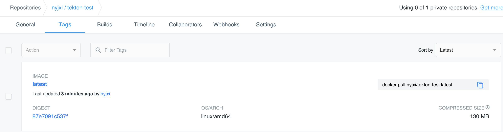

# 使用 Tekton 创建 CI/CD 流水线

[Tekton](https://tekton.dev/) 是一款功能非常强大而灵活的 `CI/CD` 开源的云原生框架。`Tekton` 的前身是 `Knative` 项目的 `build-pipeline` 项目，这个项目是为了给 `build` 模块增加 `pipeline` 的功能，但是随着不同的功能加入到 Knative build 模块中，build 模块越来越变得像一个通用的 `CI/CD `系统，于是，索性将 `build-pipeline` 剥离出 Knative，就变成了现在的 `Tekton`，而 Tekton 也从此致力于提供全功能、标准化的云原生 CI/CD 解决方案。

本文将通过一个简单的示例来创建一个构建流水线，在流水线中将运行应用程序的单元测试、构建 Docker 镜像然后推送到 `Docker Hub`。

## 安装

当然前提条件是需要一个可用的 `Kubernetes` 集群，我们这里使用的是 `v1.16.6` 版本的集群，安装 `Tekton` 非常简单，可以直接通过 [tektoncd/pipeline](https://github.com/tektoncd/pipeline) 的 GitHub 仓库中的 `release.yaml` 文件进行安装，如下所示的命令：

```
$ kubectl apply -f https://github.com/tektoncd/pipeline/releases/download/v0.12.0/release.yaml
```

由于官方使用的镜像是 `gcr` 的镜像，所以正常情况下我们是获取不到的，如果你的集群由于某些原因获取不到镜像，可以使用下面的资源清单文件

```
$ kubectl apply -f https://raw.githubusercontent.com/cnych/qikqiak.com/master/data/manifests/tekton/release.yaml
```

上面的资源清单文件安装后，会创建一个名为 `tekton-pipelines` 的命名空间，在该命名空间下面会有大量和 `tekton` 相关的资源对象，我们可以通过在该命名空间中查看 `Pod` 并确保它们处于 `Running` 状态来检查安装是否成功：

```
$ kubectl get pods -n tekton-pipelines
NAME                                           READY   STATUS    RESTARTS   AGE
tekton-pipelines-controller-5c44bcfc44-cvgx8   1/1     Running   2          47h
tekton-pipelines-webhook-7bd568f6c6-b6cxf      1/1     Running   2          47h
```

`Tekton` 安装完成后，我们还可以选择是否安装 `CLI `工具，有时候可能 `Tekton` 提供的命令行工具比 `kubectl` 管理这些资源更加方便，当然这并不是强制的，我这里是 `Mac` 系统，所以可以使用常用的 `Homebrew `工具来安装：

```
$ brew tap tektoncd/tools
$ brew install tektoncd/tools/tektoncd-cli
```

安装完成后可以通过如下命令验证 CLI 是否安装成功：

```
$ tkn version
Client version: 0.9.0
Pipeline version: v0.12.0
```

## 概念

`Tekton` 为 `Kubernetes` 提供了多种 `CRD` 资源对象，可用于定义我们的流水线，主要有以下几个资源对象：

* `Task`：表示执行命令的一系列步骤，`task` 里可以定义一系列的 `steps`，例如编译代码、构建镜像、推送镜像等，每个 step 实际由一个 Pod 执行。
* `TaskRun`：`task` 只是定义了一个模版，`taskRun` 才真正代表了一次实际的运行，当然你也可以自己手动创建一个 `taskRun`，`taskRun` 创建出来之后，就会自动触发 `task` 描述的构建任务。
* `Pipeline`：一组任务，表示一个或多个 `task`、`PipelineResource` 以及各种定义参数的集合。
* `PipelineRun`：类似 `task` 和 `taskRun` 的关系，`pipelineRun` 也表示某一次实际运行的 `pipeline`，下发一个 `pipelineRun CRD` 实例到 `Kubernetes`后，同样也会触发一次 `pipeline` 的构建。
* `PipelineResource`：表示 `pipeline` 输入资源，比如` github` 上的源码，或者 `pipeline` 输出资源，例如一个容器镜像或者构建生成的` jar` 包等。


## 示例

在这里我们使用一个简单的 Golang 应用，可以在仓库 https://github.com/cnych/tekton-demo 下面获取应用程序代码，测试以及 Dockerfile 文件。

首先第一个任务就是 `Clone` 应用程序代码进行测试，创建一个 `task-test.yaml `的资源文件，内容如下所示：

```
apiVersion: tekton.dev/v1beta1
kind: Task
metadata:
  name: test
spec:
  resources:
    inputs:
    - name: repo
      type: git
  steps:
  - name: run-test
    image: golang:1.14-alpine
    workingDir: /workspace/repo
    command: ["go"]
    args: ["test"]
```

其中 `resources` 定义了我们的任务中定义的步骤所需的输入内容，这里我们的步骤需要 `Clone` 一个 `Git` 仓库作为 `go test` 命令的输入。

`Tekton` 内置了一种 `git `资源类型，它会自动将代码仓库 `Clone `到 `/workspace/$input_name` 目录中，由于我们这里输入被命名成 `repo`，所以代码会被 `Clone` 到 `/workspace/repo`

然后下面的 `steps` 就是来定义执行运行测试命令的步骤，这里我们直接在代码的根目录中运行 `go test` 命令即可，**需要注意的是命令和参数需要分别定义**。

定义完成后直接使用 kubectl 创建该任务：

```
$ kubectl apply -f task-test.yaml
task.tekton.dev/test created
```

```
$ kubectl get task
NAME   AGE
test   3m21s
```

现在我们定义完成了一个建的 `Task` 任务，**但是该任务并不会立即执行，我们必须创建一个 `TaskRun` 引用它并提供所有必需输入的数据才行**。这里我们就需要将 `git` 代码库作为输入，**我们必须先创建一个 `PipelineResource` 对象来定义输入信息**，**创建一个名为 `pipelineresource.yaml` 的资源清单文件**，内容如下所示：

```
apiVersion: tekton.dev/v1alpha1
kind: PipelineResource
metadata:
  name: pipeline-tekton-example
spec:
  type: git
  params:
    - name: url
      value: https://github.com/cnych/tekton-demo
    - name: revision
      value: master
```

直接创建上面的资源对象即可：

```
$ kubectl apply -f pipelineresource.yaml
pipelineresource.tekton.dev/pipeline-tekton-example created
```
```
$ kubectl get pipelineresource
NAME                      AGE
pipeline-tekton-example   36s
```


接下来我们就创建 `TaskRun` 对象了，创建一个名为 `taskrun.yaml` 的文件，内容如下所示：

```
apiVersion: tekton.dev/v1beta1
kind: TaskRun
metadata:
  name: testrun
spec:
  taskRef:
    name: test
  resources:
    inputs:
    - name: repo
      resourceRef:
        name: pipeline-tekton-example
```

这里通过 `taskRef` 引用上面定义的 `Task` 和 `git` 仓库作为输入，`resourceRef` 也是引用上面定义的 `PipelineResource` 资源对象。现在我们创建这个资源对象过后，就会开始运行了：

```
$ kubectl apply -f taskrun.yaml
taskrun.tekton.dev/testrun created
```

创建后，我们可以通过查看 TaskRun 资源对象的状态来查看构建状态：

```
$ kubectl get taskrun
NAME      SUCCEEDED   REASON    STARTTIME   COMPLETIONTIME
testrun   Unknown     Pending   23s 

$ kubectl get pods    | grep test
testrun-pod-4kp6v                           0/2     Init:1/2   0          49s

$ kubectl describe pod testrun-pod-4kp6v  
...
Events:
  Type     Reason     Age                   From                     Message
  ----     ------     ----                  ----                     -------
  Normal   Scheduled  <unknown>             default-scheduler        Successfully assigned default/testrun-pod-4kp6v to docker-desktop
  Normal   Pulling    9m33s                 kubelet, docker-desktop  Pulling image "busybox@sha256:a2490cec4484ee6c1068ba3a05f89934010c85242f736280b35343483b2264b6"
  Normal   Pulled     8m58s                 kubelet, docker-desktop  Successfully pulled image "busybox@sha256:a2490cec4484ee6c1068ba3a05f89934010c85242f736280b35343483b2264b6"
  Normal   Created    8m58s                 kubelet, docker-desktop  Created container working-dir-initializer
  Normal   Started    8m58s                 kubelet, docker-desktop  Started container working-dir-initializer
  Warning  Failed     8m19s                 kubelet, docker-desktop  Failed to pull image "gcr.io/tekton-releases/github.com/tektoncd/pipeline/cmd/entrypoint:v0.12.0@sha256:67f93630931aae98f449b5dfb764d80f7ada7c3c67950c1563ed4ec406fad2f9": rpc error: code = Unknown desc = Error response from daemon: Get https://gcr.io/v2/tekton-releases/github.com/tektoncd/pipeline/cmd/entrypoint/manifests/sha256:67f93630931aae98f449b5dfb764d80f7ada7c3c67950c1563ed4ec406fad2f9: EOF
  Warning  Failed     8m19s                 kubelet, docker-desktop  Error: ErrImagePull
  Normal   BackOff    8m18s                 kubelet, docker-desktop  Back-off pulling image "gcr.io/tekton-releases/github.com/tektoncd/pipeline/cmd/entrypoint:v0.12.0@sha256:67f93630931aae98f449b5dfb764d80f7ada7c3c67950c1563ed4ec406fad2f9"
  Warning  Failed     8m18s                 kubelet, docker-desktop  Error: ImagePullBackOff
  Normal   Pulling    8m3s (x2 over 8m57s)  kubelet, docker-desktop  Pulling image "gcr.io/tekton-releases/github.com/tektoncd/pipeline/cmd/entrypoint:v0.12.0@sha256:67f93630931aae98f449b5dfb764d80f7ada7c3c67950c1563ed4ec406fad2f9"
  Normal   Pulled     39s                   kubelet, docker-desktop  Successfully pulled image "gcr.io/tekton-releases/github.com/tektoncd/pipeline/cmd/entrypoint:v0.12.0@sha256:67f93630931aae98f449b5dfb764d80f7ada7c3c67950c1563ed4ec406fad2f9"
  Normal   Created    39s                   kubelet, docker-desktop  Created container place-tools
  Normal   Started    39s                   kubelet, docker-desktop  Started container place-tools
  Normal   Pulling    39s                   kubelet, docker-desktop  Pulling image "gcr.io/tekton-releases/github.com/tektoncd/pipeline/cmd/git-init:v0.12.0@sha256:b3cf4f912c58115e1ba9eb44a1e2d7a61445337e83117eeaec0eddbaf04ecf03"
```

我们可以通过 kubectl `describe` 命令来查看任务运行的过程，**首先就是通过 `initContaine`r 中的一个` busybox` 镜像将代码 `Clone` 下来，然后使用任务中定义的镜像来执行命令**。

当任务执行完成后，` Pod` 就会变成 `Completed `状态了：

```
$ kubectl get pods    | grep test
testrun-pod-4kp6v                           0/2     Completed   0          33m

$ kubectl get taskrun
NAME      SUCCEEDED   REASON      STARTTIME   COMPLETIONTIME
testrun   True        Succeeded   33m         48s
```

我们可以查看容器的日志信息来了解任务的执行结果信息：

```
$ kubectl logs testrun-pod-4kp6v  --all-containers
{"level":"info","ts":1588950077.6362185,"caller":"git/git.go:136","msg":"Successfully cloned https://github.com/cnych/tekton-demo @ f840e0c3
90be9a1a6edad76abbde64e882047f05 (grafted, HEAD, origin/master) in path /workspace/repo"}
{"level":"info","ts":1588950077.677141,"caller":"git/git.go:177","msg":"Successfully initialized and updated submodules in path /workspace/r
epo"}
PASS
ok      _/workspace/repo        0.002s
```

我们可以看到我们的测试已经通过了，当然我们也可以使用 `Tekton CLI` 工具来运行这个任务。Tekton CLI 提供了一种更快、更方便的方式来运行任务。

**我们不用手动编写 `TaskRun` 资源清单，可以运行以下命令来执行，该命令引用我们的任务（名为 test），生成一个 `TaskRun` 资源对象并显示其日志**：

```
$ tkn task start test --inputresource repo=pipeline-tekton-example --showlog
Taskrun started: test-run-njtgg
Waiting for logs to be available...
[git-source-pipeline-tekton-example-pfjxf] {"level":"info","ts":1588950434.1149626,"caller":"git/git.go:136","msg":"Successfully cloned http
s://github.com/cnych/tekton-demo @ f840e0c390be9a1a6edad76abbde64e882047f05 (grafted, HEAD, origin/master) in path /workspace/repo"}
[git-source-pipeline-tekton-example-pfjxf] {"level":"info","ts":1588950434.1570942,"caller":"git/git.go:177","msg":"Successfully initialized
 and updated submodules in path /workspace/repo"}

[run-test] PASS
[run-test] ok   _/workspace/repo        0.002s
```

### 总结

我们已经在 Kubernetes 集群上成功安装了 Tekton，**定义了一个 Task，并通过 `YAML` 清单和 `Tekton CLI `创建 `TaskRun` 对其进行了测试**。在下一部发我们将创建一个任务来构建一个 `Docker` 镜像，并将其推送到 `Docker Hub`。最后，我们将创建一个流水线，按顺序运行我们的两个任务（运行应用程序测试，构建和推送）。


接着前面的内容，本文我们将创建一个新的 `Task` 来构建一个` Docker` 镜像并将其推送到 `Docker Hub`，最后，我们将这些任务组合成一个流水线

## Docker Hub 配置

为了能够构建 `Docker` 镜像，一般来说我们需要使用 `Docker` 来进行，我们这里是容器，所以可以使用 `Docker In Docker` 模式，但是这种模式安全性不高，除了这种方式之外，我们还可以使用 **`Google `推出的 `Kaniko `工具来进行构建，该工具可以在 `Kubernetes` 集群中构建 `Docker` 镜像而无需依赖 Docker 守护进程**

使用 `Kaniko` 构建镜像和 `Docker` 命令基本上一致，所以我们可以提前设置下 `Docker Hub` 的登录凭证，方便后续将镜像推送到镜像仓库。登录凭证可以保存到 `Kubernetes `的 `Secret` 资源对象中，创建一个名为 `secret.yaml` 的文件，内容如下所示:

```
apiVersion: v1
kind: Secret
metadata:
  name: docker-auth
  annotations:
    tekton.dev/docker-0: https://index.docker.io/v1/
type: kubernetes.io/basic-auth
stringData:
    username: myusername
    password: mypassword
```

> 记得将 myusername 和 mypassword 替换成你的 Docker Hub 登录凭证。

我们这里在 `Secret` 对象中添加了一个 `tekton.dev/docker-0` 的 `annotation`，该注解信息是用来告诉 `Tekton` 这些认证信息所属的 `Docker` 镜像仓库。

然后创建一个 `ServiceAccount` 对象来使用上面的 `docker-auth` 这个 `Secret` 对象，创建一个名为 `serviceaccount.yaml` 的文件，内容如下所示：

```
apiVersion: v1
kind: ServiceAccount
metadata:
  name: build-sa
secrets:
- name: docker-auth
```

然后直接创建上面两个资源对象即可：

```
$ kubectl apply -f secret.yaml 
secret/docker-auth created
$ kubectl apply -f serviceaccount.yaml 
serviceaccount/build-sa created
```

创建完成后，我们就可以在运行 `Tekton` 的任务或者流水线的时候使用上面的 `build-sa` 这个 `ServiceAccount` 对象来进行 `Docker Hub` 的登录认证了。

## 创建镜像任务

现在我们创建一个 Task 任务来构建并推送 Docker 镜像，我们这里使用的示例应用 https://github.com/cnych/tekton-demo 中根目录下面已经包含了一个 Dockerfile 文件了，所以我们直接 Clone 代码就可以获得：

```
FROM golang:1.14-alpine

WORKDIR /go/src/app
COPY . .

RUN go get -d -v ./...
RUN go install -v ./...

CMD ["app"]
```

创建一个名为 `task-build-push.yaml` 的文件，文件内容如下所示：

```
apiVersion: tekton.dev/v1beta1
kind: Task
metadata:
  name: build-and-push
spec:
  resources:
    inputs:
    - name: repo
      type: git
  steps:
  - name: build-and-push
    image: cnych/kaniko-executor:v0.22.0
    env:
    - name: DOCKER_CONFIG
      value: /tekton/home/.docker
    command:
    - /kaniko/executor
    - --dockerfile=Dockerfile
    - --context=/workspace/repo
    - --destination=nyjxi/tekton-test:latest
```

和前文的任务类似，这里我们同样将 `git` 作为输入，也只定义了一个名为 `build-and-push` 的步骤，**`Kaniko` 会在同一个命令中构建并推送，所以不需要多个步骤了，执行的命令就是 `/kaniko/executor`**，**通过 `--dockerfile` 指定 `Dockerfile` 路径，`--context` 指定构建上下文，我们这里当然就是项目的根目录了**，然后 `--destination` 参数指定最终我们的镜像名称。

其实 `Tekton` 也支持参数化的形式，这样就可以避免我们这里直接写死了，不过由于我们都还是初学者，为了避免复杂，我们直接就直接硬编码了。


此外我们定义了一个名为 `DOCKER_CONFIG` 的环境变量，这个变量是用于 `Kaniko` 去[查找 Docker 认证信息的](https://github.com/tektoncd/pipeline/pull/706)。

同样直接创建上面的资源对象即可：

```
$ kubectl apply -f task-build-push.yaml 
task.tekton.dev/build-and-push created
```

创建了 `Task` 任务过后，要想真正去执行这个任务，我们就需要创建一个对应的 `TaskRun` 资源对象，当然通过`kubectl` 或者 `tkn` 都是可以的，在第一部分文章中我们就已经演示过了。

### 执行任务

和前面一样，现在我们来创建一个 `TaskRun `对象来触发任务，不同之处在于我们需要指定 `Task` 时需要的 `ServiceAccount` 对象。创建一个名为 `taskrun-build-push.yaml `的文件，内容如下所示：

```
apiVersion: tekton.dev/v1beta1
kind: TaskRun
metadata:
  name: build-and-push
spec:
  serviceAccountName: build-sa
  taskRef:
    name: build-and-push
  resources:
    inputs:
    - name: repo
      resourceRef:
        name: pipeline-tekton-example
```

注意这里我们通过 `serviceAccountName` 属性指定了 `Docker` 认证信息的` ServiceAccount` 对象，然后通过 `taskRef` 引用我们的任务，以及下面的 `resourceRef` 关联第一部分我们声明的输入资源。

然后直接创建这个资源对象即可：

```
$ kubectl apply -f taskrun-build-push.yaml 
taskrun.tekton.dev/build-and-push created
```
创建完成后就会触发任务执行了，我们可以通过查看 Pod 对象状态来了解进度：

```
$ kubectl get pods | grep build
build-and-push-pod-mp89n                    0/2     Init:0/2    0          34s

$ kubectl get taskrun
NAME             SUCCEEDED   REASON      STARTTIME   COMPLETIONTIME
build-and-push   Unknown     Pending     48s
```

现在任务执行的 Pod 还在初始化容器阶段，我们可以看到 TaskRun 的状态处于 Pending，隔一会儿正常构建就会成功了，我们可以查看构建任务的 Pod 日志信息：

```
$ kubectl get pods | grep build
build-and-push-pod-mp89n                    0/2     Completed   0          13m

$ kubectl logs -f build-and-push-pod-mp89n --all-containers
E0509 00:43:55.856189      11 aws_credentials.go:77] while getting AWS credentials NoCredentialProviders: no valid providers in chain. Depre
cated.
        For verbose messaging see aws.Config.CredentialsChainVerboseErrors
INFO[0051] Retrieving image manifest golang:1.14-alpine 
INFO[0065] Retrieving image manifest golang:1.14-alpine 
INFO[0072] Built cross stage deps: map[]                
INFO[0072] Retrieving image manifest golang:1.14-alpine 
INFO[0076] Retrieving image manifest golang:1.14-alpine 
INFO[0081] Executing 0 build triggers                   
{"level":"info","ts":1588984919.5870125,"caller":"creds-init/main.go:44","msg":"Credentials initialized."}
INFO[0081] Unpacking rootfs as cmd COPY . . requires it. 
INFO[0650] WORKDIR /go/src/app                          
INFO[0650] cmd: workdir                                 
INFO[0650] Changed working directory to /go/src/app     
INFO[0650] Creating directory /go/src/app               
INFO[0650] Resolving 1 paths                            
INFO[0650] Taking snapshot of files...                  
INFO[0650] COPY . .                                     
INFO[0650] Resolving 56 paths                           
INFO[0650] Taking snapshot of files...                  
INFO[0650] RUN go get -d -v ./...                       
INFO[0650] Taking snapshot of full filesystem...        
INFO[0650] Resolving 11667 paths                        
INFO[0652] cmd: /bin/sh                                 
INFO[0652] args: [-c go get -d -v ./...]                
INFO[0652] Running: [/bin/sh -c go get -d -v ./...]     
INFO[0652] Taking snapshot of full filesystem...        
INFO[0652] Resolving 11667 paths                        
INFO[0653] RUN go install -v ./...                      
INFO[0653] cmd: /bin/sh                                 
INFO[0653] args: [-c go install -v ./...]               
INFO[0653] Running: [/bin/sh -c go install -v ./...]    
app
{"level":"info","ts":1588984994.5716236,"caller":"git/git.go:136","msg":"Successfully cloned https://github.com/cnych/tekton-demo @ f840e0c390be9a1a6edad76abbde64e882047f05 (grafted, HEAD, origin/master) in path /workspace/repo"}
{"level":"info","ts":1588984994.640117,"caller":"git/git.go:177","msg":"Successfully initialized and updated submodules in path /workspace/repo"}
INFO[0654] Taking snapshot of full filesystem...        
INFO[0654] Resolving 11666 paths                        
INFO[0655] CMD ["app"]
```

```
$ kubectl get taskrun
NAME             SUCCEEDED   REASON      STARTTIME   COMPLETIONTIME
build-and-push   True        Succeeded   14m         83s
```

我们可以看到 `TaskRun` 任务已经执行成功了。 这个时候其实我们可以在 `Docker Hub` 上找到我们的镜像了，当然也可以直接使用这个镜像进行测试：



### 创建流水线

到这里前面我们的两个任务 test 和 build-and-push 都已经完成了，我们还可以创建一个流水线来将这两个任务组织起来，首先运行 test 任务，如果通过了再执行后面的 build-and-push 这个任务。

创建一个名为 `pipeline.yaml` 的文件，内容如下所示：

首先我们需要定义流水线需要哪些资源，可以是输入或者输出的资源，在这里我们只有一个输入，那就是命名为 `repo` 的应用程序源码的 `GitHub` 仓库。接下来定义任务，每个任务都通过 `taskRef `进行引用，并传递任务需要的输入参数。

同样直接创建这个资源对象即可：

```
$ kubectl apply -f pipeline.yaml 
pipeline.tekton.dev/test-build-push created
```

前面我们提到过和通过创建 TaskRun 去触发 Task 任务类似，我们可以通过创建一个 PipelineRun 对象来运行流水线，当然同样可以用 kubectl 或者 `Tekton CLI` 工具来完成。

这里我们创建一个名为 `pipelinerun.yaml` 的 `PipelineRun` 对象来运行流水线，文件内容如下所示：

```
apiVersion: tekton.dev/v1beta1
kind: PipelineRun
metadata:
  name: test-build-push-run
spec:
  serviceAccountName: build-sa
  pipelineRef:
    name: test-build-push
  resources:
  - name: repo
    resourceRef:
      name: pipeline-tekton-example
```

定义方式和 `TaskRun` 几乎一样，通过 `serviceAccountName` 属性指定 `ServiceAccount `对象，`pipelineRef` 关联流水线对象。同样直接创建这个资源，创建后就会触发我们的流水线任务了

```
$ kubectl apply -f pipelinerun.yaml 
pipelinerun.tekton.dev/test-build-push-run created

$ kubectl get pods | grep test-build-push-run
test-build-push-run-build-and-push-rz2sg-pod-jrlx2   0/2     Completed   0          14m
test-build-push-run-test-zrxxr-pod-7fcxj             0/2     Completed   0          14m

 kubectl logs -f test-build-push-run-build-and-push-rz2sg-pod-jrlx2 --all-containers
 ...
 INFO[0049] Retrieving image manifest golang:1.14-alpine 
INFO[0058] Retrieving image manifest golang:1.14-alpine 
INFO[0064] Built cross stage deps: map[]                
INFO[0064] Retrieving image manifest golang:1.14-alpine 
INFO[0068] Retrieving image manifest golang:1.14-alpine
...
INFO[0638] Running: [/bin/sh -c go install -v ./...]    
app
INFO[0638] Taking snapshot of full filesystem...        
INFO[0638] Resolving 11666 paths                        
INFO[0640] CMD ["app"] 


$ kubectl get taskrun |grep test-build-push-run
test-build-push-run-build-and-push-rz2sg   True        Succeeded   15m         4m16s
test-build-push-run-test-zrxxr             True        Succeeded   15m         15m
```

到这里证明我们的流水线执行成功了。

## 总结

在前文中，我们将 Tekton 安装在 Kubernetes 集群上，定义了一个 Task，并通过 YAML 清单和 Tekton CLI 创建 TaskRun 对其进行了测试。在这一部分中，我们创建了由两个任务组成的 Tektok 流水线，第一个任务是从 GitHub 克隆代码并运行应用程序测试，第二个任务是构建一个 Docker 镜像并将其推送到Docker Hub 上

