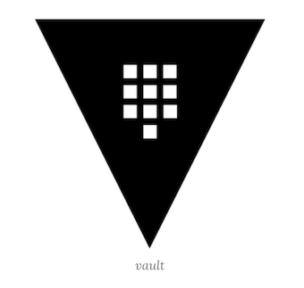
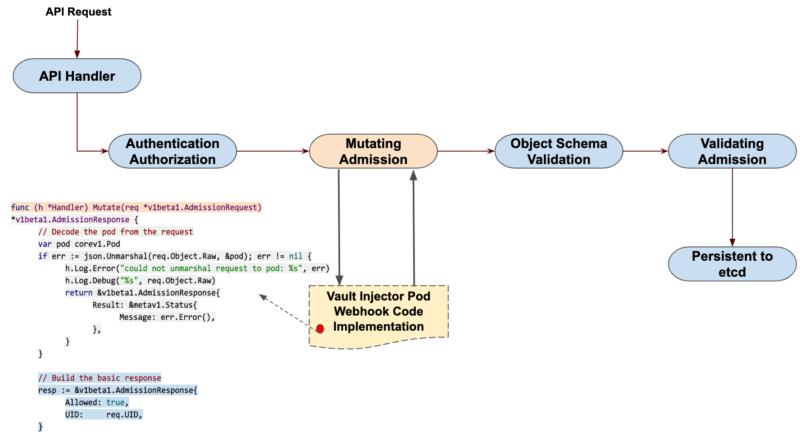

# 在 Kubernetes 上部署 Vault

很多时候我们可能都是直接将应用程序的密码或者 `API Token` 之类的私密信息直接暴露在源代码中的，显然直接暴露这些私密信息不是一个好的方式。在 `Kubernetes` 系统中提供了一个 `Secret` 对象来存储私密的数据，但是也只是简单的做了一次 `Base64` 编码而已，虽然比直接暴露要好点了，但是如果是一些安全性要求非常高的应用直接用 `Secret` 显然也还是不够的。本文就将来介绍如何使用 [HashiCorp Vault](https://www.vaultproject.io/) 在 `Kubernetes` 集群中进行秘钥管理。

## Vault 介绍

[Vault](https://www.vaultproject.io/) 是用于处理和加密整个基础架构秘钥的中心管理服务。`Vault ` 通过 `secret` 引擎管理所有的秘钥，`Vault` 有一套 `secret `引擎可以使用，一般情况为了使用简单，我们会使用 `kv（键值）secret` 引擎来进行管理。



### 使用 Vault 有很多的优点：

* 秘钥管理服务简单的说，可以看做后端领域的 `Password`。首先它会保证秘钥存储安全，不管谁拿到秘钥管理服务的落地数据文件，在没有秘钥的情况下还是不能解密的。
* 从 `Vault` 获取之前配置的密码、秘钥等关键数据，会需要由管理员分配 `Token`，对这些分配的 `Token`，管理员可以制定包括过期、撤销、更新和权限管理等等各种安全策略
* `Vault` 的安全级别可以提供面向公网开放的服务，所以可以为开发环境提供一个开发人员的 `Vault` ，在家或者异地开发也可以很方便
* 管理员可以随时通过 `Vault` 更新各个数据服务的安全密码或密钥，也可以随时收回或修改特定 `Token` 的权限。这在 `Rolling out` 更新时很有用
* 使用 `Vault` 会强制代码通过 `Vault` 接口来获取各种数据连接密码或秘钥。避免开发人员无意获得和在代码中使用秘钥密码。而且因为 `Vaul`t 的管理方式允许，虽然代码只有一份，我们还是可以将不同开发阶段的 `Vault` 分别管理。甚至可以做到生产环境中只有 `1 `人有 `Vault` 管理权限，也不会觉得维护起来很吃力
* 所有秘钥存取和修改都有日志记录。可以作为事后证据成为被入侵的线索
* 数据库和 `API `秘钥不再散落在代码各处

## 安装

同样为了方便我们这里还是使用 `Helm3` 在` Kubernetes` 集群上安装 `Vault`，对应的环境版本如下所示：

```
$  helm version
version.BuildInfo{Version:"v3.0.3", GitCommit:"ac925eb7279f4a6955df663a0128044a8a6b7593", GitTreeState:"clean", GoVersion:"go1.13.7"}
```
```
$ kubectl version  
Client Version: version.Info{Major:"1", Minor:"15", GitVersion:"v1.15.1", GitCommit:"4485c6f18cee9a5d3c3b4e523bd27972b1b53892", GitTreeState:"clean", BuildDate:"2019-07-18T09:18:22Z", GoVersion:"go1.12.5", Compiler:"gc", Platform:"darwin/amd64"}
Server Version: version.Info{Major:"1", Minor:"15", GitVersion:"v1.15.5", GitCommit:"20c265fef0741dd71a66480e35bd69f18351daea", GitTreeState:"clean", BuildDate:"2019-10-15T19:07:57Z", GoVersion:"go1.12.10", Compiler:"gc", Platform:"linux/amd64"}
```

这里直接使用 `Vault `官方提供的 chart 包安装即可：[https://github.com/hashicorp/vault-helm](https://github.com/hashicorp/vault-helm)，改包没有上传到 `chart `仓库中，所以我们可以直接 `clone` 代码到 `Helm3` 所在的客户端直接安装，当然也可以直接通过指定 `Release` 的压缩包也可以，使用如下命令安装：

```
$  wget https://github.com/hashicorp/vault-helm/archive/v0.3.3.tar.gz

$ helm install vault --namespace kube-system --set "server.dev.enabled=true" v0.3.3.tar.gz
NAME: vault
LAST DEPLOYED: Wed Feb 19 16:03:02 2020
NAMESPACE: kube-system
STATUS: deployed
REVISION: 1
TEST SUITE: None
NOTES:
Thank you for installing HashiCorp Vault!

Now that you have deployed Vault, you should look over the docs on using
Vault with Kubernetes available here:

https://www.vaultproject.io/docs/


Your release is named vault. To learn more about the release, try:

  $ helm status vault
  $ helm get vault
```

上面的命令就会在 `kube-system` 命名空间下面安装一个名为 `vault` 的 `Helm release`：

```
$ helm ls -n kube-system | grep vault
vault   kube-system     1               2020-02-19 16:03:02.951868 +0800 CST    deployed        vault-0.3.3 
```
```
$ kubectl get pods -n kube-system | grep vault
vault-0                                        1/1     Running   0          25m
vault-agent-injector-5f8c857c9f-5szkv          1/1     Running   0          25m
```

看到上面的两个 `Vault` 相关的 `Pod` 运行成功则证明已经安装成功了，所以安装是很方便的，接下来重点看下如何使用。

## 使用

假如现在我们有一个需求是希望 `Vault` 将数据库的用户名和密码存储在应用的 `internal/database/config` 路径下面，首先要创建 `secret` 需要线开启 `kv secret` 引擎，并将用户名和密码放在指定的路径中。

进入 `vault-0` 容器的命令行交互终端：

```
$ kubectl exec -it vault-0 /bin/sh -n kube-system
/ $
```

在 `internal` 路径下面开启 `kv-v2 secrets ` 引擎：

```
/ $ vault secrets enable -path=internal kv-v2
Success! Enabled the kv-v2 secrets engine at: internal/
```

然后在 `internal/exampleapp/config` 路径下面添加一个用户名和密码的秘钥：

```
/ $ vault kv put internal/database/config username="db-readonly-username" password="db-secret-password"
Key              Value
---              -----
created_time     2020-02-19T12:11:39.8379346Z
deletion_time    n/a
destroyed        false
version          1
```

创建完成后可以通过如下命令校验上面创建的 `secret`：

```
/ $ vault kv get internal/database/config
====== Metadata ======
Key              Value
---              -----
created_time     2020-02-19T12:11:39.8379346Z
deletion_time    n/a
destroyed        false
version          1

====== Data ======
Key         Value
---         -----
password    db-secret-password
username    db-readonly-username
```

这样我们就将用户名和密码信息存储在了 `Vault` 中，`Vault `提供了一个[ `Kubernetes` 认证的方法](https://www.vaultproject.io/docs/auth/kubernetes/)可以让客户端通过使用` Kubernetes ServiceAccount` 进行身份认证。

开启 `Kubernetes ` 认证方式：
 
```
/ $ vault auth enable kubernetes
Success! Enabled kubernetes auth method at: kubernetes/
```

**`Vault `会接受来自于 `Kubernetes` 集群中的任何客户端的服务 `Token`。**

在身份验证的时候，`Vault` 通过配置的 `Kubernetes `地址来验证 `ServiceAccount` 的 `Token` 信息。

通过 `ServiceAccount` 的 `Token`、`Kubernetes `地址和 `CA `证书信息配置 `Kubernetes` 认证方式：

```
$ vault write auth/kubernetes/config \
    token_reviewer_jx="$(cat /var/run/secrets/kubernetes.io/serviceaccount/token)" \
    kubernetes_host="https://$KUBERNETES_PORT_443_TCP_ADDR:443" \
    kubernetes_ca_cert=@/var/run/secrets/kubernetes.io/serviceaccount/ca.crt
 Success! Data written to: auth/kubernetes/config   
```

* 其中 `token_reviewer_jx` 和 `kubernetes_ca_cert` 都是 `Kubernetes` 默认注入到 `Pod` 中的，
* 而环境变量 `KUBERNETES_PORT_443_TCP_ADDR` 也是内置的表示 `Kubernetes APIServer `的内网地址。
* 为了让客户端读取上一步定义在 `internal/database/config` 路径下面的 `secret` 数据，还需要为该路径授予 `read` 的权限。

这里我们创建一个名为 `internal-app` 的策略名称，该策略会启用对路径 `internal/database/config` 中的 `secret` 的读取权限：

```
/ $ vault policy write internal-app - <<EOH
    path "internal/data/database/config" {
    capabilities = ["read"]
 }
EOH
Success! Uploaded policy: internal-app
```

然后创建一个名为 `internal-app` 的 `Kubernetes `认证角色：

```
/$ vault write auth/kubernetes/role/internal-app \
    bound_service_account_names=internal-app \
    bound_service_account_namespaces=default \
    policies=internal-app \
    ttl=72h
Success! Data written to: auth/kubernetes/role/internal-app
```

该角色将 `Kubernetes default` 命名空间下面的名为 `internal-app` 的 `ServiceAccount` 与 `Vault` 的 `internal-app` 策略连接在了一起，认证后返回的 `Token `有 72小时的有效期。

最后直接退出` vault-0`：

```
/ $ exit
```

到这里 `Vault` 相关的准备工作已经完成了，接下来就是如何在 `Kubernetes` 中来读取上面我们的 `Secret` 数据。

上面我们在 `default` 命名空间下面定义了一个名为 `internal-app` 的 `ServiceAccount`，该对象还不存在，首先先创建：(`vault-sa.yaml`)

```
apiVersion: v1
kind: ServiceAccount
metadata:
  name: internal-app  # 需要和上面的 bound_service_account_names 一致
  namespace: default  # 需要和上面的 bound_service_account_namespaces 一致
```

直接创建即可：

```
$ kubectl apply -f vault-sa.yaml
serviceaccount/internal-app created
```

```
$ kubectl get sa
NAME           SECRETS   AGE
internal-app   1         174m
```

然后在我们的应用中使用上面创建的 sa 对象：(`vault-demo.yaml`)

```
apiVersion: apps/v1
kind: Deployment
metadata:
  name: vault-demo
  labels:
    app: vault-demo
spec:
  selector:
    matchLabels:
      app: vault-demo
  template:
    metadata:
      labels:
        app: vault-demo
    spec:
      serviceAccountName: internal-app  # 使用上面创建的 serviceaccount 对象
      containers:
        - name: vault
          image: cnych/vault-demo:0.0.1
```

其中比较重要的就是 `spec.template.spec.serviceAccountName` 字段需要使用上面我们创建的名为 `internal-app` 的这个 `ServiceAccount` 资源对象，同样也是直接创建即可：

```
$ kubectl apply -f vault-demo.yaml 
deployment.apps/vault-demo created

$ kubectl get pods | grep vault
vault-demo-57f86557dd-9jn2s           1/1     Running     0          13m
```

**正常的情况是我们部署的 `Vault` 中的 `vault-agent-injector` 这个程序会去查找 `Kubernetes` 集群中部署应用的 `annotations` 属性进行处理**，

我们当前的 `Deployment` 中没有配置相关的信息，所以我们这里的 `vault-demo-7fb8449d7b-x8bft` 这个 `Pod` 中是获取不到任何 `secret` 数据的，可以通过如下所示的命令进行验证：

```
$ kubectl exec -it vault-demo-57f86557dd-9jn2s -- ls /vault/secrets
ls: /vault/secrets: No such file or directory
command terminated with exit code 1
```

可以看到在容器中现在没有对应的 `secret` 数据。这个时候我们就需要通过 `annotations` 来添加一些获取 `secret` 数据的一些说明：(`vault-inject.yaml`)

```
spec:
  template:
    metadata:
      annotations:
        vault.hashicorp.com/agent-inject: "true"
        vault.hashicorp.com/role: "internal-app"
        vault.hashicorp.com/agent-inject-secret-database-config.txt: "internal/data/database/config"
```

上面的 annotations 定义了部分 `vault` 相关的信息，都是以 `vault.hashicorp.com` 为前缀开头的信息：

* `agent-inject` 用于标识启用 `Vault Agent` 注入服务
* `role` 表示 `Vault Kubernetes` 身份验证的角色
* `agent-inject-secret-FILEPATH `为写入 `/vault/secrets` 的文件 `database-config.txt` 的路径上加上前缀，对应的值是 `Vault `中定义的 `secret` 数据存储路径。

直接使用上面定义的 `annotations` 来给上面的 `Deployment` 打一个补丁：

```
$ kubectl patch deployment vault-demo --patch "$(cat vault-inject.yaml)"
deployment.apps/vault-demo patched

$ kubectl get pods | grep  vault
vault-demo-84cc6585fd-nkxnz                          2/2     Running     0          9m37s
```

现在新的 `Pod` 中会包含两个容器，

* 一个是我们定义的 `vault-demo` 容器，
* 另一个是名为 `vault-agent` 的 `Vault Agent `容器。

在 `Pod` 中自动添加一个 `vault-agent` 的 `Sidecar `容器其实也是利用了 `Mutating Admission Webhook` 来实现的，和 `Istio` 实现的机制是一样的：




现在我们可以查看 `vault-agent `容器的日志：

```
$ kubectl logs -f vault-demo-84cc6585fd-nkxnz  -c vault-agent
==> Vault server started! Log data will stream in below:

==> Vault agent configuration:

                     Cgo: disabled
               Log Level: info
                 Version: Vault v1.3.1

2020-02-19T14:03:20.069Z [INFO]  sink.file: creating file sink
2020-02-19T14:03:20.069Z [INFO]  sink.file: file sink configured: path=/home/vault/.token mode=-rw-r-----
2020-02-19T14:03:20.069Z [INFO]  auth.handler: starting auth handler
2020-02-19T14:03:20.069Z [INFO]  auth.handler: authenticating
2020-02-19T14:03:20.070Z [INFO]  template.server: starting template server
2020/02/19 14:03:20.070117 [INFO] (runner) creating new runner (dry: false, once: false)
2020-02-19T14:03:20.070Z [INFO]  sink.server: starting sink server
2020/02/19 14:03:20.070986 [INFO] (runner) creating watcher
2020-02-19T14:03:20.081Z [INFO]  auth.handler: authentication successful, sending token to sinks
2020-02-19T14:03:20.082Z [INFO]  auth.handler: starting renewal process
2020-02-19T14:03:20.082Z [INFO]  template.server: template server received new token
2020/02/19 14:03:20.082340 [INFO] (runner) stopping
2020/02/19 14:03:20.082419 [INFO] (runner) creating new runner (dry: false, once: false)
2020/02/19 14:03:20.082936 [INFO] (runner) creating watcher
2020/02/19 14:03:20.083005 [INFO] (runner) starting
2020-02-19T14:03:20.083Z [INFO]  sink.file: token written: path=/home/vault/.token
2020-02-19T14:03:20.090Z [INFO]  auth.handler: renewed auth token
```

**`vault-agent` 容器会管理 `Token` 的整个生命周期和 `secret` 数据检索**，我们定义的 `secret` 数据会被添加到应用容器的 `/vault/secrets/database-config.txt` 路径下面：

```
$ kubectl exec -it vault-demo-84cc6585fd-nkxnz -c vault -- cat /vault/secrets/database-config.txt
data: map[password:db-secret-password username:db-readonly-username]
metadata: map[created_time:2020-02-19T12:11:39.8379346Z deletion_time: destroyed:false version:1]
```

到这里 `secret` 数据就成功的存储在了我们的应用容器中，当然对于实际的应用我们完全可以直接通过 `Vault` 提供的 `SDK` 直接去读取对应的 `secret` 数据。比如下面就是一段通过 `Vault SDK` 读取动态认证数据的示例：

```
package main

import (
	"fmt"
	"io/ioutil"

	vaultApi "github.com/hashicorp/vault/api"
)

var (
	vaultHost           string
	vaultCAPath         string
	vaultServiceAccount string
	vaultJWTPath        string
)

func main() {
	vaultJWTPath = "/var/run/secrets/kubernetes.io/serviceaccount/token"
	vaultServiceAccount = "internal-app"

	tlsConfig := &vaultApi.TLSConfig{
		CACert:   vaultCAPath,
		Insecure: false,
	}

    config := vaultApi.DefaultConfig()
    // todo，配置 vault 地址
	config.Address = fmt.Sprintf("https://%s", vaultHost)
	config.ConfigureTLS(tlsConfig)

	client, _ := vaultApi.NewClient(config)
	buf, _ := ioutil.ReadFile(vaultJWTPath)
	jwt := string(buf)

	options := map[string]interface{}{
		"jwt":  jwt,
		"role": vaultServiceAccount,
	}
	loginSecret, _ := client.Logical().Write("auth/kubernetes/login", options)
	client.SetToken(loginSecret.Auth.ClientToken)

	secret, _ := client.Logical().Read("internal/data/database/config")
	fmt.Println(secret)
}
```

另外需要注意的是上面我们定义的认证角色只有`72`小时，是有过期时间的，在到期前可以执行 `renew` 操作，如果 `token` 所属的 `policy` 有 `/auth/token/renew-self` 相应的权限，那么也可以直接在代码中自己 `renew` 自己。

```
vault token renew your-vault-token
```

更多的关于 Vault 和 Kubernetes 的结合使用可以查看官方文档 https://learn.hashicorp.com/vault/getting-started-k8s/k8s-intro 了解更多。
