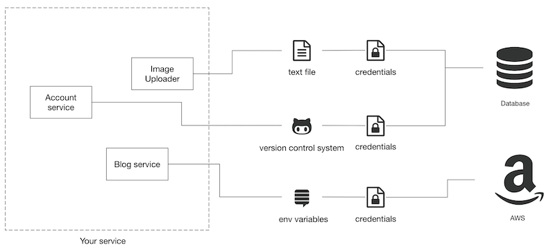
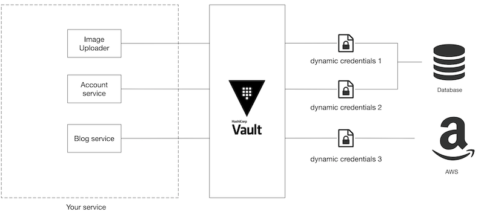
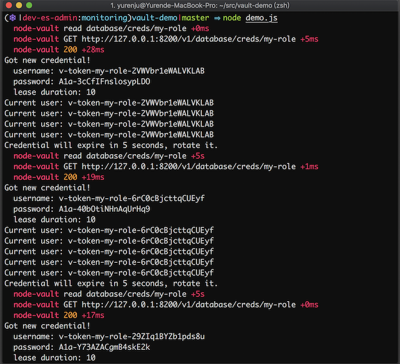

# 透过 Vault 定期 rotate credentials

建立一个软件服务时，刚开始通常都会把 `API Key`、连接资料库或 `AWS` 的帐号密码储存在各式各样的地方，档案、环境变数、甚至一个不小心就储存到 `git` 裡面。



随意储存固然方便简单，但是伴随安全隐忧。随着服务愈来愈重要，开发者会开始更加安全的储存这些重要的资讯，例如将这些 `credential` 集中储存在同一个地方。除此之外通常也会从多个面向来提昇安全性，像是缩限每个 `credential` 的存取范围，或是过一段时间就更换一次 `credential` 等等。

可是要定期更换 `credential` 是一件多么痛苦的事情，假如说服务中有十个 `instance` ，要规划安全又不中断服务的方式更换所有 `instance` 的资料库帐号密码会是个很大的挑战。

当使用的 `credential` 数量与种类增加，痛苦指数就会快速上升。

**今天想来介绍 `Vault`，用它来动态的产生 `credential` 可以痛苦指数降低一些。**

## Vault 介绍

https://www.vaultproject.io/

`Vault` 是一套由 `HashiCorp` 主导开发用于管理机密资料的开源专案。所有储存在 `vault` 内的资料都会经过加密，管理者可以透过开设不同的帐号或 `token` 来限制不同的存取范围，同时 `token` 的存取纪录都会透过 `audit` 模组记录下来，方便之后查核用途。

但是安全的存放机密资料并不是 `vault` 最实用的地方，`Vault` 方便之处在于它可以帮你动态的产生 `credential` 并且设定过期的期限，等期限到了 `Vault` 会帮你撤销该 `credential`。



而因为 `credential` 会动态的产生，所以每一个元件都会拿到不一样的 `credential`。

如果发现已经洩漏，也可以透过 `audit` 模组知道是哪个元件使用的 `credential` 洩露了，接著用 `vault` 撤销凭证的功能把特定的 `credential` 撤销。跟所有的元件都采用同一个 `credential` 相比，影响的范围会更小，会需要处理的工作也会更少。


## 范例

这边用 `node.js` 展示一下 `vault` 的使用方法。

需求如下：`demo.js` 是一个需要存取 `MySQL` 的 `command line` 工具，我们希望定期变更 `demo.js` 使用的 `MySQL` 帐号密码来增加安全程度。在范例中我们把 `credential` 期限设定成十秒，不过一般来说线上使用时期限可能会是二週或一个月等。

这个范例可以在 `github` 上面找到完整的源码。

一般来说存取资料库大多都会到特定资料表读取与写入资料，不过在这个例子裡面我们简化 demo.js 存取 `MySQL` 拿到的资料是每秒去跟 `MySQL` 问自己目前用哪个 `User` 建立连线： `SELECT USER();`，这样范例裡面我才不用额外需要新增表格 :-)

`demo.js` 会在几个时机跟 `vault/mysql` 沟通：

1. 初始时会跟 `vault` 动态的索取一组 `credential`，此时 `Vault` 连结 `MySQL` 帮你动态生成一组帐号密码，并且在期限后帮你删除。
2. 每秒会用此 `credential` 读取 `MySQL` 内的资讯
3. 到达过期时间的一半（五秒）时，跟 `vault` 拿一组新的 `credential`
4. 遇到无法存取资料的错误时，跟 `vault` 拿一组新的 `credential`
5. 结束时会把正在用的 `credential` 注销


## 设定环境

首先我们会需要 `MySQL` 跟 `Vault` 的服务，利用 `docker-compose` 可以很简单地把需要的环境建立完成。我们在 `docker-compose` 里面起了一台 `MySQL` 与一台 `vault`：

**`docker-compose.yml`**

```
version: '3'
services:
  vault:
    image: vault:0.11.4
    cap_add:
      - IPC_LOCK
    environment:
      - VAULT_DEV_ROOT_TOKEN_ID=${VAULT_TOKEN}
    ports:
      - 8200:8200
  mysql:
    image: mysql:5.7
    environment:
      - MYSQL_ROOT_PASSWORD=${MYSQL_ROOT_PASSWORD}
    ports:
      - 3306:3306
```

透过 `docker-compose up` 就可以将 `mysql` 跟 `vault` 服务启动。

接下来则要设定 `Vault` 让它知道要怎么动态发出 `credential`，打开另外一个终端机分页，使用 `bash shell script` 来做初始化。这个命令使用了 `vault` 的 `command line`，`macOS` 可以利用 `homebrew `安装 `vault`。

```
$ brew install vault
```

**`init.sh`**

```
#!/bin/bash
set -x

# Load .env variables
export $(egrep -v '^#' .env | xargs)

vault secrets enable database

vault write database/config/my-database \
    plugin_name=mysql-database-plugin \
    connection_url="{{username}}:{{password}}@tcp(mysql:3306)/" \
    allowed_roles=my-role username=${MYSQL_ROOT_USERNAME} password=${MYSQL_ROOT_PASSWORD}

vault write database/roles/my-role \
    db_name=my-database \
    creation_statements="CREATE USER '{{name}}'@'%' IDENTIFIED BY '{{password}}';GRANT SELECT ON *.* TO '{{name}}'@'%';" \
    default_ttl="10s" \
    max_ttl="20s"
```

这边有几个名词先解释一下：

* `secret engine:` 用来连接不同服务并且动态产生 `credential` 的元件，比如说 `database secret engine` 可以用来产生资料库的动态帐号密码，`AWS secret engine` 则是用来动态产生 `AWS IAM user`
* `database` 组态设定：用来告诉 `vault` 要怎麽连接你的资料库，这边会需要给他足够大权限的 `root credential` 让它可以帮你根据不同的 `role` 建立不同权限范围的使用者
* `role`：因为资料库里面可能有很多不同的资料表，用多组 `role` 就可以设定不同权限范围的使用者

在 `init.sh` 裡面，第 `7` 行 `vault secrets enable database ` 的用途是启用 database secret engine，这个引擎支援多种资料库，可以让 `MySQL, PostgreSQL` 等资料库可以动态派送 `credential`。除此之外也有许多不同的 `secret engine` 如 `AWS, Azure, Google Cloud, LDAP, SSH` 等等，可以支援的服务非常多元。

第 `9` 行则是告诉 `vault` 该资料库的 `root credential` 用来建立以及删除资料库使用者，这行指令除了把 `root credential` 传给 `vault` 外还有指定我们要连接的资料库的 `plugin` 是 `mysql-database-plugin`，另外也用 `allowed_roles` 指定这个资料库设定只给 `my_role` 这个角色使用，其他 `role `则不能存取这个资料库设定。

第 `14` 行是建立 `my_role` 这个角色，其中 `creation_statements` 用来指定建立该使用者时的 `SQL` 语法，在这边也可以设定这个使用者对资料表的存取权限。另外这边我们设定 `default_ttl` 是十秒钟，代表透过这个 `role` 产生的 `credential` 建立后十秒钟后会过期， `max_ttl` 为 `20` 秒则是因为 `vault` 支援 `credential` 延长的功能，最多可以延长到 `20` 秒。

当执行 `init.sh` 后 `vault` 的设定就完成了，这时候可以利用 `vault` 来尝试发出动态的 `credential`

```
# 读取 `.env` 裡面的环境变数
$ export $(egrep -v '^#' .env | xargs)
$ vault read database/creds/my-role
Key                Value
---                -----
lease_id           database/creds/my-role/1nZSP653ppdsrCMwDM7qDtob
lease_duration     10s
lease_renewable    true
password           A1a-4I90sOuUFcYKgeK9
username           v-token-my-role-4iDqk7sRI4m6Gocm
```

如果你手速够快的话，可以马上利用这组帐号密码登入 `MySQL`，这组帐号密码会在十秒后删除。

到这边就设定完成了，接下来我们来看一下 `demo.js` 的函式：

* `issueCredential():` 利用 `node-vault` 来跟 `vault` 索取 `credential`，同时设定当时限过了一半后 `rotate` 目前正在用的 `credentia`l。
* `gracefulShutdown():` 当收到 `SIGTERM` 也就是程序用` kill `指令砍掉时，会将目前正在使用的 `credential` 撤销，这样可以让这个 `credential` 没在使用后就立即删除增加安全性。
* `loop(): demo script` 中的无限循环，会不停的跟 `MySQL` 查询目前用什麽使用者登入，如果发现 `SQL` 登入错误则重新跟 `vault` 要一组新的帐号密码。

**`demo.js`**

```
process.env.DEBUG = "node-vault"; // switch on debug mode

require("dotenv").config();
const mysql = require("promise-mysql");
const Vault = require("node-vault");

const { VAULT_TOKEN } = process.env;
const vault = Vault({ token: VAULT_TOKEN });

let credential;

async function issueCredential() {
  credential = await vault.read("database/creds/my-role");
  const { username, password } = credential.data;
  const leaseDuration = credential.lease_duration;
  lease_id = credential.lease_id;

  const info = [
    `Got new credential!`,
    `  username: ${username}`,
    `  password: ${password}`,
    `  lease duration: ${leaseDuration}`
  ];
  console.log(info.join("\n"));

  global.setTimeout(() => {
    console.log(`Credential will expire in ${leaseDuration / 2} seconds, rotate it.`);
    issueCredential();
  }, (leaseDuration * 1000) / 2);
}

async function gracefulShutdown() {
  console.info("SIGTERM signal received.");
  await vault.revoke({ lease_id: credential.lease_id });
  process.exit(0);
}

async function loop() {
  try {
    const { username, password } = credential.data;
    const conn = await mysql.createConnection({
      host: "localhost",
      user: username,
      password: password
    });
    const result = await conn.query("SELECT USER()");
    console.log(`Current user: ${result[0]["USER()"].split("@")[0]}`);
    conn.end();
  } catch (e) {
    console.error(e.sqlMessage);
    issueCredential();
  }
}

function main() {
  issueCredential();
  global.setInterval(loop, 1000);
  process.on("SIGTERM", gracefulShutdown);
}

if (require.main === module) {
  main();
}
```

执行 `demo.js` 时，首先会看到 `demo.js` 先跟 `vault` 要到了一组帐号密码，接下来则会每秒钟都跟资料库查询目前的使用者：

```
Current user: v-token-my-role-2VWVbr1eWALVKLAB
```

过了五秒后因为距离帐号密码过期的期限只剩下一半，此时我们会再跟 `vault` 要一组新的帐号密码，接下来的资料库的使用者则变为：

```
Current user: v-token-my-role-6rC0cBjcttqCUEyf
```

这两组帐号密码都是由 `vault` 动态建立，并且会在建立后十秒钟后删除。




最后当我们用 `kill` 指令停止 `demo.js` 程序时，因为我们有监听 `SIGTERM` 信号的缘故，此时除了关闭程式我们还会将最近正在使用的帐号密码撤销以增加安全性，避免此帐号密码之后还被其他人使用

## 踩雷区

其实上面的 `demo.js` 最重要的地方就在于 `graceful shutdown` 时要把目前使用的 `credential` 给撤销掉。

你可能会觉得这个 `credential` 放著也还好，反正时候到了就会过期，不会有太多影响。BUT!! 假如你跟我们一样 `dev` 环境是每个 `commit` 都会 `deploy`，而且 `credential` 的过期日期设定的比较长，比如说一个月的话，每天十个 `commit`，`kubernetes` 裡面有十个 `pod`，每个 `pod `可能会用到两三个由 `Vault` 管理的动态凭证的话，你在资料库或` IAM User` 会膨胀的很快，很快地你就会发现这些为数众多的 credentials 管理上会造成困难，甚至拖累整个开发环境。

像最近我突然知道原来 `AWS IAM User` 的预设上限是 `5000` 人…。

当你有很多 `IAM User` 的时候，虽然可以透过指令一次把所有由 `Vault` 管理的 `IAM User` 撤销，但是就我们的经验来说大量 `revoke IAM User` 的时候，`vault `大多都会 `timeout` (也有可能是因为我们 dev 环境开的资源太少)，所以要执行很多次才能把所有使用者删除，其中还有可能会因为资源太少导致 `Vault crash` 的状况，在` production` 的状况 `vault` 重启会需要 `unseal`，此时就会伴随许多痛苦，甚至 `vault` 会被不停地打挂，到最后只好到 `backend storage` 跟 `AWS console` 裡面手动删除这些资料。

总之请大家别忘了在服务裡面加上 `graceful shutdown` 时同时也去撤销 `vault` 裡面的 `credential`，采用免得原本`Vault `是要降低痛苦却适得其反，让痛苦太多，收获太少。