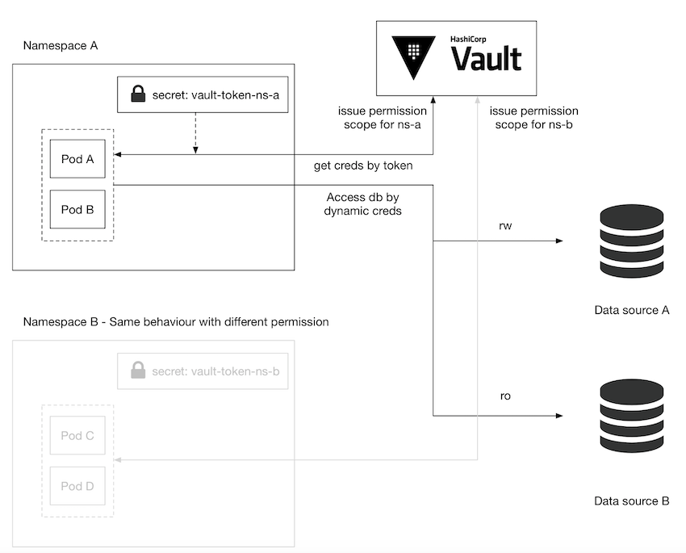
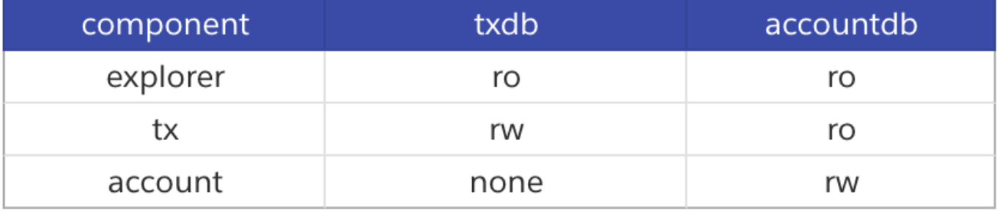
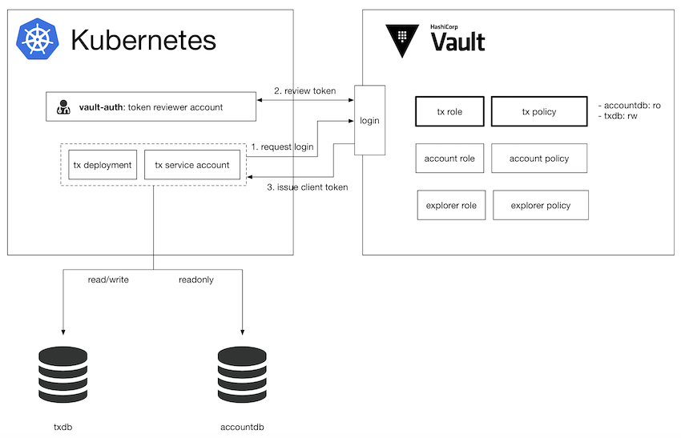

# Vault 与 Kubernetes 的深度整合


本篇文章则更进一步的解释要如何透过 `Kubernetes` 的 `Service Account` 整合登入验证，并且针对不同 `Account` 管理权限范围让特定 `deployment` 仅能存取特定 `credentials`。

## 使用情境与问题

前篇文章我们介绍了要如何用 `vault` 发出 `dynamic credential` 增强安全性，而当服务变复杂时，每个服务都会有针对不同 `credentials` 有不同的存取权限的需求。此时在 `vault `管理时就会需要用不同的 `policy` 来管理不同范围的权限。

而如果服务是架设在 `Kubernetes` 时，又要如何管理呢？

其中一个解决方案是依照 `deployment` 的权限范围将相似权限的放在同一个 `namespace` 中。并且在每个 `namespace` 底下放入一个内容为 `vault token` 的 `secret`，并且在 `vault` 当中设定此 `token` 的存取权限。我们在 `deployment` 中则透过 `Kubernetes` 的环境变数指向此 `secret`，如此一来在程式中利用 `Vault SDK` 就可以取得 `Dynamic Credential`。



因为 `namespace` 的切分可以让不同 `namespace` 之间没有办法读取其他 `namespace` 的 `secret`，以达到权限分群的效果。但是这样的设定只要稍稍复杂的情境就变得不怎么好用。

假设我们要开发一套简易银行转帐的 `API` 系统，切分成三个元件：

* `explorer`: 登入使用者后可读取交易资料
* `tx`: 登入使用者后写入交易资料
* `account`: 创建使用者

而系统裡有两个资料库：

* `txdb`: 存放交易资料
* `accountdb`: 存放使用者帐户

依照权限划分出元件与资料库的关系如下：



此时用上述的 `namespace` 切分法就显得窒碍难行，每个元件的权限范围都不同，几乎每个 `deployment` 就要放在一个 `namespace` ，本例仅有三个元件，但是稍微复杂一点的系统都会超过这个数量，原本的管理方法就变得不合适。

在这样的状况下 `vault` 有提供更进一步的功能可以透过 `Kubernetes` 的 `Service Account `来登入 `vault`，并且取得该 `service account` 的特定权限。

## Vault Kubernetes Auth

`Kubernetes `当中有两个 `account `类型：**`User Account` 跟 `Service Account`**，分别是给一般使用者与 `Service` 使用，**而 `Service Account` 大多用来规范 `Service` 可以存取 `Kubernetes API` 的权限**。

在我们的使用情境当中，我们并不用它来规范 `Kubernetes API` 存取范围，而是用来登入 `Vault` 并且取得由` Vault` 管理的 `Dynamic Credentials`，并且透过每个 `account` 设定一组特定的 `policy` 来区分存取 `credential` 的权限。



**`vault` 整合 `kubernetes service account` 的方式是设定一组 `token reviewer` 的 `service account`**，此帐号需要有 `kubernetes` 的 `system:auth-delegator` 权限，另外也会为每个 `component `都建立一组 `role`，每组 `role` 都会对应一组 `policy` 明定可以存取的 `credentials`。

接下来每一个 `component` 都会建立一组专用的 `service account`，并且在 `deployment` 中指定 `service account`。

部署上` kubernetes` 后，每个 `pod` 会绑定一个 `service account` 并且将相关资讯放在 `secret` 当中，其中有两类型的资料是我们会使用到的：

* **`service account name`**(后面简称 `sa name`): `service account` 的名字，通常可以订为跟 `deployment` 一样的名字
* **`token: service account`** 的 `JWT Token`，可以用来验证此 `Service Account` 是否为合法的帐号。

当一个 `pod` 启动后会有以下的几个步骤：

1. 从 `pod` 当中取出 `sa name` 与 [`JWT token`](https://jwt.io/) 并且尝试登入 `vault`
2. `vault` 会将 `sa name `与 `JWT token` 透过 `token reviewer` 跟 `Kubernetes Cluster` 确认此帐号是否合法
3. 若为合法帐号，则回传 `client token`，此 `token` 可以存取特定的 `Dynamic Credentials`
4. `pod` 取得 `Dynamic Credentials` 并且存取资料库。

每个 `service account` 对应到 `vault` 的 `role` 都会有一组自己的 `policy`，如此一来就可以利用 `service account` 来切分不同的权限。

### 建立 service account

这边会有两种 `service account` 需要建立：`token reviewer` 跟给 `deployment` 用的 `service account`。`token reviewer `需要两种 `resources: ServiceAccount` 跟` ClusterRoleBinding`，后者用来绑定 `system:auth-delegator `权限。

```
apiVersion: v1
kind: ServiceAccount
metadata:
  name: vault-auth-service-account
  namespace: default
---
kind: ClusterRoleBinding
apiVersion: rbac.authorization.k8s.io/v1beta1
metadata:
  name: vault-auth-role-binding
  namespace: default
subjects:
- kind: ServiceAccount
  name: vault-auth-service-account
  namespace: default
roleRef:
  apiGroup: rbac.authorization.k8s.io
  kind: ClusterRole
  name: system:auth-delegator
```

至于 `deployment` 所使用的 `Service Account` 不需要任何额外的权限，只需要在 `deployment` 绑上相对应的 `service account`。

以下的范例中第一个 `resource` 是 `ServiceAccount` 名字是 `tx`，而第二个 `resource` 是 `Deployment`，并且设定 `serviceAccountName` 为 `tx`。


####  取得 `service account (SA) `存在` k8s` 的 `secret name`
```
$ export VAULT_SA_NAME=$(kubectl get sa vault-auth -o jsonpath="{.secrets[*]['name']}")
```

####  將 `Token Reviewer` 的 `JWT token` 取出

```
$ export SA_JWT_TOKEN=$(kubectl get secret $VAULT_SA_NAME -o jsonpath="{.data.token}" | base64 --decode; echo)
```
####  Kubernetes 的 CA

```
$ export SA_CA_CRT=$(kubectl get secret $VAULT_SA_NAME -o jsonpath="{.data['ca\.crt']}" | base64 --decode; echo)
```

#### `cluster` 的 `host/ip`，正式環境可以從 `kubeconfig` 裡面取得

```
$ export K8S_HOST=$(minikube ip)
```

接著使用以下指令即可启用 `vault` 的 `kubernetes auth`：

```
$ vault auth enable kubernetes
```

启用后就可以设定 `token reviewer` 的相关资讯：

```
vault write auth/kubernetes/config \
  token_reviewer_jwt="${SA_JWT_TOKEN}" \
  kubernetes_host="${K8S_HOST}" \
  kubernetes_ca_cert="${SA_CA_CRT}"
```

以上设定可以让 `vault` 可以使用` token reviewer` 的角色验证接下来的 `service account` 是否合格，接下来则是设定每个` service account` 对应的 `vault role`。下面的设定中採用了` kubernetes-tx `这个 `policy`，此时我们还没建立，下一个步骤会建立该 `policy`。

```
vault write auth/kubernetes/role/tx \
    bound_service_account_names=tx \
    bound_service_account_namespaces=default \
    policies=kubernetes-tx \
    ttl=336h
```

以上是 `tx role`，以我们举例的简易银行 `API` 系统，

* 我们还要新增 `explorer` 与 `account role`。
* 新增完毕后下一步是新增对应的 `policy` 与指定给特定的 `role`。
* 首先会需要新增一个 `hcl` 档案，比如说 `tx` 会需要如下的 `policy`：

```
path "database/creds/tx {
  capabilities = ["read"]
}
path "database/creds/account-readonly {
  capabilities = ["read"]
}
```

并且用 `write policy` 写入 `vault` 设定：

```
vault policy write kubernetes-tx tx.hcl
```

上面要设定的事情满繁琐的，我们是使用一个 `python script` 读取自订的设定档案把这一连串繁琐的事情用 `script` 设定。

程序部分实作：

要存取 `vault` 得到 `Dynamic Credentials `有几种方式，

* 像 `Vault Agent with Kubernetes` 文章中提到的是利用一个 `vault agent` 放在` initContainer` 裡面把 `secret` 读取出来。
* 另外一个方式是在程式中利用 `Vault SDK` 登入与取得 `Dynamic Credentials`。

以下是透过 `Vault SDK` 存取 `Dynamic Credentials` 的范例：

**`vault-k8s-auth.go `**

```
package main

import (
	"fmt"
	"io/ioutil"

	vaultApi "github.com/hashicorp/vault/api"
)

var (
	vaultHost           string
	vaultCAPath         string
	vaultServiceAccount string
	vaultJWTPath        string
)

func main() {
	vaultJWTPath = "/var/run/secrets/kubernetes.io/serviceaccount/token"
	vaultServiceAccount = "tx"

	tlsConfig := &vaultApi.TLSConfig{
		CACert:   vaultCAPath,
		Insecure: false,
	}

	config := vaultApi.DefaultConfig()
	config.Address = fmt.Sprintf("https://%s", vaultHost)
	config.ConfigureTLS(tlsConfig)

	client, _ := vaultApi.NewClient(config)
	buf, _ := ioutil.ReadFile(vaultJWTPath)
	jwt := string(buf)

	options := map[string]interface{}{
		"jwt":  jwt,
		"role": vaultServiceAccount,
	}
	loginSecret, _ := client.Logical().Write("auth/kubernetes/login", options)
	client.SetToken(loginSecret.Auth.ClientToken)

	secret, _ := client.Logical().Read("database/creds/tx")
	fmt.Println(secret)
}
```

这边要注意的是 `kubernetes `会将 `JWT token` 挂载在 `/var/run/secrets/kubernetes.io/serviceaccount/token`，所以会需要从此路径取得 `token`，取得 `client token` 之后就可以利用此 `token` 存取权限范围内的 `credential` 了，在这个范例读取了 `database/creds/tx` 路径底下的帐号密码，` secret.Data` 内会包含 `username` 与 `password`。

