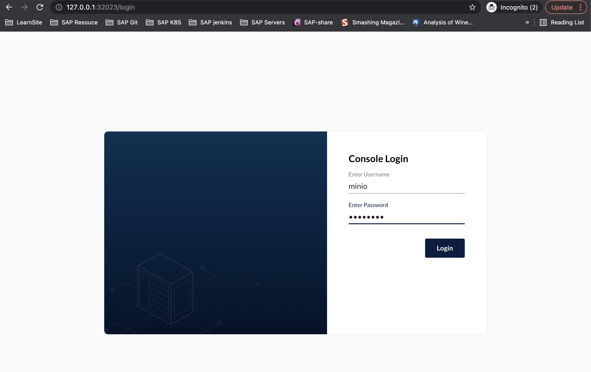
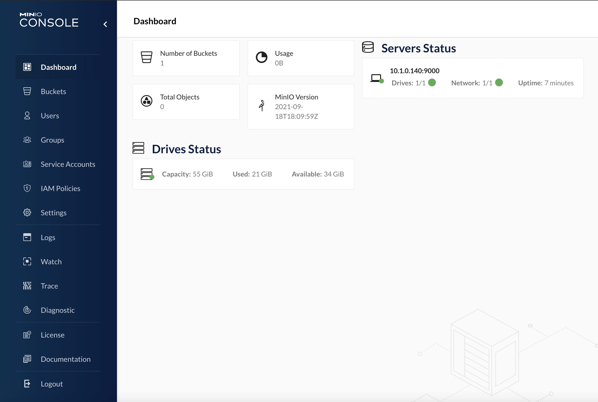
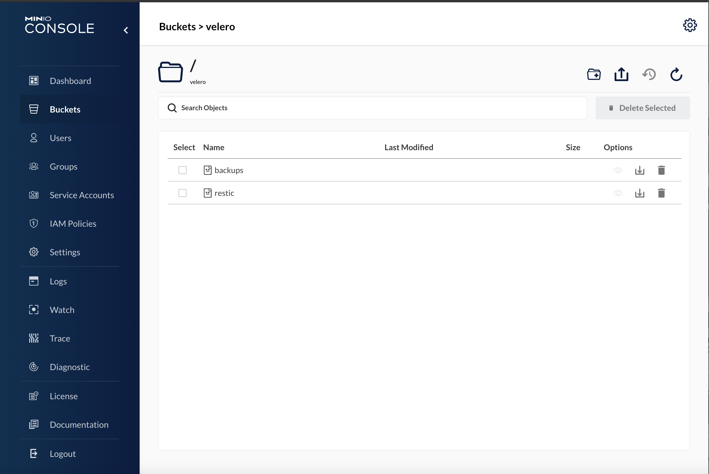
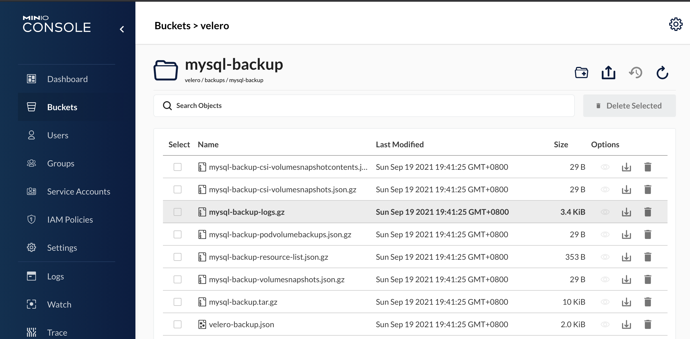

# **使用 Velero 备份还原 Kubernetes 集群**


Velero([https://velero.io](https://velero.io))（可以提供备份和还原 Kubernetes 集群资源和持久卷的能力，你可以在公有云或本地搭建的私有云环境安装 Velero，可以为你提供以下能力：

* **备份集群数据，并在集群故障的情况下进行还原**
* **将集群资源迁移到其他集群**
* **将生产集群复制到开发和测试集群**

## **原理**

每个 Velero 的操作（比如按需备份、计划备份、还原）都是 CRD 自定义资源，**Velero 可以备份或还原集群中的所有对象，也可以按类型、namespace 或标签过滤对象**。

Velero 是 Kubernetes 用来灾难恢复的理想选择，也可以在集群上执行系统操作（比如升级）之前对应用程序状态进行快照的理想选择。

### **按需备份**

**按需备份操作可以将复制的 Kubernetes 对象的压缩文件上传到云对象存储中，也可以调用云环境提供的 API 来创建持久化卷的磁盘快照**。

我们可以选择指定在备份期间执行的备份 hook，比如你可能需要在拍摄快照之前告诉数据库将其内存中的缓冲区刷新到磁盘。

> 需要注意的是集群备份并不是严格的原子备份，如果在备份时创建或编辑 Kubernetes 对象，则它们可能不会被包含在备份中，是可能出现这种状况的。

### **定时备份**

通过**定时**操作，我们可以定期备份数据，第一次创建日程表时将执行第一次备份，随后的备份将按日程表指定的间隔进行备份，这些间隔由 Cron 表达式指定。

定时备份保存的名称为` <SCHEDULE NAME>-<TIMESTAMP>`，其中` <TIMESTAMP> `格式为 `YYYYMMDDhhmmss`。

### **备份还原**

通过还原操作，我们可以从以前创建的备份中还原所有对象和持久卷，此外我们还可以仅还原对象和持久卷的子集，Velero 支持多个命名空间重新映射。例如在一次还原操作中，**可以在命名空间 def 下重新创建命名空间 abc 中的对象，或在 456 之下重新创建名称空间 123 中的对象**。

还原的默认名称为 `<BACKUP NAME>-<TIMESTAMP>`，`<TIMESTAMP>` 格式为 YYYYMMDDhhmmss，还可以指定自定义名称，恢复的对象还包括带有键 `velero.io/restore-name` 和值的标签 `<RESTORE NAME>`。

默认情况下，备份存储位置以读写模式创建，但是，在还原期间，可以将备份存储位置配置为只读模式，这将禁用该存储位置的备份创建和删除，这对于确保在还原方案期间不会无意间创建或删除任何备份非常有用。

**此外我们还可以选择指定在还原期间或还原资源后执行的还原 hook，例如可能需要在数据库应用程序容器启动之前执行自定义数据库还原操作。**


### **备份流程**

执行命令 `velero backup create test-backup` 的时候，会执行下面的操作：

*  Velero 客户端调用 `Kubernetes APIServer` 创建 Backup 这个 CRD 对象
*  Backup 控制器 watch 到新的 Backup 对象被创建并执行验证
*  Backup 控制器开始执行备份，通过查询 APIServer 来获取资源收集数据进行备份
*  Backup 控制器调用对象存储服务，比如 S3 上传备份文件

**<mark>默认情况下 `velero backup create` 支持任何持久卷的磁盘快照，可以通过指定其他参数来调整快照，可以使用 `--snapshot-volumes=false` 选项禁用快照</mark>**。

 

### **设置备份过期时间**

创建备份时，可以通过添加标志 `--ttl` 来指定 TTL，如果未指定，则将默认的 TTL 值为30天，如果 Velero 检测到有备份资源已过期，它将删除以下相应备份数据：

* 备份资源
* 来自云对象存储的备份文件
* 所有 PersistentVolume 快照
* 所有关联的还原


### **同步对象存储**

Velero 将对象存储视为资源的来源，它不断检查以确保始终存在正确的备份资源，如果存储桶中有格式正确的备份文件，但 `Kubernetes APIServer` 中没有相应的备份资源，则 Velero 会将信息从对象存储同步到 Kubernetes，这使还原功能可以在集群迁移方案中工作，在该方案中，新集群中不存在原始的备份对象。

**同样，如果备份对象存在于 Kubernetes 中，但不存在于对象存储中，则由于备份压缩包不再存在，它将从 Kubernetes 中删除。**

### **备份存储位置和卷快照位置**

Velero 有两个自定义资源 `BackupStorageLocation` 和 `VolumeSnapshotLocation`，用于配置 Velero 备份及其关联的持久卷快照的存储位置。

* **`BackupStorageLocation`：定义为存储区，存储所有 Velero 数据的存储区中的前缀以及一组其他特定于提供程序的字段,后面部分会详细介绍该部分所包含的字段**。
* **`VolumeSnapshotLocation`：完全由提供程序提供的特定的字段（例如AWS区域，Azure资源组，Portworx快照类型等）定义**。

用户可以预先配置一个或多个可能的 `BackupStorageLocations` 对象，也可以预先配置一个或多个 `VolumeSnapshotLocations` 对象，并且可以在创建备份时选择应该存储备份和相关快照的位置。

此配置设计支持许多不同的用法，包括：

* 在单个 Velero 备份中创建不止一种持久卷的快照。例如，在同时具有 EBS 卷和 Portworx 卷的集群中
* 在不同地区将数据备份到不同的存储中
* 对于支持它的卷提供程序（例如Portworx），可以将一些快照存储在本地集群中，而将其他快照存储在云中


## **安装**

在 Github Release 页面([https://github.com/vmware-tanzu/velero/releases](https://github.com/vmware-tanzu/velero/releases))下载指定的 velero 二进制客户端安装包，比如这里我们下载最新稳定版本 v1.6.3，

```
$ wget https://github.com/vmware-tanzu/velero/releases/download/v1.6.3/velero-v1.6.3-darwin-amd64.tar.gz

$  tar -zxvf velero-v1.6.3-darwin-amd64.tar.gz && cd velero-v1.6.3-darwin-amd64
x velero-v1.6.3-darwin-amd64/LICENSE
x velero-v1.6.3-darwin-amd64/examples/README.md
x velero-v1.6.3-darwin-amd64/examples/minio
x velero-v1.6.3-darwin-amd64/examples/minio/00-minio-deployment.yaml
x velero-v1.6.3-darwin-amd64/examples/nginx-app
x velero-v1.6.3-darwin-amd64/examples/nginx-app/README.md
x velero-v1.6.3-darwin-amd64/examples/nginx-app/base.yaml
x velero-v1.6.3-darwin-amd64/examples/nginx-app/with-pv.yaml
x velero-v1.6.3-darwin-amd64/velero

$ tree .
.
├── LICENSE
├── examples
│   ├── README.md
│   ├── minio
│   │   └── 00-minio-deployment.yaml
│   └── nginx-app
│       ├── README.md
│       ├── base.yaml
│       └── with-pv.yaml
└── velero

3 directories, 7 files
```

将根目录下面的 velero 二进制文件拷贝到 `PATH` 路径下面：

```
$ cp velero /usr/local/bin && chmod +x /usr/local/bin/velero

$ velero version
Client:
        Version: v1.6.3
        Git commit: 5fe3a50bfddc2becb4c0bd5e2d3d4053a23e95d2
<error getting server version: no matches for kind "ServerStatusRequest" in version "velero.io/v1">
```

## **安装 MINIO**

这里我们可以使用 minio 来代替云环境的对象存储，在上面解压的压缩包中包含一个 `examples/minio/00-minio-deployment.yaml` 的资源清单文件，为了测试方便可以将其中的 Service 更改为 NodePort 类型，我们可以配置一个 `console-address` 来提供一个` console` 页面的访问入口，完整的资源清单文件如下所示：

```
apiVersion: v1
kind: Namespace
metadata:
  name: velero
---
apiVersion: apps/v1
kind: Deployment
metadata:
  namespace: velero
  name: minio
  labels:
    component: minio
spec:
  strategy:
    type: Recreate
  selector:
    matchLabels:
      component: minio
  template:
    metadata:
      labels:
        component: minio
    spec:
      volumes:
      - name: storage
        emptyDir: {}
      - name: config
        emptyDir: {}
      containers:
      - name: minio
        image: minio/minio:latest
        imagePullPolicy: IfNotPresent
        args:
        - server
        - /storage
        - --config-dir=/config
        - --console-address=:9001
        env:
        - name: MINIO_ACCESS_KEY
          value: "minio"
        - name: MINIO_SECRET_KEY
          value: "minio123"
        ports:
        - containerPort: 9000
        - containerPort: 9001
        volumeMounts:
        - name: storage
          mountPath: "/storage"
        - name: config
          mountPath: "/config"
---
apiVersion: v1
kind: Service
metadata:
  namespace: velero
  name: minio
  labels:
    component: minio
spec:
  type: NodePort
  ports:
    - name: api
      port: 9000
      targetPort: 9000
    - name: console
      port: 9001
      targetPort: 9001
  selector:
    component: minio
---
apiVersion: batch/v1
kind: Job
metadata:
  namespace: velero
  name: minio-setup
  labels:
    component: minio
spec:
  template:
    metadata:
      name: minio-setup
    spec:
      restartPolicy: OnFailure
      volumes:
      - name: config
        emptyDir: {}
      containers:
      - name: mc
        image: minio/mc:latest
        imagePullPolicy: IfNotPresent
        command:
        - /bin/sh
        - -c
        - "mc --config-dir=/config config host add velero http://minio:9000 minio minio123 && mc --config-dir=/config mb -p velero/velero"
        volumeMounts:
        - name: config
          mountPath: "/config"
```

然后直接部署在 Kubernetes 集群中即可：

```
$ kubectl apply -f examples/minio/00-minio-deployment-bak.yaml 
namespace/velero created
deployment.apps/minio created
service/minio created
job.batch/minio-setup created

$ kubectl get pods -n velero
NAME                     READY   STATUS      RESTARTS   AGE
minio-58dc5cf789-lbpqn   1/1     Running     0          2m37s
minio-setup-b9zbb        0/1     Completed   2          2m37s

$ kubectl get svc -n velero
NAME    TYPE       CLUSTER-IP      EXTERNAL-IP   PORT(S)                         AGE
minio   NodePort   10.99.245.237   <none>        9000:31634/TCP,9001:32023/TCP   2m50s
```

* minio
* minio123

然后我们可以通过 `http://<nodeip>:31925` 访问 minio 的 `console` 页面，使用 `minio` 与 `minio `进行登录即可：

 

 


## minio 服务端安装在 Kubernetes 集群外

当然如果需要在不同 Kubernetes 和存储池集群备份与恢复数据，需要将 minio 服务端安装在 Kubernetes 集群外，保证在集群发生灾难性故障时，不会对备份数据产生影响，可以通过二进制的方式进行安装。

在待安装 minio 的服务器上下载二进制包

```
➜  ~ wget https://dl.minio.io/server/minio/release/linux-amd64/minio
➜  ~ chmod +x minio
➜  ~ sudo mv minio /usr/local/bin/
➜  ~ minio --version
```

```
$ wget https://dl.minio.io/server/minio/release/linux-amd64/minio
--2021-09-19 17:44:08--  https://dl.minio.io/server/minio/release/linux-amd64/minio
Resolving dl.minio.io (dl.minio.io)... 178.128.69.202
Connecting to dl.minio.io (dl.minio.io)|178.128.69.202|:443... connected.
HTTP request sent, awaiting response... 200 OK
Length: 90460160 (86M) [application/octet-stream]
Saving to: ‘minio’

minio                               100%[==================================================================>]  86.27M  2.64MB/s    in 1m 57s  

2021-09-19 17:46:06 (754 KB/s) - ‘minio’ saved [90460160/90460160]


$ chmod +x minio

$ sudo mv minio /usr/local/bin/
```

### Mac

```
$ brew install minio
Warning: minio 20210903035613 is already installed, it's just not linked.
To link this version, run:
  brew link minio

$ brew link minio
Linking /usr/local/Cellar/minio/20210903035613... 1 symlinks created.

$ minio --version
minio version RELEASE.2021-09-03T03-56-13Z
```

> 准备对象存储的磁盘，这里我们跳过该步骤，可以使用 systemd 来方便管理 minio 服务，对于使用 `systemd init` 系统运行系统的人，请创建用于运行 minio 服务的用户和组：

```
➜  ~ sudo groupadd --system minio
➜  ~ sudo useradd -s /sbin/nologin --system -g minio minio
```

为 `/data`(上述步骤准备好的磁盘挂载位置)目录提供 minio 用户所有权：

```
➜  ~ sudo chown -R minio:minio /data/
```

为 minio 创建 systemd 服务单元文件：


```
➜  ~ vi /etc/systemd/system/minio.service
[Unit]
Description=Minio
Documentation=https://docs.minio.io
Wants=network-online.target
After=network-online.target
AssertFileIsExecutable=/usr/local/bin/minio

[Service]
WorkingDirectory=/data
User=minio
Group=minio
EnvironmentFile=-/etc/default/minio
ExecStartPre=/bin/bash -c "if [ -z \"${MINIO_VOLUMES}\" ]; then echo \"Variable MINIO_VOLUMES not set in /etc/default/minio\"; exit 1; fi"
ExecStart=/usr/local/bin/minio server $MINIO_OPTS $MINIO_VOLUMES
# Let systemd restart this service always
Restart=always
# Specifies the maximum file descriptor number that can be opened by this process
LimitNOFILE=65536
# Disable timeout logic and wait until process is stopped
TimeoutStopSec=infinity
SendSIGKILL=no

[Install]
WantedBy=multi-user.target
```

创建 minio 环境文件 `/etc/default/minio`：

```
# Volume to be used for Minio server.
MINIO_VOLUMES="/data"

# Use if you want to run Minio on a custom port.
MINIO_OPTS="--address :9000"

# Access Key of the server.
MINIO_ACCESS_KEY=minio

# Secret key of the server.
MINIO_SECRET_KEY=minio123
```

其中` MINIO_ACCESS_KEY` 为长度至少为3个字符的访问密钥，`MINIO_SECRET_KEY` 为最少8个字符的密钥。重新加载 systemd 并启动 minio 服务：

```
➜  ~ sudo systemctl daemon-reload
➜  ~ sudo systemctl start minio
```

关于 minio 的更多使用方法可以参考官方文档 [https://docs.min.io/](https://docs.min.io/) 了解更多。

### **Mac Minio server**

```
cd /Users/i515190/k8s_test/minio
MINIO_ROOT_USER=admin MINIO_ROOT_PASSWORD=password minio server /Users/i515190/k8s_test/minio --console-address ":9001"
```

```$ MINIO_ROOT_USER=admin MINIO_ROOT_PASSWORD=password minio server /Users/i515190/k8s_test/minio --console-addre
ss ":9001"

┏━━━━━━━━━━━━━━━━━━━━━━━━━━━━━━━━━━━━━━━━━━━━━━━━━━━━━━━━━━━━━━━━┓
┃ You are running an older version of MinIO released 2 weeks ago ┃
┃ Update: Run `mc admin update`                                  ┃
┗━━━━━━━━━━━━━━━━━━━━━━━━━━━━━━━━━━━━━━━━━━━━━━━━━━━━━━━━━━━━━━━━┛

API: http://10.59.178.5:9000  http://172.16.1.1:9000  http://172.16.208.1:9000  http://127.0.0.1:9000                   
RootUser: admin 
RootPass: password 

Console: http://10.59.178.5:9001 http://172.16.1.1:9001 http://172.16.208.1:9001 http://127.0.0.1:9001          
RootUser: admin 
RootPass: password 

Command-line: https://docs.min.io/docs/minio-client-quickstart-guide
   $ mc alias set myminio http://10.59.178.5:9000 admin password

Documentation: https://docs.min.io
```

其中 `MINIO_ACCESS_KEY` 为长度至少为3个字符的访问密钥，MINIO_SECRET_KEY 为最少8个字符的密钥。重新加载 systemd 并启动 minio 服务：

## 安装 velero 服务端


我们可以使用 velero 客户端来安装服务端，也可以使用 Helm Chart 来进行安装，比如这里我们用客户端来安装，velero 命令默认读取 kubectl 配置的集群上下文，所以前提是 velero 客户端所在的节点有可访问集群的 kubeconfig 配置。

首先准备密钥文件，在当前目录建立一个空白文本文件，内容如下所示：

```
[default]
aws_access_key_id=<access key id>
aws_secret_access_key=<secret access key>
```

替换为之前步骤中 minio 的对应 `access key id` 和 `secret access key` 如果 `minio` 安装在 kubernetes 集群内时按照如下命令安装 velero 服务端:

```
➜  ~ velero install    \
     --provider aws   \
     --bucket velero   \
     --image velero/velero:v1.6.3  \
  --plugins velero/velero-plugin-for-aws:v1.2.1  \
  --namespace velero  \
  --secret-file ./credentials-velero  \
  --use-volume-snapshots=false \
     --use-restic \
  --backup-location-config region=minio,s3ForcePathStyle="true",s3Url=http://minio.velero.svc:9000
......
DaemonSet/restic: created
Velero is installed! ⛵ Use 'kubectl logs deployment/velero -n velero' to view the status.


➜  ~ kubectl get pods -n velero
NAME                      READY   STATUS      RESTARTS   AGE
minio-5b96ffddf8-x8s7p    1/1     Running     0          4m1s
minio-setup-rhc4d         0/1     Completed   1          4m1s
restic-2qn94              1/1     Running     0          22s
velero-664598d6cc-dpvxn   1/1     Running     0          22s
```

由于我们这里准备使用 minio 来作为对象存储，minio 是兼容 S3 的，所以这里我们配置的

* provider（声明使用的 Velero 插件类型）是 aws，\
* `--secret-file` 用来提供访问 minio 的密钥，
* `--use-restic` 表示使用开源免费备份工具 restic 备份和还原持久卷数据，启用该参数后会部署一个名为 restic 的 DaemonSet 对象，
* `--plugins` 使用的 velero 插件，我们使用 AWS S3 兼容插件。


安装完成后 velero 的服务端就部署成功了。


### 本地部署

1. Create a Velero-specific credentials file (`credentials-velero`) in your local directory:

```
[default]
aws_access_key_id = minio
aws_secret_access_key = minio123
```

```
$ kubectl get svc -n velero 
NAME    TYPE       CLUSTER-IP      EXTERNAL-IP   PORT(S)                         AGE
minio   NodePort   10.99.245.237   <none>        9000:31634/TCP,9001:32023/TCP   114m
```

```
velero install \
    --provider aws \
    --plugins velero/velero-plugin-for-aws:v1.1.0 \
    --bucket velero \
    --secret-file ./credentials-velero \
    --use-volume-snapshots=false \
    --backup-location-config region=minio,s3ForcePathStyle="true",s3Url=http://minio.velero.svc:9000
```
```
$ velero install    \
     --provider aws   \
     --bucket velero   \
     --image velero/velero:v1.6.3  \
  --plugins velero/velero-plugin-for-aws:v1.2.1  \
  --namespace velero  \
  --secret-file ./credentials-velero  \
  --use-volume-snapshots=false \
     --use-restic \
  --backup-location-config region=minio,s3ForcePathStyle="true",s3Url=http://minio.velero.svc:9000


CustomResourceDefinition/backups.velero.io: attempting to create resource
CustomResourceDefinition/backups.velero.io: attempting to create resource client
...

CustomResourceDefinition/volumesnapshotlocations.velero.io: created
Waiting for resources to be ready in cluster...
Namespace/velero: attempting to create resource
Namespace/velero: attempting to create resource client
Namespace/velero: already exists, proceeding
Namespace/velero: created
ClusterRoleBinding/velero: attempting to create resource
ClusterRoleBinding/velero: attempting to create resource client
ClusterRoleBinding/velero: created
ServiceAccount/velero: attempting to create resource
ServiceAccount/velero: attempting to create resource client
ServiceAccount/velero: created
Secret/cloud-credentials: attempting to create resource
Secret/cloud-credentials: attempting to create resource client
Secret/cloud-credentials: created
BackupStorageLocation/default: attempting to create resource
BackupStorageLocation/default: attempting to create resource client
BackupStorageLocation/default: created
Deployment/velero: attempting to create resource
Deployment/velero: attempting to create resource client
Deployment/velero: created
Velero is installed! ⛵ Use 'kubectl logs deployment/velero -n velero' to view the status.
```

```
$ kubectl get pod -n velero
NAME                      READY   STATUS      RESTARTS   AGE
minio-58dc5cf789-lbpqn    1/1     Running     0          131m
minio-setup-b9zbb         0/1     Completed   2          131m
restic-88tcv              1/1     Running     0          3m
velero-65f77c8d54-wb2n4   1/1     Running     0          15m
```

## 测试

```
apiVersion: v1
kind: PersistentVolumeClaim
metadata:
  name: mysql-pv-claim
  labels:
    app: mysql
spec:
  accessModes:
    - ReadWriteOnce
  resources:
    requests:
      storage: 2Gi
---
apiVersion: apps/v1
kind: Deployment
metadata:
  name: mysql
  labels:
    app: mysql
spec:
  selector:
    matchLabels:
      app: mysql
  template:
    metadata:
      labels:
        app: mysql
    spec:
      containers:
      - image: mysql:5.6
        name: mysql
        env:
        - name: MYSQL_ROOT_PASSWORD
          valueFrom:
            secretKeyRef:
              name: mysql-pass
              key: password
        livenessProbe:
          tcpSocket:
            port: 3306
        ports:
        - containerPort: 3306
          name: mysql
        volumeMounts:
        - name: mysql-persistent-storage
          mountPath: /var/lib/mysql
      volumes:
      - name: mysql-persistent-storage
        persistentVolumeClaim:
          claimName: mysql-pv-claim
```

直接部署上面的应用：

```
kubectl create namespace kube-demo

$ kubectl create secret generic mysql-pass --from-literal=password=password321 -n kube-demo

$ kubectl apply -f mysql-deployment.yaml -n kube-demo
persistentvolumeclaim/mysql-pv-claim created
deployment.apps/mysql created


$ kubectl get pods -n kube-demo
NAME                    READY   STATUS    RESTARTS   AGE
mysql-9b6c75758-q46wg   1/1     Running   0          35s
```

比如现在我们创建一个新的数据库 velero：

**password321**

``` 
 $ kubectl exec -it -n kube-demo mysql-9b6c75758-q46wg -- /bin/bash
root@mysql-9b6c75758-q46wg:/# mysql -uroot -p
Enter password: 
Welcome to the MySQL monitor.  Commands end with ; or \g.
Your MySQL connection id is 13
Server version: 5.6.51 MySQL Community Server (GPL)

Copyright (c) 2000, 2021, Oracle and/or its affiliates. All rights reserved.

Oracle is a registered trademark of Oracle Corporation and/or its
affiliates. Other names may be trademarks of their respective
owners.

Type 'help;' or '\h' for help. Type '\c' to clear the current input statement.

mysql>  show databases;
+--------------------+
| Database           |
+--------------------+
| information_schema |
| mysql              |
| performance_schema |
+--------------------+
3 rows in set (0.00 sec)

mysql>  create database velero;
Query OK, 1 row affected (0.00 sec)

mysql> 
```

现在我们来执行一个备份：

```
$ velero backup create mysql-backup --include-namespaces kube-demo
```


* `--include-namespaces` 用来备份该命名空间下的所有资源，不包括集群资源，
* 此外还可以使用 `--include-resources` 指定要备份的资源类型 ，
* `--include-cluster-resources` 指定是否备份集群资源。


该命令请求创建一个对项目（命名空间）的备份，备份请求发送之后可以用命令查看备份状态，等到 STATUS 列变为 `Completed` 表示备份完成。

```
$ velero backup create mysql-backup --include-namespaces kube-demo --default-volumes-to-restic
Backup request "mysql-backup" submitted successfully.
Run `velero backup describe mysql-backup` or `velero backup logs mysql-backup` for more details.

```

```
$ velero backup get
NAME           STATUS      ERRORS   WARNINGS   CREATED                         EXPIRES   STORAGE LOCATION   SELECTOR
mysql-backup   Completed   0        0          2021-09-19 19:30:56 +0800 CST   29d       default            <none>
```

 

 

现在我们删除应用所在的命名空间来模拟生产环境发生灾难或运维错误导致应用失败的场景：

```
 kubectl delete namespace kube-demo
```

这个时候我们肯定访问不了我们的 MySQL 数据库了，这时候我们可以用一条命令，使用 velero 从 minio 中来恢复应用和数据:

```
$ velero restore create --from-backup mysql-backup
Restore request "mysql-backup-20210919194704" submitted successfully.
Run `velero restore describe mysql-backup-20210919194704` or `velero restore logs mysql-backup-20210919194704` for more details.
```


同样我们可以使用 `velero restore get` 来查看还原的进度，等到 STATUS 列变为 Completed 表示还原完成：


```
]$  velero restore get
NAME                          BACKUP         STATUS      STARTED                         COMPLETED                       ERRORS   WARNINGS   CREATED  
                       SELECTOR
mysql-backup-20210919201738   mysql-backup   Completed   2021-09-19 20:17:38 +0800 CST   2021-09-19 20:17:38 +0800 CST   0        0          2021-09-1
9 20:17:38 +0800 CST   <none>

$  velero backup describe mysql-backup
Name:         mysql-backup
Namespace:    velero
Labels:       velero.io/storage-location=default
Annotations:  velero.io/source-cluster-k8s-gitversion=v1.21.2
              velero.io/source-cluster-k8s-major-version=1
              velero.io/source-cluster-k8s-minor-version=21

Phase:  Completed

Errors:    0
Warnings:  0

Namespaces:
  Included:  kube-demo
  Excluded:  <none>

Resources:
  Included:        *
  Excluded:        <none>
  Cluster-scoped:  auto

Label selector:  <none>

Storage Location:  default

Velero-Native Snapshot PVs:  auto

TTL:  720h0m0s

Hooks:  <none>

Backup Format Version:  1.1.0

Started:    2021-09-19 20:15:10 +0800 CST
Completed:  2021-09-19 20:15:12 +0800 CST

Expiration:  2021-10-19 20:15:10 +0800 CST

Total items to be backed up:  21
Items backed up:              21

Velero-Native Snapshots: <none included>
```

还原完成后我们再去查看之前我们的 kube-demo 命名空间下面的应用数据是否正确：

```
$  kubectl get ns kube-demo
NAME        STATUS   AGE
kube-demo   Active   86s

$  kubectl get pods -n kube-demo
NAME                    READY   STATUS    RESTARTS   AGE
mysql-9b6c75758-m4jwb   1/1     Running   0          98s

$ kubectl exec -it -n kube-demo mysql-9b6c75758-m4jwb -- /bin/bash


[Jacob@i515190:~/Devops_sap/Tech_Books/jxistiobook/docs/images]$ kubectl exec -it -n kube-demo mysql-9b6c75758-m4jwb -- /bin/bash
root@mysql-9b6c75758-m4jwb:/# mysql -uroot -p
Enter password: 
Welcome to the MySQL monitor.  Commands end with ; or \g.
Your MySQL connection id is 16
Server version: 5.6.51 MySQL Community Server (GPL)

Copyright (c) 2000, 2021, Oracle and/or its affiliates. All rights reserved.

Oracle is a registered trademark of Oracle Corporation and/or its
affiliates. Other names may be trademarks of their respective
owners.

Type 'help;' or '\h' for help. Type '\c' to clear the current input statement.

mysql> show databases;
+--------------------+
| Database           |
+--------------------+
| information_schema |
| mysql              |
| performance_schema |
| velero              |
+--------------------+
4 rows in set (0.00 sec)

mysql> 
```

可以看到我们的创建的 velero 数据库依然存在，证明已经完全恢复了。

只要我们将每个 velero 实例指向相同的对象存储，velero 就能将资源从一个群集迁移到另一个群集。此外还支持定时备份，触发备份 Hooks 等操作，更多资料请查阅官方文档：https://velero.io/docs/

 

