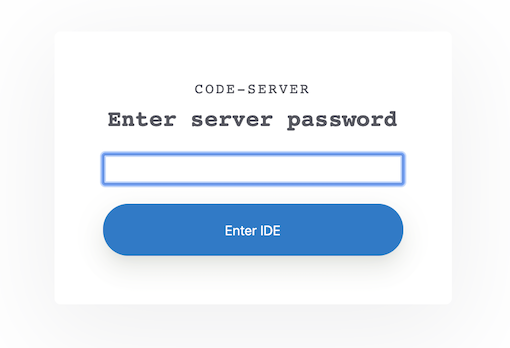
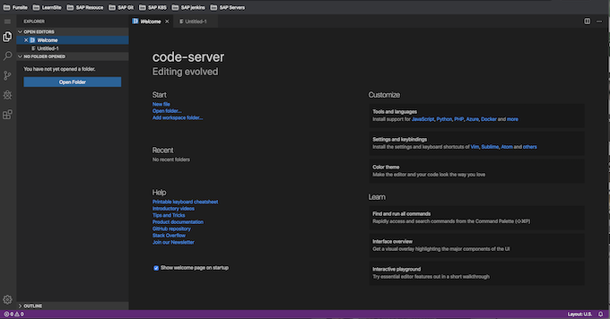

# 在 Kubernetes 集群上部署 VSCode

现在在云端作业的工具也在逐渐增长，比如最近比较流行的设计应用 Figma，就完全是云端操作的方式，大有要取代 `Sketch` 的趋势，对于开发工具来说云端 `IDE` 也逐渐受到大家重视，特别是对于远程办公的团队，`Cloud IDE` 允许开发团队在一个统一的开发环境中实时协作的工具，这可以大大提高生产效率。

而且只需要通过 `web` 浏览器就可以访问，还有一个优点就是可以利用集群的能力，这可以大大超过我们之前的个人 `PC` 的处理能力，我们也不用为本地 `IDE` 占用了电脑大量资源而苦恼了。

[code-server](https://github.com/cdr/code-server) 就是一个可以运行在服务器上面直接通过浏览器来访问的 [VSCode](https://code.visualstudio.com/)，VSCode 是一个现代化的代码编辑器，支持 Git、代码调试器、智能代码提示以及各种定制和扩展功能。接下来我们来介绍下如何在我们的 Kubernetes 集群上运行一个 VSCode。

## 安装

首先当然需要一个已经安装好的 `Kubernetes` 集群，如果想要通过域名来访问我们的 `Cloud IDE`，则还需要准备一个域名以及一个 `Ingress Controller` 安装在集群中。

> 我们这里选择的是 `Traefik2.1` 版本，当然你也可以选择其他的。

我们将 `code-server` 部署在一个名为 `code-server` 的命名空间中，然后使用 `Deployment` 来管理 `code-server` 的容器，这里我们使用的镜像是`codercom/code-server`，并在我们通过环境变量 `PASSWORD` 来设置了访问 `IDE` 的密码，对应的资源清单文件如下所示：（`code-server.yaml`）

```
apiVersion: v1
kind: Namespace
metadata:
  name: code-server
---
apiVersion: v1
kind: Service
metadata:
 name: code-server
 namespace: code-server
spec:
 ports:
 - port: 80
   targetPort: 8080
 selector:
   app: code-server
---
apiVersion: apps/v1
kind: Deployment
metadata:
  labels:
    app: code-server
  name: code-server
  namespace: code-server
spec:
  selector:
    matchLabels:
      app: code-server
  template:
    metadata:
      labels:
        app: code-server
    spec:
      containers:
      - image: codercom/code-server
        imagePullPolicy: IfNotPresent
        name: code-server
        ports:
        - containerPort: 8080
        env:
        - name: PASSWORD
          value: "code321"
```

直接创建上面的资源清单即可：

```
$ kubectl apply -f code-server.yaml
namespace/code-server created
service/code-server created
deployment.apps/code-server created
```

创建完成后我们可以通过查看 Pod 的状态来了解应用运行情况：

```
$ kubectl get pods -n code-server
NAME                         READY   STATUS    RESTARTS   AGE
code-server-99dc7566-txk5b   1/1     Running   0          5d
```

当 `Pod` 是 `Running` 状态后证明应用部署成功了

## 补充： 安装 `Traefik2.1  Ingress` 

这个时候如果我们想要把应用暴露给外部用户，则可以创建一个 `Ingress` 对象来完成。由于我们这里使用的是 `Traefik2.1` 版本，所以我们创建 `IngressRoute` 资源对象即可，对于这部分知识点不清楚的，可以查看文章 一文搞懂 Traefik2.1 的使用 了解更多信息。对应的资源清单文件如下所示：（`ingress-route.yaml`）

```
apiVersion: traefik.containo.us/v1alpha1
kind: Middleware
metadata:
  name: redirect-https
  namespace: code-server
spec:
  redirectScheme:
    scheme: https
---
apiVersion: traefik.containo.us/v1alpha1
kind: IngressRoute
metadata:
  name: code-server
  namespace: code-server
spec:
  entryPoints:
  - web
  routes:
  - kind: Rule
    match: Host(`code.jax.com`)
    middlewares:
    - name: redirect-https
    services:
    - kind: Service
      name: code-server
      port: 80
---
apiVersion: traefik.containo.us/v1alpha1
kind: IngressRoute
metadata:
  name: code-server-https
  namespace: code-server
spec:
  entryPoints:
  - websecure
  routes:
  - kind: Rule
    match: Host(`code.jax.com`)
    services:
    - kind: Service
      name: code-server
      port: 80
  tls:
    certResolver: ali
    domains:
    - main: '*.jax.com'
```

上面我们定义了两个 `IngressRoute` 对象，一个是绑定 `80 `端口，一个是绑定 `443` 端口，为了让我们通过 `https` 访问，我们还特地创建了一个 `redirect-https` 中间件，用来强制跳转到 `https` 服务，当然如果你的 `https` 服务有自己的证书直接通过 `Secret` 创建后补充到 `tls `区域即可，我们这里是使用的 `Traefik2.1` 提供的 `ACME` 机制自动生成的通配符的证书。同样直接创建上面资源对象即可：

```
$ kubectl apply -f ingress-route.yaml
$ kubectl get ingressroute -n code-server
NAME                AGE
code-server         5d
code-server-https   5d
```

## 使用 `port-forward svc`

```
$ kubectl get svc -n code-server
NAME          TYPE        CLUSTER-IP      EXTERNAL-IP   PORT(S)   AGE
code-server   ClusterIP   10.103.96.230   <none>        80/TCP    13h
```

```
$ kubectl port-forward svc/code-server 8080:80 -n code-server 
Forwarding from 127.0.0.1:8080 -> 8080
Forwarding from [::1]:8080 -> 8080
Handling connection for 8080
...
```


输入配置的密码后即可进入应用，就是我们熟悉的 `VSCode` 界面的样子，只是现在是在浏览器中运行：**`code321`**



输入配置的密码后即可进入应用，就是我们熟悉的 VSCode 界面的样子，只是现在是在浏览器中运行：




然后其他的就和我们在本地使用 VSCode 基本上差不多了，可以安装主题、插件、调试等等


