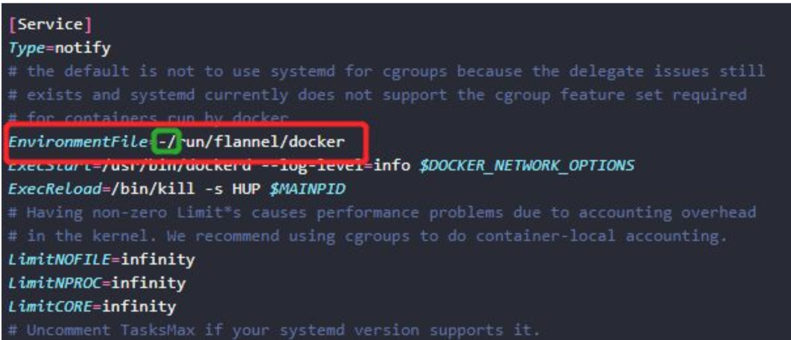
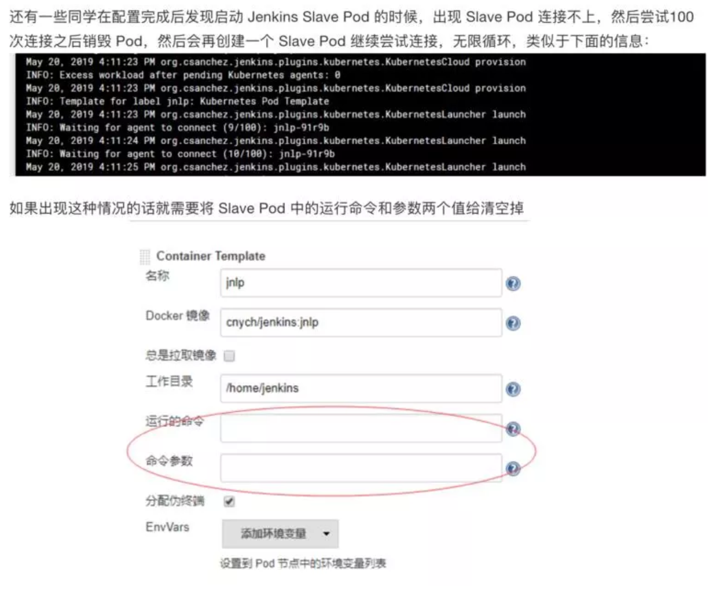
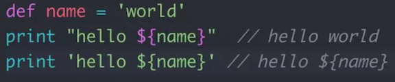
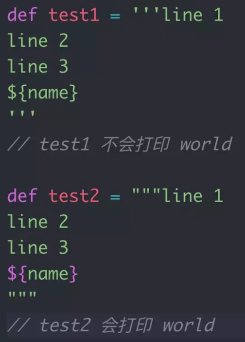
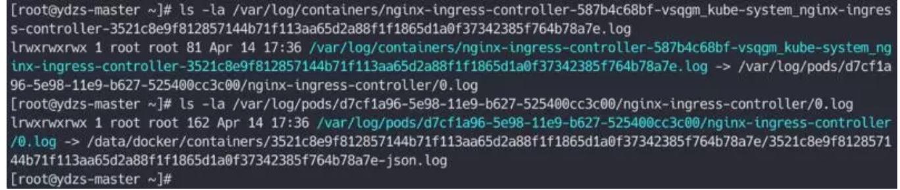
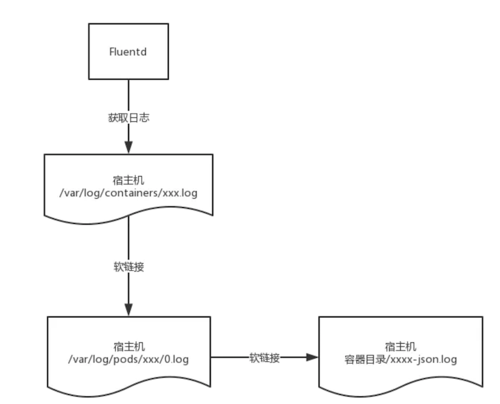

# K8S Q&A Chapter Five

## 1. Systemd 连接词号“-”的作用

在 `Docker` 的启动配置文件中有一个`EnvironmentFile=-/run/flannel/docker`的配置项，这里的`“-”`的作用是什么？ 

#### 回答：

**这个是 `Linux Systemd` 的一个用法，在所有的启动设置之前，都可以加上一个连词号`（-）`，表示"抑制错误"，即发生错误的时候，不影响其他命令的执行。**

比如，`EnvironmentFile=-/run/flannel/docker`，就表示即使 `/run/flannel/docker` 这个文件不存在，也不会抛出错误，还可以继续执行后面的动作。



## 2.外网访问 Kubernetes 集群

**我们的集群搭建在云服务下面的，但是有的时候需要在本地远程连接集群，这就需要我们通过 `APIServer` 的外网地址去访问集群了** ，

但是我们在搭建集群的时候肯定都是内网，也就是说外网 `IP` 没有参与证书校验，直接将 `~/.kube/config` 下面的 `apiserver` 地址替换成外网 `IP` 肯定是会报证书错误的。


**在安装集群的时候我们可以通过 `kubeadm` 的配置文件去指定参数 `apiServerCertSANs`，将外网 `IP` 也添加到里面这样就可以了**

但是如果是已经搭建好了的集群，重新去生成下 `apiserver` 的证书到不是不可以，但是这样重新生成一次毕竟有风险的，我们可以通过 `openssl` 工具去查看下 `apiserver` 证书的详细信息：

```
$ openssl x509 -in apiserver.crt -noout -text
......
 X509v3 Subject Alternative Name:
                DNS:ydzs-master, DNS:kubernetes, DNS:kubernetes.default, DNS:kubernetes.default.svc, DNS:kubernetes.default.svc.cluster.local, IP Address:10.96.0.1, IP Address:10.151.30.11
......
```
我们可以看到里面里面参与证书前面的 `hosts` 地址包括了宿主机的 `hostname`，想到什么了吗？我们是不是就可以直接在本地 `/etc/hosts` 里面做一个隐射 `APIServer` 的外网 `IP  -> ydzs-master`，然后在本地的 `~/.kube/config` 文件里面将 `apiserver` 地址替换成 `https://ydzs-master:6443` 是不是就可以了😄？

这样就解决了不用重新生成 `apiserver` 证书还可以在本地去访问集群的问题。这也是使用 `kubeadm` 搭建集群的一些好处，当然如果你使用的是二进制方式搭建的话，最好在搭建之初就规划下需要将哪些 `hosts` 用于签名，后需要要更改的话还是略显麻烦。

## 3. `Jenkins Slave Pod` 启动错误

有一些同学在使用 `Jenkins` 配置动态 `Slave Pod` 的时候，遇到配置完成后启动 `Jenkins Slave Pod` 的时候，连接不上，然后尝试`100`次连接之后销毁 `Pod`，然后会再创建一个 `Slave Pod` 继续尝试连接，无限循环。




## 4. `Gitlab CI Runner` 域名解析问题

今天有同学在做 `Gitlab CI` 的时候遇到一个问题：`gitlab` 的域名不是通过外网的 `DNS` 解析的正常的域名，而是通过 `/etc/hosts` 添加的一个映射域名，这样的话运行的 `Gitlab CI Runner` 的 `Pod` 就没办法解析 `Git` 地址了，就需要在 `runner` 的 `Pod` 中去添加 `gitlab` 域名对应的 `hosts` 了，那么如何添加呢？

我们可以想到的是 `Pod` 的 `hostAlias` 可以实现这个需求，但是 `runner` 的 `Pod` 是自动生成的，没办法直接去定义 `hostAlias`。我们可以通过一个比较 `hack` 的方法，通过 `--pre-clone-script` 参数来指定一段脚本来添加 `hosts` 信息，也可以通过添加环境变量 `RUNNER_PRE_CLONE_SCRIPT` 来指定：

```
--pre-clone-script = "echo 'xx.xx.xxx.xx git.qikqiak.com' >> /etc/hosts"
```

## 5. `Kubectl` 高级使用

有的时候我们在使用 `kubectl` 工具来查看 `Pod` 列表的时候可能会觉得数据太多太杂乱无章了，其实我们可以使用 `kubectl` 工具来自定义需要显示的数据。如下表示只展示 `Pod` 名称 和 `Node` 名称，并按照 `Node` 名称进行排序：

```
kubectl get pods -o custom-columns=POD:metadata.name,NODE:spec.nodeName --sort-by spec.nodeName -n kube-system
```

## 6. `Groovy` 脚本问题

有同学写 `Jenkins Pipeline` 脚本的时候发现插入的值没有效果。这是因为在 `Groovy` 脚本中支持单引号、双号，但是双引号才支持插值，单引号不支持；同样的 `Grovvy` 也支持三引号，三引号又分为三单引号和三双引号，都支持换行，但是只有三双引号支持插值操作。





## 7. `Fluentd` 日志收集问题

有同学在用 `Fluentd` 收集日志的时候，不是很明白为什么是采集的 `/var/log/containers` 目录下面的日志，其实我们去观察下这个目录下面的日志来源就可以明白，这个目录下面的日志实际上是来自于 `Pod` 目录下面的日志数据，而 `Pod` 下面的日志数据又来自于 `Docker` 容器目录下面的日志数据的，所以我们需要将宿主机的 `/var/log` 目录和 `Fluentd` 容器进行映射，而且如果更改了容器目录，那么 `Fluentd` 中的容器目录也要保持一直才行，这是因为软链接是宿主机的容器路径。





## 8. `kubeadm` 指定初始化集群镜像

在使用 `kubeadm` 搭建集群的时候，默认情况下, 会从 `k8s.gcr.io` 仓库拉取镜像，但是 `gcr` 的镜像默认又是被墙了的，所以我们安装起来非常麻烦，当然我们可以去 `docker hub` 或者 阿里云上面搜索对应的镜像，`pull` 下来后重新打 `tag`，但是这样确实也非常麻烦。

为此我们可以通过一份配置文件来配置 `kubeadm` 的镜像拉取策略，使用 `imageRepository` 来改变镜像仓库地址，如下面的 `config.yaml` 配置文件：

```
apiVersion: kubeadm.k8s.io/v1alpha1
kind: MasterConfiguration
api:
  advertiseAddress: "10.20.79.10"
networking:
  podSubnet: "10.244.0.0/16"
kubernetesVersion: "v1.10.3"
imageRepository: "registry.cn-hangzhou.aliyuncs.com/google_containers"
```

然后初始化的使用指定上面的配置文件即可：

```
kubeadm init --config kubeadm.yaml
```

这样 kubeadm 就会使用 `imageRepository` 指定的镜像前缀去拉取镜像了。

## 9. YAML 文件格式

求问`configmap`里面的`|`和`|-`分别是啥意思呀

其实这个和`configmap`没有太大的关系，这个是属于`YAML`文件的语法格式：

**多行字符串可以使用 `| `保留换行符，也可以使用 `> `折叠换行**，如：

```

this: |
  Foo
  Bar
that: >
  Foo
  Bar
```
对应的意思就是：`{ this: 'Foo\nBar\n', that: 'Foo Bar\n' }`

**`+ `表示保留文字块末尾的换行，`- `表示删除字符串末尾的换行**，如：

```
s1: |
  Foo

s2: |+
  Foo


s3: |-
  Foo
```

对应的意思就是：`{ s1: 'Foo\n', s2: 'Foo\n\n\n', s3: 'Foo' }`
