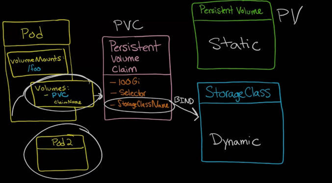
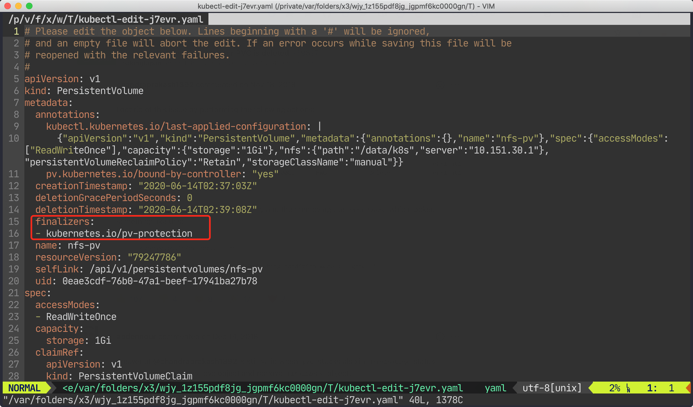
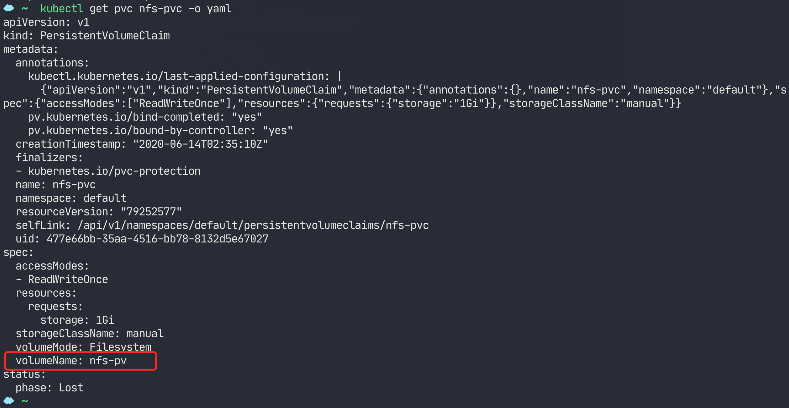
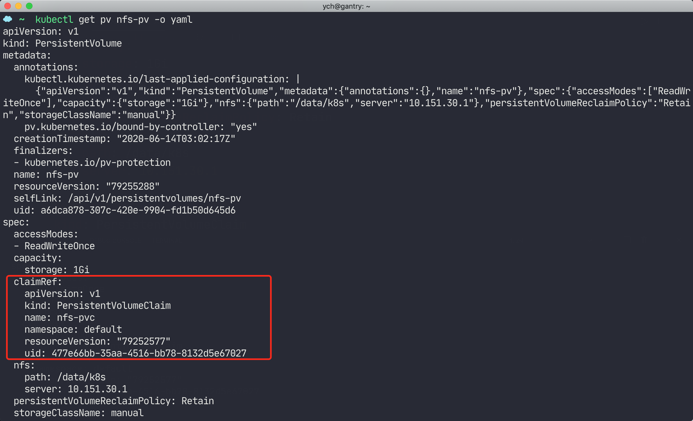
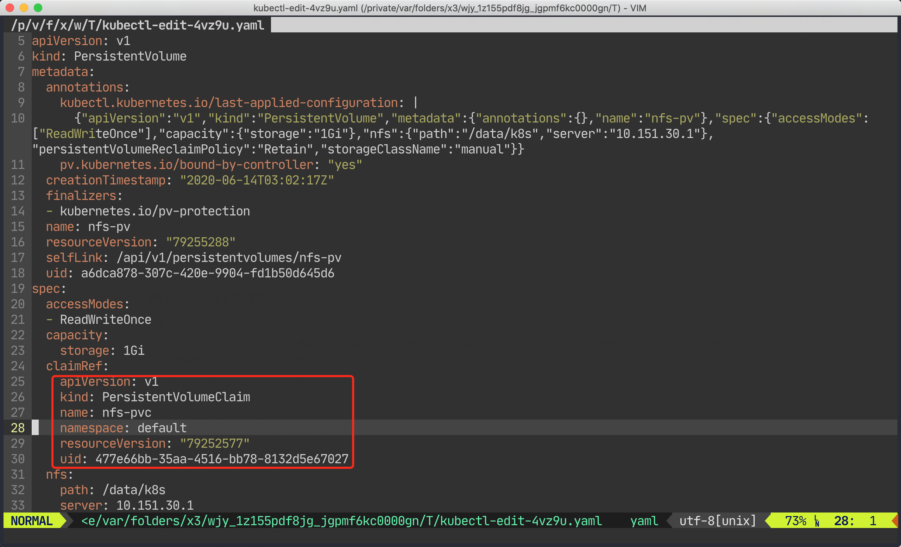

# Kubernetes 中 PV 和 PVC 的状态变化





我们对 `PV` 和 `PVC` 的几种状态应该不算陌生，但是在使用过程中可能也会产生一些疑问，比如为什么 `PV` 变成 `Failed` 状态了，新创建的 `PVC` 如何能够绑定之前的 `PV`，我可以恢复之前的 `PV` 吗？这里我们就来对 `PV` 和 `PVC` 中的几种状态变化再次进行说明。

在不同的情况下，PV 和 PVC 的状态变化我们用如下所示的表格来进行说明：


## 创建PV

**详细教程 [kubernetes 持久化存储(一)](k8s_adv14_pv1.md)**

正常情况下` PV` 被创建成功后是 `Available` 状态：

```
apiVersion: v1
kind: PersistentVolume
metadata:
  name: nfs-pv
spec:
  storageClassName: manual
  capacity: 
    storage: 1Gi
  accessModes:
  - ReadWriteOnce
  persistentVolumeReclaimPolicy: Retain
  nfs:
    path: /data/k8s  # 指定nfs的挂载点
    server: 10.151.30.1  # 指定nfs服务地址
```

直接创建上面的 PV 对象，就可以看到状态是 Available 状态，表示可以用于 PVC 绑定：

```
$ kubectl get pv nfs-pv
NAME     CAPACITY   ACCESS MODES   RECLAIM POLICY   STATUS      CLAIM   STORAGECLASS   REASON   AGE
nfs-pv   1Gi        RWO            Retain           Available           manual                  7s
```

## 新建 PVC

刚添加的 `PVC` 状态是 `Pending`，如果有合适的 `PV`，这个 `Pending` 状态会立刻变为 `Bound` 状态，同时相应的 `PVC` 也会变为 `Bound`，`PVC` 和 `PV` 进行了绑定。 我们可以先添加 `PVC`，后添加 `PV`，这样就能保证看到 `Pending` 状态。

```
apiVersion: v1
kind: PersistentVolumeClaim
metadata:
  name: nfs-pvc
spec:
  storageClassName: manual
  accessModes:
  - ReadWriteOnce
  resources:
    requests:
      storage: 1Gi
```

新建上面的 PVC 资源对象，刚新建完成会是 Pending 状态：

```
$ kubectl get pvc nfs-pvc
NAME      STATUS    VOLUME   CAPACITY   ACCESS MODES   STORAGECLASS   AGE
nfs-pvc   Pending                                      manual         7s
```

当 `PVC` 找到合适的 `PV` 绑定后，就会立刻变成 `Bound` 状态，`PV` 也从 `Available` 状态变成了 `Bound` 状态：

```
$ kubectl get pvc nfs-pvc
NAME      STATUS   VOLUME   CAPACITY   ACCESS MODES   STORAGECLASS   AGE
nfs-pvc   Bound    nfs-pv   1Gi        RWO            manual         2m8s
$ kubectl get pv nfs-pv  
NAME     CAPACITY   ACCESS MODES   RECLAIM POLICY   STATUS   CLAIM             STORAGECLASS   REASON   AGE
nfs-pv   1Gi        RWO            Retain           Bound    default/nfs-pvc   manual                  23s
```

## 删除 PV

由于现在 PVC 和 PV 已经是处于绑定状态了，那么如果这个时候我们不小心将 PV 进行了删除，会出现怎样的情况呢：


```
$ kubectl delete pv nfs-pv
persistentvolume "nfs-pv" deleted

^C
$ kubectl get pv nfs-pv   
NAME     CAPACITY   ACCESS MODES   RECLAIM POLICY   STATUS        CLAIM             STORAGECLASS   REASON   AGE
nfs-pv   1Gi        RWO            Retain           Terminating   default/nfs-pvc   manual                  12m
$ kubectl get pvc nfs-pvc                          
NAME      STATUS   VOLUME   CAPACITY   ACCESS MODES   STORAGECLASS   AGE
nfs-pvc   Bound    nfs-pv   1Gi        RWO            manual         13m
```

**事实上我们这里删除` PV` 被` hang` 住了，也就是不能真正的删除 `PV`，但是这个时候 `PV` 会变成 `Terminating` 状态，而对应的 `PVC` 还是 `Bound` 状态，也就是说这个时候由于 `PV` 和 `PVC` 已经绑定在一起了，就不能先删除 `PV`，只是现在状态是 `Terminating` 状态，对于 `PVC` 还是没有任何影响**，那么这个时候我们应该怎么处理呢？


我们可以通过编辑 `PV`，删除 `PV` 中的 `finalizers` 属性来强制删除 `PV`：

```
$ kubectl edit pv nfs-pv
# 按照下面所示删除 finalizers 属性中的内容
```




编辑完成后 PV 就会被真正删除了，而 PVC 也是 Lost 状态了：

```
$ kubectl get pv nfs-pv
Error from server (NotFound): persistentvolumes "nfs-pv" not found
$ kubectl get pvc nfs-pvc
NAME      STATUS   VOLUME   CAPACITY   ACCESS MODES   STORAGECLASS   AGE
nfs-pvc   Lost     nfs-pv   0                         manual         23m
```

## 重新创建 PV

当我们看到` PVC` 处于 `Lost` 状态的时候不用着急，这是由于之前已经绑定的 `PV` 已经没有了，但是 PVC 里面仍然有 PV 的绑定信息：



所以要解决这个问题也很简单，只需要重新把之前的 PV 创建出来即可：

```
# 重新创建 PV
$ kubectl apply -f volume.yaml 
persistentvolume/nfs-pv created
```

当 PV 创建成功后，PVC 和 PV 状态就都恢复成 Bound 状态了：

```
$ kubectl get pv nfs-pv   
NAME     CAPACITY   ACCESS MODES   RECLAIM POLICY   STATUS   CLAIM             STORAGECLASS   REASON   AGE
nfs-pv   1Gi        RWO            Retain           Bound    default/nfs-pvc   manual                  93s
# PVC 恢复成了正常的 Bound 状态
$ kubectl get pvc nfs-pvc        
NAME      STATUS   VOLUME   CAPACITY   ACCESS MODES   STORAGECLASS   AGE
nfs-pvc   Bound    nfs-pv   1Gi        RWO            manual         27m
```

## 删除 PVC

上面是先删除 PV 的情况，那么如果我们是先删除的 PVC 的话会是什么样的状况呢？

```
$ kubectl delete pvc nfs-pvc
persistentvolumeclaim "nfs-pvc" deleted
$ kubectl get pv nfs-pv     
NAME     CAPACITY   ACCESS MODES   RECLAIM POLICY   STATUS     CLAIM             STORAGECLASS   REASON   AGE
nfs-pv   1Gi        RWO            Retain           Released   default/nfs-pvc   manual                  3m36s
```

我们可以看到 `PVC` 被删除后，`PV` 变成了 `Released `的状态，但是我们仔细看后面的` CLAIM` 属性，其中依然还保留着 `PVC` 的绑定信息，也可以将 `PV` 的对象信息通过下面的命令导出：



这个时候大家可能就会想到现在我的 PVC 被删除了，PV 也变成了 `Released` 状态，**那么我重建之前的 PVC 他们不就可以重新绑定了，事实并不会，`PVC` 只能和 `Available` 状态的 `PV` 进行绑定。**

这个时候我们就需要手工去进行干预了，真实生产环境下管理员会把数据备份或迁移出来，然后修改 `PV`，删除 `claimRef` 对 `PVC` 的引用，这个时候 `Kubernetes` 的 `PV` 控制器 `watch` 到` PV` 变化后，就会将 `PV` 修改为 `Available` 状态，`Available` 状态的 `PV` 当然就可以被其他 `PVC` 绑定了。

**直接编辑 PV 删除 `cliamRef` 属性中的内容即可：**

```
# 删除 cliamRef 中的内容
$ kubectl edit pv nfs-pv
persistentvolume/nfs-pv edited
```



**删除完成后，这个时候 `PV `就会变成正常的 `Available` 状态了，重新去重建之前的 PVC 当然就可以正常绑定了：**

```
$ kubectl get pv nfs-pv
NAME     CAPACITY   ACCESS MODES   RECLAIM POLICY   STATUS      CLAIM   STORAGECLASS   REASON   AGE
nfs-pv   1Gi        RWO            Retain           Available           manual                  12m
```

在较新版本的 Kubernetes 集群中对 PV 的各种功能也做了增强，比如克隆、快照等功能都是非常有用的，我们后续再来对这些新功能进行说明。

##  Deleting a PVC stuck in status “Terminating”


You need to patch the PVC to set the “finalizers” setting to null, this allows the final unmount from the node, and the PVC can be deleted.

```
kubectl patch pvc {PVC_NAME} -p '{"metadata":{"finalizers":null}}'
```


