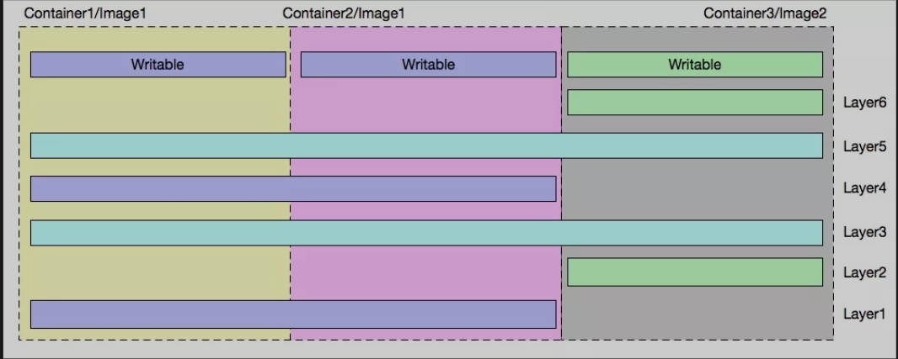
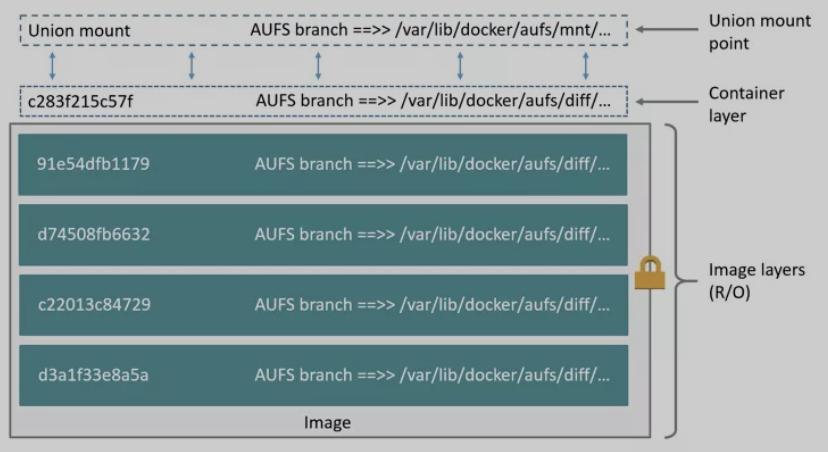
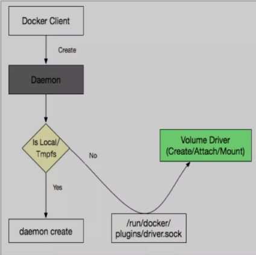
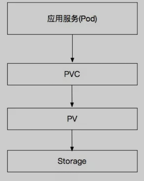
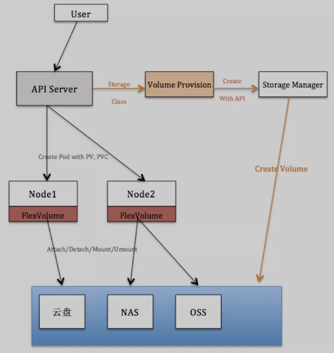

# 云原生存储详解：容器存储与 K8s 存储卷

云原生存储的两个关键领域：

* **Docker 存储卷**：容器服务在单节点的存储组织形式，关注数据存储、容器运行时的相关技术；
* **K8s 存储卷**：关注容器集群的存储编排，从应用使用存储的角度关注存储服务。


## Docker 存储

容器服务之所以如此流行，一大优势即来自于运行容器时容器镜像的组织形式。容器通过复用容器镜像的技术，**实现在相同节点上多个容器共享一个镜像资源（更细一点说是共享某一个镜像层），避免了每次启动容器时都拷贝、加载镜像文件，这种方式既节省了主机的存储空间**，又提高了容器启动效率。

### 1. 容器读写层

为了提高节点存储的使用效率，容器不光在不同运行的容器之间共享镜像资源，而且还实现了在不同镜像之间共享数据。共享镜像数据的实现原理：**镜像是分层组合而成的，即一个完整的镜像会包含多个数据层，每层数据相互叠加、覆盖组成了最终的完整镜像**。

**为了实现多个容器间共享镜像数据，容器镜像每一层都是只读的**。而通过实践我们得知，使用镜像启动一个容器的时候，其实是可以在容器里随意读写的，这是如何实现的呢？

**容器使用镜像时，在多个镜像分层的最上面还添加了一个读写层。每一个容器在运行时，都会基于当前镜像在其最上层挂载一个读写层，用户针对容器的所有操作都在读写层中完成。一旦容器销毁，这个读写层也随之销毁**。



如上图所示例子，一个节点上共有 3 个容器，分别基于 2 个镜像运行。

镜像存储层说明如下：

该节点上共包含 6 个镜像层：Layer 1~6。

* 镜像 1 由：Layer 1、3、4、5 组成；
* 镜像 2 由：Layer 2、3、5、6 组成。

**所以两个镜像共享了 Layer 3、5 两个镜像层；**

容器存储说明：

* 容器 1：使用镜像 1 启动
* 容器 2：使用镜像 1 启动
* 容器 3：使用镜像 2 启动


容器 1 和容器 2 共享镜像 1，且每个容器有自己的可写层；

容器 1（2）和容器 3 共享镜像 2 个层（Layer3、5）；

通过上述例子可以看到，通过容器镜像分层实现数据共享可以大幅减少容器服务对主机存储的资源需求。

上面给出了容器读写层结构，而读写的原则：

* **对于读**：容器由这么多层的数据组合而成，当不同层次的数据重复时，读取的原则是上层数据覆盖下层数据；
* **对于写**：容器修改某个文件时，都是在最上层的读写层进行。主要实现技术有：**写时复制、用时配置**。

#### 1）写时复制

**写时复制（`CoW：copy-on-write`），表示只在需要写时才去复制，是针对已有文件的修改场景。**

`CoW` 技术可以让所有的容器共享 `image` 的文件系统，所有数据都从 `image` 中读取，只有当要对文件进行写操作时，才从 `image` 里把要写的文件复制到最上面的读写层进行修改。

所以无论有多少个容器共享同一个 `image`，所做的写操作都是对从 `image` 中复制后在复本上进行，并不会修改 `image` 的源文件，**且多个容器操作同一个文件，会在每个容器的文件系统里生成一个复本，每个容器修改的都是自己的复本，相互隔离，相互不影响**。

### 2）用时配置

**用时分配：在镜像中原本没有某个文件的场景，只有在要新写入一个文件时才分配空间，这样可以提高存储资源的利用率**。比如启动一个容器，**并不会为这个容器预分配一些磁盘空间，而是当有新文件写入时，才按需分配新空间**。

### 2. 存储驱动

存储驱动是指如何对容器的各层数据进行管理，已达到上述需要实现共享、可读写的效果。即：容器存储驱动实现了容器读写层数据的存储和管理。常见的存储驱动：

* AUFS
* OverlayFS
* Devicemapper
* Btrfs
* ZFS

以 AUFS 为例，我们来讲述一下存储驱动的工作原理：



AUFS 是一种联合文件系统（UFS），是文件级的存储驱动。

AUFS 是一个能透明叠加一个或多个现有文件系统的层状文件系统，把多层文件系统合并成单层表示。即：**支持将不同目录挂载到同一个虚拟文件系统下的文件系统**。

可以一层一层地叠加修改文件，其底层都是只读的，只有最上层的文件系统是可写的。

**当需要修改一个文件时，AUFS 创建该文件的一个副本，使用 CoW 将文件从只读层复制到可写层进行修改，结果也保存在可写层。**

**在 Docker 中，底下的只读层就是 image，可写层就是 Container 运行时**。

### 3. Docker 数据卷介绍

容器中的应用读写数据都是发生在容器的读写层，镜像层+读写层映射为容器内部文件系统、负责容器内部存储的底层架构。当我们需要容器内部应用和外部存储进行交互时，需要一个类似于计算机 U 盘一样的外置存储，容器数据卷即提供了这样的功能。

另一方面：**容器本身的存储数据都是临时存储，在容器销毁的时候数据会一起删除。而通过数据卷将外部存储挂载到容器文件系统，应用可以引用外部数据，也可以将自己产出的数据持久化到数据卷中，所以容器数据卷是容器进行数据持久化的实现方式**。

```
容器存储组成：只读层（容器镜像） + 读写层 + 外置存储（数据卷）
```


容器数据卷从作用范围可以分为：**单机数据卷** 和 **集群数据卷**。

* 单机数据卷即为容器服务在一个节点上的数据卷挂载能力，`docker volume` 是单机数据卷的代表实现；
* 集群数据卷则关注的是集群级别的数据卷编排能力，K8s 数据卷则是集群数据卷的主要应用方式。

`Docker Volume` 是一个可供多个容器使用的目录，它绕过 UFS，包含以下特性：

* 数据卷可以在容器之间共享和重用；
* 相比通过存储驱动实现的可写层，数据卷读写是直接对外置存储进行读写，效率更高；
* 对数据卷的更新是对外置存储读写，不会影响镜像和容器读写层；
* 数据卷可以一直存在，直到没有容器使用。


#### 1）Docker 数据卷类型

`Bind`：将主机目录/文件直接挂载到容器内部。

* 需要使用主机的上的绝对路径，且可以自动创建主机目录；
* 容器可以修改挂载目录下的任何文件，是应用更具有便捷性，但也带来了安全隐患。

`Volume`：使用第三方数据卷的时候使用这种方式。

* `Volume` 命令行指令：`docker volume (create/rm)`；
* 是 Docker 提供的功能，所以在非 `docker` 环境下无法使用；
* 分为命名数据卷和匿名数据卷，其实现是一致的，区别是匿名数据卷的名字为随机码；
* 支持数据卷驱动扩展，实现更多外部存储类型的接入。


Tmpfs：非持久化的卷类型，存储在内存中。

数据易丢失。


#### 2）Bind 挂载方式语法

`-v: src:dst:opts` 只支持单机版。

* `Src`：表示卷映射源，主机目录或文件，需要是绝对地址；
* `Dst`：容器内目标挂载地址；
* `Opts`：可选，挂载属性：ro, consistent, delegated, cached, z, Z；
* `Consistent, delegated, cached`：为 mac 系统配置共享传播属性；
* `Z、z`：配置主机目录的 `selinux label`。

示例：

```
$ docker run -d --name devtest -v /home:/data:ro,rslave nginx
$ docker run -d --name devtest --mount type=bind,source=/home,target=/data,readonly,bind-propagation=rslave nginx
$ docker run -d --name devtest -v /home:/data:z nginx
```

#### 3）Volume 挂载方式语法

`-v: src:dst:opts` 只支持单机版。

* `Src`：表示卷映射源，数据卷名、空
* `Dst`：容器内目标目录
* `Opts`：可选，挂载属性：ro（只读）

示例：

```
$ docker run -d --name devtest -v myvol:/app:ro nginx
$ docker run -d --name devtest --mount source=myvol2,target=/app,readonly nginx
```

### 4. Docker 数据卷使用


Docker 数据卷使用方式：

#### 1）Volume 类型

* 匿名数据卷：`docker run –d -v /data3 nginx`；
* 会在主机上默认创建目录：`/var/lib/docker/volumes/{volume-id}/_data `进行映射；
* 命名数据卷：`docker run –d -v nas1:/data3 nginx`；
* 如果当前找不到 `nas1` 卷，会创建一个默认类型`（local）`的卷。

#### 2）Bind 方式

`docker run -d -v /test:/data nginx`


如果主机上没有`/test`目录，则默认创建此目录。

#### 3）数据卷容器

数据卷容器是一个运行中的容器，其他容器可以继承此容器中的挂载数据卷，则此容器的所有挂载都会在引用容器中体现。

`docker run -d --volumes-from nginx1 -v /test1:/data1 nginx`

继承所有来自配置容器的数据卷，并包含自己定义的卷。

#### 4）数据卷的挂载传播

`Docker volume` 支持挂载传播的配置：`Propagation`。

* Private：挂载不传播，源目录和目标目录中的挂载都不会在另一方体现；
* Shared：挂载会在源和目的之间传播；
* Slave：源对象的挂载可以传播到目的对象，反之不行；
* Rprivate：递归 Private，默认方式；
* Rshared：递归 Shared；
* Rslave：递归 Slave。

示例：

```
$ docker run –d -v /home:/data:shared nginx
表示：主机/home下面挂载的目录，在容器/data下面可用，反之可行；
$ docker run –d -v /home:/data:slave nginx
表示：主机/home下面挂载的目录，在容器/data下面可用，反之不行；
```

#### 5）数据卷挂载的可见性

Volume 挂载可见性：

* 本地空目录、镜像空目录：无特殊处理；
* 本地空目录、镜像非空目录：镜像目录的内容拷贝到主机；(是拷贝，不是映射；即使容器删除内容也会保存)；
* 本地非空目录、镜像空目录：本地目录内容映射到容器；
* 本地非空目录、镜像非空目录：本地目录内容映射到容器,容器目录的内容被隐藏。

Bind 挂载可见性：以主机目录为准。

* 本地空目录、镜像空目录：无特殊处理；
* 本地空目录、镜像非空目录：容器目录变成空；
* 本地非空目录、镜像空目录：本地目录内容映射到容器；
* 本地非空目录、镜像非空目录：本地目录内容映射到容器，容器目录的内容被隐藏。

### 5. Docker 数据卷插件

Docker 数据卷实现了将容器外部存储挂载到容器文件系统的方式。为了扩展容器对外部存储类型的需求，docker 提出了通过存储插件的方式挂载不同类型的存储服务。扩展插件统称为 `Volume Driver`，可以为每种存储类型开发一种存储插件。

* 单个节点上可以部署多个存储插件；
* 一个存储插件负责一种存储类型的挂载服务。



`Docker Daemon` 与 `Volume driver` 通信方式有：


* Sock 文件：linux 下放在 `/run/docker/plugins` 目录下
* Spec 文件：`/etc/docker/plugins/convoy.spec` 定义
* Json 文件：`/usr/lib/docker/plugins/infinit.json` 定义

实现接口：

> Create, Remove, Mount, Path, Umount, Get, List, Capabilities;


使用示例：

```
$ docker volume create --driver nas -o diskid="" -o host="10.46.225.247" -o path=”/nas1" -o mode="" --name nas1
```

Docker Volume Driver 适用在单机容器环境或者 swarm 平台进行数据卷管理，随着 K8s 的流行其使用场景已经越来越少，关于 VolumeDriver 的详细介绍这里不在细讲。


## K8s 存储卷

### 1. 基础概念

根据之前的描述，为了实现容器数据的持久化我们需要使用数据卷的功能，在 K8s 编排系统中如何为运行的负载(Pod)定义存储呢？K8s 是一个容器编排系统，其关注的是容器应用在整个集群的管理和部署形式，所以在考虑 K8s 应用存储的时候就需要从集群角度考虑。K8s 存储卷定义了在 K8s 系统中应用与存储的关联关系。其包含以下概念：

#### 1）Volume 数据卷

数据卷定义了外置存储的细节，并内嵌到 Pod 中作为 Pod 的一部分。其实质是外置存储在 K8s 系统的一个记录对象，当负载需要使用外置存储的时候，从数据卷中查到相关信息并进行存储挂载操作。

* 生命周期和 Pod 一致，即 pod 被删除的时候数据卷也一起消失（注意不是数据删除）；
* 存储细节定义在编排模板中，应用编排感知存储细节；
* 一个负载（Pod）中可以同时定义多个 volume，可以是相同类型或不同类型的存储；
* Pod 的每个 container 可以引用一个或多个 volume，不同 container 可以同时使用相同 volume。


K8S Volume 常用类型：

* **本地存储**：如 HostPath、emptyDir，这些存储卷的特点是，数据保存在集群的特定节点上，并且不能随着应用飘逸，节点宕机时数据即不再可用；
* **网络存储**：Ceph、Glusterfs、NFS、Iscsi 等类型，这些存储卷的特点是数据不在集群的某个节点上，而是在远端的存储服务上，使用存储卷时需要将存储服务挂载到本地使用；
* **Secret/ConfigMap**：这些存储卷类型，其数据是集群的一些对象信息，并不属于某个节点，使用时将对象数据以卷的形式挂载到节点上供应用使用；
* **CSI/Flexvolume**：这是两种数据卷扩容方式，可以理解为抽象的数据卷类型。每种扩展方式都可再细化成不同的存储类型；
* **PVC**：一种数据卷定义方式，将数据卷抽象成一个独立于 pod 的对象，这个对象定义（关联）的存储信息即存储卷对应的真正存储信息，供 K8s 负载挂载使用。

一些 volume 模板示例如下：

```
volumes:
  - name: hostpath
    hostPath:
      path: /data
      type: Directory
---
  volumes:
  - name: disk-ssd
    persistentVolumeClaim:
      claimName: disk-ssd-web-0
  - name: default-token-krggw
    secret:
      defaultMode: 420
      secretName: default-token-krggw
---
  volumes:
    - name: "oss1"
      flexVolume:
        driver: "alicloud/oss"
        options:
          bucket: "docker"
          url: "oss-cn-hangzhou.aliyuncs.com"
```

#### 2）PVC 和 PV

* K8s 存储卷是一个集群级别的概念，其对象作用范围是整个 K8s 集群，而不是而一个节点；
* K8s 存储卷包含一些对象（PVC、PV、SC），这些对象和应用负载（Pod）是独立，通过编排模板进行关联；
* K8s 存储卷可以有自己的独立生命周期，不依附于 Pod。

PVC 是 PersistentVolumeClaim 的缩写，译为存储声明；PVC 是在 K8s 中一种抽象的存储卷类型，代表了某个具体类型存储的数据卷表达。其设计意图是：存储与应用编排分离，将存储细节抽象出来并实现存储的编排（存储卷）。这样 K8s 中存储卷对象独立于应用编排而单独存在，在编排层面使应用和存储解耦。


PV 是 PersistentVolume 的缩写，译为持久化存储卷；PV 在 K8s 中代表一个具体存储类型的卷，其对象中定义了具体存储类型和卷参数。即目标存储服务所有相关的信息都保存在 PV 中，K8s 引用 PV 中的存储信息执行挂载操作。

应用负载、PVC、PV 的关联关系为：



从实现上看，只要有了 PV 既可以实现存储和应用的编排分离，也能实现数据卷的挂载，为何要用 PVC + PV 两个对象呢？


K8s 这样设计是从应用角度对存储卷进行二次抽象；由于 PV 描述的是对具体存储类型，需要定义详细的存储信息，而应用层用户在消费存储服务的时候往往不希望对底层细节知道的太多，让应用编排层面来定义具体的存储服务不够友好。这时对存储服务再次进行抽象，只把用户关系的参数提炼出来，用 PVC 来抽象更底层的 PV。所以 PVC、PV 关注的对象不一样，PVC 关注用户对存储需求，给用户提供统一的存储定义方式；而 PV 关注的是存储细节，可以定义具体存储类型、存储挂载使用的详细参数等。

使用时应用层会声明一个对存储的需求（PVC），而 K8s 会通过最佳匹配的方式选择一个满足 PVC 需求的 PV，并与之绑定。所以从职责上 PVC 是应用所需要的存储对象，属于应用作用域（和应用处于一个名词空间）；PV 是存储平面的存储对象，属于整个存储域（不属于某个名词空间）；


下面给出 PVC、PV 的一些属性：

* PVC 和 PV 总是成对出现的，PVC 必须与 PV 绑定后才能被应用（Pod）消费；
* PVC 和 PV 是一一绑定关系，不存在一个 PV 被多个 PVC 绑定，或者一个 PVC 绑定多个 PV 的情况；
* PVC 是应用层面的存储概念，是属于具体的名词空间的；
* PV 是存储层面的存储概念，是集群级别的，不属于某个名词空间；PV 常由专门的存储运维人员负责管理；
* 消费关系上：Pod 消费 PVC，PVC 消费 PV，而 PV 定义了具体的存储介质。

#### 3）PVC 详细定义

PVC 定义的模板如下：

```
apiVersion: v1
kind: PersistentVolumeClaim
metadata:
  name: disk-ssd-web-0
spec:
  accessModes:
  - ReadWriteOnce
  resources:
    requests:
      storage: 20Gi
  storageClassName: alicloud-disk-available
  volumeMode: Filesystem
```

PVC 定义的存储接口包括：存储的读写模式、资源容量、卷模式等；主要参数说明如下：

**accessModes**：存储卷的访问模式，支持：`ReadWriteOnce`、`ReadWriteMany`、`ReadOnlyMany` 三种模式。


* ReadWriteOnce 表示 pvc 只能同时被一个 pod 以读写方式消费；
* ReadWriteMany 可以同时被多个 pod 以读写方式消费；
* ReadOnlyMany 表示可以同时被多个 pod 以只读方式消费。

> 注意：这里定义的访问模式只是编排层面的声明，具体应用在读写存储文件的时候是否可读可写，需要具体的存储插件实现确定。

**storage**：定义此 PVC 对象期望提供的存储容量，同样此处的数据大小也只是编排声明的值，具体存储容量要看底层存储服务类型。

**volumeMode**：表示存储卷挂载模式，支持 `FileSystem、Block` 两种模式；


#### 4）PV 详细定义

下面为云盘数据卷 PV 对象的编排示例：

```
apiVersion: v1
kind: PersistentVolume
metadata:
  labels:
    failure-domain.beta.kubernetes.io/region: cn-shenzhen
    failure-domain.beta.kubernetes.io/zone: cn-shenzhen-e
  name: d-wz9g2j5qbo37r2lamkg4
spec:
  accessModes:
  - ReadWriteOnce
  capacity:
    storage: 30Gi
  flexVolume:
    driver: alicloud/disk
    fsType: ext4
    options:
      VolumeId: d-wz9g2j5qbo37r2lamkg4
  persistentVolumeReclaimPolicy: Delete
  storageClassName: alicloud-disk-available
  volumeMode: Filesystem
```

* **accessModes**：存储卷的访问模式，支持：ReadWriteOnce、ReadWriteMany、ReadOnlyMany 三种模式；具体含义同 PVC 字段；
* **capacity**：定义存储卷容量；
* **persistentVolumeReclaimPolicy**：定义回收策略，即删除 pvc 的时候如何处理 PV；支持 Delete、Retain 两种类型，动态数据卷部分会详细说明此参数；
* **storageClassName**：表示存储卷的使用的存储类名字，动态数据卷部分会详细说明此参数；
* **volumeMode**：同 PVC 中的 volumeMode 定义；
* **Flexvolume**：此字段表示具体的存储类型，这里 Flexvolume 为一种抽象的存储类型，并在 flexvolume 的子配置项中定义了具体的存储类型、存储参数。


#### 5）PVC/PV 绑定


PVC 只有绑定了 PV 之后才能被 Pod 使用，而 PVC 绑定 PV 的过程即是消费 PV 的过程，这个过程是有一定规则的，下面规则都满足的 PV 才能被 PVC 绑定：

* **VolumeMode**：被消费 PV 的 VolumeMode 需要和 PVC 一致；
* **AccessMode**：被消费 PV 的 AccessMode 需要和 PVC 一致；
* **StorageClassName**：如果 PVC 定义了此参数，PV 必须有相关的参数定义才能进行绑定；
* **LabelSelector**：通过 label 匹配的方式从 PV 列表中选择合适的 PV 绑定；
* **storage**：被消费 PV 的 capacity 必须大于或者等于 PVC 的存储容量需求才能被绑定。


满足上述所有需要的 PV 才可以被 PVC 绑定。

> 如果同时有多个 PV 满足需求，则需要从 PV 中选择一个更合适的进行绑定；通常选择容量最小的，如果容量最小的也有多个，则随机选择。
> 
> 如果没有满足上述需求的 PV 存储，则 PVC 会处于 Pending 状态，等待有合适的 PV 出现了再进行绑定。

### 2. 静态、动态存储卷

从上面的讨论我们了解到，PVC 是针对应用服务对存储的二次抽象，具有简洁的存储定义接口。而 PV 是具有繁琐存储细节的存储抽象，一般有专门的集群管理人员定义、维护。

根据 PV 的创建方式可以将存储卷分为动态存储和静态存储卷：

* 静态存储卷：由管理员创建的 PV
* 动态存储卷：由 Provisioner 插件创建的 PV


#### 1）静态存储卷


一般先由集群管理员分析集群中存储需求，并预先分配一些存储介质，同时创建对应的 PV 对象，创建好的 PV 对象等待 PVC 来消费。如果负载中定义了 PVC 需求，K8s 会通过相关规则实现 PVC 和匹配的 PV 进行绑定，这样就实现了应用对存储服务的访问能力。

#### 2）动态存储卷

由集群管理员配置好后端的存储池，并创建相应的模板（storageclass），等到有 PVC 需要消费 PV 的时候，根据 PVC 定义的需求，并参考 `storageclass` 的存储细节，由 `Provisioner` 插件动态创建一个 PV。

两种卷的比较：

* 动态存储卷和静态存储卷最终的效果都是：`Pod -> PVC -> PV` 的使用链路，且对象的具体模板定义都是一致的；
* 动态存储卷和静态存储卷区别是：动态卷是插件自动创建 `PV`，而静态卷是集群管理员手动创建 PV。

提供动态存储卷的优势：

* 动态卷让 K8s 实现了 PV 的自动化生命周期管理，PV 的创建、删除都通过 Provisioner 完成；
* 自动化创建 PV 对象，减少了配置复杂度和系统管理员的工作量；
* 动态卷可以实现 PVC 对存储的需求容量和 Provision 出来的 PV 容量一致，实现存储容量规划最优。


#### 3）动态卷的实现流程

当用户声明一个 PVC 时，如果在 PVC 中添加了 StorageClassName 字段，其意图为：当 PVC 在集群中找不到匹配的 PV 时，会根据 StorageClassName 的定义触发相应的 Provisioner 插件创建合适的 PV 供绑定，即创建动态数据卷；**动态数据卷时由 `Provisioner` 插件创建的，并通过 `StorageClassName` 与 `PVC` 进行关联。**

**`StorageClass` 可译为存储类**，表示为一个创建 `PV` 存储卷的模板；在 `PVC` 触发自动创建PV的过程中，即使用 StorageClass 对象中的内容进行创建。其内容包括：目标 `Provisioner` 名字，创建 PV 的详细参数，回收模式等配置。

StorageClasss 模板定义如下：

```
apiVersion: storage.k8s.io/v1
kind: StorageClass
metadata:
  name: alicloud-disk-topology
parameters:
  type: cloud_ssd
provisioner: diskplugin.csi.alibabacloud.com
reclaimPolicy: Delete
allowVolumeExpansion: true
volumeBindingMode: WaitForFirstConsumer
```

* `provisioner`：为一个注册插件的名字，此插件实现了创建 PV 的功能；一个 StorageClass 只能定义一个Provisioner；
* `parameters`：表示创建数据卷的具体参数；例如这里表示创建一个 SSD 类型的云盘；
* `reclaimPolicy`：用来指定创建 PV 的 persistentVolumeReclaimPolicy 字段值，支持 Delete/Retain；Delete 表示动态创建的 PV，在销毁的时候也会自动销毁；Retain 表示动态创建的 PV，不会自动销毁，而是由管理员来处理；
* `allowVolumeExpansion`：定义由此存储类创建的 PV 是否运行动态扩容，默认为 false；是否能动态扩容是有底层存储插件来实现的，这里只是一个开关；
* `volumeBindingMode`：表示动态创建 PV 的时间，支持 `Immediate/WaitForFirstConsumer`；分别表示立即创建和延迟创建。




用户创建一个 PVC 声明时，会在集群寻找合适的 PV 进行绑定，如果没有合适的 PV 与之绑定，则触发下面流程：

* `Volume Provisioner` 会 watch 到这个 PVC 的存在，若这个 PVC 定义了 `StorageClassName`，且 `StorageClass` 对象中定义的 `Provisioner` 插件是自己，`Provisioner `会触发创建 PV 的流程；
* `Provisioner` 根据 `PVC` 定义的参数（Size、VolumeMode、AccessModes）以及 `StorageClass` 定义的参数（ReclaimPolicy、Parameters）执行 PV 创建；
* `Provisioner` 会在存储介质端创建数据卷（通过 API 调用，或者其他方式），完成后会创建 PV 对象；
* `PV` 创建完成后，实现与 `PVC` 的绑定；以满足后续的 `Pod` 启动流程。

#### 4）延迟绑定动态数据卷

某种存储（阿里云云盘）在挂载属性上有所限制，只能将相同可用区的数据卷和 Node 节点进行挂载，不在同一个可用区不可以挂载。这种类型的存储卷通常遇到如下问题：

* 创建了 A 可用区的数据卷，但是 A 可用区的节点资源已经耗光，导致 Pod 启动无法完成挂载；
* 集群管理员在规划 PVC、PV 的时候不能确定在哪些可用区创建多个 PV 来备用。

`StorageClass` 中的 `volumeBindingMode ` 字段正是用来解决此问题，如果将 `volumeBindingMode` 配置为 `WaitForFirstConsumer` 值，则表示 `Provisioner` 在收到 `PVC Pending` 的时候不会立即进行数据卷创建，而是等待这个 PVC 被 Pod 消费的时候才执行创建流程。

其实现原理是：

* `Provisioner` 在收到 `PVC Pending` 状态的时候不会立即进行数据卷创建，而是等待这个 PVC 被 Pod 消费；
* 如果有 Pod 消费此 PVC，调度器发现 PVC 是延迟绑定，则 pv 继续完成调度功能（后续会详细讲解存储调度）；且调度器会将调度结果 patch 到 PVC 的 metadata 中；
* 当 `Provisioner` 发现` PVC` 中写入了调度信息时，会根据调度信息获取创建目标数据卷的位置信息（zone、Node），并触发 PV 的创建流程。

通过上述流程可见：延迟绑定会先让应用负载进行调度（确定有充足的资源供 pod 使用），然后再触发动态卷的创建流程，这样就避免了数据卷所在可用区没有资源的问题，也避免了存储预规划的不准确性问题。

在多可用区集群环境中，更推荐使用延迟绑定的动态卷方案，目前阿里云 ACK 集群已经支持上述配置方案。

### 3. 使用示例

下面给出一个 pod 消费 PVC、PV 的例子：

```
apiVersion: v1
kind: PersistentVolumeClaim
metadata:
  name: nas-pvc
spec:
  accessModes:
  - ReadWriteOnce
  resources:
    requests:
      storage: 50Gi
  selector:
    matchLabels:
      alicloud-pvname: nas-csi-pv
---
apiVersion: v1
kind: PersistentVolume
metadata:
  name: nas-csi-pv
  labels:
    alicloud-pvname: nas-csi-pv
spec:
  capacity:
    storage: 50Gi
  accessModes:
    - ReadWriteOnce
  persistentVolumeReclaimPolicy: Retain
  flexVolume:
    driver: "alicloud/nas"
    options:
      server: "***-42ad.cn-shenzhen.extreme.nas.aliyuncs.com"
      path: "/share/nas"
---
apiVersion: apps/v1
kind: Deployment
metadata:
  name: deployment-nas
  labels:
    app: nginx
spec:
  selector:
    matchLabels:
      app: nginx
  template:
    metadata:
      labels:
        app: nginx
    spec:
      containers:
      - name: nginx1
        image: nginx:1.8
      - name: nginx2
        image: nginx:1.7.9
        volumeMounts:
          - name: nas-pvc
            mountPath: "/data"
      volumes:
        - name: nas-pvc
          persistentVolumeClaim:
            claimName: nas-pvc
```

模板解析：


* 此应用为 `Deployment `方式编排的一个 `Nginx` 服务，每个 pod 包含 2 个容器：nginx1、nginx2；
* 模板中定义了 Volumes 字段，说明期望挂载数据卷给应用使用，此例中使用了 PVC 这种数据卷定义方式；
* 应用内部：将数据卷 nas-pvc 挂载到 `nginx2`容器的 `/data` 目录上；`nginx1` 容器并没有挂载；
* `PVC（nas-pvc）`定义为一个不小于 `50G` 容量、读写方式为 `ReadWriteOnce` 的存储卷需求，且对 PV 有 Label 设置的需求；
* `PV（nas-csi-pv`）定义为一个容量为 `50G`、读写方式为 `ReadWriteOnce`、回收模式为 `Retain`、类型为` Flexvolume` 抽象类型的存储卷，且具有 Label 配置；

根据 PVC、PV 绑定的逻辑，此 PV 符合 PVC 消费要求，则 PVC 会和此 PV 进行绑定，并供 pod 挂载使用。

