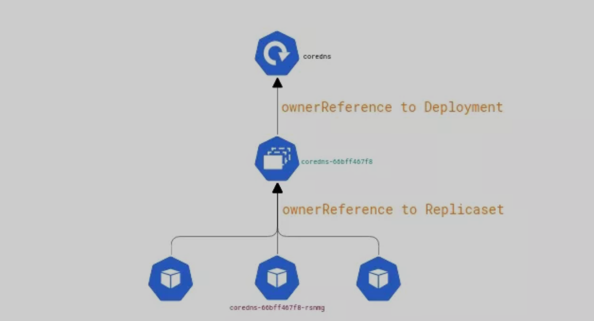

# Kubernetes 中的垃圾回收

设想这么一个场景：我们在 `K8s` 上创建了一个对象，它根据需要生成副本集和 `Pod`。


在检查时，我们遗漏了容器某个属性的设置，因此又重新编辑了 `Deployment`。新的 `Deployment` 就产生了新的副本集对象和新的 `Pod`。


这里就出现了一个问题，旧的副本集和 `Pos` 去哪了？另外，如果直接删除 `Deployment`，那副本集和 `Pod` 又会如何？事实就是，在删除 `Deployment` 后，副本集和 `Pod` 也会一起被删除，要不然集群早就乱套了。


在这个场景之下，我们可以深入思考几个问题：**在 K8s 中该如何实现级联删除？有几种级联删除策略？在 K8s 中有没有可能存在孤儿对象（orphan object）**？这些问题其实就是典型的垃圾回收（garbage collection，GC）问题。本文将介绍 K8s 中垃圾回收的概念以及实现方法。


## 什么是垃圾回收

一般来说，**垃圾回收（GC）就是从系统中删除未使用的对象，并释放分配给它们的计算资源**。GC 存在于所有的高级编程语言中，较低级的编程语言通过系统库实现 GC。

GC 最常见的算法之一是 `mark-and-sweep`，这个算法会标记将删除的对象，再进行删除，如下图所示：


## OwnerReference


在面向对象的语言中，一些对象会引用其他对象或者直接由其他对象组成，k8s 也有类似形式，例如副本集管理一组 Pod，而 Deployment 又管理着副本集。

但与面向对象语言不同的是，在 K8s 对象的定义中，没有明确所有者之间的关系，那么系统要如何确定它们的关系呢？其实，**在 K8s 中，每个从属对象都具有 唯一数据字段名称 `metadata.ownerReferences` 用于确定关系**。

从 Kubernetes v1.8 开始，K8s 对于 `ReplicaSet`、`StatefulSet`、`DaemonSet`、`Deployment`、`Job`、 `CronJob` 等创建或管理的对象，**会自动为其设置 `ownerReferences` 的值。如果有需要，我们还可以手动设置 `ownerReferences`。**


以下内容显示了 `core-dns Deployment` 上 `metadata.ownerReferences ` 的值。


```
 kubectl get deployment -n kube-system -o wide
NAME                        READY   UP-TO-DATE   AVAILABLE   AGE   CONTAINERS                  IMAGES                                              SELECTOR
coredns                     2/2     2            2           40d   coredns                     k8s.gcr.io/coredns:1.6.2                            k8s-app=kube-dns

$ kubectl  get rs -n kube-system -o json | jq ".items[0].metadata.name, .items[0].metadata.ownerReferences"
"coredns-5644d7b6d9"
[
  {
    "apiVersion": "apps/v1",
    "blockOwnerDeletion": true,
    "controller": true,
    "kind": "Deployment",
    "name": "coredns",
    "uid": "f05bea3b-3c56-42f9-b92e-5db0003e6808"
  }
]

$ kubectl  get pods -n kube-system
NAME                                         READY   STATUS      RESTARTS   AGE
coredns-5644d7b6d9-4jkzz                     1/1     Running     4          40d
coredns-5644d7b6d9-rz2gq                     1/1     Running     4          40d
...

$ $ kubectl get pods coredns-5644d7b6d9-4jkzz  -n kube-system -o json | jq ".metadata.name, .metadata.ownerReference
s"
"coredns-5644d7b6d9-4jkzz"
[
  {
    "apiVersion": "apps/v1",
    "blockOwnerDeletion": true,
    "controller": true,
    "kind": "ReplicaSet",
    "name": "coredns-5644d7b6d9",
    "uid": "030f75b7-6c88-42d3-9d25-ef6c22a27da9"
  }
]
```

认真观察上述命令的输出，其实它和其他对象 GC 之间是有些许差别的。对象关联参考金字塔是颠倒的：



## K8S的垃圾回收策略

如前面所讲，在 Kubernetes v1.8 之前，依赖对象逻辑删除的实现是在客户端，对于某些资源而言则是在控制器端。有时，客户端会中途失败，导致集群状态混乱，需要手动清理。后来为了解决这个问题，K8s 社区引入并实现了 **Garbage Collector Controller（垃圾回收器）**，用更好用且更简单的方式实现 GC。在 K8s 中，有两大类 GC：

* **级联（Cascading）**：在级联删除中，所有者被删除，那集群中的从属对象也会被删除。
* **孤儿（Orphan）**：这种情况下，对所有者的进行删除只会将其从集群中删除，并使所有对象处于“孤儿”状态。

## 垃圾回收器如何工作

如果对象的 `OwnerReferences` 元数据中没有任何所有者对象，那么垃圾回收器会删除该对象。**垃圾回收器由 `Scanner`、`Garbage Processor` 和 `Propagator` 组成：**

**Scanner**：它会检测 K8s 集群中支持的所有资源，并通过控制循环周期性地检测。它会扫描系统中的所有资源**，并将每个对象添加到"脏队列"（dirty queue）中**。


**Garbage Processor**：它由在"脏队列"上工作的 `worker` 组成。每个 `worker` 都会从"脏队列"中取出对象，并检查该对象里的 `OwnerReference` 字段是否为空。如果为空，那就从“脏队列”中取出下一个对象进行处理；如果不为空，它会检测 `OwnerReference `字段内的 `owner resoure object` 是否存在，如果不存在，会请求 API 服务器删除该对象。


**Propagator** ：用于优化垃圾回收器，它包含以下三个组件：

* **EventQueue**：负责存储 k8s 中资源对象的事件
* **DAG**（有向无环图）：负责存储 k8s 中所有资源对象的 owner-dependent 关系
* **Worker**：从 EventQueue 中取出资源对象的事件，并根据事件的类型会采取操作

在有了 Propagator 的加入之后，我们完全可以仅在 GC 开始运行的时候，让 Scanner 扫描系统中所有的对象，然后将这些信息传递给 Propagator 和“脏队列”。只要 DAG 一建立起来之后，那么 Scanner 其实就没有再工作的必要了。


https://sparsecode.io/garbage-collection-in-k8s.html