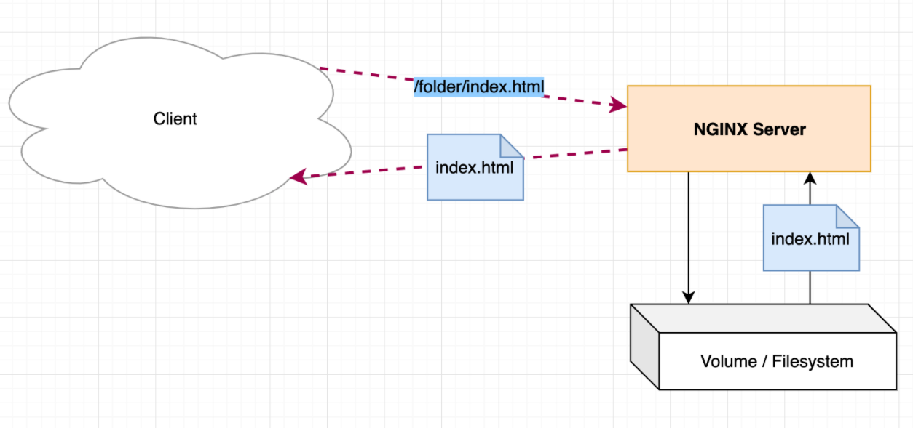
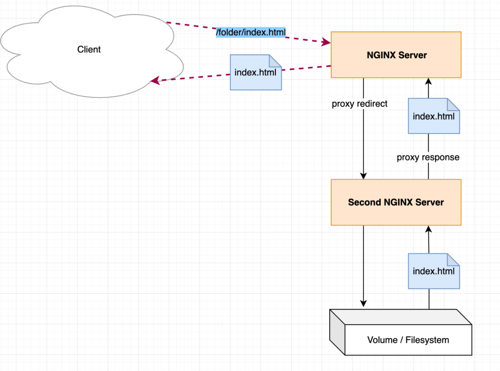
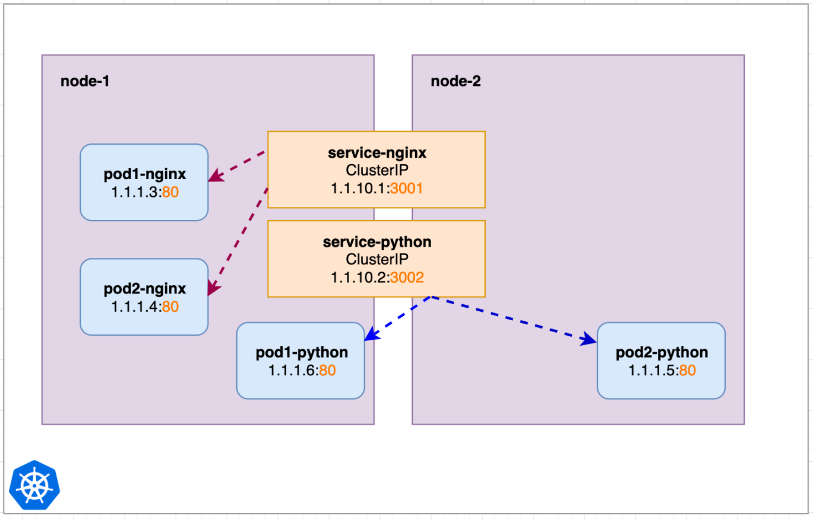
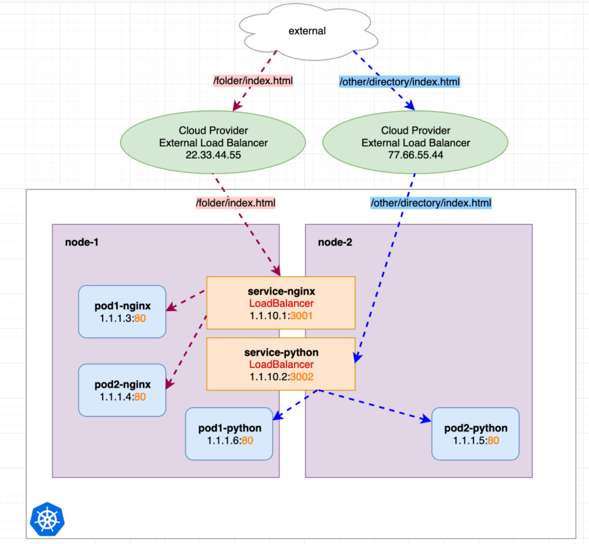
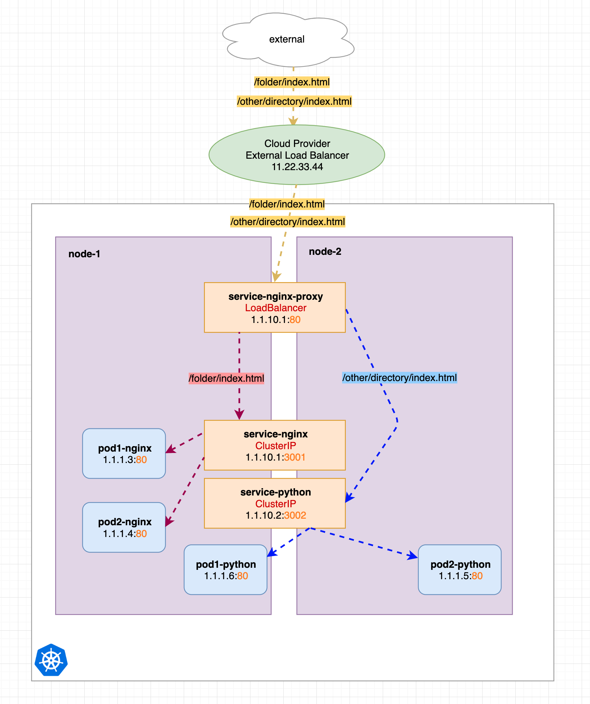
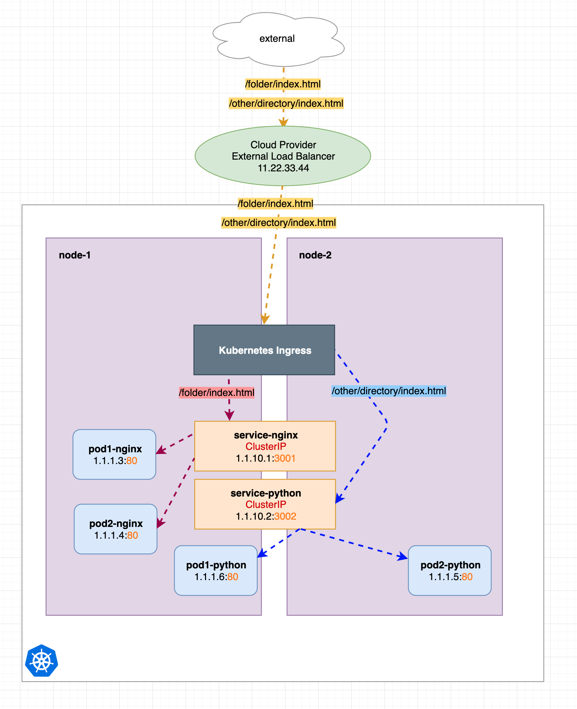

# 图解 Kubernetes Ingress 完整详解
 
Kubernetes Ingress 只是 Kubernetes 中的一个普通资源对象，需要一个对应的 `Ingress Controller` 来解析 `Ingress` 的规则，**暴露服务到外部，比如 `ingress-nginx`，本质上来说它只是一个 `Nginx Pod`**，然后将请求重定向到其他内部（ClusterIP）服务去， 

**这个Pod 本身也是通过 Kubernetes 服务暴露出去，最常见的方式是通过 LoadBalancer 来实现的。**


同样本文希望用一个简单清晰的概述，让你来了解 Kubernetes Ingress 背后的东西，让你更容易理解使用的 Ingress

## 为什么要使用 Ingress？

我们可以使用 `Ingress` 来使内部服务暴露到集群外部去，它为你节省了宝贵的静态 `IP`，因为你不需要声明多个` LoadBalancer` 服务了，此次，它还可以进行更多的额外配置。

下面我们通过一个简单的示例来对 Ingress 进行一些说明吧。

## 简单 HTTP server

首先，我们先回到容器、Kubernetes 之前的时代。

之前我们更多会使用一个`（Nginx）HTTP server` 来托管我们的服务，它可以通过 `HTTP ` 协议接收到一个特定文件路径的请求，然后在文件系统中检查这个文件路径，如果存在则就返回即可。




例如，在 Nginx 中，我们可以通过下面的配置来实现这个功能。

```
location /folder {
    root /var/www/;
    index index.html;
}
```

除了上面提到的功能之外，**我们可以当 `HTTP server` 接收到请求后，将该请求重定向到另一个服务器（意味着它作为代理）去，然后将该服务器的响应重定向到客户端去**。

对于客户端来说，什么都没有改变，接收到的结果仍然还是请求的文件（如果存在的话）。



同样如果在 Nginx 中，重定向可以配置成下面的样子：

```
location /folder {
    proxy_pass http://second-nginx-server:8000;
}
```

这意味着 Nginx 可以从文件系统中提供文件，或者通过代理将响应重定向到其他服务器并返回它们的响应。

## 简单的 Kubernetes 示例

### 使用 ClusterIP 服务

在 Kubernetes 中部署应用后，我们应该先去了解 `Kubernetes Service` 服务（前文中讲解的）。比如我们有两个 `worker` 节点，**有两个服务 `service-nginx` 和 `service-python`**，它们指向不同的 `pods`。这两个服务没有被调度到任何特定的节点上，也就是在任何节点上都有可能，如下图所示：



在集群内部我们可以通过他们的 Service 服务来请求到 Nginx pods 和 Python pods 上去，现在我们想让这些服务也能从集群外部进行访问，按照前文提到的我们就需要将这些服务转换为 LoadBalancer 服务。

###  使用 LoadBalancer 服务

当然使用 LoadBalancer 服务的前提是我们的 Kubernetes 集群的托管服务商要能支持才行，如果支持我们可以将上面的 ClusterIP 服务转换为 LoadBalancer 服务，可以创建两个外部负载均衡器，将请求重定向到我们的节点 IP，然后重定向到内部的 ClusterIP 服务。



我们可以看到两个 LoadBalancers 都有自己的 IP，

* **如果我们向 `LoadBalancer 22.33.44.55` 发送请求，它请被重定向到我们的内部的 `service-nginx` 服务去。**
* **如果发送请求到 `77.66.55.44`，它将被重定向到我们的内部的 `service-python` 服务**。


### 手动配置 Nginx 代理服务

我们知道 `Nginx` 可以作为一个代理使用，所以我们可以很容易想到运行一个 Nginx 来代理我们的服务。

如下图所示，我们新增了一个名为 `service-nginx-proxy` 的新服务，它实际上是我们唯一的一个 LoadBalancer 服务。

**`service-nginx-proxy `仍然会指向一个或多个 `Nginx-pod-endpoints`（为了简单没有在图上标识），之前的另外两个服务转换为简单的` ClusterIP` 服务了。**





可以看到我们只分配了一个 IP 地址为 `11.22.33.44` 的负载均衡器，对于不同的 `http` 请求路径我们用黄色来进行标记，他们的目标是一致的，只是包含的不同的请求 `URL`。

**`service-nginx-proxy` 服务会根据请求的 URL 来决定他们应该将请求重定向到哪个服务去。**

在上图中我们有两个背后的服务，分别用红色和蓝色进行了标记，***红色会重定向到 `service-nginx` 服务，蓝色重定向到 `service-python` 服务***。对应的 Nginx 代理配置如下所示：

```
location /folder {
    proxy_pass http://service-nginx:3001;
}
location /other {
    proxy_pass http://service-python:3002;
}
```


只是目前我们需要去手动配置 **service-nginx-proxy** 服务，比如新增了一个请求路径需要路由到其他服务去，**我们就需要去重新配置 Nginx 的配置让其生效，但是这个确实是一个可行的解决方案，只是有点麻烦而已。**

**而 Kubernetes Ingress 就是为了让我们的配置更加容易、更加智能、更容易管理出现的，所以在 Kubernetes 集群中我们会用 Ingress 来代替上面的手动配置的方式将服务暴露到集群外去。**

## 使用 Kubernetes Ingress


现在我们将上面手动配置代理的方式转换为 Kubernetes Ingress 的方式，如下图所示，我们只是使用了一个预先配置好的 Nginx（Ingress），它已经为我们做了所有的代理重定向工作，这为我们节省了大量的手动配置工作了。



这其实就已经说明了 Kubernetes Ingress 是什么，下面让我们来看看一些配置实例吧。

## 安装 Ingress 控制器

Ingress 只是 Kubernetes 的一种资源对象而已，在这个资源中我们可以去配置我们的服务路由规则，但是要真正去实现识别这个 Ingress 并提供代理路由功能，还需要安装一个对应的控制器才能实现。

```
kubectl apply -f https://raw.githubusercontent.com/kubernetes/ingress-nginx/nginx-0.24.1/deploy/mandatory.yaml
kubectl apply -f https://raw.githubusercontent.com/kubernetes/ingress-nginx/nginx-0.24.1/deploy/provider/cloud-generic.yaml
```

使用下面的命令，可以看到安装在命名空间 **ingress-nginx** 中的 k8s 资源。

```
$ kubectl get svc,pod --namespace=ingress-nginx
NAME                    TYPE           CLUSTER-IP     EXTERNAL-IP   PORT(S)                      AGE
service/ingress-nginx   LoadBalancer   10.107.2.224   <pending>     80:30989/TCP,443:30488/TCP   2m51s

NAME                                           READY   STATUS    RESTARTS   AGE
pod/nginx-ingress-controller-9899c7dfc-k96zq   1/1     Running   0          3m12s
```

我们可以看到一个正常的 `LoadBalancer` 服务，有一个外部 `IP` 和一个所属的 `pod`，我们可以使用命令 `kubectl exec` 进入该 `pod`，里面包含一个预配置的 Nginx 服务器。

```
$ kubectl exec -it nginx-ingress-controller-9899c7dfc-k96zq -n ingress-nginx bash
kubectl exec [POD] [COMMAND] is DEPRECATED and will be removed in a future version. Use kubectl exec [POD] -- [COMMAND] instead.
www-data@nginx-ingress-controller-9899c7dfc-k96zq:/etc/nginx$ $ ls -lh
total 88K
-rw-r--r-- 1 www-data www-data 1.1K Apr  6  2019 fastcgi.conf
-rw-r--r-- 1 www-data www-data 1.1K Apr  6  2019 fastcgi.conf.default
-rw-r--r-- 1 www-data www-data 1007 Apr  6  2019 fastcgi_params
-rw-r--r-- 1 www-data www-data 1007 Apr  6  2019 fastcgi_params.default
drwxr-xr-x 1 www-data www-data  119 Apr  6  2019 geoip
-rw-r--r-- 1 www-data www-data 2.8K Apr  6  2019 koi-utf
-rw-r--r-- 1 www-data www-data 2.2K Apr  6  2019 koi-win
drwxr-xr-x 6 www-data www-data  267 Apr 13  2019 lua
-rw-r--r-- 1 www-data www-data 5.2K Apr  6  2019 mime.types
-rw-r--r-- 1 www-data www-data 5.2K Apr  6  2019 mime.types.default
drwxr-xr-x 2 www-data www-data   53 Apr  6  2019 modsecurity
drwxr-xr-x 2 www-data www-data  150 Apr  6  2019 modules
-rw-r--r-- 1 www-data www-data  14K Nov 12 23:05 nginx.conf
-rw-r--r-- 1 www-data www-data 2.6K Apr  6  2019 nginx.conf.default
-rw-r--r-- 1 www-data www-data    2 Apr 13  2019 opentracing.json
drwxr-xr-x 6 www-data www-data 4.0K Apr  6  2019 owasp-modsecurity-crs
-rw-r--r-- 1 www-data www-data  636 Apr  6  2019 scgi_params
-rw-r--r-- 1 www-data www-data  636 Apr  6  2019 scgi_params.default
drwxr-xr-x 2 www-data www-data   24 Apr 13  2019 template
-rw-r--r-- 1 www-data www-data  664 Apr  6  2019 uwsgi_params
-rw-r--r-- 1 www-data www-data  664 Apr  6  2019 uwsgi_params.default
-rw-r--r-- 1 www-data www-data 3.6K Apr  6  2019 win-utf
```

其中的 `nginx.conf` 文件就包含各种代理重定向设置和其他相关配置。

## Ingress 配置示例

我们所使用的 Ingress yaml 例子可以是这样的。

```
# just example, not tested
apiVersion: networking.k8s.io/v1beta1
kind: Ingress
metadata:
  annotations:
    kubernetes.io/ingress.class: nginx
  namespace: default
  name: test-ingress
spec:
  rules:
  - http:
      paths:
      - path: /folder
        backend:
          serviceName: service-nginx
          servicePort: 3001
  - http:
      paths:
      - path: /other
        backend:
          serviceName: service-python
          servicePort: 3002
```

和其他资源对象一样，通过 `kubectl create -f ingress.yaml` 来创建这个资源对象即可，创建完成后这个 Ingress 对象会被上面安装的 Ingress 控制器转换为对应的 Nginx 配置。

如果你的一个内部服务，即 `Ingress` 应该重定向到的服务，是在不同的命名空间里，怎么办？**因为我们定义的 `Ingress` 资源是命名空间级别的。在 `Ingress` 配置中，只能重定向到同一命名空间的服务。**

如果你定义了多个 `Ingress yaml` 配置，那么这些配置会被一个单一的`Ingress `控制器合并成一个 Nginx 配置。

也就是说所有的人都在使用同一个 `LoadBalancer IP`。


## 配置 Ingress Nginx

有时候我们需要对 `Ingress Nginx` 进行一些微调配置，我们可以通过 `Ingress` 资源对象中的 `annotations` 注解来实现，比如我们可以配置各种平时直接在 `Nginx` 中的配置选项。

```
kind: Ingress
metadata:
  name: ingress
  annotations:
      kubernetes.io/ingress.class: nginx
      nginx.ingress.kubernetes.io/proxy-connect-timeout: '30'
      nginx.ingress.kubernetes.io/proxy-send-timeout: '500'
      nginx.ingress.kubernetes.io/proxy-read-timeout: '500'
      nginx.ingress.kubernetes.io/send-timeout: "500"
      nginx.ingress.kubernetes.io/enable-cors: "true"
      nginx.ingress.kubernetes.io/cors-allow-methods: "*"
      nginx.ingress.kubernetes.io/cors-allow-origin: "*"
...
```

此外也可以做更细粒度的规则配置，如下所示：

```
nginx.ingress.kubernetes.io/configuration-snippet: |
  if ($host = 'www.qikqiak.com' ) {
    rewrite ^ https://qikqiak.com$request_uri permanent;
  }
```

这些注释都将被转换成 Nginx 配置，你可以通过手动连接(kubectl exec)到 nginx pod 中检查这些配置。

关于 ingress-nginx 更多的配置使用可以参考官方文档相关说明：

* https://github.com/kubernetes/ingress-nginx/tree/master/docs/user-guide/nginx-configuration
* https://github.com/kubernetes/ingress-nginx/blob/master/docs/user-guide/nginx-configuration/annotations.md#lua-resty-waf

### 查看 ingress-nginx 日志

要排查问题，通过查看 Ingress 控制器的日志非常有帮助。

```
$ kubectl get ingress
Warning: extensions/v1beta1 Ingress is deprecated in v1.14+, unavailable in v1.22+; use networking.k8s.io/v1 Ingress
NAME           CLASS    HOSTS   ADDRESS   PORTS   AGE
test-ingress   <none>   *                 80      17m

$ kubectl logs -n ingress-nginx nginx-ingress-controller-9899c7dfc-k96zq | head -n 20
-------------------------------------------------------------------------------
NGINX Ingress controller
  Release:    0.24.1
  Build:      git-ce418168f
  Repository: https://github.com/kubernetes/ingress-nginx
-------------------------------------------------------------------------------

W1112 23:05:57.467769       7 flags.go:214] SSL certificate chain completion is disabled (--enable-ssl-chain-completion=false)
nginx version: nginx/1.15.10
W1112 23:05:57.473347       7 client_config.go:549] Neither --kubeconfig nor --master was specified.  Using the inClusterConfig.  This might not work.
I1112 23:05:57.473582       7 main.go:205] Creating API client for https://10.96.0.1:443
I1112 23:05:57.482264       7 main.go:249] Running in Kubernetes cluster version v1.19 (v1.19.1) - git (clean) commit 206bcadf021e76c27513500ca24182692aabd17e - platform linux/amd64
I1112 23:05:57.949107       7 main.go:124] Created fake certificate with PemFileName: /etc/ingress-controller/ssl/default-fake-certificate.pem
I1112 23:05:57.997714       7 nginx.go:265] Starting NGINX Ingress controller
I1112 23:05:58.082413       7 event.go:209] Event(v1.ObjectReference{Kind:"ConfigMap", Namespace:"ingress-nginx", Name:"udp-services", UID:"e60b533a-1072-4aaa-8b8f-e574627b4ef4", APIVersion:"v1", ResourceVersion:"200700", FieldPath:""}): type: 'Normal' reason: 'CREATE' ConfigMap ingress-nginx/udp-services
I1112 23:05:58.082472       7 event.go:209] Event(v1.ObjectReference{Kind:"ConfigMap", Namespace:"ingress-nginx", Name:"tcp-services", UID:"22b70ce6-cb08-431b-b3f1-9d190f9adc5b", APIVersion:"v1", ResourceVersion:"200699", FieldPath:""}): type: 'Normal' reason: 'CREATE' ConfigMap ingress-nginx/tcp-services
I1112 23:05:58.098080       7 event.go:209] Event(v1.ObjectReference{Kind:"ConfigMap", Namespace:"ingress-nginx", Name:"nginx-configuration", UID:"70bb4ea5-c74b-49b4-8476-78ba4c124f9a", APIVersion:"v1", ResourceVersion:"200698", FieldPath:""}): type: 'Normal' reason: 'CREATE' ConfigMap ingress-nginx/nginx-configuration
I1112 23:05:59.201489       7 nginx.go:311] Starting NGINX process
I1112 23:05:59.205242       7 leaderelection.go:217] attempting to acquire leader lease  ingress-nginx/ingress-controller-leader-nginx...
I1112 23:05:59.207286       7 controller.go:170] Configuration changes detected, backend reload required.
```

### 使用 Curl 测试


如果我们想测试 Ingress 重定向规则，最好使用 `curl -v [yourhost.com](http://yourhost.com) `来代替浏览器，可以避免缓存等带来的问题。


### 重定向规则

在本文的示例中我们使用 `/folder` 和 `/other/directory` 等路径来重定向到不同的服务，此外我们也可以通过主机名来区分请求，比如将 `api.myurl.com` 和 `site.myurl.com` 重定向到不同的内部 ClusterIP 服务去。

```
apiVersion: networking.k8s.io/v1beta1
kind: Ingress
metadata:
  name: simple-fanout-example
spec:
  rules:
  - host: api.myurl.com
    http:
      paths:
      - path: /foo
        backend:
          serviceName: service1
          servicePort: 4200
      - path: /bar
        backend:
          serviceName: service2
          servicePort: 8080
  - host: website.myurl.com
    http:
      paths:
      - path: /
        backend:
          serviceName: service3
          servicePort: 3333
```

### SSL/HTTPS

可能我们想让网站使用安全的 HTTPS 服务，Kubernetes Ingress 也提供了简单的 TLS 校验，这意味着它会处理所有的 SSL 通信、解密/校验 SSL 请求，然后将这些解密后的请求发送到内部服务去。


如果你的多个内部服务使用相同（可能是通配符）的 SSL 证书，这样我们就只需要在 Ingress 上配置一次，而不需要在内部服务上去配置，Ingress 可以使用配置的 TLS Kubernetes Secret 来配置 SSL 证书。

```
apiVersion: networking.k8s.io/v1beta1
kind: Ingress
metadata:
  name: tls-example-ingress
spec:
  tls:
  - hosts:
    - sslexample.foo.com
    secretName: testsecret-tls
  rules:
    - host: sslexample.foo.com
      http:
        paths:
        - path: /
          backend:
            serviceName: service1
            servicePort: 80
```

不过需要注意的是如果你在不同的命名空间有多个 Ingress 资源，那么你的 TLS secret 也需要在你使用的 Ingress 资源的所有命名空间中可用。


