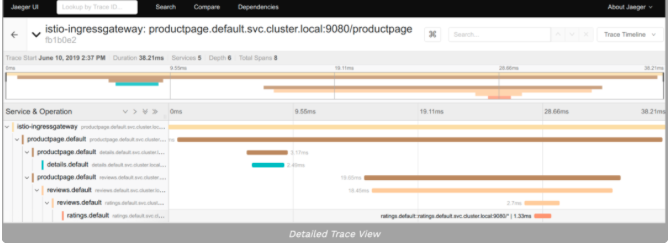

# 图解 Istio —— 技术详解

Istio 是一个服务网格，它允许集群中的 pods 和服务之间进行更详细、复杂和可观察的通信。

它通过使用 CRD 扩展 Kubernetes API 来进行管理，它将代理容器注入到所有 pods 中，然后由这些 pods 来控制集群中的流量。

## Kubernetes Services

[前面我们已经了解了 Kubernetes Services](https://github.com/Chao-Xi/JacobTechBlog/blob/master/k8s_tutorial/k8s_adv106_svc_scratch.md)，我们可以再简短地说明下如何实现 Kubernetes Services，这这有助于理解 Istio 如何工作的。

上图的 Kubernetes 集群中一共有两个节点和 4 个 pod，每个 pod 都有一个容器。

服务 `service-nginx` 指向 `nginx pods`，服务 `service-python` 指向` python pods`。红线显示了从 `pod1-nginx` 中的 `nginx` 容器向 s`ervice-python` 服务发出的请求，该服务将请求重定向到 `pod2-python`。

默认情况下，ClusterIP 服务进行简单的随机或轮询转发请求，Kubernetes 中的 Services 并不存在于特定的节点上，而是存在于整个集群中。我们可以在下图 中看到更多细节:

**上图要更详细点，`Kubernetes` 中的服务是由运行在每个节点上的 `kube-proxy` 组件实现的，该组件创建` iptables` 规则，并将请求重定向到 `Pod`。**

因此，服务就是 iptables 规则。(还有其他不使用 iptables 的代理模式，但过程是相同的。)

## Kubernetes Istio

现在我们来看一个配置了 Istio 的相同示例:

**上图中可以看到集群中安装了 `Istio`，每个 `pod` 都有第二个称为 `istio-proxy` 的 `sidecar` 容器，该容器在创建期间会自动将其注入到 `pods` 中**。

**`Istio` 最常见的代理是 `Envoy`**，当然也可以使用其他代理（如 `Nginx`），所以我们将代理称为istio-proxy。

我们可以看到不再显示 `kube-proxy` 组件，这样做是为了保持图像的整洁，这些组件仍然存在，**但是拥有 `istio-proxy` 的 `pods` 将不再使用 `kube-proxy` 组件了**。

每当配置或服务发生变化时，`Istio` 控制平面就会对所有 `istio-proxy sidecars` 进行处理，类似于图 2 中 Kubernetes API 处理所有 kube-proxy 组件的方式。

**Istio 控制平面使用现有的 Kubernetes 服务来接收每个服务点所指向的所有 pods ，通过使用 pod IP 地址，Istio 实现了自己的路由。**

在 Istio 控制平面对所有 istio-proxy sidecars 处理之后，它看起来是这样的:

在图 4 中，**我们看到 Istio 控制平面如何将当前配置应用到集群中的所有 `istio-proxy `容器**，`Istio` 将把 Kubernetes 服务声明转换成它自己的路由声明。

让我们看看如何使用 Istio 发出请求:

在上图中，所有的 istio-proxy 容器已经被 Istio 控制平面所管控，并包含所有必要的路由信息，如图 3/4 所示，来自 pod1-nginx 的 nginx 容器向 service-python 发出请求。

**请求被` pod1-nginx` 的 `istio-proxy` 容器拦截，并被重定向到一个 `python pod` 的 `istio-proxy` 容器，该容器随后将请求重定向到 python 容器。**

## 为什么要使用 Istio?

如果在使用 Istio 的时候没有什么变化（nginx pod 仍然可以像以前一样连接到 python pod），那么我们为什么还要使用 Istio 呢？

**其惊人的优势是**，现在所有流量都通过每个 Pod 中的 `istio-proxy` 容器进行路由，每当 `istio-proxy` 接收并重定向一个请求时，它还会将有关该请求的信息提交给` Istio `控制平面。

**因此 `Istio` 控制平面可以准确地知道该请求来自哪个 pod、存在哪些 HTTP 头、从一个`istio-proxy` 到另一个 `istio-proxy` 的请求需要多长时间等等。**

在具有彼此通信的服务的集群中，这可以提高可观察性并更好地控制所有流量。

**先进的路由**，Kubernetes 内部 Services 只能对 pods 执行轮询或随机分发请求，使用 Istio 可以实现更复杂的方式。比如，如果发生错误，根据请求头进行重定向，或者重定向到最少使用的服务。

**部署**，它允许将一定比例的流量路由到特定的服务版本，因此允许绿色/蓝色和金丝雀部署。

**加密**，**可以对 pods 之间从 istio-proxy 到 istio-proxy 的集群内部通信进行加密**。

**监控/图形**，Istio 可以连接到 Prometheus 等监控工具，也可以与 Kiali 一起展示所有的服务和他们的流量。

**追踪，**因为 Istio 控制平面拥有大量关于请求的数据，**所以可以使用 Jaeger 等工具跟踪和检查这些数据**。

![Alt Image Text](images/adv/adv107_7.png "Body image"

**多集群 mesh**，Istio 有一个内部服务注册中心，它可以使用现有的 Kubernetes  服务，但是也可以从集群外部添加资源，甚至将不同的集群连接到一个网格中。

**Sidecar 注入**，为了使 Istio 工作，每一个作为网状结构一部分的 pod 都需要注入一个 istio-proxysidecar，这可以在 pod 创建期间为整个命名空间自动完成（也可以手动完成）。

## Istio 会取代 Kubernetes 的服务吗？

当然不会，当我开始使用 Istio 时，我问自己的一个问题是它是否会取代现有的 Kubernetes 服务，答案是否定的，因为 Istio 会使用现有的 Kubernetes 服务获取它们的所有 `endpoints/pod IP` 地址。

## Istio 取代了 Kubernetes 的 Ingress 吗？

是的，Istio 提供了新的 CRD 资源，**比如 Gateway 和 VirtualService，甚至还附带了 ingress 转换器 istioctl convert-ingress，下图显示了 Istio 网关如何处理进入流量，网关本身也是一个 istio-proxy 组件。**

