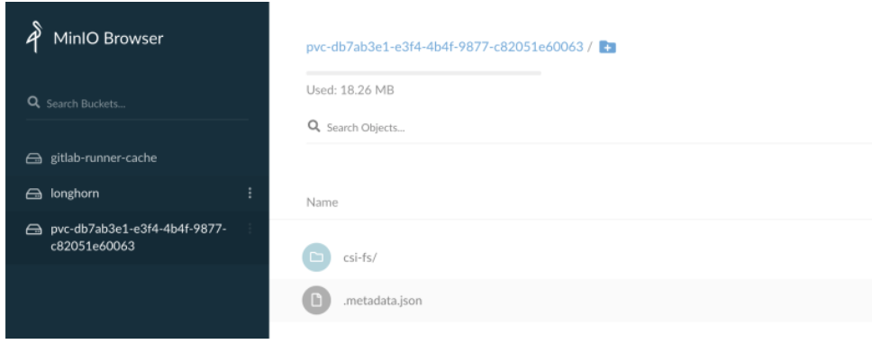
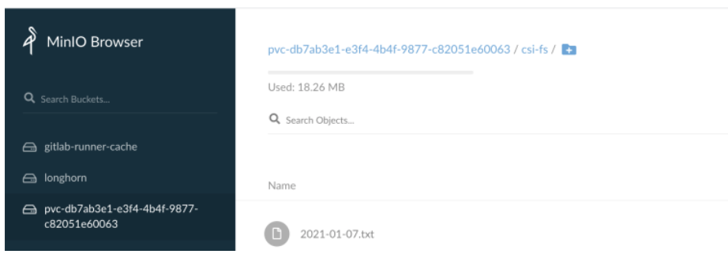

# **使用s3(minio)为kubernetes提供pv存储**

我们可以通过`csi`使用s3为kubernetes提供`pv`存储，当我们申请`pvc`时，会自动在s3上创建bucket。这里我们使用`minio`作为`s3`使用。


> **注: 不建议生产环境使用**

## 要求

kubernetes集群需要满足以下几个条件：

* Kubernetes 1.16+（CSI v1.0.0兼容性）
* Kubernetes必须允许特权容器
* Docker守护程序必须允许共享挂载（**systemd标志`MountFlags=shared`）**


## 安装

### **2-1 首先创建一个secrets用来提供minio的凭据**

```
apiVersion: v1
kind: Secret
metadata:
  name: csi-driver-s3-secret
  namespace: kube-system
stringData:
  accessKeyID: "xxxxx"
  secretAccessKey: "xxxxxx"
  #s3地址，如果是aws需要设置为https://s3.<region>.amazonaws.com
  endpoint: https://xxxx
  ＃如果不在S3上，请将其设置为“”
  region: ""
```

### **2-2 接下来安装csi驱动**

**`provisioner.yaml`**

```
apiVersion: v1
kind: ServiceAccount
metadata:
  name: csi-provisioner-sa
  namespace: kube-system
---
kind: ClusterRole
apiVersion: rbac.authorization.k8s.io/v1
metadata:
  name: external-provisioner-runner
rules:
  - apiGroups: [""]
    resources: ["secrets"]
    verbs: ["get", "list"]
  - apiGroups: [""]
    resources: ["persistentvolumes"]
    verbs: ["get", "list", "watch", "create", "delete"]
  - apiGroups: [""]
    resources: ["persistentvolumeclaims"]
    verbs: ["get", "list", "watch", "update"]
  - apiGroups: ["storage.k8s.io"]
    resources: ["storageclasses"]
    verbs: ["get", "list", "watch"]
  - apiGroups: [""]
    resources: ["events"]
    verbs: ["list", "watch", "create", "update", "patch"]
---
kind: ClusterRoleBinding
apiVersion: rbac.authorization.k8s.io/v1
metadata:
  name: csi-provisioner-role
subjects:
  - kind: ServiceAccount
    name: csi-provisioner-sa
    namespace: kube-system
roleRef:
  kind: ClusterRole
  name: external-provisioner-runner
  apiGroup: rbac.authorization.k8s.io
---
kind: Service
apiVersion: v1
metadata:
  name: csi-provisioner-s3
  namespace: kube-system
  labels:
    app: csi-provisioner-s3
spec:
  selector:
    app: csi-provisioner-s3
  ports:
    - name: dummy
      port: 12345
---
kind: StatefulSet
apiVersion: apps/v1
metadata:
  name: csi-provisioner-s3
  namespace: kube-system
spec:
  serviceName: "csi-provisioner-s3"
  replicas: 1
  selector:
    matchLabels:
      app: csi-provisioner-s3
  template:
    metadata:
      labels:
        app: csi-provisioner-s3
    spec:
      serviceAccount: csi-provisioner-sa
      containers:
        - name: csi-provisioner
          image: quay.io/k8scsi/csi-provisioner:v1.6.0
          args:
            - "--provisioner=s3.csi.metal-stack.io"
            - "--csi-address=$(ADDRESS)"
            - "--v=4"
          env:
            - name: ADDRESS
              value: /var/lib/kubelet/plugins/s3.csi.metal-stack.io/csi.sock
          imagePullPolicy: "IfNotPresent"
          volumeMounts:
            - name: socket-dir
              mountPath: /var/lib/kubelet/plugins/s3.csi.metal-stack.io
        - name: csi-driver-s3
          image: majst01/csi-driver-s3:v0.2.0
          args:
            - "--endpoint=$(CSI_ENDPOINT)"
            - "--nodeid=$(NODE_ID)"
            - "--v=4"
          env:
            - name: CSI_ENDPOINT
              value: unix:///var/lib/kubelet/plugins/s3.csi.metal-stack.io/csi.sock
            - name: NODE_ID
              valueFrom:
                fieldRef:
                  fieldPath: spec.nodeName
          imagePullPolicy: "IfNotPresent"
          volumeMounts:
            - name: socket-dir
              mountPath: /var/lib/kubelet/plugins/s3.csi.metal-stack.io
      volumes:
        - name: socket-dir
          emptyDir: {}
```


**`attacher.yaml`**

```
apiVersion: v1
kind: ServiceAccount
metadata:
  name: csi-attacher-sa
  namespace: kube-system
---
kind: ClusterRole
apiVersion: rbac.authorization.k8s.io/v1
metadata:
  name: external-attacher-runner
rules:
  - apiGroups: [""]
    resources: ["secrets"]
    verbs: ["get", "list"]
  - apiGroups: [""]
    resources: ["events"]
    verbs: ["get", "list", "watch", "update"]
  - apiGroups: [""]
    resources: ["persistentvolumes"]
    verbs: ["get", "list", "watch", "update"]
  - apiGroups: [""]
    resources: ["nodes"]
    verbs: ["get", "list", "watch"]
  - apiGroups: ["storage.k8s.io"]
    resources: ["volumeattachments"]
    verbs: ["get", "list", "watch", "update", "patch"]
---
kind: ClusterRoleBinding
apiVersion: rbac.authorization.k8s.io/v1
metadata:
  name: csi-attacher-role
subjects:
  - kind: ServiceAccount
    name: csi-attacher-sa
    namespace: kube-system
roleRef:
  kind: ClusterRole
  name: external-attacher-runner
  apiGroup: rbac.authorization.k8s.io
---
# needed for StatefulSet
kind: Service
apiVersion: v1
metadata:
  name: csi-attacher-s3
  namespace: kube-system
  labels:
    app: csi-attacher-s3
spec:
  selector:
    app: csi-attacher-s3
  ports:
    - name: dummy
      port: 12345
---
kind: StatefulSet
apiVersion: apps/v1
metadata:
  name: csi-attacher-s3
  namespace: kube-system
spec:
  serviceName: "csi-attacher-s3"
  replicas: 1
  selector:
    matchLabels:
      app: csi-attacher-s3
  template:
    metadata:
      labels:
        app: csi-attacher-s3
    spec:
      serviceAccount: csi-attacher-sa
      containers:
        - name: csi-attacher
          image: quay.io/k8scsi/csi-attacher:v2.2.0
          args:
            - "--v=4"
            - "--csi-address=$(ADDRESS)"
          env:
            - name: ADDRESS
              value: /var/lib/kubelet/plugins/s3.csi.metal-stack.io/csi.sock
          imagePullPolicy: "IfNotPresent"
          volumeMounts:
            - name: socket-dir
              mountPath: /var/lib/kubelet/plugins/s3.csi.metal-stack.io
      volumes:
        - name: socket-dir
          hostPath:
            path: /var/lib/kubelet/plugins/s3.csi.metal-stack.io
            type: DirectoryOrCreate
```

**`csi-s3.yaml`**

```
apiVersion: v1
kind: ServiceAccount
metadata:
  name: csi-driver-s3
  namespace: kube-system
---
kind: ClusterRole
apiVersion: rbac.authorization.k8s.io/v1
metadata:
  name: csi-driver-s3
rules:
  - apiGroups: [""]
    resources: ["secrets"]
    verbs: ["get", "list"]
  - apiGroups: [""]
    resources: ["nodes"]
    verbs: ["get", "list", "update"]
  - apiGroups: [""]
    resources: ["namespaces"]
    verbs: ["get", "list"]
  - apiGroups: [""]
    resources: ["persistentvolumes"]
    verbs: ["get", "list", "watch", "update"]
  - apiGroups: ["storage.k8s.io"]
    resources: ["volumeattachments"]
    verbs: ["get", "list", "watch", "update"]
---
kind: ClusterRoleBinding
apiVersion: rbac.authorization.k8s.io/v1
metadata:
  name: csi-driver-s3
subjects:
  - kind: ServiceAccount
    name: csi-driver-s3
    namespace: kube-system
roleRef:
  kind: ClusterRole
  name: csi-driver-s3
  apiGroup: rbac.authorization.k8s.io
---
kind: DaemonSet
apiVersion: apps/v1
metadata:
  name: csi-driver-s3
  namespace: kube-system
spec:
  selector:
    matchLabels:
      app: csi-driver-s3
  template:
    metadata:
      labels:
        app: csi-driver-s3
    spec:
      serviceAccount: csi-driver-s3
      hostNetwork: true
      containers:
        - name: driver-registrar
          image: quay.io/k8scsi/csi-node-driver-registrar:v1.3.0
          args:
            - "--kubelet-registration-path=$(DRIVER_REG_SOCK_PATH)"
            - "--v=4"
            - "--csi-address=$(ADDRESS)"
          env:
            - name: ADDRESS
              value: /csi/csi.sock
            - name: DRIVER_REG_SOCK_PATH
              value: /var/lib/kubelet/plugins/s3.csi.metal-stack.io/csi.sock
            - name: KUBE_NODE_NAME
              valueFrom:
                fieldRef:
                  fieldPath: spec.nodeName
          volumeMounts:
            - name: plugin-dir
              mountPath: /csi
            - name: registration-dir
              mountPath: /registration/
        - name: csi-driver-s3
          securityContext:
            privileged: true
            capabilities:
              add: ["SYS_ADMIN"]
            allowPrivilegeEscalation: true
          image: majst01/csi-driver-s3:v0.2.0
          args:
            - "--endpoint=$(CSI_ENDPOINT)"
            - "--nodeid=$(NODE_ID)"
            - "--v=4"
          env:
            - name: CSI_ENDPOINT
              value: unix:///csi/csi.sock
            - name: NODE_ID
              valueFrom:
                fieldRef:
                  fieldPath: spec.nodeName
          imagePullPolicy: "IfNotPresent"
          volumeMounts:
            - name: plugin-dir
              mountPath: /csi
            - name: pods-mount-dir
              mountPath: /var/lib/kubelet/pods
              mountPropagation: "Bidirectional"
            - name: fuse-device
              mountPath: /dev/fuse
      volumes:
        - name: registration-dir
          hostPath:
            path: /var/lib/kubelet/plugins_registry/
            type: DirectoryOrCreate
        - name: plugin-dir
          hostPath:
            path: /var/lib/kubelet/plugins/s3.csi.metal-stack.io
            type: DirectoryOrCreate
        - name: pods-mount-dir
          hostPath:
            path: /var/lib/kubelet/pods
            type: Directory
        - name: fuse-device
          hostPath:
            path: /dev/fuse
```

**`psp.yaml`**

```
apiVersion: policy/v1beta1
kind: PodSecurityPolicy
metadata:
  name: psp-s3
spec:
  allowPrivilegeEscalation: true
  fsGroup:
    rule: RunAsAny
  privileged: true
  runAsUser:
    rule: RunAsAny
  seLinux:
    rule: RunAsAny
  supplementalGroups:
    rule: RunAsAny
  hostNetwork: true
  allowedHostPaths: []
  allowedCapabilities:
    - "SYS_ADMIN"
  volumes:
  - '*'
---
apiVersion: rbac.authorization.k8s.io/v1
kind: Role
metadata:
  name: psp-s3-role
  namespace: kube-system
rules:
- apiGroups:
  - policy
  resources:
  - podsecuritypolicies
  resourceNames:
  - psp-s3
  verbs:
  - use
---
apiVersion: rbac.authorization.k8s.io/v1
kind: RoleBinding
metadata:
  name: psp-rolebinding-s3
  namespace: kube-system
roleRef:
  apiGroup: rbac.authorization.k8s.io
  kind: Role
  name: psp-s3-role
subjects:
- apiGroup: ""
  kind: ServiceAccount
  name: csi-attacher-sa
- apiGroup: ""
  kind: ServiceAccount
  name: csi-driver-s3
- apiGroup: ""
  kind: ServiceAccount
  name: csi-provisioner-sa
- apiGroup: ""
  kind: ServiceAccount
  name: csi-resizer-sa
```

### **2-3 接下来创建storageclass**

**`provisioner.yaml`**

```
---
kind: StorageClass
apiVersion: storage.k8s.io/v1
metadata:
  name: csi-driver-s3
provisioner: s3.csi.metal-stack.io
parameters:
  # specify which mounter to use
  # currently only s3fs is supported
  mounter: s3fs
  csi.storage.k8s.io/provisioner-secret-name: csi-driver-s3-secret
  csi.storage.k8s.io/provisioner-secret-namespace: kube-system
  csi.storage.k8s.io/controller-publish-secret-name: csi-driver-s3-secret
  csi.storage.k8s.io/controller-publish-secret-namespace: kube-system
  csi.storage.k8s.io/node-stage-secret-name: csi-driver-s3-secret
  csi.storage.k8s.io/node-stage-secret-namespace: kube-system
  csi.storage.k8s.io/node-publish-secret-name: csi-driver-s3-secret
  csi.storage.k8s.io/node-publish-secret-namespace: kube-system
```

### **2-4 mounter有以下几种配置参数：**

S3不是真正的文件系统，因此这里有一些限制要考虑。根据所使用的安装程序，您将具有不同级别的POSIX兼容性。另外，取决于您使用的是哪个S3存储后端，并不总是可以保证一致性。

可以将驱动程序配置为使用以下安装程序之一来安装存储桶：


* rclone
* s3fs
* goofys
* s3backer


可以将安装程序设置为存储类中的参数。如果愿意，还可以为每个安装程序创建多个存储类。

根据您的使用情况，所有安装程序都有不同的优点和缺点。以下是一些可以帮助您选择贴片机的特征：

**rclone：**

* 几乎完全兼容POSIX（取决于缓存模式）
* 可以使用任何S3客户端正常查看文件

**s3fs：**


* POSIX的较大子集
* 可以使用任何S3客户端正常查看文件
* 不支持追加或随机写入

**goofys：**

* POSIX兼容性弱
* 表现第一
* 可以使用任何S3客户端正常查看文件
* 不支持追加或随机写入

**s3backer（实验性）：**

* 表示存储在S3上的块设备
* 允许使用真实的文件系统
* 其他S3客户端无法读取文件
* 支持附件
* 支持上传前压缩（此驱动程序尚未实现）
* 支持上传前加密（此驱动程序尚未实现）

**s3backer目前处于试验阶段，因为在Kubernetes节点或`CSI Pod`意外关闭的情况下，卷损坏可能很快发生。`s3backer`二进制文件未与普通docker映像捆绑在一起，以使其尽可能小。使用`<version>-fullimage`标签测试s3backer**


## **3、使用**

我们创建一个pvc并创建一个pod绑定这个pvc

```
apiVersion: v1
kind: PersistentVolumeClaim
metadata:
  name: csi-s3-pvc
  namespace: default
spec:
  accessModes:
  - ReadWriteOnce
  resources:
    requests:
      storage: 1Gi
  storageClassName: csi-s3
---
apiVersion: v1
kind: Pod
metadata:
  name: csi-s3-test-nginx
  namespace: default
spec:
  containers:
   - name: csi-s3-test-nginx
     image: nginx
     volumeMounts:
       - mountPath: /var/lib/www/html
         name: webroot
  volumes:
   - name: webroot
     persistentVolumeClaim:
       claimName: csi-s3-pvc
       readOnly: false
```

我们创建后查看pvc已经是bound状态了

```
[root@master-01 sample]# kubectl get pvc 
NAME                STATUS   VOLUME                                     CAPACITY   ACCESS MODES   STORAGECLASS    AGE
csi-driver-s3-pvc   Bound    pvc-db7ab3e1-e3f4-4b4f-9877-c82051e60063   5Gi        RWO            csi-driver-s3   6s
```

并且我们在minio上也可以看到这个bucket




我们进入pod内的/var/lib/www/html目录下创建一个文件

```
[root@master-01 sample]# kubectl exec -it csi-driver-s3-test-nginx  -- bash 
root@csi-driver-s3-test-nginx:/# cd /var/lib/www/html/
root@csi-driver-s3-test-nginx:/var/lib/www/html# touch `date +"%Y-%m-%d"`.txt
root@csi-driver-s3-test-nginx:/var/lib/www/html# ls
2021-01-07.txt
```

