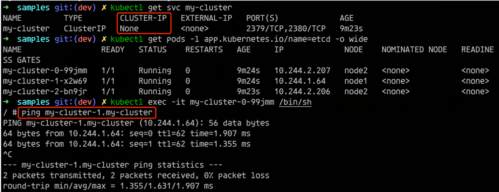
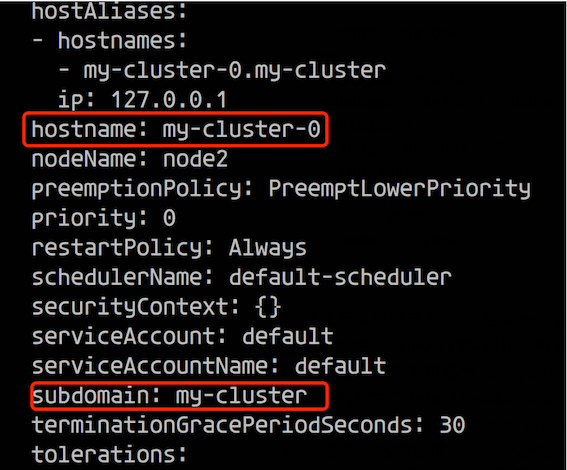

# 给 Pod 添加 DNS 记录

**<span style="color:red">我们都知道 StatefulSet 中的 Pod 是拥有单独的 DNS 记录的，比如一个 StatefulSet 名称为 etcd，而它关联的 Headless SVC 名称为 etcd-headless，**</span>

**那么 CoreDNS 就会为它的每个 Pod 解析如下的 A 记录**：

* `etcd-0.etcd-headless.default.svc.cluster.local`
* `etcd-1.etcd-headless.default.svc.cluster.local`
* ...

**<span style="color:red">那么除了 `StatefulSet` 管理的 `Pod` 之外，其他的 Pod 是否也可以生成 DNS 记录呢？</span>**

如下所示，我们这里只有一个 `Headless` 的 `SVC`，并没有 `StatefulSet` 管理的 `Pod`，而是 `ReplicaSet` 管理的 `Pod`，我们可以看到貌似也生成了类似于 `StatefulSet` 中的解析记录。





这是怎么做到的呢？

按照我们常规的理解会认为这是一个 `StatefulSet` 管理的 Pod，但其实这里是不同的 `ReplicaSet` 而已。

**这里的实现其实是因为 Pod 自己本身也是可以有自己的 DNS 记录的，所以我们是可以去实现一个类似于 StatefulSet 的 Pod 那样的解析记录的。**

首先我们来部署一个 Deployment 管理的普通应用，其定义如下：

```
# nginx.yaml
apiVersion: apps/v1 
kind: Deployment
metadata:
  name: nginx
spec:
  selector:
    matchLabels:
      app: nginx
  replicas: 2
  template:
    metadata:
      labels:
        app: nginx
    spec:
      containers:
      - name: nginx
        image: nginx:1.7.9
        ports:
        - containerPort: 80
```

部署后创建了两个 Pod：

```
$ kubectl apply -f nginx.yaml
deployment.apps/nginx created

$ kubectl get pod -l app=nginx -o wide
NAME                     READY   STATUS    RESTARTS   AGE   IP          NODE             NOMINATED NODE   READINESS GATES
nginx-5d59d67564-2xkq4   1/1     Running   0          48s   10.1.0.42   docker-desktop   <none>           <none>
nginx-5d59d67564-n42rl   1/1     Running   0          48s   10.1.0.41   docker-desktop   <none>           <none>
```

然后定义如下的 Headless Service:

```
# service.yaml
apiVersion: v1
kind: Service
metadata:
  name: nginx
spec:
  clusterIP: None
  ports:
  - name: http
    port: 80
    protocol: TCP
  selector:
    app: nginx
  type: ClusterIP
```

创建该 service，并尝试解析 service DNS：

```
$ kubectl apply -f service.yaml 
service/nginx created
```

创建该 service，并尝试解析 service DNS：

```
kubectl get svc
kubernetes       ClusterIP   10.96.0.1       <none>        443/TCP              14d
nginx            ClusterIP   None            <none>        80/TCP               24s
```

启动一个`network-multitool` 工具pod

```
kubectl run network-multitool --image=praqma/network-multitool --replicas=1
```

在`network-multitool`尝试解析 service DNS：

```
kubectl exec -it network-multitool sh
```

```
/ # dig @10.96.0.10 nginx.default.svc.cluster.local

; <<>> DiG 9.16.6 <<>> @10.96.0.10 nginx.default.svc.cluster.local
; (1 server found)
;; global options: +cmd
;; Got answer:
;; WARNING: .local is reserved for Multicast DNS
;; You are currently testing what happens when an mDNS query is leaked to DNS
;; ->>HEADER<<- opcode: QUERY, status: NOERROR, id: 43599
;; flags: qr aa rd; QUERY: 1, ANSWER: 2, AUTHORITY: 0, ADDITIONAL: 1
;; WARNING: recursion requested but not available

;; OPT PSEUDOSECTION:
; EDNS: version: 0, flags:; udp: 4096
; COOKIE: ef402f8750088991 (echoed)
;; QUESTION SECTION:
;nginx.default.svc.cluster.local. IN    A

;; ANSWER SECTION:
nginx.default.svc.cluster.local. 30 IN  A       10.244.0.14
nginx.default.svc.cluster.local. 30 IN  A       10.244.0.15

;; Query time: 8 msec
;; SERVER: 10.96.0.10#53(10.96.0.10)
;; WHEN: Fri Jan 15 13:00:40 UTC 2021
;; MSG SIZE  rcvd: 166
```

然后我们对 `nginx` 的 `FQDN` 域名进行 `dig` 操作，可以看到返回了多条 `A `记录，每一条对应一个 `Pod`。

上面 `dig` 命令中使用的 `10.96.0.10` 就是 `kube-dns` 的 `cluster IP`，可以在 `kube-system namespace` 中查看：

```
$ kubectl -n kube-system get svc
NAME                   TYPE        CLUSTER-IP     EXTERNAL-IP   PORT(S)         AGE
kube-dns               ClusterIP   10.96.0.10     <none>        53/UDP,53/TCP   52m
```

接下来我们试试在 service 名字前面加上 Pod 名字交给 kube-dns 做解析：

```
dig @10.96.0.10 nginx-5d59d67564-lr5bg.nginx.default.svc.cluster.local

; <<>> DiG 9.16.6 <<>> @10.96.0.10 nginx-5d59d67564-lr5bg.nginx.default.svc.cluster.local
; (1 server found)
;; global options: +cmd
;; Got answer:
;; WARNING: .local is reserved for Multicast DNS
;; You are currently testing what happens when an mDNS query is leaked to DNS
;; ->>HEADER<<- opcode: QUERY, status: NXDOMAIN, id: 23166
;; flags: qr aa rd; QUERY: 1, ANSWER: 0, AUTHORITY: 1, ADDITIONAL: 1
;; WARNING: recursion requested but not available

;; OPT PSEUDOSECTION:
; EDNS: version: 0, flags:; udp: 4096
; COOKIE: 69ef540af0d97e8b (echoed)
;; QUESTION SECTION:
;nginx-5d59d67564-lr5bg.nginx.default.svc.cluster.local.        IN A

;; AUTHORITY SECTION:
cluster.local.          30      IN      SOA     ns.dns.cluster.local. hostmaster.cluster.local. 1610714574 7200 1800 86400 30

;; Query time: 3 msec
;; SERVER: 10.96.0.10#53(10.96.0.10)
;; WHEN: Fri Jan 15 13:10:13 UTC 2021
;; MSG SIZE  rcvd: 188
```


可以看到并没有得到解析结果。官方文档中有一段 Pod’s hostname and subdomain fields 说明：


> Pod 规约中包含一个可选的 hostname 字段，可以用来指定 Pod 的主机名。 当这个字段被设置时，它将优先于 Pod 的名字成为该 Pod 的主机名。 举个例子，给定一个 hostname 设置为 “my-host” 的 Pod， 该 Pod 的主机名将被设置为 “my-host”。Pod 规约还有一个可选的 subdomain 字段，可以用来指定 Pod 的子域名。 举个例子，某 Pod 的 hostname 设置为 “foo”，subdomain 设置为 “bar”， 在名字空间 “my-namespace” 中对应的完全限定域名（FQDN）为 “foo.bar.my-namespace.svc.cluster-domain.example”。

更新部署再尝试解析 Pod DNS：

现在我们编辑一下 `nginx.yaml` 加上 `subdomain` 测试下看看：

```
apiVersion: apps/v1 
kind: Deployment
metadata:
  name: nginx
spec:
  selector:
    matchLabels:
      app: nginx
  replicas: 2
  template:
    metadata:
      labels:
        app: nginx
    spec:
      subdomain: nginx
      containers:
      - name: nginx
        image: nginx:1.7.9
        ports:
        - containerPort: 80
```

**` subdomain: nginx`**

更新部署再尝试解析 Pod DNS：


```
$ kubectl get pod -l app=nginx -o wide
NAME                     READY   STATUS    RESTARTS   AGE   IP            NODE                 NOMINATED NODE   READINESS GATES
nginx-78f58d8bcb-pd979   1/1     Running   0          89s   10.244.0.19   kind-control-plane   <none>           <none>
nginx-78f58d8bcb-pgp84   1/1     Running   0          87s   10.244.0.20   kind-control-plane   <none>           <none>
```

```
/ # dig @10.96.0.10 nginx-78f58d8bcb-pd979.nginx.default.svc.cluster.local

; <<>> DiG 9.16.6 <<>> @10.96.0.10 nginx-78f58d8bcb-pd979.nginx.default.svc.cluster.local
; (1 server found)
;; global options: +cmd
;; Got answer:
;; WARNING: .local is reserved for Multicast DNS
;; You are currently testing what happens when an mDNS query is leaked to DNS
;; ->>HEADER<<- opcode: QUERY, status: NXDOMAIN, id: 10979
;; flags: qr aa rd; QUERY: 1, ANSWER: 0, AUTHORITY: 1, ADDITIONAL: 1
;; WARNING: recursion requested but not available

;; OPT PSEUDOSECTION:
; EDNS: version: 0, flags:; udp: 4096
; COOKIE: 2001c868cd919986 (echoed)
;; QUESTION SECTION:
;nginx-78f58d8bcb-pd979.nginx.default.svc.cluster.local.        IN A

;; AUTHORITY SECTION:
cluster.local.          30      IN      SOA     ns.dns.cluster.local. hostmaster.cluster.local. 1610718291 7200 1800 86400 30

;; Query time: 1 msec
;; SERVER: 10.96.0.10#53(10.96.0.10)
;; WHEN: Fri Jan 15 13:51:12 UTC 2021
;; MSG SIZE  rcvd: 188
```

可以看到依然不能解析，那就试试官方文档中的例子 ，不用 `Deployment` 直接创建 `Pod` 吧。

**第一步先将 `hostname` 和` subdomain` 注释掉：**

**`individual-pods-example.yaml`**

```
apiVersion: v1
kind: Service
metadata:
  name: default-subdomain
spec:
  selector:
    name: busybox
  clusterIP: None
  ports:
  - name: foo # Actually, no port is needed.
    port: 1234
    targetPort: 1234
---
apiVersion: v1
kind: Pod
metadata:
  name: busybox1
  labels:
    name: busybox
spec:
  hostname: busybox-1
  subdomain: default-subdomain
  containers:
  - image: busybox:1.28
    command:
      - sleep
      - "3600"
    name: busybox
---
apiVersion: v1
kind: Pod
metadata:
  name: busybox2
  labels:
    name: busybox
spec:
  hostname: busybox-2
  subdomain: default-subdomain
  containers:
  - image: busybox:1.28
    command:
      - sleep
      - "3600"
    name: busybox
```

* **`hostname: busybox-1`**
* **`subdomain: default-subdomain`**

```
$ kubectl apply -f individual-pods-example.yaml 
service/default-subdomain created
pod/busybox1 created
pod/busybox2 created
```

部署然后尝试解析 Pod DNS (注意这里 hostname 和 pod 的名字有区别，中间多了减号)：

```
$ kubectl get pod -l name=busybox
NAME       READY   STATUS    RESTARTS   AGE
busybox1   1/1     Running   0          2m54s
busybox2   1/1     Running   0          2m54s
```

```
$ kubectl exec -it centos-multitool sh
kubectl exec [POD] [COMMAND] is DEPRECATED and will be removed in a future version. Use kubectl exec [POD] -- [COMMAND] instead.
/ # dig @10.96.0.10 busybox-1.default-subdomain.default.svc.cluster.local

; <<>> DiG 9.16.6 <<>> @10.96.0.10 busybox-1.default-subdomain.default.svc.cluster.local
; (1 server found)
;; global options: +cmd
;; Got answer:
;; WARNING: .local is reserved for Multicast DNS
;; You are currently testing what happens when an mDNS query is leaked to DNS
;; ->>HEADER<<- opcode: QUERY, status: NOERROR, id: 16020
;; flags: qr aa rd; QUERY: 1, ANSWER: 1, AUTHORITY: 0, ADDITIONAL: 1
;; WARNING: recursion requested but not available

;; OPT PSEUDOSECTION:
; EDNS: version: 0, flags:; udp: 4096
; COOKIE: 994f37ad9c91e1ab (echoed)
;; QUESTION SECTION:
;busybox-1.default-subdomain.default.svc.cluster.local. IN A

;; ANSWER SECTION:
busybox-1.default-subdomain.default.svc.cluster.local. 30 IN A 10.244.0.21

;; Query time: 1 msec
;; SERVER: 10.96.0.10#53(10.96.0.10)
;; WHEN: Fri Jan 15 14:15:54 UTC 2021
;; MSG SIZE  rcvd: 16
```

**<span style="color:red">现在我们看到有 `ANSWER` 记录回来了，`hostname` 和 `subdomain` 二者都必须显式指定，缺一不可。</span>**

一开始我们的截图中的实现方式其实也是这种方式。



```
$ kubectl get svc
NAME                TYPE        CLUSTER-IP   EXTERNAL-IP   PORT(S)    AGE
default-subdomain   ClusterIP   None         <none>        1234/TCP   6m54s
```

现在我们修改一下之前的 nginx deployment 加上 hostname，重新解析：

```
apiVersion: apps/v1
kind: Deployment
metadata:
  name: nginx
spec:
  selector:
    matchLabels:
      app: nginx
  replicas: 2
  template:
    metadata:
      labels:
        app: nginx
    spec:
      subdomain: nginx
      hostname: nginx
      containers:
      - name: nginx
        image: nginx:1.7.9
        ports:
        - containerPort: 80                   
```

```
$ kubectl apply -f nginx-sub.yaml
deployment.apps/nginx configured
```

```
/ # dig @10.96.0.10 nginx.nginx.default.svc.cluster.local

; <<>> DiG 9.16.6 <<>> @10.96.0.10 nginx.nginx.default.svc.cluster.local
; (1 server found)
;; global options: +cmd
;; Got answer:
;; WARNING: .local is reserved for Multicast DNS
;; You are currently testing what happens when an mDNS query is leaked to DNS
;; ->>HEADER<<- opcode: QUERY, status: NOERROR, id: 32000
;; flags: qr aa rd; QUERY: 1, ANSWER: 2, AUTHORITY: 0, ADDITIONAL: 1
;; WARNING: recursion requested but not available

;; OPT PSEUDOSECTION:
; EDNS: version: 0, flags:; udp: 4096
; COOKIE: d43b01b58e6c5447 (echoed)
;; QUESTION SECTION:
;nginx.nginx.default.svc.cluster.local. IN A

;; ANSWER SECTION:
nginx.nginx.default.svc.cluster.local. 30 IN A  10.244.0.24
nginx.nginx.default.svc.cluster.local. 30 IN A  10.244.0.23

;; Query time: 0 msec
;; SERVER: 10.96.0.10#53(10.96.0.10)
;; WHEN: Fri Jan 15 14:22:20 UTC 2021
;; MSG SIZE  rcvd: 184
```

可以看到解析成功了，但是因为 Deployment 中无法给每个 Pod 指定不同的 hostname，所以两个 Pod 有同样的 hostname，解析出来两个 IP，跟我们的本意就不符合了。

不过知道了这种方式过后我们就可以自己去写一个 Operator 去直接管理 Pod 了，给每个 Pod 设置不同的 hostname 和一个 Headless SVC 名称的 subdomain，这样就相当于实现了 StatefulSet 中的 Pod 解析。


