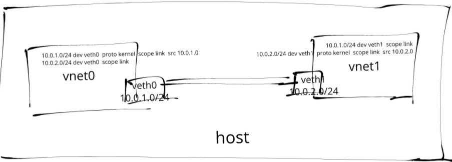

# 理解 Linux 网络命名空间 network namespace

如果你使用过 Docker 和 Kubernetes，那么可能应该听说过 network namespace（网络命名空间）

## 网络命名空间

**我们知道容器运行时使用 `namespace`（命名空间）内核功能对系统资源进行分区，以实现某种形式的进程隔离**，这样，对一个命名空间中资源的更改不会影响其他命名空间中的资源，**包括进程 ID、主机名、用户 ID、文件名和网络接口等**。

**网络名称空间可以虚拟化网络堆栈**

**每个网络名称空间都有自己的资源，例如网络接口、IP 地址、路由表、隧道、防火墙等**

例如，`iptables`添加到网络名称空间的规则只会影响进入和离开该名称空间的流量。


## ip 命令

`ip` 命令是用来显示或操纵 Linux 主机的路由、网络设备、策略路由和隧道，是 Linux 下较新的功能强大的网络配置工具。

```
$ ip
Usage: ip [ OPTIONS ] OBJECT { COMMAND | help }
       ip [ -force ] -batch filename
where  OBJECT := { link | address | addrlabel | route | rule | neigh | ntable |
                   tunnel | tuntap | maddress | mroute | mrule | monitor | xfrm |
                   netns | l2tp | fou | macsec | tcp_metrics | token | netconf | ila |
                   vrf }
       OPTIONS := { -V[ersion] | -s[tatistics] | -d[etails] | -r[esolve] |
                    -h[uman-readable] | -iec |
                    -f[amily] { inet | inet6 | ipx | dnet | mpls | bridge | link } |
                    -4 | -6 | -I | -D | -B | -0 |
                    -l[oops] { maximum-addr-flush-attempts } | -br[ief] |
                    -o[neline] | -t[imestamp] | -ts[hort] | -b[atch] [filename] |
                    -rc[vbuf] [size] | -n[etns] name | -a[ll] | -c[olor]}
```

例如：

* **要添加一个新的网络接口**，使用 `ip link add <interface-name> type <interface-type> <interface-arguments>... ` 命令
* **要分配一个新的 IP 地址范围到一个接口**，使用 `ip addr add <ip-address-range> dev <device-name>` 命令
* **要从路由表中删除一条路由**，使用 `ip route del <route-ip-range> dev <device-name>` 命令

**选项 `-n` 可以用来切换目标命名空间，**

例如，**要将 `10.0.1.0/24` IP 地址范围分配给 `ns1` 网络命名空间内的接口 `veth0`，使用`ip -n ns1 addr add 10.0.1.0/24 dev veth0` 命令即可 。**

> 💡 `-n` 选项是 `ip netns exec` 的缩写





## **2、配置第一个网络命名空间**

**首先我们使用 `ip link add` 命令创建一对新的 veth 接口：`veth0` 和 `veth1`**：

```
$ sudo -i
# 创建一对名为 veth0 和 veth1 的 veth 接口。
$ ip link add veth0 type veth peer name veth1

# 确认 veth0 已创建
$ ip link show veth0
106: veth0@veth1: <BROADCAST,MULTICAST> mtu 1500 qdisc noop state DOWN mode DEFAULT group default qlen 1000
    link/ether 0e:eb:c9:20:84:15 brd ff:ff:ff:ff:ff:ff
    
# 确认 veth1 已创建
$ ip link show veth1
105: veth1@veth0: <BROADCAST,MULTICAST> mtu 1500 qdisc noop state DOWN mode DEFAULT group default qlen 1000
    link/ether 92:84:d7:b6:44:eb brd ff:ff:ff:ff:ff:ff
    
$ ip addr
105: veth1@veth0: <BROADCAST,MULTICAST,M-DOWN> mtu 1500 qdisc noop state DOWN group default qlen 1000
    link/ether 92:84:d7:b6:44:eb brd ff:ff:ff:ff:ff:ff
106: veth0@veth1: <BROADCAST,MULTICAST,M-DOWN> mtu 1500 qdisc noop state DOWN group default qlen 1000
    link/ether 0e:eb:c9:20:84:15 brd ff:ff:ff:ff:ff:ff
```

veth 接口通常被创建为一个对，其中一端传输的数据会立即被另一端接收，这种类型的接口在容器运行时通常用于在不同网络命名空间之间传输数据包。

让我们创建第一个网络命名空间 `ns1`，然后我们可以将 `veth0` 接口分配给这个网络命名空间，并将 `10.0.1.0/24` 的 `IP` 地址范围分配给它。

```
# 创建 ns1 网络命名空间
$ ip netns add ns1

# 分配 veth0 接口到 ns1 网络命名空间
$ ip link set veth0 netns ns1

# 将 10.0.1.0/24 IP 地址范围分配给 veth0 接口
$ ip -n ns1 addr add 10.0.1.0/24 dev veth0

# 将 veth0 接口 up 起来
$ ip -n ns1 link set veth0 up

# 将 lo 接口 up 起来，因为发往 10.0.1.0/24 的数据（本地的）
# （像 ping）要通过 local（本地）路由表
# 比如要 ping 自己
$ ip -n ns1 link set lo up 

# 确认接口已经 up 起来
$ ip -n ns1 addr show
1: lo: <LOOPBACK,UP,LOWER_UP> mtu 65536 qdisc noqueue state UNKNOWN group default qlen 1000
    link/loopback 00:00:00:00:00:00 brd 00:00:00:00:00:00
    inet 127.0.0.1/8 scope host lo
       valid_lft forever preferred_lft forever
    inet6 ::1/128 scope host
       valid_lft forever preferred_lft forever
289: veth0@if288: <NO-CARRIER,BROADCAST,MULTICAST,UP> mtu 1500 qdisc noqueue state LOWERLAYERDOWN group default qlen 1000
    link/ether 5e:87:df:87:af:c7 brd ff:ff:ff:ff:ff:ff link-netnsid 0
    inet 10.0.1.0/24 scope global veth0
       valid_lft forever preferred_lft forever
```

现在如果我们从主机和 ns1 两个网络命名空间中去 `ping veth0` 接口会发生什么呢？

```
# veth0 不在主机的根网络命名空间中
$ ip link show veth0            
Device "veth0" does not exist.

# 从主机网络命名空间中 ping 不通
$ ping -c10 10.0.1.0
PING 10.0.1.0 (10.0.1.0) 56(84) bytes of data.
^C
--- 10.0.1.0 ping statistics ---
3 packets transmitted, 0 received, 100% packet loss, time 1999ms
```

**我们可以看到直接在主机的根网络命名空间中是找不到 `veth0` 这个接口的，当然也是 `ping` 不同 `10.0.1.0` 这个地址的，因为他们被绑定到 `ns1 `这个网络命名空间中，所以我们在操作的时候需要切换到这个命名空间下面**。

```
# ip netns exec ns1 ping -c10 10.0.1.0
PING 10.0.1.0 (10.0.1.0) 56(84) bytes of data.
64 bytes from 10.0.1.0: icmp_seq=1 ttl=64 time=0.032 ms
64 bytes from 10.0.1.0: icmp_seq=2 ttl=64 time=0.037 ms
64 bytes from 10.0.1.0: icmp_seq=3 ttl=64 time=0.042 ms
64 bytes from 10.0.1.0: icmp_seq=4 ttl=64 time=0.024 ms
64 bytes from 10.0.1.0: icmp_seq=5 ttl=64 time=0.056 ms
64 bytes from 10.0.1.0: icmp_seq=6 ttl=64 time=0.033 ms
64 bytes from 10.0.1.0: icmp_seq=7 ttl=64 time=0.034 ms
^C
--- 10.0.1.0 ping statistics ---
7 packets transmitted, 7 received, 0% packet loss, time 5999ms
rtt min/avg/max/mdev = 0.024/0.036/0.056/0.012 ms
```

这里我们使用了一条 `ip netns exec` 的命令，这个命令允许我们在指定的网络命名空间中去执行任意的命令，可以看到现在我们在 ns1 网络命名空中间去 `ping 10.0.1.0` 就可以通了。


## 配置第二个网络命名空间

下面我们用上面的方式来创建第二个网络命名空间 `ns2`，然后将 `veth1` 接口分配给这个网络命名空间，并将 `10.0.2.0/24` 的 IP 地址范围分配给这个接口。

```
# 创建名为 ns2 的网络命名空间
$ ip netns add ns2

# 分配 veth1 接口到 ns2 网络命名空间
$ ip link set veth1 netns ns2

# 将 10.0.2.0/24 IP 地址范围分配给 veth1 接口
$ ip -n ns2 addr add 10.0.2.0/24 dev veth1

# 将 veth1 接口 up 起来
$ ip -n ns2 link set veth1 up

# 将 lo 接口 up 起来（这样可以 ping 通自己）
$ ip -n ns2 link set lo up 

$ ip -n ns2 addr show
1: lo: <LOOPBACK,UP,LOWER_UP> mtu 65536 qdisc noqueue state UNKNOWN group default qlen 1000
    link/loopback 00:00:00:00:00:00 brd 00:00:00:00:00:00
    inet 127.0.0.1/8 scope host lo
       valid_lft forever preferred_lft forever
    inet6 ::1/128 scope host
       valid_lft forever preferred_lft forever
288: veth1@if289: <BROADCAST,MULTICAST,UP,LOWER_UP> mtu 1500 qdisc noqueue state UP group default qlen 1000
    link/ether be:0d:a4:8c:9f:2a brd ff:ff:ff:ff:ff:ff link-netnsid 0
    inet 10.0.2.0/24 scope global veth1
       valid_lft forever preferred_lft forever
    inet6 fe80::bc0d:a4ff:fe8c:9f2a/64 scope link
       valid_lft forever preferred_lft forever
```
为方便后面设置路由，这里我们为 veth1 接口分配一个不同的子网 IP 范围。

和 veth0 接口类似**，veth1 接口也不能从主机网络命名空间到达，只能在 ns2 本身的网络命名空间内工作。**

```
$ ip link show veth1
Device "veth1" does not exist.
$ ping -c10 10.0.2.0
PING 10.0.2.0 (10.0.2.0) 56(84) bytes of data.
From 180.149.159.13 icmp_seq=2 Packet filtered
^C
--- 10.0.2.0 ping statistics ---
2 packets transmitted, 0 received, +1 errors, 100% packet loss, time 999
$ ip netns exec ns2 ping -c10 10.0.2.0
PING 10.0.2.0 (10.0.2.0) 56(84) bytes of data.
64 bytes from 10.0.2.0: icmp_seq=1 ttl=64 time=0.100 ms
64 bytes from 10.0.2.0: icmp_seq=2 ttl=64 time=0.096 ms
64 bytes from 10.0.2.0: icmp_seq=3 ttl=64 time=0.068 ms
^C
--- 10.0.2.0 ping statistics ---
3 packets transmitted, 3 received, 0% packet loss, time 1999ms
rtt min/avg/max/mdev = 0.068/0.088/0.100/0.014 ms
```

## 配置子网路由

虽然在上面的两个网络空间内可以各自访问自己，但是他们互相之间是不能 ping 通的。

```
$ ip netns exec ns1 ping -c10 10.0.2.0
connect: Network is unreachable
$ ip netns exec ns2 ping -c10 10.0.1.0
connect: Network is unreachable
```

`veth0` 和 `veth1` 这两个接口本身也都 up 起来了，而且在各种的网络命名空间中 ping 也能正常工作，所以互相直接不通那很可能和路由有关。

下面我们使用 ip 命令来调试下，我们可以通过 `ip route get 命令来确定一个数据包所走的路由。

```
$ ip -n ns1 route get 10.0.2.0
RTNETLINK answers: Network is unreachable

$ ip -n ns2 route get 10.0.1.0
RTNETLINK answers: Network is unreachable
```

我们可以看到都是网络不可达，我们来检查下两个网络命名空间中的路由表信息。

```
$ ip -n ns1 route
10.0.1.0/24 dev veth0 proto kernel scope link src 10.0.1.0

$ ip -n ns2 route
10.0.2.0/24 dev veth1 proto kernel scope link src 10.0.2.0
```

看到路由表是不是很清晰了，两个网络命名空间的路由表都只有各自 IP 范围的路由条目，并没有通往其他子网的路由，所以当然不能互通了，要解决也很简单，

**<span style="color:red">可以使用 `ip route add` 命令在路由表中插入新的路由条目是不是就可以了。</span>**

```
# 更新 veth0 路由表，添加一条通往 10.0.2.0/24 的路由
$ ip -n ns1 route add 10.0.2.0/24 dev veth0

# 确认发往 10.0.2.0/24 的数据包被路由到 veth0
$ ip -n ns1 route get 10.0.2.0
10.0.2.0 dev veth0 src 10.0.1.0
    cache

# 同样更新 veth1 路由表，添加一条通往 10.0.1.0/24 的路由
$ ip -n ns2 route add 10.0.1.0/24 dev veth1

# 确认发往 10.0.1.0/24 的数据包被路由到 veth1
$ ip -n ns2 route get 10.0.1.0
10.0.1.0 dev veth1 src 10.0.2.0
    cache
```

上面我们在各自的网络命名空间中添加了对方的路由信息，现在我们来尝试 ping 下对方的 veth 接口。


```
# ip netns exec ns1 ping -c10 10.0.2.0
PING 10.0.2.0 (10.0.2.0) 56(84) bytes of data.
64 bytes from 10.0.2.0: icmp_seq=1 ttl=64 time=0.100 ms
64 bytes from 10.0.2.0: icmp_seq=2 ttl=64 time=0.035 ms
^C
--- 10.0.2.0 ping statistics ---
2 packets transmitted, 2 received, 0% packet loss, time 1000ms
rtt min/avg/max/mdev = 0.035/0.067/0.100/0.033 ms

# ip netns exec ns2 ping -c10 10.0.1.0
PING 10.0.1.0 (10.0.1.0) 56(84) bytes of data.
64 bytes from 10.0.1.0: icmp_seq=1 ttl=64 time=0.078 ms
64 bytes from 10.0.1.0: icmp_seq=2 ttl=64 time=0.039 ms
64 bytes from 10.0.1.0: icmp_seq=3 ttl=64 time=0.039 ms
^C
--- 10.0.1.0 ping statistics ---
3 packets transmitted, 3 received, 0% packet loss, time 1999ms
rtt min/avg/max/mdev = 0.039/0.052/0.078/0.018 ms
```

可以看到已经通啦！！🎉🎉🎉


此外我们还可以使用 `tcpdump` 来捕获两个网络命名空间之间传输的数据包。

```
ip netns exec ns1 tcpdump -i veth0 icmp -l
tcpdump: verbose output suppressed, use -v or -vv for full protocol decode
listening on veth0, link-type EN10MB (Ethernet), capture size 262144 bytes
11:29:22.080392 IP 10.0.2.0 > 10.0.1.0: ICMP echo request, id 7253, seq 1, length 64
11:29:22.080464 IP 10.0.1.0 > 10.0.2.0: ICMP echo reply, id 7253, seq 1, length 64
11:29:23.080409 IP 10.0.2.0 > 10.0.1.0: ICMP echo request, id 7253, seq 2, length 64
11:29:23.080472 IP 10.0.1.0 > 10.0.2.0: ICMP echo reply, id 7253, seq 2, length 64
11:29:24.080357 IP 10.0.2.0 > 10.0.1.0: ICMP echo request, id 7253, seq 3, length 64
11:29:24.080418 IP 10.0.1.0 > 10.0.2.0: ICMP echo reply, id 7253, seq 3, length 64
11:29:25.080346 IP 10.0.2.0 > 10.0.1.0: ICMP echo request, id 7253, seq 4, length 64
11:29:25.080401 IP 10.0.1.0 > 10.0.2.0: ICMP echo reply, id 7253, seq 4, length 64
11:29:26.080417 IP 10.0.2.0 > 10.0.1.0: ICMP echo request, id 7253, seq 5, length 64
11:29:26.080496 IP 10.0.1.0 > 10.0.2.0: ICMP echo reply, id 7253, seq 5, length 64
11:29:27.080454 IP 10.0.2.0 > 10.0.1.0: ICMP echo request, id 7253, seq 6, length 64
11:29:27.080507 IP 10.0.1.0 > 10.0.2.0: ICMP echo reply, id 7253, seq 6, length 64
11:29:28.080398 IP 10.0.2.0 > 10.0.1.0: ICMP echo request, id 7253, seq 7, length 64
11:29:28.080456 IP 10.0.1.0 > 10.0.2.0: ICMP echo reply, id 7253, seq 7, length 64
11:29:29.080390 IP 10.0.2.0 > 10.0.1.0: ICMP echo request, id 7253, seq 8, length 64
11:29:29.080431 IP 10.0.1.0 > 10.0.2.0: ICMP echo reply, id 7253, seq 8, length 64
11:29:30.080524 IP 10.0.2.0 > 10.0.1.0: ICMP echo request, id 7253, seq 9, length 64
11:29:30.080576 IP 10.0.1.0 > 10.0.2.0: ICMP echo reply, id 7253, seq 9, length 64
11:29:31.081895 IP 10.0.2.0 > 10.0.1.0: ICMP echo request, id 7253, seq 10, length 64
11:29:31.081942 IP 10.0.1.0 > 10.0.2.0: ICMP echo reply, id 7253, seq 10, length 64
^C
20 packets captured
20 packets received by filter
0 packets dropped by kernel
```

## TCP 连接

最好我们来测试下 TCP 连接，**使用 nc 命令在 ns1 命名空间的 7096 端口启动一个 TCP 服务器**，然后从 ns2 网络命名空间发起一个 TCP 握手连接。

```
$ yum install -y nc

$ ip netns exec ns1 nc -l 10.0.1.0 7096 -v
Ncat: Version 7.50 ( https://nmap.org/ncat )
Ncat: Listening on 10.0.1.0:7096
```

```
# ip netns exec ns1 nc -l 10.0.1.0 7096 -v
Ncat: Version 7.50 ( https://nmap.org/ncat )
Ncat: Listening on 10.0.1.0:7096
```


然后重新开一个终端进行连接：

```
# 使用 nc 从 ns2 发起 TCP 握手
$ ip netns exec ns2 nc -4t 10.0.1.0 7096 -v
Ncat: Version 7.50 ( https://nmap.org/ncat )
Ncat: Connected to 10.0.1.0:7096.

# 这个时候正常会在前面的服务中看到连接状态
$ ip netns exec ns1 nc -l 10.0.1.0 7096 -v
Ncat: Version 7.50 ( https://nmap.org/ncat )
Ncat: Listening on 10.0.1.0:7096
Ncat: Connection from 10.0.2.0.
Ncat: Connection from 10.0.2.0:45668.
```

一旦 TCP 连接建立，我们就可以从 ns2 向 ns1 发送测试消息了。

```
$ ip netns exec ns2 nc -4t 10.0.1.0 7096 -v
Ncat: Version 7.50 ( https://nmap.org/ncat )
Ncat: Connected to 10.0.1.0:7096.
this is a test message  # 在这里输入一段信息
```

此时我们在 ns1 这边的服务器端也会收到发送的消息。


```
# ip netns exec ns1 nc -l 10.0.1.0 7096 -v
Ncat: Version 7.50 ( https://nmap.org/ncat )
Ncat: Listening on 10.0.1.0:7096
Ncat: Connection from 10.0.2.0.
Ncat: Connection from 10.0.2.0:45668.
this is a test
```

同样我们也可以使用 tcpdump 来抓取所有在两个网络命名空间之间传输的数据包。

```
# ip netns exec ns1 tcpdump -X -i veth0 -n tcp -l
tcpdump: verbose output suppressed, use -v or -vv for full protocol decode
listening on veth0, link-type EN10MB (Ethernet), capture size 262144 bytes
21:06:26.418024 IP 10.0.1.0.7096 > 10.0.2.0.45668: Flags [P.], seq 3587345992:3587346009, ack 3510881752, win 227, options [nop,nop,TS val 2468014612 ecr 2467805956], length 17
        0x0000:  4500 0045 058b 4000 4006 1e29 0a00 0100  E..E..@.@..)....
        0x0010:  0a00 0200 1bb8 b264 d5d2 8e48 d143 cdd8  .......d...H.C..
        0x0020:  8018 00e3 1737 0000 0101 080a 931a ea14  .....7..........
        0x0030:  9317 bb04 6120 7365 636f 6e64 206d 6573  ....a.second.mes
        0x0040:  7361 6765 0a                             sage.
21:06:26.418041 IP 10.0.2.0.45668 > 10.0.1.0.7096: Flags [.], ack 17, win 229, options [nop,nop,TS val 2468014612 ecr 2468014612], length 0
        0x0000:  4500 0034 4608 4000 4006 ddbc 0a00 0200  E..4F.@.@.......
        0x0010:  0a00 0100 b264 1bb8 d143 cdd8 d5d2 8e59  .....d...C.....Y
        0x0020:  8010 00e5 1726 0000 0101 080a 931a ea14  .....&..........
        0x0030:  931a ea14                                ....
```

当然也可以将这个抓包结果保存下来然后用其他工具比如大白鲨来进行详细的分析。

## 总结


本文我们使用 ip 子命令可以用来创建和配置网络命名空间、接口和路由等，我们创建了一对 veth 接口，这些接口被分配到两个不同的网络命名空间中，具有不同的子网 IP 地址范围，在网络命名空间的路由表中配置了额外的路由，这可以实现两个子网之间的通信。

两个 veth 接口都无法从主机网络命名空间直接到达，因为它们的 IP 地址范围和路由表的变化也被隔离在自己的网络命名空间中了。

我们可以使用 `ip netns exec` 命令运行工具和 tcpdump 来调试网络命名空间之间的连接问题。


