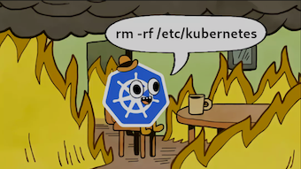
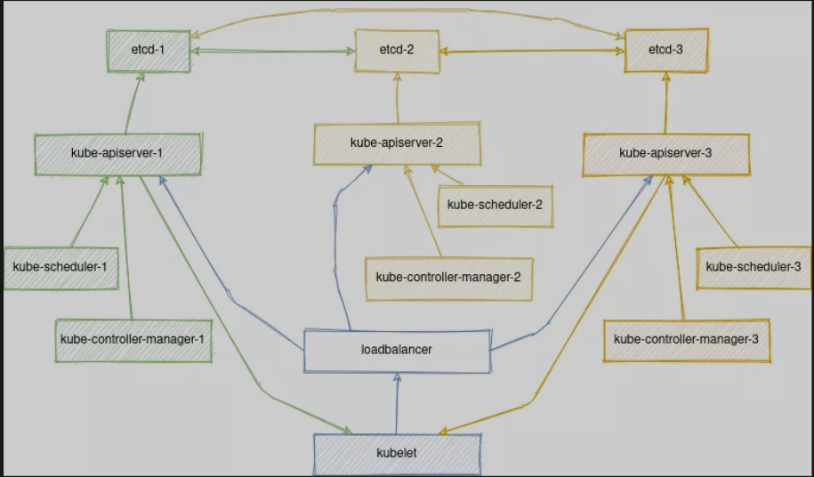

# 恢复全部清空的 Kubernetes 证书文件




我们知道 Kubernetes 的控制平面是由几个组件组成的：

* etcd：作为整个集群的数据库使用
* kube-apiserver：集群的 API 服务
* **kube-controller-manager：整个集群资源的控制操作**
* kube-scheduler：核心调度器
* kubelet：是运行在节点上用来真正管理容器的组件

这些组件都由一套针对客户端和服务端的 TLS 证书保护，用于组件之间的认证和授权，大部分情况下它们并不是直接存储在 Kubernetes 的数据库中的，而是以普通文件的形式存在。

```

# tree /etc/kubernetes/pki/
/etc/kubernetes/pki/
├── apiserver.crt
├── apiserver-etcd-client.crt
├── apiserver-etcd-client.key
├── apiserver.key
├── apiserver-kubelet-client.crt
├── apiserver-kubelet-client.key
├── ca.crt
├── ca.key
├── CTNCA.pem
├── etcd
│   ├── ca.crt
│   ├── ca.key
│   ├── healthcheck-client.crt
│   ├── healthcheck-client.key
│   ├── peer.crt
│   ├── peer.key
│   ├── server.crt
│   └── server.key
├── front-proxy-ca.crt
├── front-proxy-ca.key
├── front-proxy-client.crt
├── front-proxy-client.key
├── sa.key
```

控制面板的组件以静态 Pod (我这里用 `kubeadm` 搭建的集群)的形式运行在 master 节点上，默认资源清单位于 `/etc/kubernetes/manifests` 目录下。通常来说这些组件之间会进行互相通信，基本流程如下所示：



组件之间为了通信，他们需要使用到 `TLS` 证书。假设我们已经有了一个部署好的集群，接下来让我们开始我们的破坏行为。

```
rm -rf /etc/kubernetes/
```

在 master 节点上，这个目录包含：

* etcd 的一组证书和 CA（在 `/etc/kubernetes/pki/etcd `目录下）
* 一组 kubernetes 的证书和 CA（在 `/etc/kubernetes/pki` 目录下）
* 还有 `kube-controller-manager`、`kube-scheduler`、`cluster-admin` 以及 `kubelet` 这些使用的 kubeconfig 文件
* `etcd`、`kube-apiserver`、`kube-scheduler` 和 `kube-controller-manager` 的静态 Pod 资源清单文件（位于 `/etc/kubernetes/manifests` 目录）

## 修复控制平面

首先我也确保下我们的所有控制平面 Pod 已经停止了。

```
# 如果你用 docker 也是可以的
crictl rm `crictl ps -aq`
```

> 注意：kubeadm 默认不会覆盖现有的证书和 kubeconfigs，为了重新颁发证书，你必须先手动删除旧的证书。

接下来我们首先恢复 etcd，执行下面的命令生成 etcd 集群的证书：

```
kubeadm init phase certs etcd-ca
```

上面的命令将为我们的 etcd 集群生成一个新的 CA，由于所有其他证书都必须由它来签署，我们也将把它和私钥复制到其他 master 节点(如果你是多 master)。

```
/etc/kubernetes/pki/etcd/ca.{key,crt}
```

接下来让我们在所有 master 节点上为它重新生成其余的 etcd 证书和静态资源清单。

```
kubeadm init phase certs etcd-healthcheck-client
kubeadm init phase certs etcd-peer
kubeadm init phase certs etcd-server
kubeadm init phase etcd local
```

上面的命令执行后，你应该已经有了一个正常工作的 etcd 集群了。

```
# crictl ps
CONTAINER ID        IMAGE               CREATED             STATE               NAME                ATTEMPT             POD ID
ac82b4ed5d83a       0369cf4303ffd       2 seconds ago       Running             etcd                0                   bc8b4d568751b
```

接下来我们对 Kubernetes 服务做同样的操作，在其中一个 master 节点上执行如下的命令：

```
kubeadm init phase certs all
kubeadm init phase kubeconfig all
kubeadm init phase control-plane all
cp -f /etc/kubernetes/admin.conf ~/.kube/config
```

上面的命令将生成 Kubernetes 的所有 SSL 证书，以及 Kubernetes 服务的静态 Pods 清单和 kubeconfigs 文件。

如果你使用 kubeadm 加入 `kubelet`，你还需要更新 `kube-public` 命名空间中的 `cluster-info` 配置，因为它仍然包含你的旧 CA 的哈希值。

```
kubeadm init phase bootstrap-token
```

由于其他 master 节点上的所有证书也必须由单一 CA 签署，所以我们将其复制到其他控制面节点，并在每个节点上重复上述命令。

```
/etc/kubernetes/pki/{ca,front-proxy-ca}.{key,crt}
/etc/kubernetes/pki/sa.{key,pub}
```

顺便说一下，作为手动复制证书的替代方法，你也可以使用 Kubernetes API，如下所示的命令：

```
kubeadm init phase upload-certs --upload-certs
```
该命令将加密并上传证书到 Kubernetes，时间为2小时，所以你可以按以下方式注册 master 节点：

```
kubeadm join phase control-plane-prepare all kubernetes-apiserver:6443 --control-plane --token cs0etm.ua7fbmwuf1jz946l --discovery-token-ca-cert-hash sha256:555f6ececd4721fed0269d27a5c7f1c6d7ef4614157a18e56ed9a1fd031a3ab8 --certificate-key 385655ee0ab98d2441ba8038b4e8d03184df1806733eac131511891d1096be73
kubeadm join phase control-plane-join all
```

需要注意的是，Kubernetes API 还有一个配置，它为 `front-proxy` 客户端持有 CA 证书，它用于验证从`apiserver` 到 `webhooks` 和聚合层服务的请求。不过 kube-apiserver 会自动更新它。到在这个阶段，我们已经有了一个完整的控制平面了。

## 修复工作节点


现在我们可以使用下面的命令列出集群的所有节点：

```
kubectl get nodes
```

当然正常现在所有节点的状态都是 NotReady，这是因为他们仍然还使用的是旧的证书，为了解决这个问题，我们将使用 kubeadm 来执行重新加入集群节点。

```
systemctl stop kubelet
rm -rf /var/lib/kubelet/pki/ /etc/kubernetes/kubelet.conf
kubeadm init phase kubeconfig kubelet
kubeadm init phase kubelet-start
```

但要加入工作节点，我们必须生成一个新的 token。

```
kubeadm token create --print-join-command
```
然后在工作节点分别执行下面的命令：

```
systemctl stop kubelet
rm -rf /var/lib/kubelet/pki/ /etc/kubernetes/pki/ /etc/kubernetes/kubelet.conf 
kubeadm join phase kubelet-start kubernetes-apiserver:6443  --token cs0etm.ua7fbmwuf1jz946l --discovery-token-ca-cert-hash sha256:555f6ececd4721fed0269d27a5c7f1c6d7ef4614157a18e56ed9a1fd031a3ab8
```
> 注意：你不需要删除 master 节点上的 `/etc/kubernetes/pki` 目录，因为它已经包含了所有需要的证书。

上面的操作会把你所有的 kubelet 重新加入到集群中，它并不会影响任何已经运行在上面的容器，但是，如果集群中有多个节点并且不同时进行，则可能会遇到一种情况，即 `kube-controller-mananger` 开始从 `NotReady` 节点重新创建容器，并尝试在活动节点上重新调度它们。

为了防止这种情况，我们可以暂时停掉 master 节点上的 `controller-manager`。

```
rm /etc/kubernetes/manifests/kube-controller-manager.yaml
crictl rmp `crictl ps --name kube-controller-manager -q`
```
一旦集群中的所有节点都被加入，你就可以为 controller-manager 生成一个静态资源清单，在所有 master 节点上运行下面的命令。

```
kubeadm init phase control-plane controller-manager
```

如果 kubelet 被配置为请求由你的 CA 签署的证书(选项serverTLSBootstrap: true)，你还需要批准来自 kubelet 的 CSR：

```
kubectl get csr
kubectl certificate approve <csr>
```

## 修复 ServiceAccounts

因为我们丢失了 `/etc/kubernetes/pki/sa.key` ，这个 key 用于为集群中所有 `ServiceAccounts` 签署 `jwt tokens`，因此，我们必须为每个 `sa` 重新创建`tokens`。

这可以通过类型为  `kubernetes.io/service-account-token` 的 `Secret` 中删除 `token` 字段来完成。

```
kubectl get secret --all-namespaces | awk '/kubernetes.io\/service-account-token/ { print "kubectl patch secret -n " $1 " " $2 " -p {\\\"data\\\":{\\\"token\\\":null}}"}' | sh -x
```

删除之后，`kube-controller-manager` 会自动生成用新密钥签名的新令牌。不过需要注意的是并非所有的微服务都能即时更新 tokens，因此很可能需要手动重新启动使用 tokens 的容器。


```
kubectl get pod --field-selector 'spec.serviceAccountName!=default' --no-headers --all-namespaces | awk '{print "kubectl delete pod -n " $1 " " $2 " --wait=false --grace-period=0"}'
```

例如，这个命令会生成一个命令列表，会将所有使用非默认的 serviceAccount 的 Pod 删除，我建议从 kube-system 命名空间执行，因为 `kube-proxy` 和 `CNI` 插件都安装在这个命名空间中，它们对于处理你的微服务之间的通信至关重要。

