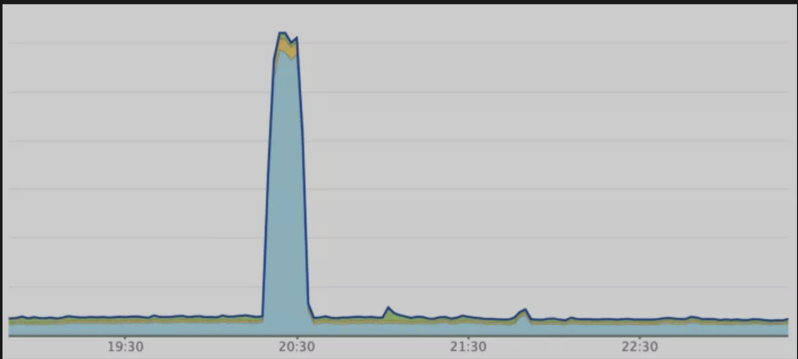
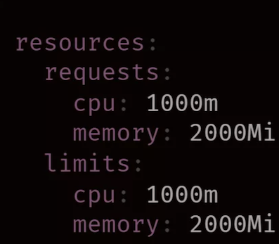
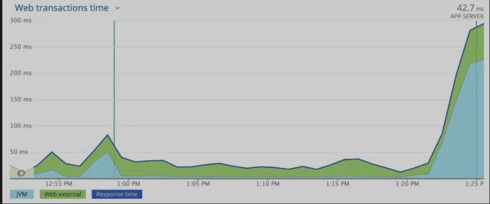
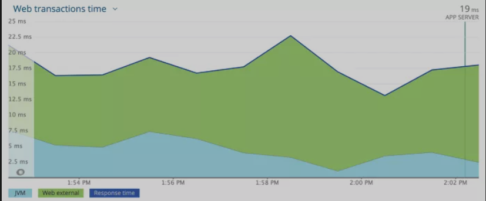
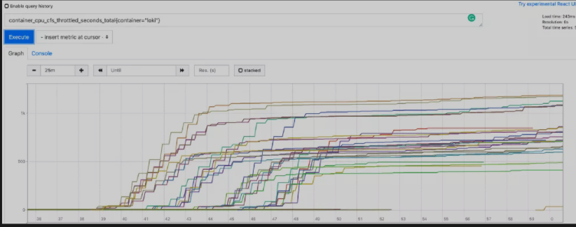
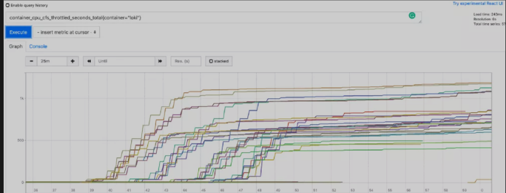
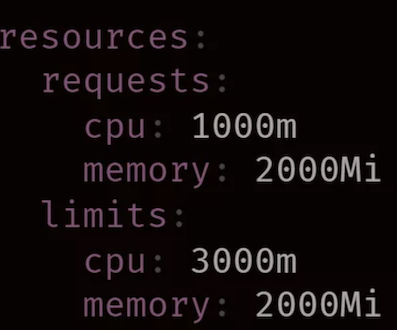
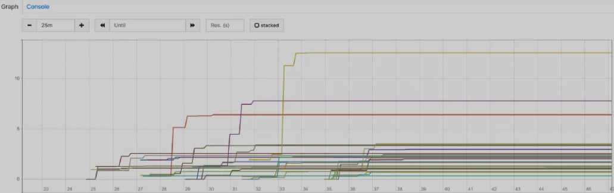

# **改善 Kubernetes 上的 JVM 预热问题**

**基于 JVM 的应用程序在达到最高性能之前，需要一些时间来“预热”。**

当应用程序启动时，通常会从较低的性能开始。这归因于像即时（JIT）编译这些事儿，它会通过收集使用配置文件信息来优化常用代码。

最终这样的负面影响是，与平均水平相比，预热期间接收的 request 将具有非常高的响应时间。

**在容器化、高吞吐量、频繁部署和自动伸缩的环境中，这个问题可能会加剧。**

将讨论在运行在 Kubernetes 集群中的 Java 服务如何解决 JVM 预热问题的经验。

## 起因

我们通过负载测试进行了通常的容量规划过程，并确定 N 个 Pod 足以处理超过预期的峰值流量。

尽管该服务在轻松处理高峰流量，但我们在部署过程中发现了问题。**我们的每个 Pod 在高峰时间处理的 RPM 都超过 10k，而我们使用的是 Kubernetes 滚动更新机制**。在部署过程中，服务的响应时间会激增几分钟，然后再稳定到通常的稳定状态。在我们的仪表板中，会看到类似的图表：

与此同时，我们开始收到来自部署时间段内的大量投诉，几乎都关于高响应时间和超时错误。

## 第一步： 花钱解决问题

我们很快意识到这个问题与 JVM 预热阶段有关，但当时有其他的重要事情，因此我们没有太多时间进行调查，**直接尝试了最简单的解决方案——增加 Pod 数量，以减少每个 Pod 的吞吐量**。

我们将 Pod 数量增加了近三倍，以便每个 Pod 在峰值处理约 4k RPM 的吞吐量。我们还调整了部署策略，**以确保一次最多滚动更新 25%（使用 maxSurge 和 maxUnavailable 参数）**。

这样就解决了问题，尽管我们的运行容量是稳定状态所需容量的 3 倍，但我们能够在我们的服务中或任何相关服务中没有问题地进行部署。

## 第二步： 预热脚本

我们的想法是运行一个预热脚本，向服务发送几分钟的综合请求，来完成 JVM 预热，然后再允许实际流量通过。

为了创建预热脚本，我们从生产流量中抓取了实际的 URL。然后，我们创建了一个 Python 脚本，使用这些 URL 发送并行请求。**我们相应地配置了 readiness 探针的 initialDelaySeconds，以确保预热脚本在 Pod 为 ready 并开始接受流量之前完成。**

我们仍然经常观察到高响应时间和错误。此外，预热脚本还带来了新的问题。之前，Pod 可以在 40-50 秒内准备就绪，但用了脚本，它们大约需要 3 分钟，这在部署期间成为了一个问题，更别说在自动伸缩期间。我们在预热机制上做了一些调整，**比如允许预热脚本和实际流量有一个短暂的重叠期，但也没有看到显著的改进。最后，我们认为预热脚本的收益太小了，决定放弃。**

## 第三步： 发现

由于预热脚本想法失败了，我们决定尝试一些启发式技术-

* GC（G1、CMS 和 并行）和各种 GC 参数
* 堆内存
* CPU 分配

**测试的服务配置了 Kubernetes 资源 limits：**

**我们将 CPU request 和 limit 增加到 2000m，并部署服务以查看影响，可以看到响应时间和错误有了巨大的改进，比预热脚本好得多**。

为了进一步测试，我们将配置升级到 3000m CPU，问题完全消失了。正如下面看到的，响应时间没有峰值。

**发现问题出在 CPU 节流上。在预热阶段，JVM 需要比平均稳定状态下更多的 CPU 时间，但 Kubernetes 资源处理机制（CGroup）根据配置的 limits，从而限制了 CPU。**

有一个简单的方法可以验证这一点。

Kubernetes 公开了一个每个 Pod 的指标，`container_cpu_cfs_throttled_seconds_total` 表示这个 Pod 从开始到现在限制了多少秒 CPU。

如果我们用 1000m 配置观察这个指标，应该会在开始时看到很多节流，然后在几分钟后稳定下来。我们使用该配置进行了部署，这是 Prometheus 中所有 Pod 的 `container_cpu_cfs_throttled_seconds_total` 图：

正如预期，在容器启动的前 5 到 7 分钟有很多节流，大部分在 500 秒到 1000 秒之间，然后稳定下来，这证实了我们的假设。

**当我们使用 3000m CPU 配置进行部署时，观察到下图：**

CPU 节流几乎可以忽略不计（几乎所有 Pod 都不到 4 秒）。

## 第四步： 改进

因为有这个问题的大多数服务都已经有类似的资源配置，并且在 Pod 数量上超额配置，以避免部署失败，但是没有一个团队有将 CPU 的 request、limits 增加三倍并相应减少 Pod 数量的想法。

这**种解决方案实际上可能比运行更多的 Pod 更糟糕，因为 Kubernetes 会根据 request 调度 Pod，找到具有 3 个空闲 CPU 容量的节点比找到具有 1 个空闲 CPU 的节点要困难得多。**它可能导致集群自动伸缩器频繁触发，从而向集群添加更多节点。

### 现在问题是这样的：

在最初的预热阶段（持续几分钟），JVM 需要比配置的 limits（1000m）更多的 CPU（大约 3000m）。

预热后，即使 CPU limits 为 1000m，JVM 也可以充分发挥其潜力。

**Kubernetes 会使用 request 而不是 limits 来调度 Pod。**

我们清楚地了解问题后，答案就出现了——Kubernetes Burstable QoS。

Kubernetes 根据配置的资源 request 和 limits 将 QoS 类分配给 Pod。

到目前为止，我们一直在通过指定具有相等值的 request 和 limits（最初是 1000m，然后是 3000m）来使用 Guaranteed QoS。尽管 Guaranteed QoS 有它的好处，但我们不需要在整个 Pod 生命周期中独占 3 个 CPU，我们只需要在最初的几分钟内使用它。Burstable QoS 允许我们指定小于 limits 的 request，例如：

由于 Kubernetes 使用 request 中指定的值来调度 Pod，它会找到具有 1000m CPU 容量的节点来调度这个 Pod。

**但是由于 3000m 的 limits 要高得多，如果应用程序在任何时候都需要超过 1000m 的 CPU，并且该节点上有空闲的 CPU 容量，那么就不会在 CPU 上限制应用程序。如果可用，它最多可以使用 3000m。**

**在预热阶段，当 JVM 需要更多的 CPU 时，它可以获取需要的 CPU。JVM 被优化后，可以在 request 范围内全速运行。这允许我们使用集群中的冗余的资源（足够可用时）来解决预热问题，而不需要任何额外的成本。**

进行假设测试。我们更改了资源配置并部署了应用程序，成功了！我们做了更多的测试以验证结果一致。此外，我们监控了 `container_cpu_cfs_throttled_seconds_total `指标，以下是其中一个 Deployment 的图表：

正如我们所看到的，这张图与 3000m CPU 的 Guaranteed QoS 设置非常相似。节流几乎可以忽略不计，它证实了具有 Burstable QoS 的解决方案是有效的。

