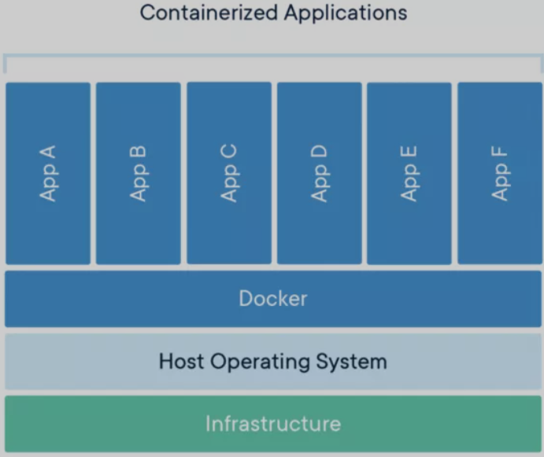

# **Docker 和 Kubernetes：root 与特权**

很多熟悉 Unix 系统的人（例如 macOS、Linux）都习惯于通过使用 sudo 随意提升我们的特权给 root 用户。

在调试开发工具或尝试编辑受保护目录中的文件时，经常会发生这种情况，许多人在第一次尝试之后，执行命令不成功，都会默认使用 sudo。




Docker 提供了一个类似 `--privileged flag`，实际上这与我们随意使用的 sudo 有很大不同，它可能会使应用程序面临不必要的风险。本文将展示这与 root 运行方式有何不同（以及如何避免以 root 用户身份运行），并介绍特权（privileged）的实际含义。

## 作为root运行

Docker 允许其在主机操作系统上隔离进程、功能和文件系统，并且实际上，大多数容器默认以 root 身份运行。为了示例，本文将使用 DockerHub 上的三个最受欢迎镜像。

**Postgres**

```
$ docker run -it postgres 
＃whoami 
root 
＃id -u 
0
```

**Couchbase：**

```
$ docker run -it couchbase sh 
＃whoami 
root 
＃id -u 
0
```

**Alpine：**

```
$ docker run -it alpine sh 
＃whoami 
root 
＃id -u 
0
```

我们可以看到，默认情况下，大多数镜像都以 root 用户身份运行。通常这可以简化调试过程，尤其是在我们要 exec 到容器时。尽管 root 用户的 Linux 功能非常有限，**但最好还是避免以 root 用户身份运行**。

## 避免作为root运行

尽管在容器内部以 root 身份运行是非常正常的事，但是如果我们想要强化容器，仍然需要避免这种情况。首**先，违反了最小特权原则，其次，更严格地说，容器将成为运行 Docker 命令的同一用户命名空间的一部分**，并且如果容器能够转义，它将可以访问 volume、socket 等资源。

有两种避免以 root 用户身份运行的方法。

通过调整 Dockerfile 以使用特定用户：

```
// Dockerfile 

FROM microsoft/windowsservercore
# Create Windows user in the container
RUN net user /add patrick
# Set it for subsequent commands
USER patrick
```

在运行时重写 User ID：

```
$ docker run -it --user 4000 postgres sh
# whoami
whoami: cannot find name for user ID 4000
# id -u
4000
```

## 关于特权

`--privileged flag` 将我们之前看到的用户 ID 直接映射到主机的用户 ID，并使其不受限制地访问其选择的任何系统调用。即使 root 在容器内部，在正常操作中，Docker 也会限制容器的 Linux 功能，例如限制 `CAP_AUDIT_WRITE`，它允许覆盖内核的审计日志，这是容器化工作负载不太需要的功能。

实际上，特权应该只在我们真正需要的特定设置中使用，它可以使容器访问主机（作为 root）几乎可以执行所有操作。从本质上讲，这是一个通行证，可以逃避容器包含的文件系统、进程、套接字和其他包含的项目。它有特定的用例，例如 `Docker-in-Docke`r，其他 CI/CD 工具要求（从 Docker 容器内部需要 Docker 守护程序）以及需要极端网络的地方。


下面看一个使用 Ubuntu 镜像的示例（在 VM 内测试，这样就不会破坏任何东西）：

没有特权：

```
# whoami
root # Notice here, we are still root!
# id -u
0
# hostname
382f1c400bd
# sysctl kernel.hostname=Attacker
sysctl: setting key "kernel.hostname": Read-only file system  # Yet we can't do this
```

有特权：

```
$ docker run -it --privileged ubuntu sh
# whoami
root. # Root again
# id -u
0
# hostname
86c62e9bba5e
# sysctl kernel.hostname=Attacker
kernel.hostname = Attacker # Except now we are privileged
# hostname
Attacker 
```

Kubernetes 通过安全上下文提供相同的功能：

```
apiVersion: v1
kind: Pod
metadata:
  name: nginx
spec:
  containers:
  - name: nginx
    image: nginx
    securityContext:
      privileged: true
```

**此外，Kubernetes 有一个称为 PodSecurityPolicy 的强制机制，它是一个准入控制器（Kubernetes 在允许容器进入集群之前会对其进行检查），这里强烈建议不允许使用特权 Pod**：

```
apiVersion: policy/v1beta1
kind: PodSecurityPolicy
metadata:
  name: example
spec:
  privileged: false  # Don't allow privileged pods!
```

## 总结

**到此为止，我们了解了一些有关 root 和 `--privileged flag` 的信息，以及它们与“主机”操作系统的关系。无论我们是否想限制容器的安全性或调试问题，都需要确保应用程序安全。**

防御安全性需要深度防御（像洋葱一层一层的保护）并减少攻击面，通过不以 root 身份运行，不以特权身份运行以及添加 SecurityContext 和 PodSecurityPolicies 是实现更高容器安全性的四个主要方面。


