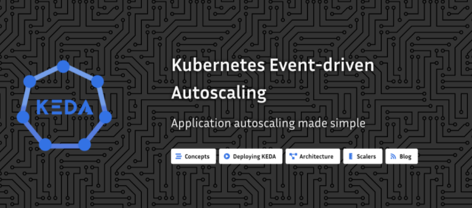
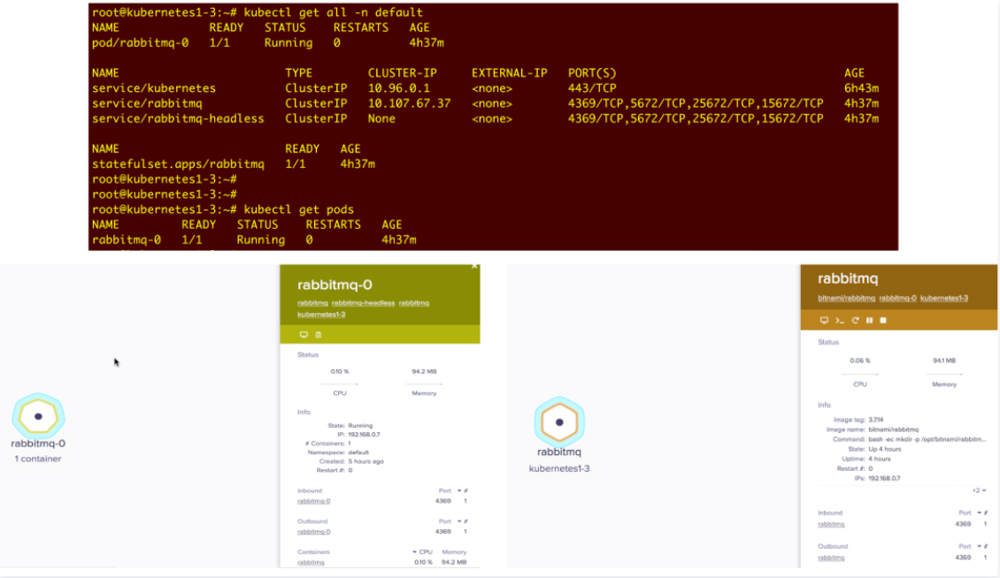
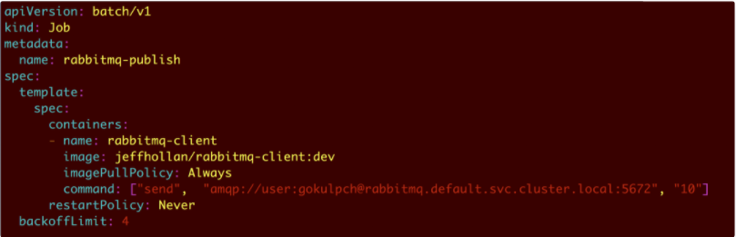

# **KEDA-Kubernetes 中基于事件驱动的自动伸缩**

事件驱动计算并不是什么新的想法，在数据库领域中就已经使用数据库触发器有很多年了。

这个概念很简单：**就是每当你添加、更改或删除数据时，就会触发一个事件来执行各种操作**。

这些类型的事件和触发器在其他领域的应用中也大量出现，例如自动扩展、自动修复、容量规划等等。事件驱动架构的核心是对系统上的各种事件做出反应并执行相应的动作。

**自动缩放**已成为几乎所有云平台中不可或缺的组成部分，微服务或者容器也不例外。事实上，以灵活和解耦设计著称的容器最适合自动伸缩，因为它们比虚拟机更容易创建。

**容量扩展—自动扩展**

可扩展性是基于容器的应用部署需要考虑的最重要方面之一。随着容器编排平台的发展，设计可伸缩性的解决方案变得非常简单了。

基于 Kubernetes 的事件驱动自动伸缩 KEDA（https://keda.sh/），允许用户在 Kubernetes 上构建自己的以事件驱动的应用程序。KEDA 处理触发器以响应其他服务中发生的事件，并根据需要扩展工作负载。

**KEDA 使容器可以直接从源头消费事件，而不是通过 HTTP 进行路由**。

KEDA 可以在任何公有云或私有云以及企业内部工作，包括 Azure Kubernetes 服务和 Red Hat 的OpenShift。

有了它，开发人员现在还可以将微软的无服务器平台 Azure Functions 作为容器部署在 Kubernetes 群集中，包括在 OpenShift 上。这看起来可能很简单，但假设每天处理大量事务，真的能像下图那样手动管理大量的应用程序吗?

在生产中管理自动缩放

KEDA 将自动检测新的部署应用并开始监听事件源，利用实时监控指标来驱动扩展决策。

## **KEDA**

KEDA 作为 Kubernetes 上的组件提供了两个关键角色：

* 扩展客户端：用于激活和停止部署来扩展配置的副本，并在没有事件的情况下将副本缩减为零。
* Metrics Server：一种 Metrics 指标服务，暴露了大量与事件相关的数据， 例如队列长度，允许基于事件的扩展，消耗特定类型的事件数据。

**Metrics Server 与 HPA 进行通信，以驱动 Kubernetes 部署副本的扩展。然后由部署直接从源头消费事件。**

这样可以保留丰富的事件集成，让完成或丢弃队列消息之类的可以立即使用。

在生产中管理自动缩放

## **Scaler**

**KEDA 使用 Scaler （缩放器）来检测是否应激活或取消激活部署，然后将其反馈送到特定事件源中。现在支持多个Scaler与特定支持的触发器，例如 Kafka（触发器: Kafka topic）、RabbitMQ（触发器: RabbitMQ 队列），并且还会支持更多**。

除此之外，KEDA 还可以与 Azure Functions 工具集成在一起，原生扩展 Azure 特定的缩放器，例如 Azure 存储队列、Azure 服务 Bus 队列、Azure 服务 Bus 主题。

## **ScaledObject**

ScaledObject 通过 Kubernetes CRD 的方式进行部署，它具有将部署与事件源同步的功能。

ScaledObject CRD 定义

一旦部署为 CRD，ScaledObject 即可进行以下配置：

缩放对象规格

如上所述，支持不同的触发器，下面显示了一些示例：

## **事件驱动的自动伸缩实践**

KEDA 部署在 Kubernetes 中

KEDA 控制器

## **带有 KEDA 的 RabbitMQ 队列缩放器**

RabbitMQ 是一种称为消息代理或队列管理器的消息队列应用。简单地说: 这是一个可以定义队列的应用，应用程序可以连接到队列并将消息传输到该队列上。

### **RabbitMQ 架构**

在下面的示例中，在 Kubernetes 上将 RabbitMQ 通过 StatefulSet 进行部署管理：

rabbitmq

RabbitMQ 消费者被部署为接受 RabbitMQ 服务器生成的队列并模拟执行动作的 Deployment。

### **RabbitMQ 消费者**

**使用 RabbitMQ 触发器创建 ScaledObject**

除了上面的部署外，还提供了 ScaledObject 配置，该配置将由上面创建的 KEDA CRD 转换，并在Kubernetes 上安装 KEDA。

使用RabbitMQ触发器进行ScaledObject配置

ScaledObject在Kubernetes中

创建 ScaledObject 后，KEDA 控制器将自动同步配置并开始监听上面创建的 Rabbitmq 消费者。KEDA 无缝创建具有所需配置的 HPA 对象，并根据通过 ScaledObject 提供的触发规则（在此示例中，队列长度为5）扩展副本。

**由于尚无队列，如下所示，rabbitmq-consumer 部署副本被设置为零**。

### **KEDA Controller**

KEDA 创建的卧式自动定标器

RabbitMQ 使用者副本:0

**通过 ScaledObject 和 HPA 配置，KEDA 将驱动容器根据从事件源接收的信息进行横向扩展**。使用下面的 Kubernetes Job 配置发布一些队列，这将产生10个队列：

Kubernetes Job 将发布队列

**KEDA 会自动将当前rabbitmq-consumer应用扩展为两个副本，以适应队列**。

**发布 10 个队列-RabbitMQ Consumer 扩展为两个副本**：

10个队列—2个副本

**缩小为：2—缩小为：0**

200个队列— 40个副本

缩小为：40 —缩小为：0

**发布 1000 个队列-RabbitMQ Consumer 扩展到100个副本，因为最大副本数设置为100**：

1000个队列— 100个副本

缩小为：100 —缩小为：0

KEDA 提供了一个类似于 FaaS 的事件感知扩展模型，在这种模型中，Kubernetes 部署可以基于需求和基于智能动态地从零扩展，而不会丢失数据和上下文。KEDA 还为 Azure Functions 提供了一个新的托管选项，可以将其部署为 Kubernetes 群集中的容器，从而将 Azure Functions 编程模型和扩展控制器带入任何 Kubernetes 实现中，无论是在云中还是在企业内部。

KEDA 还为 Kubernetes 带来了更多的事件源。随着未来更多触发器的加入，KEDA 有很大的潜力成为生产级 Kubernetes 部署的必需品，从而使应用程序自动缩放成为应用程序开发中的嵌入式组件。

