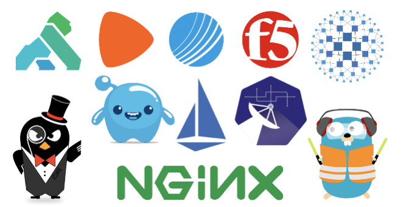

# **云原生负载均衡和网关应用实践**

## **引言**

在开始进入正题之前大家可以先思考这么一个问题：为什么我们需要网关？

假设现在有这样一个场景：需要实现一个简单的 shopping app，里面包含商品列表、用户管理、订单系统等一系列功能。刚开始我们肯定是会用一个简单的单体应用来实现这些功能。如果是多副本运行，可以通过一个负载均衡暴露出去。

但随着系统组件的发展和功能的强化，一个小的单体已经无法承载功能的扩展性。

这时我们会将某些子功能拆离出去，作为单独的应用来开发和管理，**前面可以放置一个负载均衡 Nginx 反向代理来做服务暴露**。

这时如果有更多的需求，**会考虑鉴权、安全性以及流量控制等功能**。

如果在每一个子系统上都实现这些功能，反而增加了业务的负担，不能让业务开发集中于业务逻辑上。因此就需要引入 API Gateway，将所有通用功能和负载均衡的功能集中到 Gateway 层面。**比如图示的 API Gateway 就可以实现鉴权、安全防护、日志管理、负载均衡、监控等功能**。

这里简单介绍了 Gateway 的来源。假设现在我们要将 shopping app 的应用运行在 Kubernetes 上，服务是如何暴露的？又该如何使用 Kubernetes 来有效管理网关？这就是本文要介绍的内容。

## **Kubernetes 如何对外提供服务**

### **Kubernetes Service Model**

Kubernetes 提供了 Service API，通过基本的负载均衡来暴露内部的应用。**其实现方式是 Kubernetes 集群的每个节点上会运行 kube-proxy 组件来 watch Service、Endpoint 等资源，根据 Service 的配置创建转发规则**。

**kube-proxy 常用 iptables、IPVS 的模式。**

上图是 iptables 模式的大致流程。kube-proxy 如果 watch 到 service，就会配置 ClusterIP 转到后端 Pod IP 的 iptables 规则。

**如果是多副本，内部的简单实现是一个随机的负载均衡算法。**

iptabels 的简单流程：service 提供了 ClusterIP，在集群内部访问 clusterIP 时，通过 iptables 的规则就可以将流量转发到后端的 Pod IP 上。Kubernetes 提供的 Service 我们主要使用三种类型：

1.**ClusterIP**：常见的 Service，提供内部访问的方式，比如内部的 Pod 可以通过 clusterIP 访问到其关联的服务。也可以通过内部的域名来访问。

**2.NodePort Service：**在 ClusterIP 的基础上，通过暴露节点上的端口（通常默认的是 3 万多的端口）来进行服务的暴露。如下图所示的，每个节点上会开启一个端口，可以通过访问节点 IP 加端口的方式访问其在内部关联到的服务中的 Pod。

**3.LoadBalancer Service**：在 NodePort Service 基础上做了进一步的功能提升，同样的开放节点端口暴露服务，但需要外部负载均衡提供商提供负载均衡实例进行流量访问控制。

NodePort Service 和 LoadBalancer Service 提供了外部访问集群的能力，但它们有一些局限性，比较明显的是需要和节点上的端口绑定，即服务和端口几乎是要一一对应来做服务的暴露。**当服务量很大的时候，对端口的管理及端口的承载能力来说都不是很友好。**

### **Ingress**

Kubernetes 还提供了另外一个 API：Ingress。Ingress API 是实现外部访问集群服务的入口，尤其是对内部的 HTTPS、HTTP 服务。

示例是一个简单的 Ingress 配置。

上面有规则配置的一条 host，path 路径关联后端的 default  namespace  下的 service 1。

**Ingress API 本身只是一个 API，Kubernetes 自带的组件并没有实现这个 Ingress，而是由社区实现的 Ingress Controller 实际来做 Ingress 流量的转发。**

上图是社区实现的 Ingress Controller，基于 Nginx 实现流量转发。简单的实现逻辑是 Controller watch 集群中的 Ingress 资源，根据 Ingress 上的配置来生成 Nginx 配置，热重启之后就可以使转发规则生效。

同时，可以通过在外部放置一个 LB 将入口流量转发到 Ingress Controller，这样就实现了内部服务的暴露，可以通过域名解析到 VIP 上，访问域名的路径就可以访问到内部服务。

### **Ingress API 带来的启发**

Ingress API 的设计给我们带来了一些启发。如果要暴露内部的服务，或者使用网关来管理服务，需要解决三个问题：

* **定义类 Ingress 的 API**。当然也可以使用原生的 Ingress API，它可以实现配置路径转发端口及后端的协议，以及负载均衡、鉴权等功能。
* **实现 Ingress API 的 Controller，负责实际流量的转发控制**。它类似于前面提到的社区版 Ingress Controller，可根据 API 的配置生成实际的转发配置。这样即可实现 API 的精细化管理。
* **打通外部访问。通常会使用外部 LB 作为流量入口**。

以上是 Ingress API 给我们带来的一些启发。如果需要做网关管理，可以参考这个思路。

## **社区主流网关分析**

上图是一些社区实现的 Nginx Ingress。Kong 是基于 Nginx 做了二次开发的网关，其官称是 API Gateway 的实现。

**其他还有基于 Envoy、Ambassador、Contour、Gloo、HAProxy 的网关实现，以及面向 Service Mesh 的 Istio、Traefik。**

下图是从 CNCF 的调查报告里收集的一些数据。目前来说，**基于 Nginx 的数据面转发还是占主流**，因为 Nginx 已经使用了相当长一段时间，大家比较熟悉，而且性能也比较好。

Envoy 最近势头比较猛，逐渐会被大家接受。Envoy 在一些性能的 benchmark 上也超过了其他的 Proxy。

下面的表格是社区提供的不同 Ingress Controller 的对比，**对比项涵盖支持协议、路由匹配方式、分流、灰度、蓝绿、负载均衡算法、认证等方面**。大家可以参考这个表格，根据自己的需求选择合适的 Ingress Controller。

下面介绍基于 Nginx 和 Envoy 的几个 Ingress Controller 的设计。

### **Nginx-Based Ingress Controller**

首先是大家比较熟悉的 Kubernetes ingress-nginx controller。

**它是一个内置的 Nginx，对接原生的 Ingress API。**

**主要的逻辑是 Controller 去 watch Ingress、Endpoint 等资源，根据 Ingress 的配置或者后端 Endpoints 的变化来动态调整 Nginx 的配置，使流量转发的配置生效。**

上面是一个简单的 Ingress 配置。

可以看到，Spec 里可以配置 host、path、后端 Service，其他很多扩展性功能都是通过 annotation 来实现的。

这里我们可以配置后端、backend protocol、跨域访问以及限流等负载均衡算法。

Kubernetes ingress-nginx controller 的 annotation 可能多达上百个，这对我们来说实在不友好。但是它相对来说比较成熟，目前使用的人还是比较多的。

### **Kong Ingress Controller**

**Kong Ingress Controller 是真正为 API Gateway 而设计的**，基于 Nginx 做了深度的二次开发，可以做很多扩展性的功能，比如支持自研 Plugin，内置之后可以从外部通过 API 来使用 Plugin，而从进行更精细化的 API 管理。

**Kong Ingress 在 Kubernetes 上也实现了 Ingress Controller， 其实现逻辑也是 watch Ingerss 资源，自定义 KongIngress、KongPlugin 等资源来进行配置，将这些资源上的配置通过 API 调用转化成 Kong 的配置。**

Kong Ingress Controller 的流量访问是从外部直接访问 Kong，而不是访问 Controller 来做流量转发。

**Kong Ingress 也有一些特点，它不像 nginx-ingress 那样 annotation 比较多，但是有很多 KongPlugin 可以进行扩展，根据个性化需求来选择。由于 KongPlugin 自由度比较高，管理起来相对比较复杂。**

### **Envoy-Based Ingress Controller**

Contour 是 CNCF 旗下的项目，也是最近比较火的基于 Envoy 的 Ingress Controller。

**它没有直接基于 Kubernetes Ingress 原生的 API 来做 Ingress 功能，自定义了一个 HTTPProxy 的 CRD，其配置可以在 Spec 里实现。Contour 在 Kubernetes 上的架构如下图所示。**

**Contour 也有 Controller 来负责 watch 集群中的资源，将这些资源转化成 Envoy 认知的一些配置，并通过 XDS 协议配置到 Envoy。**

Envoy 本身可以通过负载均衡器暴露出去，当从外部通过域名 IP 访问内部应用服务时，根据内部 Host 配置转发到对应的应用上。

### **网关应用场景**

为什么会介绍到这几个 Ingress Controller？因为我们的 PaaS 场景比较特殊，需要根据用户不同的需求做适配。我们涉及的一些场景包括：

* 场景一：用户在本地搭建集群，没有外部的负载均衡，**期望使用 Nginx 做 Proxy，对 API 的控制不高**。
* 场景二：部分用户比较激进，会尝试一些新技术，**比如使用 Envoy 做转发，对网关来说有一些简单的需求，比如限流、白名单等**。
* 场景三：有些用户集群部署在云上，可以使用云上的 LB，**希望使用 Kong 做 Proxy，对网关有限流、白名单等需求**。
* 场景四：**有一些云上的集群想使用 Envoy 来做转发，对网关也有限流、白名单等需求**。

社区提供了一些已有资源来管理网关，比如 Ingress API、Ingress Controller 已经比较成熟。但是如果要在 Kubernetes 上管理网关，还需要解决如下问题：

* Ingress Controller 及其数据面的部署管理；
* 不同 Ingress API 的生命周期的管理；
* 外部负载均衡的维护。

## **网关管理实践**

### 网关管理架构

在 Kubernetes 上是通过 CRD API 做网关管理的。我们定义了两个资源：

* **Gateway CRD**：**定义使用何种类型的 Load Balancer 来做流量入口，选择何种类型的 Ingress Controller 以及启动配置。**
* **TrafficRoute CRD**：**用于 Ingress API 管理。可指定该配置适用于哪个 Ingress Controller，支持配置路由匹配策略、通过内置 Plugin 列表可自由配置网关功能**。

### **其他基本的组件有：**

* **LoadBalancer Operator：根据 Gateway 配置创建云上 Load Balancer 或者部署本地 Load Balancer（IPVS）**。
* **Proxy Operator：维护 Ingress Controller 所属资源的生命周期**。
*** Route Controller：根据 TrafficRoute 转换为匹配的第三方 Ingress API，并维护其生命周期**。

整个网关管理的架构如下图所示：

### 管理 Load Balancer 和 Ingress Controller

管理 Load Balancer 和 Ingress Controller 主要介绍两个场景。

**非云场景**

非云场景下我们主要是考虑到集群内部没有前置的 Load Balancer，需要一个 Load Balancer Provider。

我们会基于 IPVS 或 Keepalive 实现内部的负载均衡，或者使用开源的 Metalb 来做前置的四层负载均衡。

**Ingress Controller 通过 LoadBalancer Service 将 LoadBalancer 和 Ingress Controller 关联起来，这样流量访问前置 LB 的 VIP 时就可以转发到后端 Ingress Controller。**

**这种方法适用于私有集群场景，无 Load Balancer。**

**云场景**

在云上可以使用云提供的 Load Balancer，相对来说比较简单。

目前基本上所有的云都实现了Cloud Provider 来对接 LoadBalancer Service 资源，**相当于创建 LoadBalancer Service 就会自动在云上拉起 LB，将 Node 节点配置到云上 LB 后端池。云场景下重点在于管理内部的 Ingress Controller。**

### 社区 Gateway API

**Gateway API 原来叫做 Service API，可以集成 Kubernetes 的 NetworkService**。

它的特点在于是以角色来分层的，如上图所示它分了 3 个主要的角色：

* **Infrastructure Provider**：基础设施的提供者，对整个集群进行管理，决定可以使用哪些 Gateway。
* **Cluster Operator**：运营者的角色，可以根据需求创建具体的 Gateway 实例进行管理。
* **应用开发者**：这个角色是真正的使用者，可以使用 HTTPRoute 来关联后端 Service，并且配置 Service 的暴露方式。

Gateway API 实现了 Ingress 的功能，并且通过扩展还可以管理整个 Gateway 生命周期。

Ingress 本身对 HTTP 支持比较友好。Gateway 不只是针对 HTTP，还可以支持各种类型的后端协议 API。

**相比较 Ingress annotation 来说这种方式来说更直观一些，内部的很多配置可以通过 Spec 清晰地了解其功能。另外 Gateway API 扩展性比较强，支持扩展到第三方 API**。

上图展示了 Gateway API 的几个主要资源：

* **GatewayClass**：定义一类 Gateway，指定其使用的 Controller；
* **Gateway：Gateway** 实例，包含 Listener 等配置、Route 选择规则。可以是 Cloud Load Balancer、APP Gateway、Ingress Controller 等实现。
* `*Route`：HTTP、TCP、UDP 等 Route，HTTPRoute 类似 Ingress 可配置路由规则等。

目前 Gateway API 还在发展过程中，支持 Gateway API 的 Ingress Controller 还比较少。Contour 已经开始支持 Gateway API，其内部由 Controller 来做规则转发，并且提供 Contour Operator 来实现 Gateway 的部署。

## 总结

### 本文的 key takeaways：

* Kubernetes 提供了多种服务暴露的方式，如 NodePort、Load Balancer、 Ingress 等，可根据不同的需求进行选择。
* Ingress API 是目前主要的暴露方式，社区里有各种 Ingress Controller 的实现，使用起来也比较方便。
* 基于 Envoy 的 Ingress Controller 逐渐被大家接受，Envoy 本身也是云原生的负载均衡。但是 Nginx 目前仍然是主流，从 Nginx 转到 Envoy 还存在很大的技术壁垒。个人依然看好 Envoy，它的性能也比较优越。
* Gateway API 是新的暴露服务的方式，将会更适合未来的使用趋势，但还很年轻，支持 Gateway API 的 Ingress Controller 还不是很多（Contour 是其中之一）。

### Q&A

* Q：面对数量很多转发和重写规则的 Ingress 的情况，有没有好一些的办法管理这些 Ingress？
* A：TrafficRoute 也是来做 Ingress 管理的，刚才提到这种 rewrite，因为我们的 TrafficRoute 可以配置不同的规则，可以将所有相关联的 Ingress 配置到同一个 TrafficRoute 上转化成多个 Ingress。对于原生的 Kubernetes Ingress API 的灰度，需要创建多个 Ingress 实例，我们可以集中到 TrafficRoute 上来做管理。

* Q：如何监控网关的指标？
* A：目前来说社区的 Ingress Controller 一般都会去做指标的暴露。我们会直接对接 Prometheus，可以实现整个网关的指标监控，还可以根据自己的需求聚合指标。

* Q：Ingress 使用 80 / 443 还有其他端口，是直接修改 ingress.yaml，添加多个端口吗？
* A：七层的 80 / 443 端口是我们常用的。如果是七层端口，可以在启动 Ingress Controller 时配置不同的端口然后选择你想用的端口；如果是四层，ingress-nginx controller 可以通过 configmap 来配置其他的四层端口的转发。
